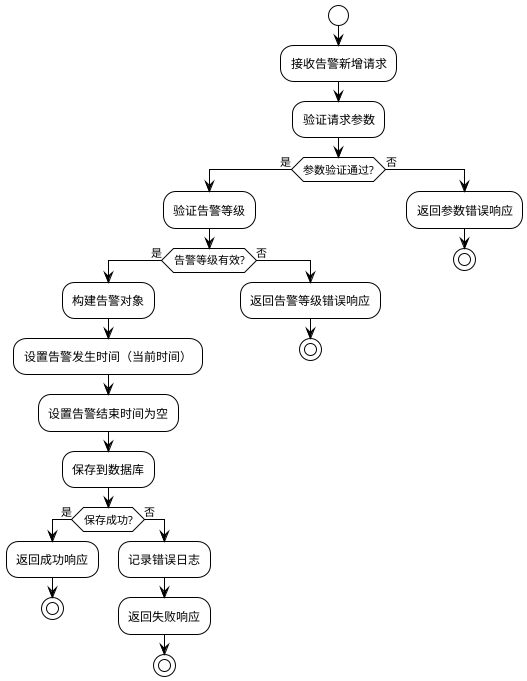
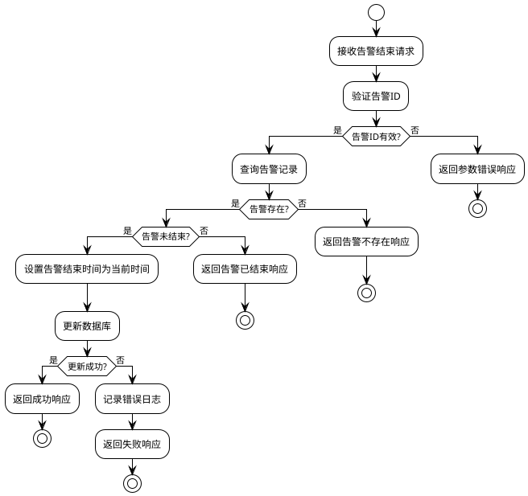

# 拨测控制中心-告警中心模块-软件实现设计文档

## 1 需求重述

### 1.1 需求背景
拨测控制中心需要提供告警管理功能，用于记录和管理系统运行过程中产生的各种告警信息。告警管理模块需要支持告警的新增、删除（结束告警）和查询功能，帮助运维人员及时了解系统状态并处理异常情况。所有用户角色均可查看告警信息，确保信息的透明性和可追溯性。

### 1.2 需求功能介绍
告警中心模块主要功能包括：
- **告警新增**：支持创建新的告警记录，包含告警概述、详细描述、告警等级等信息
- **告警删除（结束告警）**：通过设置告警的结束时间（end_time）来标记告警已处理完成
- **当前告警查询**：查询所有未结束的告警（end_time为空），按照开始时间倒序排列
- **所有告警查询**：查询系统中所有告警记录，包括已结束和未结束的告警，按照开始时间倒序排列
- **前端展示**：在运维管理菜单下提供告警管理页面，所有用户角色均可查看

**告警关键信息：**
- id：告警唯一标识
- 告警概述：告警的简要描述
- 告警详细描述：告警的详细说明信息
- 告警等级：Urgent（紧急）/ Important（重要）/ Minor（一般）
- 告警发生时间（start_time）：告警开始时间
- 告警结束时间（end_time）：告警结束时间，为空表示告警未结束

## 2 功能实现分析

### 2.1 功能点清单
1. 告警新增功能
2. 告警删除（结束告警）功能
3. 当前告警查询功能
4. 所有告警查询功能

### 2.2 功能点1：告警新增功能

#### 详细描述

**数据库表设计：**

```sql
-- 告警表
CREATE TABLE alarms (
    id BIGSERIAL PRIMARY KEY,                                    -- 主键ID，自增长
    alarm_summary VARCHAR(200) NOT NULL,                        -- 告警概述，最大长度200字符
    alarm_description TEXT,                                      -- 告警详细描述
    alarm_level VARCHAR(20) NOT NULL,                           -- 告警等级：Urgent/Important/Minor
    start_time TIMESTAMP NOT NULL DEFAULT CURRENT_TIMESTAMP,    -- 告警发生时间，精确到秒
    end_time TIMESTAMP                                          -- 告警结束时间，为空表示告警未结束
);

-- 添加检查约束：确保告警等级为有效值
ALTER TABLE alarms 
ADD CONSTRAINT chk_alarm_level 
CHECK (alarm_level IN ('Urgent', 'Important', 'Minor'));

-- 添加检查约束：确保结束时间不早于开始时间
ALTER TABLE alarms 
ADD CONSTRAINT chk_time_order 
CHECK (end_time IS NULL OR end_time >= start_time);

-- 创建索引：优化查询性能
CREATE INDEX idx_alarms_start_time ON alarms(start_time DESC);
CREATE INDEX idx_alarms_end_time ON alarms(end_time);
CREATE INDEX idx_alarms_level ON alarms(alarm_level);
```

**算法流程图：**



**函数伪代码：**

```java
/**
 * 创建告警
 * @param request 告警创建请求
 * @return 告警响应对象
 */
public AlarmResponse createAlarm(CreateAlarmRequest request) {
    // 1. 参数验证
    validateCreateRequest(request);
    
    // 2. 构建告警对象
    Alarm alarm = new Alarm();
    alarm.setAlarmSummary(request.getAlarmSummary());
    alarm.setAlarmDescription(request.getAlarmDescription());
    alarm.setAlarmLevel(request.getAlarmLevel());
    // start_time由数据库默认值自动设置
    // end_time默认为null，表示告警未结束
    
    // 3. 保存到数据库
    Alarm savedAlarm = alarmRepository.save(alarm);
    
    // 4. 记录日志
    logger.info("Alarm created: ID={}, Level={}, Summary={}", 
                savedAlarm.getId(), 
                savedAlarm.getAlarmLevel(),
                savedAlarm.getAlarmSummary());
    
    // 5. 构建响应
    AlarmResponse response = new AlarmResponse();
    response.setSuccess(true);
    response.setMessage("告警创建成功");
    response.setData(savedAlarm);
    
    return response;
}

/**
 * 验证创建请求参数
 * @param request 创建请求
 */
private void validateCreateRequest(CreateAlarmRequest request) {
    if (request == null) {
        throw new IllegalArgumentException("请求不能为空");
    }
    if (request.getAlarmSummary() == null || request.getAlarmSummary().trim().isEmpty()) {
        throw new IllegalArgumentException("告警概述不能为空");
    }
    if (request.getAlarmSummary().length() > 200) {
        throw new IllegalArgumentException("告警概述长度不能超过200字符");
    }
    if (request.getAlarmLevel() == null || request.getAlarmLevel().trim().isEmpty()) {
        throw new IllegalArgumentException("告警等级不能为空");
    }
    if (!isValidAlarmLevel(request.getAlarmLevel())) {
        throw new IllegalArgumentException("告警等级无效，必须为Urgent、Important或Minor");
    }
}

/**
 * 验证告警等级是否有效
 * @param level 告警等级
 * @return 是否有效
 */
private boolean isValidAlarmLevel(String level) {
    return "Urgent".equals(level) || 
           "Important".equals(level) || 
           "Minor".equals(level);
}
```

### 2.3 功能点2：告警删除（结束告警）功能

#### 详细描述

**数据库更新设计：**

```sql
-- 结束告警（设置结束时间）
UPDATE alarms 
SET end_time = CURRENT_TIMESTAMP 
WHERE id = ? AND end_time IS NULL;
```

**算法流程图：**



**函数伪代码：**

```java
/**
 * 结束告警（删除告警）
 * @param id 告警ID
 * @return 告警响应对象
 */
public AlarmResponse endAlarm(Long id) {
    // 1. 参数验证
    if (id == null || id <= 0) {
        throw new IllegalArgumentException("告警ID无效");
    }
    
    // 2. 查询告警记录
    Alarm alarm = alarmRepository.findById(id);
    if (alarm == null) {
        throw new IllegalArgumentException("告警不存在");
    }
    
    // 3. 检查告警是否已结束
    if (alarm.getEndTime() != null) {
        throw new IllegalStateException("告警已结束，无法重复结束");
    }
    
    // 4. 设置结束时间
    alarm.setEndTime(LocalDateTime.now());
    
    // 5. 更新数据库
    Alarm updatedAlarm = alarmRepository.update(alarm);
    
    // 6. 记录日志
    logger.info("Alarm ended: ID={}, Level={}, Summary={}", 
                updatedAlarm.getId(), 
                updatedAlarm.getAlarmLevel(),
                updatedAlarm.getAlarmSummary());
    
    // 7. 构建响应
    AlarmResponse response = new AlarmResponse();
    response.setSuccess(true);
    response.setMessage("告警已结束");
    response.setData(updatedAlarm);
    
    return response;
}
```

### 2.4 功能点3：当前告警查询功能

#### 详细描述

**数据库查询设计：**

```sql
-- 查询当前告警（未结束的告警）
SELECT 
    id,
    alarm_summary,
    alarm_description,
    alarm_level,
    start_time,
    end_time
FROM alarms
WHERE end_time IS NULL
ORDER BY start_time DESC
LIMIT ? OFFSET ?;
```

**函数伪代码：**

```java
/**
 * 查询当前告警（未结束的告警）
 * @param page 页码
 * @param size 每页大小
 * @return 告警分页响应
 */
public AlarmPageResponse getCurrentAlarms(Integer page, Integer size) {
    // 1. 参数验证和默认值设置
    if (page == null || page < 0) {
        page = 0;
    }
    if (size == null || size <= 0) {
        size = 20;
    }
    
    // 2. 查询当前告警（end_time为空）
    List<Alarm> alarms = alarmRepository.findCurrentAlarms(page, size);
    
    // 3. 查询总数
    Long totalElements = alarmRepository.countCurrentAlarms();
    
    // 4. 构建分页响应
    AlarmPageResponse response = new AlarmPageResponse();
    response.setSuccess(true);
    response.setMessage("查询成功");
    
    AlarmPageResponseData data = new AlarmPageResponseData();
    data.setContent(alarms);
    data.setTotalElements(totalElements.intValue());
    data.setTotalPages((int) Math.ceil((double) totalElements / size));
    data.setSize(size);
    data.setNumber(page);
    
    response.setData(data);
    
    logger.debug("Successfully queried {} current alarms", alarms.size());
    return response;
}
```

### 2.5 功能点4：所有告警查询功能

#### 详细描述

**数据库查询设计：**

```sql
-- 查询所有告警
SELECT 
    id,
    alarm_summary,
    alarm_description,
    alarm_level,
    start_time,
    end_time
FROM alarms
ORDER BY start_time DESC
LIMIT ? OFFSET ?;
```

**函数伪代码：**

```java
/**
 * 查询所有告警
 * @param page 页码
 * @param size 每页大小
 * @return 告警分页响应
 */
public AlarmPageResponse getAllAlarms(Integer page, Integer size) {
    // 1. 参数验证和默认值设置
    if (page == null || page < 0) {
        page = 0;
    }
    if (size == null || size <= 0) {
        size = 20;
    }
    
    // 2. 查询所有告警
    List<Alarm> alarms = alarmRepository.findAllAlarms(page, size);
    
    // 3. 查询总数
    Long totalElements = alarmRepository.countAllAlarms();
    
    // 4. 构建分页响应
    AlarmPageResponse response = new AlarmPageResponse();
    response.setSuccess(true);
    response.setMessage("查询成功");
    
    AlarmPageResponseData data = new AlarmPageResponseData();
    data.setContent(alarms);
    data.setTotalElements(totalElements.intValue());
    data.setTotalPages((int) Math.ceil((double) totalElements / size));
    data.setSize(size);
    data.setNumber(page);
    
    response.setData(data);
    
    logger.debug("Successfully queried {} alarms", alarms.size());
    return response;
}
```

## 3 AR开发者测试设计

### 3.1 测试用例设计原则
- 覆盖所有功能点的正常场景和异常场景
- 验证告警等级的有效性检查
- 验证时间约束（结束时间不能早于开始时间）
- 测试分页查询的边界条件
- 验证告警状态转换的正确性（未结束 -> 已结束）

### 3.2 测试用例列表

#### 3.2.1 告警新增测试用例

| 用例ID | 测试场景 | 输入数据 | 预期结果 | 测试方法 |
|--------|----------|----------|----------|----------|
| TC001 | 正常创建告警 | 有效请求参数（Urgent级别） | 创建成功，返回告警记录 | testCreateAlarm_Success_Urgent |
| TC002 | 正常创建告警 | 有效请求参数（Important级别） | 创建成功，返回告警记录 | testCreateAlarm_Success_Important |
| TC003 | 正常创建告警 | 有效请求参数（Minor级别） | 创建成功，返回告警记录 | testCreateAlarm_Success_Minor |
| TC004 | 缺少必填参数 | 缺少alarmSummary | 返回400错误 | testCreateAlarm_MissingSummary |
| TC005 | 缺少必填参数 | 缺少alarmLevel | 返回400错误 | testCreateAlarm_MissingLevel |
| TC006 | 告警概述超长 | alarmSummary长度超过200字符 | 返回400错误 | testCreateAlarm_SummaryTooLong |
| TC007 | 无效告警等级 | alarmLevel="Invalid" | 返回400错误 | testCreateAlarm_InvalidLevel |
| TC008 | 数据库连接异常 | 正常参数，数据库异常 | 返回500错误 | testCreateAlarm_DatabaseError |

#### 3.2.2 告警删除（结束告警）测试用例

| 用例ID | 测试场景 | 输入数据 | 预期结果 | 测试方法 |
|--------|----------|----------|----------|----------|
| TC011 | 正常结束告警 | 有效的告警ID，告警未结束 | 更新成功，end_time被设置 | testEndAlarm_Success |
| TC012 | 告警ID无效 | id=null | 返回400错误 | testEndAlarm_InvalidId |
| TC013 | 告警ID无效 | id=-1 | 返回400错误 | testEndAlarm_NegativeId |
| TC014 | 告警不存在 | 不存在的告警ID | 返回404错误 | testEndAlarm_NotFound |
| TC015 | 告警已结束 | 已结束的告警ID | 返回400错误（告警已结束） | testEndAlarm_AlreadyEnded |
| TC016 | 数据库连接异常 | 正常参数，数据库异常 | 返回500错误 | testEndAlarm_DatabaseError |

#### 3.2.3 当前告警查询测试用例

| 用例ID | 测试场景 | 输入数据 | 预期结果 | 测试方法 |
|--------|----------|----------|----------|----------|
| TC021 | 正常分页查询 | page=0, size=20 | 返回当前告警分页数据 | testGetCurrentAlarms_Success |
| TC022 | 空结果查询 | 无当前告警 | 返回空列表 | testGetCurrentAlarms_EmptyResult |
| TC023 | 分页边界测试 | page=0, size=0 | 使用默认size=20 | testGetCurrentAlarms_InvalidPageSize |
| TC024 | 分页边界测试 | page=-1, size=20 | 使用默认page=0 | testGetCurrentAlarms_InvalidPageNumber |
| TC025 | 排序验证 | 多条当前告警 | 按start_time倒序排列 | testGetCurrentAlarms_SortOrder |
| TC026 | 只返回未结束告警 | 包含已结束和未结束告警 | 只返回未结束告警 | testGetCurrentAlarms_OnlyCurrent |

#### 3.2.4 所有告警查询测试用例

| 用例ID | 测试场景 | 输入数据 | 预期结果 | 测试方法 |
|--------|----------|----------|----------|----------|
| TC031 | 正常分页查询 | page=0, size=20 | 返回所有告警分页数据 | testGetAllAlarms_Success |
| TC032 | 空结果查询 | 无告警记录 | 返回空列表 | testGetAllAlarms_EmptyResult |
| TC033 | 分页边界测试 | page=0, size=0 | 使用默认size=20 | testGetAllAlarms_InvalidPageSize |
| TC034 | 分页边界测试 | page=-1, size=20 | 使用默认page=0 | testGetAllAlarms_InvalidPageNumber |
| TC035 | 排序验证 | 多条告警记录 | 按start_time倒序排列 | testGetAllAlarms_SortOrder |
| TC036 | 包含已结束和未结束告警 | 混合状态告警 | 返回所有告警 | testGetAllAlarms_MixedStatus |

### 3.3 测试数据准备

#### 3.3.1 基础测试数据
```sql
-- 插入测试告警数据
INSERT INTO alarms (alarm_summary, alarm_description, alarm_level, start_time, end_time) VALUES
('系统CPU使用率过高', '系统CPU使用率超过90%，持续5分钟', 'Urgent', '2024-01-15 10:00:00', NULL),
('磁盘空间不足', '磁盘使用率超过85%', 'Important', '2024-01-15 11:00:00', NULL),
('网络延迟异常', '网络延迟超过100ms', 'Minor', '2024-01-15 09:00:00', '2024-01-15 09:30:00'),
('内存使用率过高', '内存使用率超过80%', 'Important', '2024-01-14 15:00:00', '2024-01-14 16:00:00');
```

### 3.4 测试环境要求
- Java 8+
- Spring Boot 2.x
- PostgreSQL 12+
- JUnit 4
- Mockito
- TestContainers（用于集成测试）

### 3.5 测试覆盖率要求
- 代码覆盖率：≥90%
- 分支覆盖率：≥85%
- 方法覆盖率：100%
- 类覆盖率：100%

### 3.6 性能测试要求
- 单次查询响应时间：<200ms
- 分页查询响应时间：<500ms
- 告警新增响应时间：<100ms
- 告警结束响应时间：<100ms
- 并发查询支持：100个并发用户