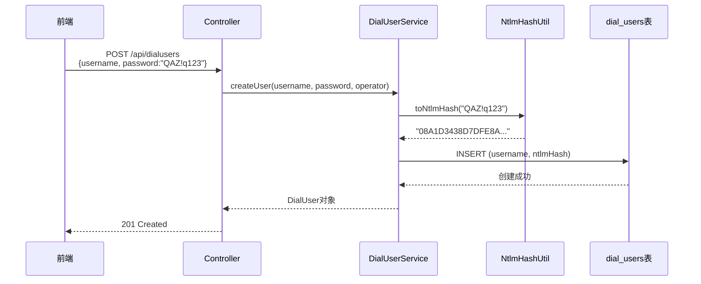
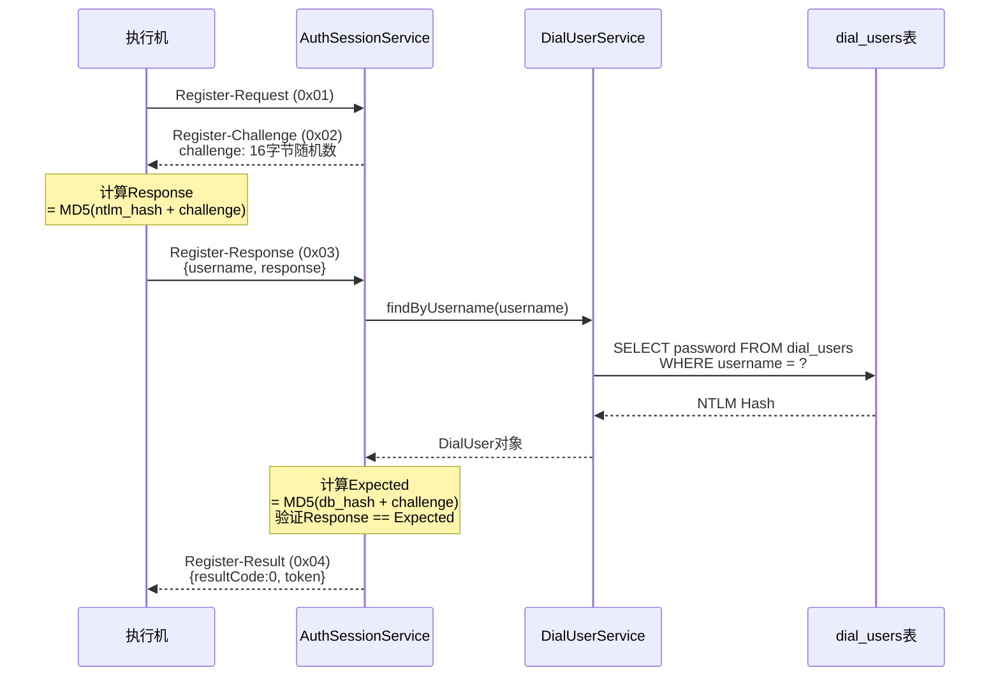
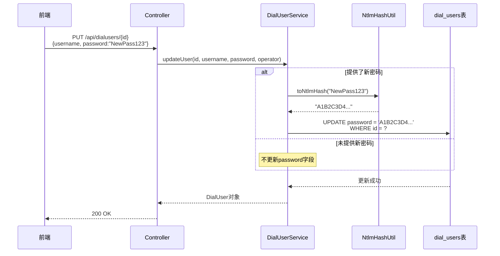

# dial_users表统一方案

> **文档版本**：V1.0  
> **最后更新**：2025-11-12  
> **主要变更**：
> - ✅ 统一使用dial_users表支持前端管理和执行机CHAP认证
> - ✅ 密码存储格式统一为NTLM Hash（32位16进制字符串）
> - ✅ 删除AgentUserDao，简化代码架构
> - ✅ 新增NtlmHashUtil工具类，自动转换明文密码

## 1. 概述

### 1.1 方案背景

改造前，执行机账号管理存在数据分散问题：
- 前端管理使用`dial_users`表，密码为bcrypt格式（60字符）
- 执行机认证使用`agent_user`表，密码为NTLM Hash格式（32字符）
- 两表数据不同步，管理复杂

### 1.2 方案目标

统一使用`dial_users`表同时支持：
1. 前端管理页面的账号管理
2. 执行机CHAP认证

核心改动：
- 密码存储格式统一为NTLM Hash
- 前端输入明文密码，后端自动转换为Hash存储
- 删除agent_user表相关代码，简化架构

## 2. 数据库变更

### 2.1 表结构变更

**dial_users表**（无结构变更，仅约束和注释）

| 字段 | 类型 | 说明 | 变更 |
|:---|:---|:---|:---|
| id | bigint | 主键 | - |
| username | varchar(50) | 用户名 | ➕ 添加唯一约束 |
| password | varchar(255) | 密码 | 📝 改为存储NTLM Hash |
| last_login_time | timestamp | 最后登录时间 | - |

**变更内容**：
```sql
-- 1. 添加唯一约束（如不存在）
ALTER TABLE dial_users ADD CONSTRAINT dial_users_username_key UNIQUE (username);

-- 2. 添加索引
CREATE INDEX IF NOT EXISTS idx_dial_users_username ON dial_users(username);

-- 3. 更新表注释
COMMENT ON TABLE dial_users IS '执行机用户表，密码存储NTLM Hash用于CHAP认证';
COMMENT ON COLUMN dial_users.password IS 'NTLM Hash格式（32位16进制字符串）';
```

### 2.2 数据迁移

**场景1**：agent_user和dial_users有同名用户
```sql
-- 自动同步NTLM Hash
UPDATE dial_users du
SET password = au.password
FROM agent_user au
WHERE du.username = au.username;
```

**场景2**：无同名用户（本项目实际情况）
- agent_user表：test_agent（NTLM Hash）
- dial_users表：admin、testuser（bcrypt格式）
- 迁移SQL影响0行
- 现有用户需通过前端重置密码

### 2.3 密码格式对比

| 项目 | 改造前 | 改造后 |
|:---|:---|:---|
| dial_users.password | bcrypt格式<br>`$2a$10$N...`（60字符） | NTLM Hash<br>`08A1D3438D7DFE8A...`（32字符） |
| agent_user.password | NTLM Hash<br>`08A1D3438D7DFE8A...`（32字符） | ❌ 不再使用 |

## 3. 代码变更

### 3.1 整体架构

```
改造前：
前端 → DialUserService → dial_users表（bcrypt）
执行机 → AuthSessionService → AgentUserDao → agent_user表（NTLM Hash）

改造后：
前端 → DialUserService → dial_users表（NTLM Hash）
                        ↑
执行机 → AuthSessionService ┘
```

### 3.2 新增文件

| 文件 | 说明 |
|:---|:---|
| `NtlmHashUtil.java` | NTLM Hash工具类<br>• `toNtlmHash(String plainPassword)` - 明文转Hash<br>• `isValidNtlmHash(String hash)` - 格式验证 |
| `NtlmHashUtilTest.java` | 单元测试（13个测试用例） |
| `upgrade_dial_users.sql` | 数据库升级脚本 |

### 3.3 修改文件

#### DialUserService.java

**修改点1**：createUser方法

```java
// 改造前
user.setPassword(password);  // 直接存储明文或bcrypt

// 改造后
String ntlmHash = NtlmHashUtil.toNtlmHash(password);  // 🔐 转换为NTLM Hash
user.setPassword(ntlmHash);
```

**修改点2**：updateUser方法

```java
// 改造后
if (password != null && !password.trim().isEmpty()) {
    String ntlmHash = NtlmHashUtil.toNtlmHash(password);  // 🔐 转换为NTLM Hash
    existingUser.setPassword(ntlmHash);
}
```

#### AuthSessionService.java

**修改点1**：依赖注入

```java
// 改造前
@Autowired
private AgentUserDao agentUserDao;

// 改造后
@Autowired
private DialUserService dialUserService;  // ✅ 改用DialUserService
```

**修改点2**：handleRegisterResponse方法（V3 TLV协议）

```java
// 改造前
AgentUser user = agentUserDao.findByUsername(username);

// 改造后
DialUser user = dialUserService.findByUsername(username);  // ✅ 从dial_users表查询
```

**修改点3**：handleRegisterAuth方法（旧JSON协议）

```java
// 改造前
AgentUser user = agentUserDao.findByUsername(ctx.username);

// 改造后
DialUser user = dialUserService.findByUsername(ctx.username);  // ✅ 从dial_users表查询
```

### 3.4 删除文件

| 文件 | 说明 |
|:---|:---|
| `AgentUserDao.java` | 不再需要agent_user表查询 |

### 3.5 关于DialUser实体类

⚠️ **重要说明**：
- DialUser类由`dialingtest-interface`模块从YAML自动生成
- YAML定义：`dialingtest-interface/src/main/resources/dialuser-api.yaml`
- 生成路径：`dialingtest-interface/target/generated-sources/swagger/.../model/DialUser.java`
- dialingtest-service通过maven依赖引用

```xml
<dependency>
    <groupId>com.huawei.cloududn</groupId>
    <artifactId>dialingtest-interface</artifactId>
    <version>1.0.0</version>
</dependency>
```

### 3.6 变更清单

| 类型 | 文件 | 说明 |
|:---:|:---|:---|
| ➕ | NtlmHashUtil.java | NTLM Hash工具类 |
| ➕ | NtlmHashUtilTest.java | 单元测试 |
| ➕ | upgrade_dial_users.sql | 数据库升级脚本 |
| 📝 | DialUserService.java | 密码转换逻辑 |
| 📝 | AuthSessionService.java | 改用DialUserService |
| ❌ | AgentUserDao.java | 删除 |

## 4. 核心流程

### 4.1 前端创建用户流程



**关键步骤**：
1. 前端输入明文密码，通过HTTPS加密传输
2. DialUserService调用NtlmHashUtil.toNtlmHash()转换密码
3. 转换逻辑：`UTF-16LE编码 → MD4哈希 → 16进制字符串（大写）`
4. 存储32位NTLM Hash到数据库
5. 自动分配EXECUTOR角色

### 4.2 执行机CHAP认证流程



**关键步骤**：
1. 执行机发送注册请求，携带hostname
2. 服务端生成16字节随机Challenge
3. 执行机使用NTLM Hash计算Response = MD5(ntlm_hash + challenge)
4. 服务端从dial_users表查询NTLM Hash（改造点）
5. 服务端计算Expected = MD5(db_hash + challenge)
6. 验证Response == Expected，认证成功返回Token

### 4.3 密码重置流程



---

**文档结束**
