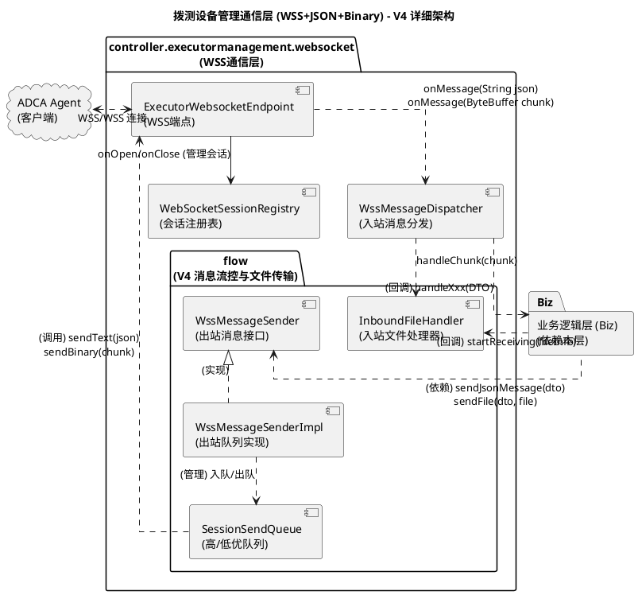
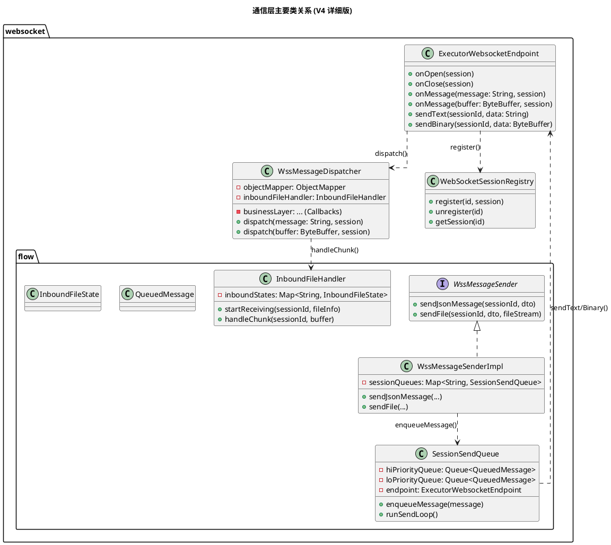
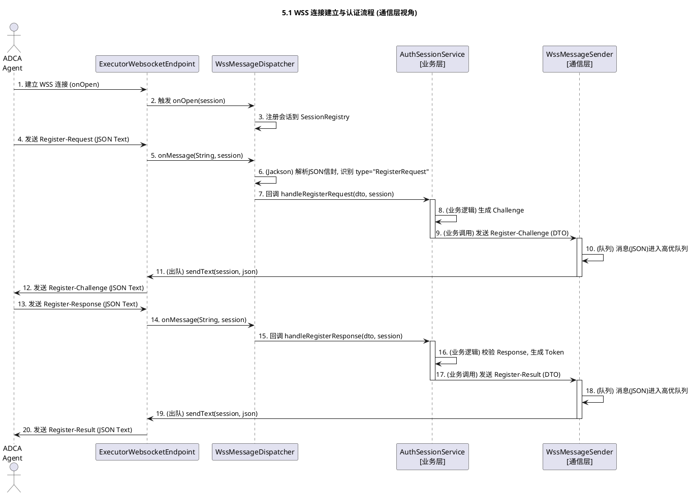
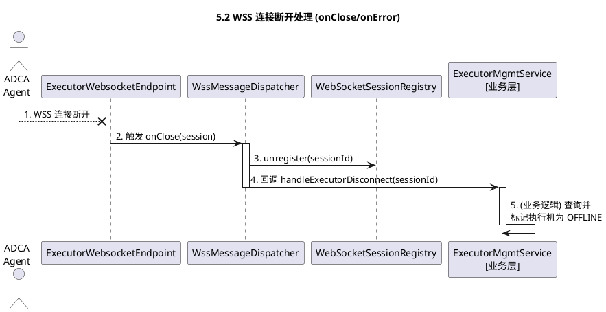
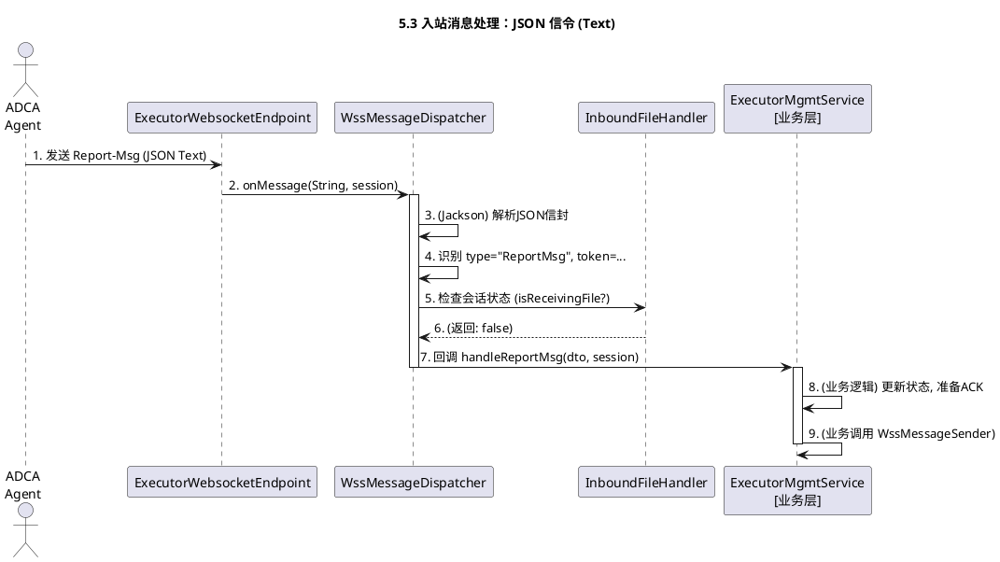
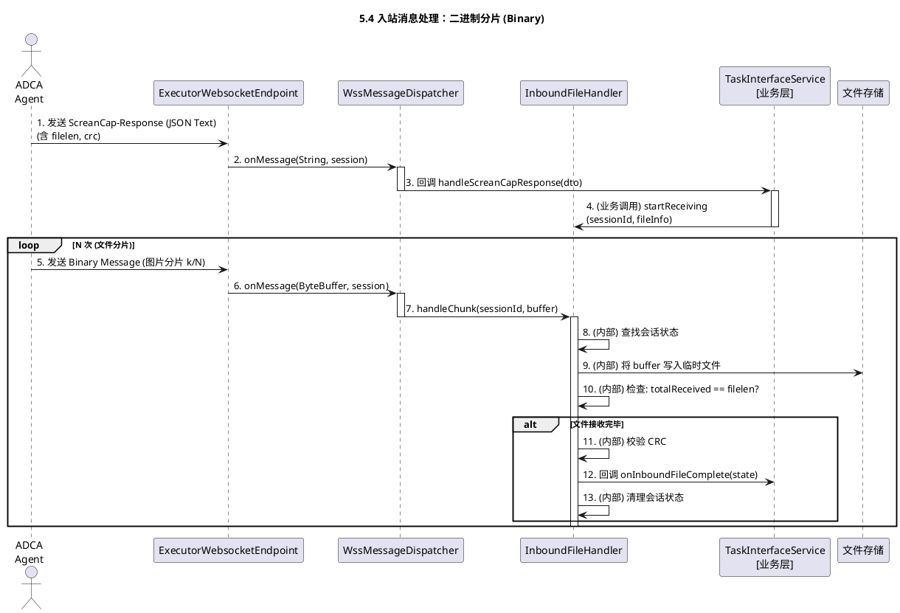
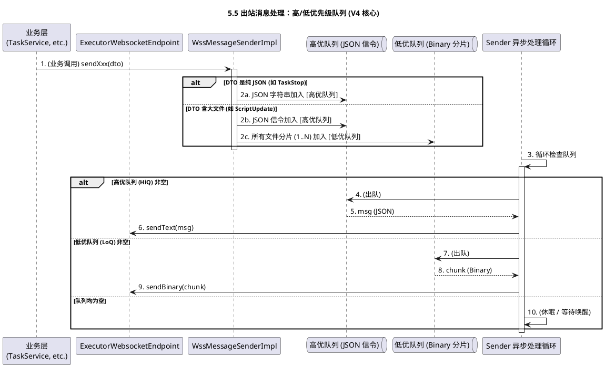
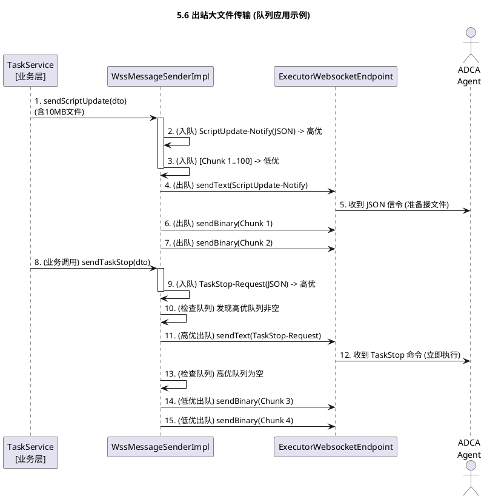

> **文档版本**：V4
> **最后更新**：2025-11-13
> 
> **关联文档**：
> - 本文档定义**通信协议层**的设计（WSS连接、JSON编解码、消息队列、文件分片）
> - 配套文档：[执行机管理-业务逻辑设计.md](./执行机管理-业务逻辑设计.md) 定义**业务逻辑层**的设计（认证、状态管理、任务调度）
> - **分层边界**：通信层通过 `WssMessageSender` 接口和 `InboundFileCompleteCallback` 回调接口向业务层提供服务，业务层不直接操作WebSocket
> 
> **主要变更**：
> 
> - ✅ 消息协议从 TLV 切换回 JSON (Text Message)。
> - ✅ 定义消息ID (JSON type) 与 JSON 消息信封。
> - ✅ 引入"JSON信令 + 独立二进制分片"的混合传输模式，用于大文件传输。
> - ✅ 增加消息发送队列（按执行机）确保信令与分片顺序。
> - ✅ 增加token会话标识，强约束后续JSON消息携带。

## 1\. 概述

### 1.1 项目背景与目标

本设计聚焦“执行机管理”的通信层实现，提供稳定的WSS长连接与**JSON信令编解码能力与二进制分片传输能力**，面向上层业务（认证、状态、任务）提供消息收发与会话管理基础设施。

### 1.2 关键需求

* 统一通信：所有Agent↔服务端交互走WSS
* **消息协议：JSON 结构 (Text)，清晰易读。**
* **会话安全：认证成功后发放8字节token，后续所有JSON消息强制携带。**
* **大文件传输：脚本、日志、截图等，通过“JSON信令+二进制分片”模式传输。**

## 2\. 系统架构

### 2.1 总体架构图



### 2.2 核心设计理念

* 职责单一：通信层仅负责连接、编解码、分发，不承载业务判定
* **清晰易读：JSON协议，调试友好。**
* **易扩展：新字段=JSON新增Key；新消息=新增Type值，向后兼容。**
* **混合模式：JSON处理信令，Raw Binary处理数据，兼顾可读性与大文件性能。**
* 可测试：编解码与分发可独立单测，业务通过回调隔离

### 2.3 包结构设计

```plaintext
com.huawei.cloududn.dialingtestapp
│
├── controller.executormanagement.websocket
│   ├── ExecutorWebsocketEndpoint.java        // JSR-356 端点: onOpen, onClose, onMessage(String), onMessage(ByteBuffer)
│   ├── WssMessageDispatcher.java           // [V4 核心] 入站消息总协调器
│   │                                       // 1. 负责解析 onMessage(String) 的JSON信封
│   │                                       // 2. 将 onMessage(ByteBuffer) 委托给 InboundFileHandler
│   │                                       // 3. 将解析后的DTO回调给业务层
│   ├── WebSocketSessionRegistry.java       // 会话注册表 (SessionId <-> Session)
│   │
│   ├── flow                                // [V4 替换 codec] 负责消息流控、排队、文件传输
│   │   ├── WssMessageSender.java           // [V4 新增] (接口) 业务层依赖的【出站消息发送器】
│   │   │                                   //   -> 提供: sendJsonMessage(dto)
│   │   │                                   //   -> 提供: sendFile(dto, fileStream)
│   │   ├── WssMessageSenderImpl.java       // [V4 新增] (实现) WssMessageSender的实现
│   │   │                                   // 1. 内部按SessionId管理 SessionSendQueue
│   │   │                                   // 2. 负责将 DTO/文件 拆解并放入队列
│   │   │
│   │   ├── SessionSendQueue.java         // [V4 新增] (图 5.5) 单个会话的【高/低优先级队列】管理器
│   │   │                                   // 1. 包含 Hi-Priority (JSON) 和 Lo-Priority (Binary) 两个队列
│   │   │                                   // 2. 包含一个异步发送循环 (SendTask)
│   │   ├── QueuedMessage.java            // [V4 新增] POJO, 队列中的消息包装类 (Text/Binary)
│   │   │
│   │   ├── InboundFileHandler.java         // [V4 新增] (组件) 【入站文件处理器】
│   │   │                                   // 1. 负责管理所有会话的入站文件状态
│   │   │                                   // 2. 业务层调用: startReceiving(sessionId, fileInfo)
│   │   │                                   // 3. Dispatcher调用: handleChunk(sessionId, buffer)
│   │   │                                   // 4. 回调机制: 通过构造器/setter注入业务层回调接口
│   │   │                                   //    -> InboundFileCompleteCallback.onComplete(state)
│   │   │                                   //    -> 由业务层(TaskInterfaceService)实现此接口
│   │   ├── InboundFileCompleteCallback.java // [V4 新增] (接口) 文件接收完成回调接口
│   │   │                                   //   -> void onInboundFileComplete(InboundFileState state)
│   │   └── InboundFileState.java         // [V4 新增] POJO, 存储单个入站文件的接收状态
│   │                                       // (expectedSize, receivedSize, crc, tempFilePath, ...)
│   │
│   └── dto
│       ├── JsonMessageEnvelope.java        // [V4 新增] JSON消息信封 (type, token, payload)
│       ├── MessageType.java              // [V4 移动] 消息ID枚举 (0x01 -> REGISTER_REQUEST)
│       │
│       ├── RegisterRequestDto.java       // 0x01 (payload)
│       ├── RegisterChallengeDto.java     // 0x02 (payload)
│       ├── RegisterResponseDto.java      // 0x03 (payload)
│       ├── RegisterResultDto.java        // 0x04 (payload)
│       ├── DeRegisterRequestDto.java     // 0x05 (payload)
│       ├── DeRegisterAckDto.java         // 0x06 (payload)
│       ├── ReportMsgDto.java             // 0x11 (payload)
│       ├── ReportAckDto.java             // 0x12 (payload)
│       ├── AppListQueryDto.java          // 0x21 (payload)
│       ├── AppListResponseDto.java       // 0x22 (payload)
│       ├── AppInstallRequestDto.java     // 0x23 (payload) [V4 修改] (移除 package/script, 增加 filelen/crc/filetype)
│       ├── AppInstallResponseDto.java    // 0x24 (payload)
│       ├── ScreanCapQueryDto.java        // 0x25 (payload)
│       ├── ScreanCapResponseDto.java     // 0x26 (payload) [V4 修改] (移除 content, 增加 filelen/crc)
│       ├── ScriptUpdateNotifyDto.java    // 0x31 (payload) [V4 修改] (移除 scriptfile, 增加 filelen/crc)
│       ├── ScriptUpdateAckDto.java       // 0x32 (payload)
│       ├── TaskStartRequestDto.java      // 0x33 (payload)
│       ├── TaskStartResponseDto.java     // 0x34 (payload) [V4 修改] (移除 files, 增加 filelen/crc)
│       ├── TaskStopRequestDto.java       // 0x35 (payload)
│       ├── TaskStopResponseDto.java      // 0x36 (payload)
│       │
│       ├── UeItemDto.java                // 子对象
│       ├── AppItemDto.java               // 子对象
│       └── SubResultItemDto.java         // 子对象
│
├── config
│   └── WebSocketJsr356Config.java        // [V4] 确保同时支持 Text 和 Binary 消息, 并配置缓冲区
└── application.yml                       // [V4] 调整 WSS Text (JSON) 与 Binary (分片) 的最大消息大小
```

### 2.3.1 V4版本文件变更统计（通信层相关）

* **删除**：`TlvEncoder`, `TlvDecoder`, `TlvField`, `FieldTag`
* **新增**：`WssMessageSenderImpl.java`, `InboundFileHandler.java`, `InboundFileCompleteCallback.java`, `JsonMessageEnvelope.java`
* **保留**：`MessageType.java` (作为JSON枚举)
* **重大修改**：
  - `ExecutorWebsocketEndpoint`：重构为同时处理 `onMessage(String json)` 和 `onMessage(ByteBuffer chunk)`
  - `WssMessageDispatcher`：重构为 JSON 信令分发，并与 `InboundFileHandler` 协作处理入站分片
  - 出站发送重构：由 `WssMessageSenderImpl` 引入会话级消息队列，保证JSON信令和Binary分片的顺序发送

### 2.4 系统类图设计



## 3\. 子模块说明

### 3.1 WebSocket 网关 (WSS Gateway)

* 包路径：`controller.executormanagement.websocket`
* 职责：连接管理（OnOpen/OnClose）、**JSON信令(Text)与二进制分片(Binary)收发、JSON解码与分发、文件流管理**
* 输入：**Agent的WSS Text消息 (JSON) 和 Binary 消息 (分片)**；业务层出站消息（DTO）
* 输出：
  - 入站：**JSON解码为DTO后回调业务层**：`handleRegister/handleReport/handleTask...`
  - 出站：**`sendText(sessionId, String)` (JSON信令) / `sendBinary(sessionId, ByteBuffer)` (文件分片)**
* 依赖（向业务层暴露的回调）：`AuthSessionService/ExecutorMgmtService/TaskInterfaceService` 的 `handleXxx(...)`

### 3.2 认证与会话服务 (Auth & Session Service)

本通信层不实现业务逻辑，仅回调业务层处理；需业务层实现四阶段CHAP并通过本层回传消息。
业务层通过DialUserService查询dial\_users表获取NTLM Hash进行认证验证。

### 3.3 执行机服务 (Executor Service)

同上，由业务层处理状态与UE信息；本层负责可靠收发与DTO解码。

### 3.4 持久化服务 (Persistence Service)

不在本层范围；本层无DB访问。

### 3.5 任务接口服务 (Task Interface Service)

由业务层发起出站消息（经JSON编码和`WssMessageSenderImpl`队列化）并通过`ExecutorWebsocketEndpoint`发送。

### 3.6 北向API服务 (Northbound API)

与本层解耦；通过业务层间接驱动本层出站消息。

## 4\. 接口定义与数据模型

### 4.1 通信机制

#### 4.1.1 连接建立

* URL：`wss://{server}:{port}/ws/executor`
* 建连后进入CHAP流程（认证在业务层），成功后分配8字节token

#### 4.1.2 数据格式 (V4 JSON + 二进制分片)

**1. JSON 信令 (Text Message)**

所有非文件类消息、文件传输的起始信令，均使用Text Message + JSON格式。

* **统一信封 (Envelope)**:
  
  ```json
  {
    "type": "RegisterRequest", // 消息类型 (对应MessageType枚举, 0x01 -> "RegisterRequest")
    "token": 1234567890123456, // 8字节会话ID (认证后必带)
    "requestId": "uuid-12345", // 可选：唯一请求ID，用于追踪
    "payload": {
      // 业务DTO (例如 RegisterRequestDto)
      "hostname": "agent-01"
    }
  }
  ```
  
  * **小二进制字段** (如 `challenge`, `response`): 在 `payload` 中使用 **Base64** 或 **Hex** 字符串编码。

**2. 二进制分片 (Binary Message)**

* 仅用于大文件（脚本、App、日志、截图）的**数据体**传输。
* 格式：**原始二进制流 (Raw Binary)**，不带任何信封或头部。
* 传输：必须在一个JSON信令（如 `ScriptUpdate-Notify`）之后，按顺序（由`WssMessageSenderImpl`的发送队列保证）连续发送N个Binary Message。
* 接收方 (Agent) 收到JSON信令后，切换状态，开始接收后续的Binary Message，直到达到JSON信令中指定的 `filelen`。

#### 4.1.3 状态维护

* 心跳周期：30s；连续3周期未达判离线
* 若持续OFFLINE状态超过10天，可按运维策略进行自动老化（归档/清理）

#### 4.1.4 会话管理

* 认证成功生成token（8字节），后续所有 **JSON信令消息** 必须携带；连接断开token失效

#### 4.1.5 TLS证书与运维要点

* 证书预装：TLS证书随Agent安装包预置在 `certs/` 目录
* 证书更新：支持手动替换证书文件并重启Agent生效
* 约束：不支持证书在线更新

### 4.2 数据模型 (数据库表)

本通信层不涉及数据库表设计（由业务层负责）。

业务层相关表：

- `dial_users`：执行机用户表，密码字段存储NTLM Hash（32位16进制）用于CHAP认证
- `executor`：执行机状态表，存储token、状态、最后在线时间等
- `ue`：UE设备表，存储绑定的执行机、设备信息等

详见：dial\_users表统一方案、执行机管理-业务逻辑设计。

### 4.3 接口定义 (WebSocket 消息)

#### 4.3.0 DTO字段命名规范说明

**JSON消息格式 vs Java DTO属性**

* **JSON消息格式**（在WebSocket上传输）：采用 **kebab-case**（短横线分隔）命名，如：`script-name`, `serial-no`, `challenge-id`, `app-list`
* **Java DTO属性**（代码中使用）：采用 **camelCase**（驼峰命名）命名，如：`scriptName`, `serialNo`, `challengeId`, `appList`
* **映射机制**：通过Jackson的 `@JsonProperty` 注解实现自动映射

**示例**：

```java
public class ScriptUpdateNotifyDto {
    @JsonProperty("script-name")
    private String scriptName;
    
    @JsonProperty("filelen")
    private Integer filelen;
    
    @JsonProperty("crc")
    private String crc;
}
```

下文表格中的字段名均为**JSON消息格式**（kebab-case），Java实现时需遵循上述映射规则。

#### 4.3.1 消息类型总览

| 类别 | 名称 | ID | 方向 |
| :--- | :--- | :--- | :--- |
| 注册 | Register-Request | 0x01 | ADCA → CloudUDN |
| | Register-Challenge | 0x02 | ADCA ← CloudUDN |
| | Register-Response | 0x03 | ADCA → CloudUDN |
| | Register-Result | 0x04 | ADCA ← CloudUDN |
| | DeRegister-Request | 0x05 | ADCA → CloudUDN |
| | DeRegister-Ack | 0x06 | ADCA ← CloudUDN |
| 状态 | Report-Msg | 0x11 | ADCA → CloudUDN |
| | Report-Ack | 0x12 | ADCA ← CloudUDN |
| UE\&App | AppList-Query | 0x21 | ADCA ← CloudUDN |
| | AppList-Response | 0x22 | ADCA → CloudUDN |
| | AppInstall-Request | 0x23 | ADCA ← CloudUDN |
| | AppInstall-Response | 0x24 | ADCA → CloudUDN |
| | ScreanCap-Query | 0x25 | ADCA ← CloudUDN |
| | ScreanCap-Response | 0x26 | ADCA → CloudUDN |
| 脚本&任务 | ScriptUpdate-Notify | 0x31 | ADCA ← CloudUDN |
| | ScriptUpdate-Ack | 0x32 | ADCA → CloudUDN |
| | TaskStart-Request | 0x33 | ADCA ← CloudUDN |
| | TaskStart-Response | 0x34 | ADCA → CloudUDN |
| | TaskStop-Request | 0x35 | ADCA ← CloudUDN |
| | TaskStop-Response | 0x36 | ADCA → CloudUDN |

#### 4.3.2 标准消息名与字段定义（V4 JSON Payload）

##### 注册消息

###### Register-Request (0x01)

(payload 内容)

| 字段名 | 类型 | 说明 |
| :--- | :--- | :--- |
| hostname | string | 执行机名 |

###### Register-Challenge (0x02)

(payload 内容)

| 字段名 | 类型 | 说明 |
| :--- | :--- | :--- |
| challenge-id | int | 挑战字序号 |
| challenge | **string** | 十六字节随机数，**Base64编码** |

###### Register-Response (0x03)

(payload 内容)

| 字段名 | 类型 | 说明 |
| :--- | :--- | :--- |
| challenge-id | int | 复制Register-Challenge消息中的值 |
| username | string | 认证用户名 |
| response | **string** | 经Challenge进行MD5加密后的密码，**Hex编码** |

###### Register-Result (0x04)

(payload 内容)

| 字段名 | 类型 | 说明 |
| :--- | :--- | :--- |
| result | int | 错误码：0-成功， 非0-失败 |
| description | string | 描述内容，失败原因等 |
| token | int(8B) | 8字节，作为后续的会话ID (同步到JSON信封) |

---

##### 状态报告消息

###### Report-Msg (0x11)

(payload 内容)

| 字段名 | 类型 | 说明 |
| :--- | :--- | :--- |
| token | int(8B) | 会话ID |
| state | string | 执行机状态信息，正常为Normal |
| ue-list | **array[object]** | UE状态信息列表 (结构见原始文档) |

###### Report-Ack (0x12)

(payload 内容)

| 字段名 | 类型 | 说明 |
| :--- | :--- | :--- |
| token | int(8B) | 会话ID |
| state | int | 错误码：0-OK， 非0-异常 |

---

##### UE\&App管理消息

###### AppList-Query (0x21)

(payload 内容)

| 字段名 | 类型 | 说明 |
| :--- | :--- | :--- |
| token | int(8B) | 会话ID |
| serial-no | string | 手机序列号 |

###### AppList-Response (0x22)

(payload 内容)

| 字段名 | 类型 | 说明 |
| :--- | :--- | :--- |
| token | int(8B) | 会话ID |
| serial-no | string | 手机序列号 |
| state | int | 错误码：0-OK， 非0-异常 |
| app-list | **array[object]** | App列表项 (结构见原始文档) |

###### AppInstall-Request (0x23)

(payload 内容)

| 字段名 | 类型 | 说明 |
| :--- | :--- | :--- |
| token | int(8B) | 会话ID |
| serial-no | string | 手机序列号 |
| taskid | int | 任务id |
| appname | string | App名字 |
| **filelen** | **int** | **[V4]** 文件总长度 (脚本或安装包) |
| **filetype** | **string** | **[V4]** "script" 或 "package", 指明后续分片类型 |
| crc | **string** | **[V4]** CRC32 Hex编码, 用于校验后续分片 |

> **V4 说明**：此消息为JSON信令。发送后，服务端立即开始**连续发送 N 个 Binary Message (文件分片)**。

###### AppInstall-Response (0x24)

(payload 内容)

| 字段名 | 类型 | 说明 |
| :--- | :--- | :--- |
| token | int(8B) | 会话ID |
| serial-no | string | 手机序列号 |
| taskid | int | 任务id |
| state | int | 错误码：0-OK， 非0-异常 |

###### ScreanCap-Query (0x25)

(payload 内容)

| 字段名 | 类型 | 说明 |
| :--- | :--- | :--- |
| token | int(8B) | 会话ID |
| serial-no | string | 手机序列号 |

###### ScreanCap-Response (0x26)

(payload 内容)

| 字段名 | 类型 | 说明 |
| :--- | :--- | :--- |
| token | int(8B) | 会话ID |
| serial-no | string | 手机序列号 |
| state | int | 错误码：0-OK， 非0-异常 |
| filename | string | 文件名，screencap\_YYYYMMDDHHMMSS.png |
| **filelen** | **int** | **[V4]** 图片文件总长度 |
| **crc** | **string** | **[V4]** 可选, CRC32 Hex编码 |

> **V4 说明**：此消息为JSON信令。Agent(执行机)发送后，**立即开始连续发送 N 个 Binary Message (图片分片)**。

---

##### 脚本&任务管理消息

###### ScriptUpdate-Notify (0x31)

(payload 内容)

| 字段名 | 类型 | 说明 |
| :--- | :--- | :--- |
| token | int(8B) | 会话ID |
| script-name | string | 脚本名字 |
| version | string | 版本号 |
| filelen | int | 文件长度 |
| crc | **string** | **[V4]** CRC32 Hex编码 |

> **V4 说明**：此消息为JSON信令。发送后，服务端立即开始**连续发送 N 个 Binary Message (文件分片)**。

###### ScriptUpdate-Ack (0x32)

(payload 内容)

| 字段名 | 类型 | 说明 |
| :--- | :--- | :--- |
| token | int(8B) | 会话ID |
| script-name | string | 脚本名字 |
| version | string | 版本号 |
| state | int | 错误码：0-OK， 非0-异常 |

###### TaskStart-Request (0x33)

(payload 内容)

| 字段名 | 类型 | 说明 |
| :--- | :--- | :--- |
| token | int(8B) | 会话ID |
| taskid | int | 任务ID |
| script-name | string | 脚本名字 |
| version | string | 版本号 |
| serial-no | **string[]** | 可选，UE序列号列表 |
| proctype | int | 可选，1-顺序，2-并行，3-组合 |
| parameters | string | 其它参数列表 |

###### TaskStart-Response (0x34)

(payload 内容)

| 字段名 | 类型 | 说明 |
| :--- | :--- | :--- |
| token | int(8B) | 会话ID |
| taskid | int | 任务ID |
| result | string | Success/Fail |
| block | string | 可选，VPN阻塞结果 |
| description | string | 描述信息 |
| sub-result | **array[object]** | 各UE执行结果 (结构见原始文档) |
| filelen | int | 文件长度 |
| crc | **string** | **[V4]** CRC32 Hex编码 |

> **V4 说明**：此消息为JSON信令。Agent(执行机)发送后，**立即开始连续发送 N 个 Binary Message (日志分片)**。

###### TaskStop-Request (0x35)

(payload 内容)

| 字段名 | 类型 | 说明 |
| :--- | :--- | :--- |
| token | int(8B) | 会话ID |
| taskid | int | 任务ID |
| script-name | string | 脚本名字 |
| version | string | 版本号 |

###### TaskStop-Response (0x36)

(payload 内容)

| 字段名 | 类型 | 说明 |
| :--- | :--- | :--- |
| token | int(8B) | 会话ID |
| taskid | int | 任务ID |
| state | int | 错误码：0-OK， 非0-异常 |

---

## 5\. 通信层核心流程 (V4)

本章节从WSS通信层的视角，描述消息的收发、排队和分片处理的核心工作流程。

### 5.1 WSS 连接建立与认证

此流程是通信层与业务层（`AuthSessionService`）的首次交互，用于验证Agent身份并注册会话。



### 5.2 WSS 连接断开处理

此流程描述了通信层如何响应连接丢失（`onClose` 或 `onError`）并通知业务层。



### 5.3 入站消息处理：JSON 信令 (Text)

此流程用于通信层处理标准JSON消息（如心跳`Report-Msg`）。



### 5.4 入站消息处理：二进制分片 (Binary)

此流程是V4的核心，展示了通信层如何接收Agent发送的大文件（如`ScreanCap-Response`）。



### 5.5 出站消息处理：高/低优先级队列 (V4 核心)

此流程是V4设计的**灵魂**。它展示了`WssMessageSenderImpl`如何使用两个队列来确保**控制信令（高优）总能优先于文件分片（低优）**。



### 5.6 出站大文件传输 (队列应用)

此流程演示了5.5中的高/低优队列设计，在实际大文件传输过程中，如何被高优先级消息（如`TaskStop`）**插队**。

