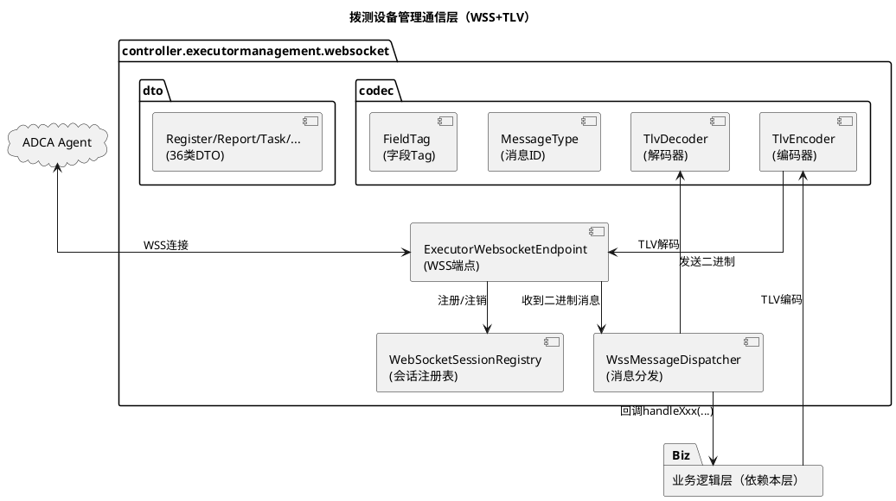
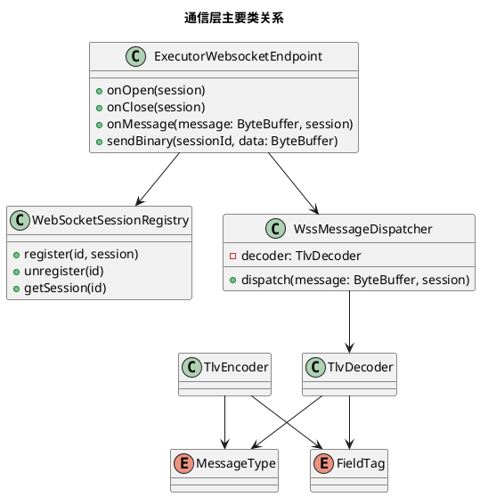
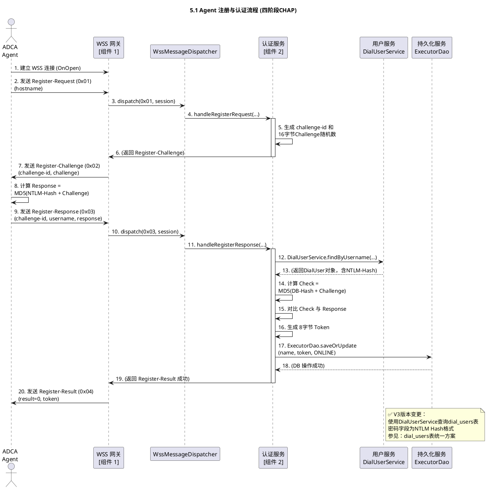
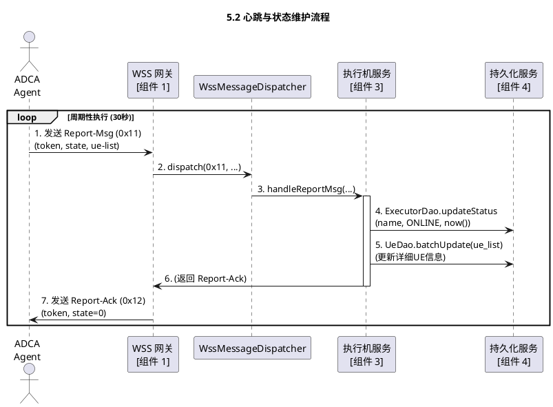
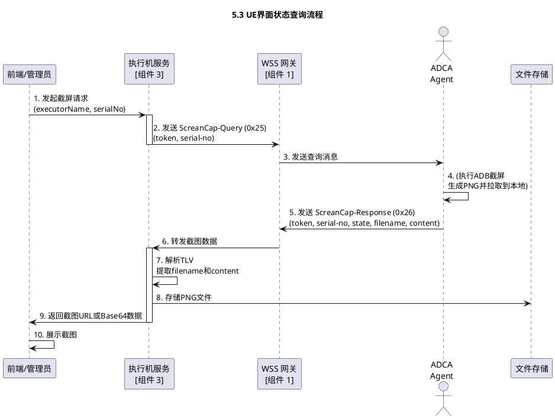
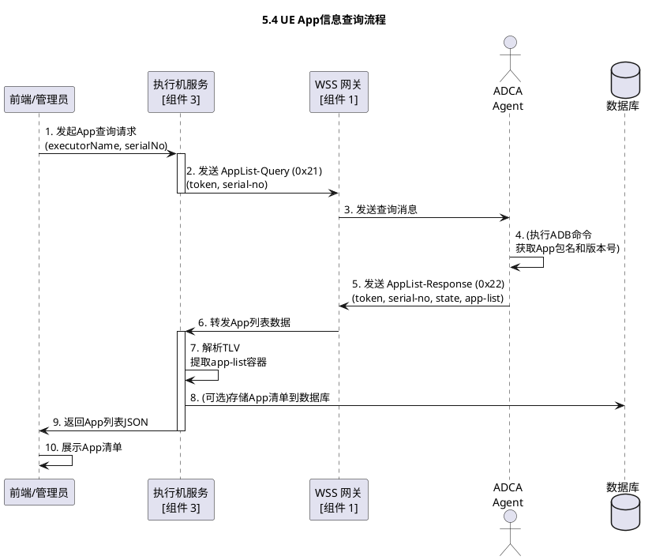
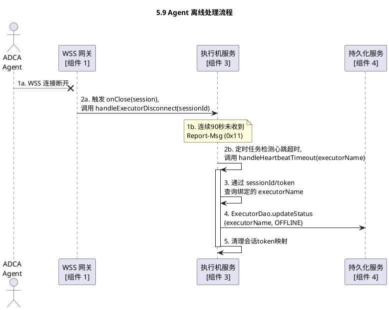

# 执行机管理-WebSocket通信协议设计

> **文档版本**：V3  
> **最后更新**：2025-11-11  
> **主要变更**：
> - ✅ WebSocket统一通信通道（WSS），消息从JSON切换为TLV二进制
> - ✅ 定义消息ID（0x01-0x36）与字段Tag（0x0001-0x0105）
> - ✅ 支持直接二进制文件传输（脚本/日志/截图）
> - ✅ 增加token会话标识，强约束后续消息携带

## 1. 概述

### 1.1 项目背景与目标
本设计聚焦“执行机管理”的通信层实现，提供稳定的WSS长连接与高效TLV编解码能力，面向上层业务（认证、状态、任务）提供消息收发与会话管理基础设施。

### 1.2 关键需求
* 统一通信：所有Agent↔服务端交互走WSS
* 二进制协议：TLV结构，紧凑高效、易扩展
* 会话安全：认证成功后发放8字节token并强制携带
* 大文件直传：脚本、日志、截图等通过二进制发送

## 2. 系统架构

### 2.1 总体架构图


### 2.2 核心设计理念
* 职责单一：通信层仅负责连接、编解码、分发，不承载业务判定
* 高效稳健：二进制紧凑、解码常量时间查Tag
* 易扩展：新字段=新增Tag；新消息=新增Type，向后兼容
* 可测试：编解码与分发可独立单测，业务通过回调隔离

### 2.3 包结构设计
```plaintext
com.huawei.cloududn.dialingtest
│
├── controller.executormanagement.websocket
│   ├── ExecutorWebsocketEndpoint.java               // WSS端点：onOpen/onClose/onMessage(ByteBuffer)
│   ├── WssMessageDispatcher.java                    // 入站分发：按消息ID解码并回调业务
│   ├── WebSocketSessionRegistry.java                // 会话注册表：session管理
│   ├── codec
│   │   ├── TlvEncoder.java                          // TLV编码
│   │   ├── TlvDecoder.java                          // TLV解码
│   │   ├── TlvField.java                            // TLV字段基础类
│   │   ├── MessageType.java                         // 消息ID 0x01-0x36
│   │   └── FieldTag.java                            // 字段Tag 0x0001-0x0105
│   └── dto
│       ├── RegisterChallengeDto.java                // 0x02
│       ├── RegisterResponseDto.java                 // 0x03
│       ├── RegisterResultDto.java                   // 0x04
│       ├── DeRegisterRequestDto.java                // 0x05
│       ├── DeRegisterAckDto.java                    // 0x06
│       ├── ReportAckDto.java                        // 0x12
│       ├── UeItemDto.java                           // 子对象
│       ├── AppListQueryDto.java                     // 0x21
│       ├── AppListResponseDto.java                  // 0x22
│       ├── AppItemDto.java                          // 子对象
│       ├── AppInstallRequestDto.java                // 0x23
│       ├── AppInstallResponseDto.java               // 0x24
│       ├── ScreanCapQueryDto.java                   // 0x25
│       ├── ScreanCapResponseDto.java                // 0x26
│       ├── ScriptUpdateNotifyDto.java               // 0x31
│       ├── ScriptUpdateAckDto.java                  // 0x32
│       ├── SubResultItemDto.java                    // 子对象
│       ├── TaskStopRequestDto.java                  // 0x35
│       ├── TaskStopResponseDto.java                 // 0x36
│       ├── RegisterRequestDto.java                  // 0x01（已有补充）
│       ├── ReportMsgDto.java                        // 0x11（已有补充）
│       ├── TaskStartRequestDto.java                 // 0x33（已有补充）
│       └── TaskStartResponseDto.java                // 0x34（已有补充）
│
├── config
│   └── WebSocketJsr356Config.java                   // 支持二进制消息与缓冲区配置
└── application.yml                                   // 调整WSS缓冲与最大消息大小
```

### 2.3.1 V3版本文件变更统计（通信层相关）
* 新增：codec 5个（TlvEncoder/Decoder/Field/MessageType/FieldTag），DTO 23个（与原文一致）
* 重大修改：
  - `ExecutorWebsocketEndpoint`：onMessage(String) → onMessage(ByteBuffer)
  - `WssMessageDispatcher`：JSON分发 → TLV按消息ID分发
  - 出站发送改为sendBinary并统一经TlvEncoder编码

### 2.4 系统类图设计


## 3. 子模块说明

### 3.1 WebSocket 网关 (WSS Gateway)
* 包路径：`controller.executormanagement.websocket`
* 职责：连接管理（OnOpen/OnClose）、二进制收发、TLV解码与分发
* 输入：Agent的WSS二进制消息；业务层出站消息（经编码器编码）
* 输出：
  - 入站：解码为DTO后回调业务层：`handleRegister/handleReport/handleTask...`
  - 出站：`sendBinary(sessionId, ByteBuffer)`
* 依赖（向业务层暴露的回调）：`AuthSessionService/ExecutorMgmtService/TaskInterfaceService` 的 `handleXxx(...)`

### 3.2 认证与会话服务 (Auth & Session Service)
本通信层不实现业务逻辑，仅回调业务层处理；需业务层实现四阶段CHAP并通过本层回传消息。
业务层通过DialUserService查询dial_users表获取NTLM Hash进行认证验证。

### 3.3 执行机服务 (Executor Service)
同上，由业务层处理状态与UE信息；本层负责可靠收发与DTO解码。

### 3.4 持久化服务 (Persistence Service)
不在本层范围；本层无DB访问。

### 3.5 任务接口服务 (Task Interface Service)
由业务层发起出站消息（经`TlvEncoder`编码）并通过`ExecutorWebsocketEndpoint`发送。

### 3.6 北向API服务 (Northbound API)
与本层解耦；通过业务层间接驱动本层出站消息。

## 4. 接口定义与数据模型

### 4.1 通信机制
#### 4.1.1 连接建立
* URL：`wss://{server}:{port}/ws/executor`
* 建连后进入CHAP流程（认证在业务层），成功后分配8字节token

#### 4.1.2 数据格式（TLV）
* 外层消息头：Type(1B)=消息ID，Length(4B BE)=消息体长度
* 消息体内部：Tag(2B)+Length(2B BE)+Value(NB)
* 基础类型：int(4B BE)、long(8B BE)、string(UTF-8)、hex(原始二进制)、容器为嵌套TLV

#### 4.1.3 状态维护
* 心跳周期：30s；连续3周期未达判离线
* 若持续OFFLINE状态超过10天，可按运维策略进行自动老化（归档/清理）

#### 4.1.4 会话管理
* 认证成功生成token（8字节），后续所有消息必须携带；连接断开token失效

#### 4.1.5 TLS证书与运维要点
* 证书预装：TLS证书随Agent安装包预置在 `certs/` 目录
* 证书更新：支持手动替换证书文件并重启Agent生效
* 约束：不支持证书在线更新

### 4.2 数据模型 (数据库表)
本通信层不涉及数据库表设计（由业务层负责）。

业务层相关表：
- `dial_users`：执行机用户表，密码字段存储NTLM Hash（32位16进制）用于CHAP认证
- `executor`：执行机状态表，存储token、状态、最后在线时间等
- `ue`：UE设备表，存储绑定的执行机、设备信息等

详见：dial_users表统一方案、执行机管理-业务逻辑设计。

### 4.3 接口定义 (WebSocket 消息)

#### 4.3.0 消息类型总览
| 类别 | 名称 | ID | 方向 |
| :--- | :--- | :--- | :--- |
| 注册 | Register-Request | 0x01 | ADCA → CloudUDN |
|  | Register-Challenge | 0x02 | ADCA ← CloudUDN |
|  | Register-Response | 0x03 | ADCA → CloudUDN |
|  | Register-Result | 0x04 | ADCA ← CloudUDN |
|  | DeRegister-Request | 0x05 | ADCA → CloudUDN |
|  | DeRegister-Ack | 0x06 | ADCA ← CloudUDN |
| 状态 | Report-Msg | 0x11 | ADCA → CloudUDN |
|  | Report-Ack | 0x12 | ADCA ← CloudUDN |
| UE&App | AppList-Query | 0x21 | ADCA ← CloudUDN |
|  | AppList-Response | 0x22 | ADCA → CloudUDN |
|  | AppInstall-Request | 0x23 | ADCA ← CloudUDN |
|  | AppInstall-Response | 0x24 | ADCA → CloudUDN |
|  | ScreanCap-Query | 0x25 | ADCA ← CloudUDN |
|  | ScreanCap-Response | 0x26 | ADCA → CloudUDN |
| 脚本&任务 | ScriptUpdate-Notify | 0x31 | ADCA ← CloudUDN |
|  | ScriptUpdate-Ack | 0x32 | ADCA → CloudUDN |
|  | TaskStart-Request | 0x33 | ADCA ← CloudUDN |
|  | TaskStart-Response | 0x34 | ADCA → CloudUDN |
|  | TaskStop-Request | 0x35 | ADCA ← CloudUDN |
|  | TaskStop-Response | 0x36 | ADCA → CloudUDN |

#### 4.3.1 字段Tag定义（摘录）
| Tag | 字段 | 类型 | 说明 |
| :--- | :--- | :--- | :--- |
| 0x0001 | hostname | string | 执行机名 |
| 0x0002 | challenge-id | int | 挑战序号 |
| 0x0003 | challenge | hex | 16字节随机数 |
| 0x0004 | username | string | 用户名 |
| 0x0005 | response | hex | MD5(NTLM-Hash+Challenge) |
| 0x0006 | result | int | 0成功/非0失败 |
| 0x0007 | description | string | 描述 |
| 0x0008 | token | long | 8字节会话ID |
| 0x0009 | state | string/int | 状态/错误码 |
| 0x000A | serial-no | string | UE序列号 |
| 0x0020 | taskid | int | 任务ID |
| 0x0021 | script-name | string | 脚本名 |
| 0x0028 | filelen | int | 文件长度 |
| 0x0027 | content/files | hex | 文件内容 |
| 0x0100 | ue-list | container | UE列表容器 |
| 0x0104 | sub-result | container | 子结果容器 |
| 0x0105 | serial-no-list | container | 序列号列表容器 |
（完整Tag表与原文一致）

#### 4.3.2 注册与认证消息
按原文表格定义（0x01~0x06），用于四阶段CHAP；本层负责收发与解码，认证校验在业务层。

#### 4.3.3 状态报告消息
Report-Msg(0x11)：携带`token/state/ue-list`；Report-Ack(0x12)：回执错误码。用于心跳与UE明细上报。

#### 4.3.4 UE&App管理消息
AppList-Query/Response、AppInstall-Request/Response、ScreanCap-Query/Response；文件/截图以hex二进制直传。

#### 4.3.5 脚本&任务管理消息
ScriptUpdate-Notify/Ack、TaskStart-Request/Response、TaskStop-Request/Response；任务结果包含`sub-result`与`files`打包日志。

#### 4.3.A 标准消息名与字段定义（与表1保持一致）

##### WebSocket消息类型

| 消息类别 | 消息名 | 消息ID | 说明 | 方向 |
| :--- | :--- | :--- | :--- | :--- |
| 注册 | Register-Request | 0x01 | 注册请求消息， 内容包括执行机HostName。 | ADCA → CloudUDN |
|  | Register-Challenge | 0x02 | 注册挑战消息，内容包括ChallengeID、Challenge随机内容。 | ADCA ← CloudUDN |
|  | Register-Response | 0x03 | 注册应答消息，内容包括用户名、ChallengeID，经Challenge进行MD5加密后的密码。 | ADCA → CloudUDN |
|  | Register-Result | 0x04 | 注册结果消息，内容包括注册结果(成功/失败)，注册描述，会话Token等。 | ADCA ← CloudUDN |
|  | DeRegister-Request | 0x05 | 去注册请求，内容包括执行机HostName。 | ADCA → CloudUDN |
|  | DeRegister-Ack | 0x06 | 去注册应答。 | ADCA ← CloudUDN |
| 状态报告 | Report-Msg | 0x11 | 状态报告消息，定时上报UE信息。 | ADCA → CloudUDN |
|  | Report-Ack | 0x12 | 状态报告应答。 | ADCA ← CloudUDN |
| UE&App | AppList-Query | 0x21 | 查询App清单。 | ADCA ← CloudUDN |
|  | AppList-Response | 0x22 | App列表信息。 | ADCA → CloudUDN |
|  | AppInstall-Request | 0x23 | App安装请求。 | ADCA ← CloudUDN |
|  | AppInstall-Response | 0x24 | App安装应答。 | ADCA → CloudUDN |
|  | ScreanCap-Query | 0x25 | 查询UE界面请求。 | ADCA ← CloudUDN |
|  | ScreanCap-Response | 0x26 | 查询UE界面应答。 | ADCA → CloudUDN |
| 脚本&任务 | ScriptUpdate-Notify | 0x31 | 更新脚本通知。 | ADCA ← CloudUDN |
|  | ScriptUpdate-Ack | 0x32 | 更新脚本应答。 | ADCA → CloudUDN |
|  | TaskStart-Request | 0x33 | 拨测任务启动请求。 | ADCA ← CloudUDN |
|  | TaskStart-Response | 0x34 | 拨测任务启动应答，上报拨测结果和日志信息。 | ADCA → CloudUDN |
|  | TaskStop-Request | 0x35 | 拨测任务停止请求。 | ADCA ← CloudUDN |
|  | TaskStop-Response | 0x36 | 拨测任务停止应答。 | ADCA → CloudUDN |

---

##### 注册消息

###### Register-Request (0x01)

| 字段名 | 类型 | 说明 |
| :--- | :--- | :--- |
| hostname | string | 执行机名 |

###### Register-Challenge (0x02)

| 字段名 | 类型 | 说明 |
| :--- | :--- | :--- |
| challenge-id | int | 挑战字序号，每次变化，可用于定位认证上下文 |
| challenge | hex | 十六字节随机数，HEX编码 |

###### Register-Response (0x03)

| 字段名 | 类型 | 说明 |
| :--- | :--- | :--- |
| challenge-id | int | 复制Register-Challenge消息中的值 |
| username | string | 认证用户名 |
| response | hex | 经Challenge进行MD5加密后的密码，HEX编码 |

###### Register-Result (0x04)

| 字段名 | 类型 | 说明 |
| :--- | :--- | :--- |
| result | int | 错误码：0-成功， 非0-失败 |
| description | string | 描述内容，失败原因等 |
| token | int(8B) | 8字节，作为后续的会话ID |

---

##### 状态报告消息

###### Report-Msg (0x11)

| 字段名 | 类型 | 说明 |
| :--- | :--- | :--- |
| token | int(8B) | 会话ID |
| state | string | 执行机状态信息，正常为Normal |
| ue-list | container | UE状态信息，可含多个：serial-no, brand, model, os, version, wmsize, ipv4, ipv6, battery |

###### Report-Ack (0x12)

| 字段名 | 类型 | 说明 |
| :--- | :--- | :--- |
| token | int(8B) | 会话ID |
| state | int | 错误码：0-OK， 非0-异常 |

---

##### UE&App管理消息

###### AppList-Query (0x21)

| 字段名 | 类型 | 说明 |
| :--- | :--- | :--- |
| token | int(8B) | 会话ID |
| serial-no | string | 手机序列号 |

###### AppList-Response (0x22)

| 字段名 | 类型 | 说明 |
| :--- | :--- | :--- |
| token | int(8B) | 会话ID |
| serial-no | string | 手机序列号 |
| state | int | 错误码：0-OK， 非0-异常 |
| app-list | container | App列表项：package、name(可选)、version |

###### AppInstall-Request (0x23)

| 字段名 | 类型 | 说明 |
| :--- | :--- | :--- |
| token | int(8B) | 会话ID |
| serial-no | string | 手机序列号 |
| taskid | int | 任务id |
| appname | string | App名字 |
| script | hex | 可选，安装/配置脚本 |
| package | hex | 可选，安装包文件内容 |
| crc | hex | 可选，CRC校验字 |

###### AppInstall-Response (0x24)

| 字段名 | 类型 | 说明 |
| :--- | :--- | :--- |
| token | int(8B) | 会话ID |
| serial-no | string | 手机序列号 |
| taskid | int | 任务id |
| state | int | 错误码：0-OK， 非0-异常 |

###### ScreanCap-Query (0x25)

| 字段名 | 类型 | 说明 |
| :--- | :--- | :--- |
| token | int(8B) | 会话ID |
| serial-no | string | 手机序列号 |

###### ScreanCap-Response (0x26)

| 字段名 | 类型 | 说明 |
| :--- | :--- | :--- |
| token | int(8B) | 会话ID |
| serial-no | string | 手机序列号 |
| state | int | 错误码：0-OK， 非0-异常 |
| filename | string | 文件名，screencap_YYYYMMDDHHMMSS.png |
| content | hex | 文件内容，图片二进制 |

---

##### 脚本&任务管理消息

###### ScriptUpdate-Notify (0x31)

| 字段名 | 类型 | 说明 |
| :--- | :--- | :--- |
| token | int(8B) | 会话ID |
| script-name | string | 脚本名字 |
| version | string | 版本号 |
| filelen | int | 文件长度 |
| scriptfile | hex | 脚本文件内容，zip压缩 |
| crc | hex | CRC校验字 |

###### ScriptUpdate-Ack (0x32)

| 字段名 | 类型 | 说明 |
| :--- | :--- | :--- |
| token | int(8B) | 会话ID |
| script-name | string | 脚本名字 |
| version | string | 版本号 |
| state | int | 错误码：0-OK， 非0-异常 |

###### TaskStart-Request (0x33)

| 字段名 | 类型 | 说明 |
| :--- | :--- | :--- |
| token | int(8B) | 会话ID |
| taskid | int | 任务ID |
| script-name | string | 脚本名字 |
| version | string | 版本号 |
| serial-no | string[] | 可选，UE序列号列表 |
| proctype | int | 可选，1-顺序，2-并行，3-组合 |
| parameters | string | 其它参数列表 |

###### TaskStart-Response (0x34)

| 字段名 | 类型 | 说明 |
| :--- | :--- | :--- |
| token | int(8B) | 会话ID |
| taskid | int | 任务ID |
| result | string | Success/Fail |
| block | string | 可选，VPN阻塞结果 |
| description | string | 描述信息 |
| sub-result | container | 各UE执行结果（serial-no/result/block/description） |
| filelen | int | 文件长度 |
| files | hex | 日志文件打包 |
| crc | hex | CRC校验字 |

###### TaskStop-Request (0x35)

| 字段名 | 类型 | 说明 |
| :--- | :--- | :--- |
| token | int(8B) | 会话ID |
| taskid | int | 任务ID |
| script-name | string | 脚本名字 |
| version | string | 版本号 |

## 5. 执行机管理业务核心流程（通信视角）

### 5.0 执行机本地配置与初始化
通信层无感；业务层通过DialUserService管理用户，密码自动转换为NTLM Hash用于CHAP认证。详见：dial_users表统一方案。

### 5.1 Agent 注册与认证流程


### 5.2 心跳与状态维护流程


### 5.3 UE界面状态查询流程


### 5.4 UE App信息查询流程


### 5.5 UE App安装流程
服务端下发AppInstall-Request（package或script二选一+crc）；Agent回AppInstall-Response（state）。

### 5.6 拨测脚本更新流程
服务端下发ScriptUpdate-Notify（scriptfile+crc）；Agent回ScriptUpdate-Ack（state）。

### 5.7 任务下发与执行流程
服务端下发TaskStart-Request（script-name/version/serial-no-list/proctype/parameters）；Agent执行并最终上报TaskStart-Response。

### 5.7.4 任务中断流程
服务端下发TaskStop-Request；Agent应立即终止并回TaskStop-Response（state）。

### 5.8 任务结果上报流程
Agent上报TaskStart-Response（result/sub-result/files/crc）；文件由业务层存储，本层保证二进制可靠到达与正确解码。

### 5.9 Agent 离线处理流程



