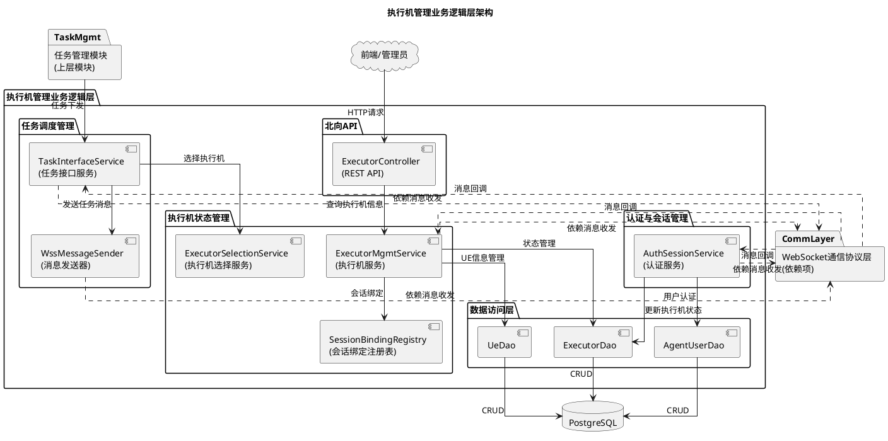
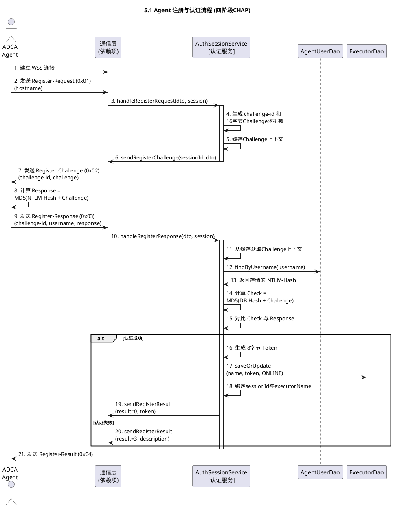
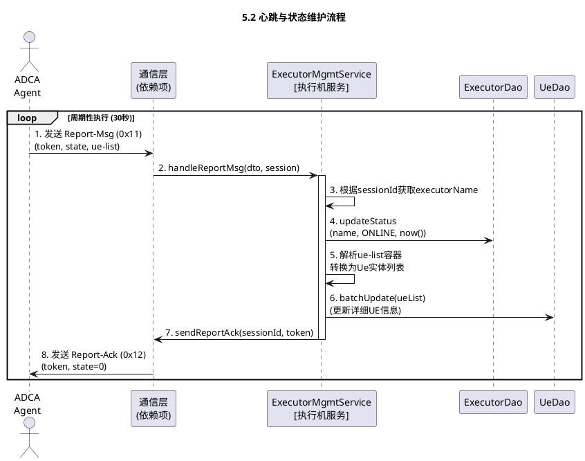
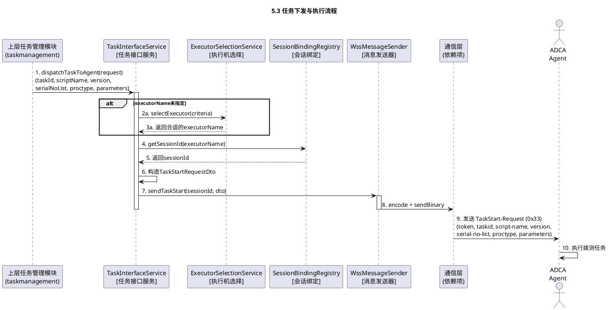
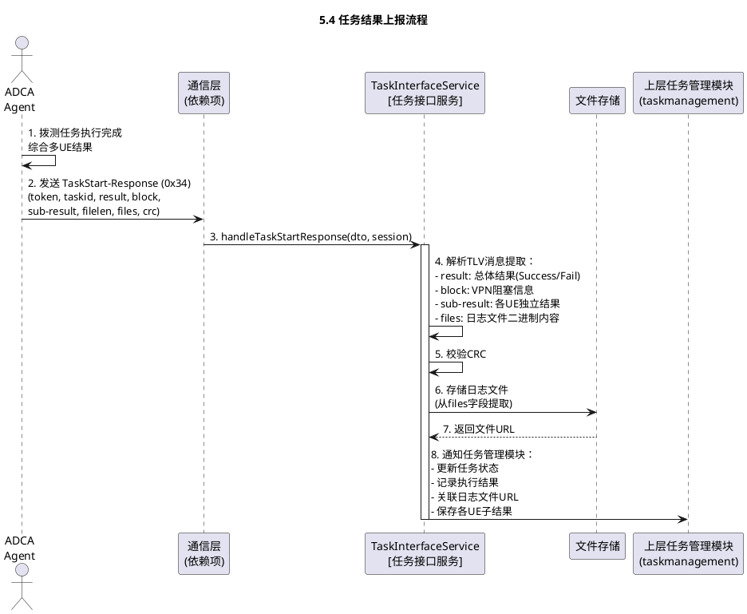
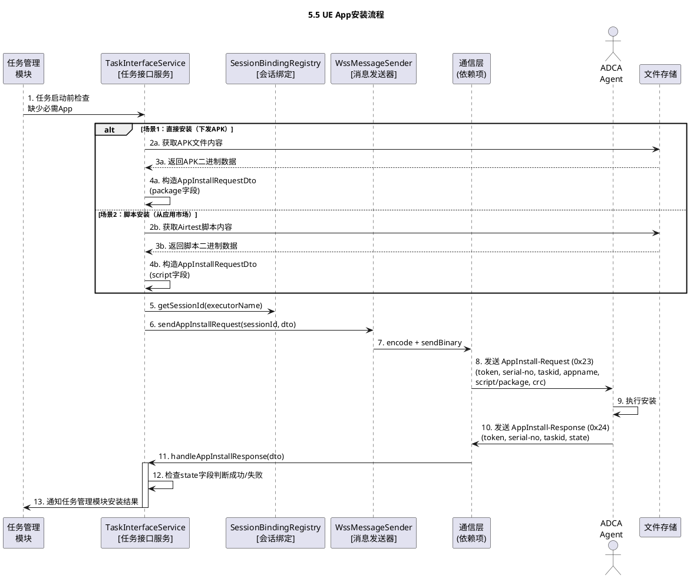
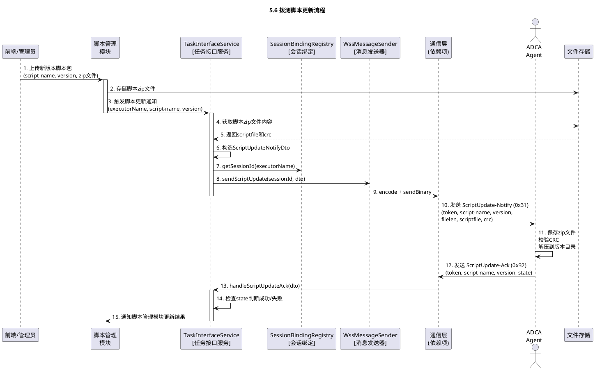
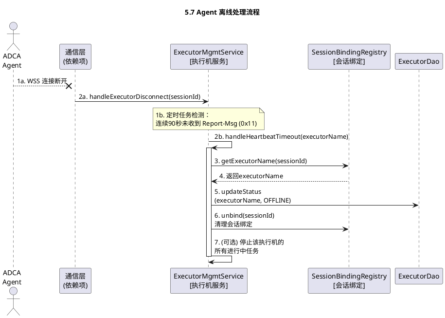

# 执行机管理业务逻辑设计

> **文档版本**：V3  
> **最后更新**：2025-11-11  
> **主要变更**：
> - ✅ 从执行机管理组件中独立出业务逻辑层
> - ✅ 明确对WebSocket通信协议层的依赖关系
> - ✅ 聚焦执行机管理的核心业务功能
> - ✅ 包含认证、状态管理、任务调度、UE管理等业务模块

## 1. 概述

### 1.1 项目背景与目标

本设计负责拨测设备管理系统中**执行机管理的业务逻辑层**，实现执行机注册认证、状态监控、任务调度、UE设备管理等核心业务功能。

### 1.2 关键需求

* **设备注册与管理**：执行机需能自动注册到UDN，上报自身及所连接UE（手机）的信息
* **任务下发与执行**：UDN能够向指定执行机或UE下发拨测任务，由Agent触发拨测工具执行
* **状态监控与上报**：Agent需周期性上报执行机与UE的状态，并实时反馈任务执行进度与结果
* **环境管理**：支持从UDN远程更新拨测脚本、安装/更新UE上的App
* **安全通信**：所有Agent与UDN之间的通信均需通过安全、可靠的通道进行，并支持认证与数据完整性校验

### 1.3 设计目标

* **业务解耦**：与通信协议层解耦，通过明确的接口依赖
* **可测试性**：每个业务模块可独立测试，不依赖WebSocket连接
* **可扩展性**：支持新增业务功能而不影响通信层
* **高可用性**：支持执行机离线重连、状态恢复等容错机制

## 2. 系统架构

### 2.1 总体架构图



### 2.2 核心设计理念

* **分层架构**：业务逻辑与通信协议分离，提高可维护性
* **依赖反转**：业务层不直接依赖WebSocket实现，通过接口依赖
* **单一职责**：每个服务类专注一个业务领域
* **事件驱动**：通过消息回调机制处理Agent上报的事件

### 2.3 包结构设计

```plaintext
com.huawei.cloududn.dialingtest
│
├── controller.executormanagement
│   └── ExecutorController.java                        // 北向API控制器（实现OpenAPI接口）
│
├── service.executormanagement
│   ├── ExecutorMgmtService.java                       // 执行机管理服务（心跳/状态/UE）
│   ├── SessionBindingRegistry.java                    // 会话绑定注册表
│   ├── ExecutorSelectionService.java                  // 执行机选择服务
│   ├── auth
│   │   └── AuthSessionService.java                    // 认证与会话服务（CHAP）
│   ├── task
│   │   ├── TaskInterfaceService.java                  // 任务接口服务（下发/回传）
│   │   └── WssMessageSender.java                      // WSS消息发送器（桥接通信层）
│   └── dto
│       └── ExecutorDetailDto.java                     // 执行机详情DTO
│
├── dao.executormanagement
│   ├── AgentUserDao.java                                // 用户DAO
│   ├── ExecutorDao.java                                 // 执行机DAO（含updateTokenAndStatus）
│   └── UeDao.java                                       // UE DAO
│
└── model
    ├── AgentUser.java                                     // 用户实体（password为NTLM Hash）
    ├── Executor.java                                      // 执行机实体（含token/status/lastOnlineTime）
    └── Ue.java                                            // UE实体（info/taskInfo为JSON）
```

注：以上 `model` 仅指JPA实体模型（数据库实体）。OpenAPI 的 API 模型不在本模块重复定义，统一由项目根目录下的 `dialingtest-interface` 模块提供与生成，后端直接引用使用。

### 2.3.1 V3版本文件变更统计
* 认证服务（AuthSessionService）：实现四阶段CHAP；新增 sendRegisterChallenge/handleRegisterResponse
* 执行机服务（ExecutorMgmtService）：心跳接收改为ReportMsgDto；新增 sendReportAck
* 任务服务（TaskInterfaceService）：支持 serial-no-list/proctype/sub-result；新增 handleTaskStopRequest/sendTaskStopResponse；文件直传
* DAO：ExecutorDao.updateTokenAndStatus 支持8字节token；UeDao方法签名对齐新DTO

### 2.4 系统类图设计

```plantuml
@startuml
title 执行机管理业务逻辑层类关系图

skinparam classAttributeIconSize 0

package "controller.executormanagement" {
    class ExecutorController {
        - executorMgmtService: ExecutorMgmtService
        + getExecutorList(): ExecutorQueryResponse
        + refreshExecutorInfo(request: RefreshExecutorRequest): void
    }
}

package "service.executormanagement" {
    
    class ExecutorMgmtService {
        - executorDao: ExecutorDao
        - ueDao: UeDao
        - sessionBindingRegistry: SessionBindingRegistry
        - wssMessageSender: WssMessageSender
        + handleReportMsg(dto: ReportMsgDto, session: Session)
        + handleExecutorDisconnect(sessionId: String)
        + getExecutorDetails(): List<ExecutorDetailDto>
        + sendReportAck(sessionId: String, token: Long)
    }
    
    class SessionBindingRegistry {
        - sessionToExecutor: Map<String, String>
        - executorToSession: Map<String, String>
        + bind(sessionId: String, executorName: String)
        + unbind(sessionId: String)
        + getExecutorName(sessionId: String): String
        + getSessionId(executorName: String): String
    }
    
    class ExecutorSelectionService {
        - executorDao: ExecutorDao
        + selectExecutor(criteria: SelectionCriteria): Executor
        + checkExecutorAvailability(executorName: String): boolean
    }
    
    package "auth" {
        class AuthSessionService {
            - agentUserDao: AgentUserDao
            - executorDao: ExecutorDao
            - wssMessageSender: WssMessageSender
            - challengeCache: Map<Integer, ChallengeContext>
            + handleRegisterRequest(dto: RegisterRequestDto, session: Session)
            + handleRegisterResponse(dto: RegisterResponseDto, session: Session)
            + handleDeRegisterRequest(dto: DeRegisterRequestDto, session: Session)
            - generateChallenge(): byte[]
            - verifyResponse(username: String, challenge: byte[], response: byte[]): boolean
            - generateToken(): Long
        }
    }
    
    package "task" {
        class TaskInterfaceService {
            - executorDao: ExecutorDao
            - wssMessageSender: WssMessageSender
            - sessionBindingRegistry: SessionBindingRegistry
            + dispatchTaskToAgent(task: TaskDispatchRequest)
            + handleTaskStartResponse(dto: TaskStartResponseDto, session: Session)
            + handleTaskStopRequest(taskId: Integer)
            + handleTaskStopResponse(dto: TaskStopResponseDto, session: Session)
            + sendAppListQuery(executorName: String, serialNo: String)
            + sendAppInstallRequest(executorName: String, request: AppInstallRequest)
            + sendScriptUpdate(executorName: String, script: ScriptUpdateRequest)
            + sendScreanCapQuery(executorName: String, serialNo: String)
        }
        
        class WssMessageSender {
            - tlvEncoder: TlvEncoder
            - websocketEndpoint: ExecutorWebsocketEndpoint
            + sendRegisterChallenge(sessionId: String, challengeDto: RegisterChallengeDto)
            + sendRegisterResult(sessionId: String, resultDto: RegisterResultDto)
            + sendReportAck(sessionId: String, ackDto: ReportAckDto)
            + sendTaskStart(sessionId: String, taskDto: TaskStartRequestDto)
            + sendTaskStop(sessionId: String, stopDto: TaskStopRequestDto)
            + sendAppListQuery(sessionId: String, queryDto: AppListQueryDto)
            + sendAppInstallRequest(sessionId: String, installDto: AppInstallRequestDto)
            + sendScriptUpdate(sessionId: String, updateDto: ScriptUpdateNotifyDto)
            + sendScreanCapQuery(sessionId: String, queryDto: ScreanCapQueryDto)
        }
    }
    
    package "dto" {
        class ExecutorDetailDto {
            + name: String
            + ip: String
            + status: Integer
            + lastOnlineTime: Date
            + ueList: List<UeItemDto>
        }
    }
}

package "dao.executormanagement" {
    interface AgentUserDao {
        + findByUsername(username: String): AgentUser
        + save(user: AgentUser): void
        + update(user: AgentUser): void
    }
    
    interface ExecutorDao {
        + findByName(name: String): Executor
        + saveOrUpdate(executor: Executor): void
        + updateStatus(name: String, status: Integer): void
        + updateTokenAndStatus(name: String, token: Long, status: Integer): void
        + findAllOnline(): List<Executor>
    }
    
    interface UeDao {
        + findBySerialNo(serialNo: String): Ue
        + batchUpdate(ueList: List<Ue>): void
        + findByExecutor(executorName: String): List<Ue>
        + updateTaskInfo(serialNo: String, taskInfo: String): void
    }
}

package "model" {
    class AgentUser {
        + id: Integer
        + username: String
        + password: String
        + lastLoginTime: Date
    }
    
    class Executor {
        + name: String
        + ip: String
        + token: String
        + proxy: String
        + description: String
        + status: Integer
        + lastOnlineTime: Date
    }
    
    class Ue {
        + msisdn: String
        + executorName: String
        + vendor: String
        + os: String
        + info: String
        + taskInfo: String
    }
}

' 依赖关系
ExecutorController --> ExecutorMgmtService
ExecutorMgmtService --> ExecutorDao
ExecutorMgmtService --> UeDao
ExecutorMgmtService --> SessionBindingRegistry
ExecutorMgmtService --> WssMessageSender
AuthSessionService --> AgentUserDao
AuthSessionService --> ExecutorDao
AuthSessionService --> WssMessageSender
TaskInterfaceService --> ExecutorDao
TaskInterfaceService --> WssMessageSender
TaskInterfaceService --> SessionBindingRegistry
ExecutorSelectionService --> ExecutorDao
AgentUserDao ..> AgentUser
ExecutorDao ..> Executor
UeDao ..> Ue

@enduml
```



## 3. 子模块说明

### 3.1 认证与会话服务 (AuthSessionService)

* **包路径**: `service.executormanagement.auth.AuthSessionService`
* **功能职责**: 负责核实Agent身份并管理其会话
  1. **身份认证**: 处理四阶段CHAP认证流程
  2. **会话绑定**: 认证成功后，生成token，建立token与sessionId的绑定关系
  3. **去注册处理**: 处理Agent主动注销

* **输入**:
  - 通信层转发的 `RegisterRequestDto`
  - 通信层转发的 `RegisterResponseDto`
  - 通信层转发的 `DeRegisterRequestDto`

* **输出**:
  - 通过WssMessageSender发送 `RegisterChallengeDto`
  - 通过WssMessageSender发送 `RegisterResultDto`
  - 通过WssMessageSender发送 `DeRegisterAckDto`
  - 调用ExecutorDao更新执行机状态和token

* **对通信层的依赖**:
  - 依赖 `WssMessageSender` 发送消息
  - 接收通信层的消息回调

### 3.2 执行机管理服务 (ExecutorMgmtService)

* **包路径**: `service.executormanagement.ExecutorMgmtService`
* **功能职责**: 负责执行机（Executor）和UE（User Equipment）设备的核心状态管理
  1. **心跳处理**: 处理 `ReportMsgDto` 消息，更新执行机 `last_online_time`，维持 `ONLINE` 状态
  2. **信息管理**: 处理Agent上报的详细信息（如UE列表），并持久化
  3. **离线处理**: 响应连接断开事件，或心跳超时，将执行机状态更新为 `OFFLINE`

* **输入**:
  - 通信层转发的 `ReportMsgDto`
  - 通信层转发的连接断开通知
  - 北向API转发的刷新指令

* **输出**:
  - 通过WssMessageSender发送 `ReportAckDto`
  - 调用ExecutorDao和UeDao更新设备状态和信息
  - 向北向API提供执行机列表和状态数据

* **对通信层的依赖**:
  - 依赖 `WssMessageSender` 发送消息
  - 接收通信层的消息回调和连接事件

### 3.3 任务接口服务 (TaskInterfaceService)

* **包路径**: `service.executormanagement.task.TaskInterfaceService`
* **功能职责**: 作为"设备管理"模块与上层"任务管理"模块之间的连接器（适配器）
  1. **任务下发**: 接收上层"任务管理"模块的拨测指令，转换为 `TaskStartRequestDto` 消息下发给Agent
  2. **结果上报**: 处理Agent上报的 `TaskStartResponseDto` 消息，通知上层"任务管理"模块更新任务状态
  3. **任务中断**: 接收上层"任务管理"模块的中断指令，发送 `TaskStopRequestDto` 消息
  4. **环境管理**: 处理脚本更新、App安装、界面截屏等请求

* **输入**:
  - 上层 `taskmanagement` 模块的任务下发调用
  - 通信层转发的 `TaskStartResponseDto`
  - 通信层转发的 `TaskStopResponseDto`
  - 通信层转发的 `AppListResponseDto`、`AppInstallResponseDto`、`ScreanCapResponseDto`、`ScriptUpdateAckDto`

* **输出**:
  - 通过WssMessageSender发送任务和管理消息
  - 向上层 `taskmanagement` 模块通知任务执行进度和结果

* **对通信层的依赖**:
  - 依赖 `WssMessageSender` 发送消息
  - 接收通信层的消息回调

### 3.4 消息发送器 (WssMessageSender)

* **包路径**: `service.executormanagement.task.WssMessageSender`
* **功能职责**: 封装消息发送逻辑，作为业务层与通信层的桥梁
  1. **消息编码**: 调用TlvEncoder将业务DTO编码为TLV二进制格式
  2. **消息发送**: 调用ExecutorWebsocketEndpoint发送二进制消息
  3. **异常处理**: 处理发送失败的情况

* **输入**:
  - 业务层提供的DTO对象和sessionId

* **输出**:
  - 通过ExecutorWebsocketEndpoint发送TLV二进制消息

* **对通信层的依赖**:
  - 依赖 `TlvEncoder` 编码消息
  - 依赖 `ExecutorWebsocketEndpoint` 发送消息

### 3.5 北向API服务 (ExecutorController)

* **包路径**: `controller.executormanagement.ExecutorController`
* **功能职责**: 负责提供对"前端管理页面"或"外部管理员"的HTTP REST接口
  1. **执行机查询**: 查询在线执行机列表和详细信息
  2. **执行机刷新**: 触发执行机信息刷新

* **输入**:
  - 前端发起的HTTP API请求（如 `GET /api/v1/executors` 查询列表）
  - OpenAPI 生成的 `model` 请求体（如 `RefreshExecutorRequest`）

* **输出**:
  - OpenAPI 生成的 `model` JSON响应（如 `ExecutorQueryResponse`）
  - 调用 `ExecutorMgmtService` 来获取数据或执行操作

* **对通信层的依赖**: 无直接依赖

#### 3.5.1 OpenAPI 契约与生成（强制）
- 契约来源：`dialingtest-interface/src/main/resources/executor-api.yaml`（OpenAPI 3）
- 代码生成：使用 openapi-generator 生成 `com.huawei.cloududn.dialingtest.api.ExecutorsApi` 与 `com.huawei.cloududn.dialingtest.model.*`
- 实现方式：`ExecutorController` 实现 `ExecutorsApi`；入参/出参严格使用已生成的 `model` 类（禁止在后端重复定义等价 DTO）
- CI与文档：构建阶段校验 YAML、生成 Java 模型与静态文档，并作为构建产物发布

### 3.6 数据访问层 (DAO)

* **包路径**: `dao.executormanagement`
* **功能职责**: 负责"设备管理"模块所有相关表的持久化数据管理（CRUD）

* **输入**:
  - 业务服务层的数据库操作调用

* **输出**:
  - `model.Executor`, `model.Ue`, `model.AgentUser` 数据（JPA 实体）
  - 数据库的 `INSERT`/`UPDATE` 结果

* **对通信层的依赖**: 无

## 4. 接口定义与数据模型

### 4.1 数据模型 (数据库表)

#### 4.1.1 用户表 (agent_user)

用于执行机登录认证。多个执行机可共用一个账户。

| 字段名 | 类型 | 约束 | 说明 |
| :--- | :--- | :--- | :--- |
| id | int | 主键 | 用户标识 |
| username | varchar(40) | 唯一 | 用户名。字母、数字、短横线、下划线 |
| password | varchar(128) | | **存储 NTLM Hash 值**，用于 CHAP 认证 |
| last_login_time | timestamp | | 最后登录时间 |

#### 4.1.2 执行机表 (executor)

存储已注册的执行机信息。

| 字段名 | 类型 | 约束 | 说明 |
| :--- | :--- | :--- | :--- |
| name | varchar(40) | 主键 | 执行机名（唯一） |
| ip | varchar(40) | | 执行机IP (WSS连接的源IP) |
| token | varchar(256) | | 认证Token (WSS会话期间使用) |
| proxy | varchar(256) | | (可选) 连接执行机的代理信息 |
| description | text | | 执行机描述 |
| status | smallint | | 0: 离线, 1: 在线, 2: 失效 |
| last_online_time | timestamp | | 最后在线时间 (心跳更新) |

#### 4.1.3 UE表 (ue)

存储执行机关联的手机终端信息。

| 字段名 | 类型 | 约束 | 说明 |
| :--- | :--- | :--- | :--- |
| msisdn | varchar(15) | 主键 | 手机号（国家码+国内号码） |
| executor_name | varchar(40) | 外键 | 所属的执行机 (关联执行机表.name) |
| vendor | varchar(128) | | 品牌 |
| os | varchar(128) | | 系统 |
| info | text | | 手机扩展信息 (JSON)。存储周期上报的详细状态 |
| task_info | text | | 关联的拨测任务信息 (JSON 字符串) |

### 4.2 业务DTO与接口（精要）
* DTO（示例）：`ExecutorDetailDto`（name/ip/status/lastOnlineTime/ueList）、`TaskDispatchRequest`（executorName/taskId/scriptName/version/serialNoList/proctype/parameters）、`ScriptUpdateRequest`（scriptName/version/scriptFile/crc）、`AppInstallRequest`（serialNo/taskId/appName/script/packageFile/crc）
* 接口要点：
  - `AuthSessionService`: handleRegisterRequest/handleRegisterResponse/handleDeRegisterRequest
  - `ExecutorMgmtService`: handleReportMsg/handleExecutorDisconnect/getExecutorDetails/sendReportAck
  - `TaskInterfaceService`: dispatchTaskToAgent/handleTaskStartResponse/handleTaskStopRequest/handleTaskStopResponse/sendAppListQuery/sendAppInstallRequest/sendScriptUpdate/sendScreanCapQuery

## 5. 执行机管理业务核心流程

### 5.1 Agent 注册与认证流程

**流程描述**: 此流程采用**四阶段CHAP认证**，避免网络传输NTLM Hash明文。



**关键业务逻辑**:
- 生成challenge并缓存（5分钟过期）；校验Response后生成8字节token
- 绑定sessionId↔executorName；更新执行机为ONLINE并落库

### 5.2 心跳与状态维护流程

**流程描述**: Agent认证成功后，周期性（**30秒**）发送 `Report-Msg (0x11)` 心跳消息。



**关键业务逻辑**:
- 基于session映射定位executor；更新ONLINE与last_online_time
- 解析ue-list并批量更新UE；回发Report-Ack；定时任务做超时离线判定

### 5.3 任务下发与执行流程

**流程描述**: CloudUDN通过手动触发或定时任务触发拨测任务执行。



**关键业务逻辑**:
- 未指定executor时通过在线性/UE可用性/负载策略选择
- 从绑定表取sessionId；构造0x33并通过发送器出站

### 5.4 任务结果上报流程

**流程描述**: Agent执行完拨测任务后，将执行结果封装为 `TaskStart-Response (0x34)` 消息上报。



**关键业务逻辑**:
- 解析总体/子结果；校验CRC并存储日志，回传URL；通知任务管理模块

### 5.5 UE App安装流程

**流程描述**: 在拨测任务启动前的准备阶段，CloudUDN查询执行机的用例集和UE的App安装情况。



**关键业务逻辑**:
- 两种安装路径（APK直装/脚本安装）；计算CRC；以state结果驱动后续流程

### 5.6 拨测脚本更新流程

**流程描述**: CloudUDN管理员在平台上更新拨测脚本后，服务端通过ScriptUpdate-Notify消息通知执行机。



**关键业务逻辑**:
- 从存储读取zip与crc并通知；按state确认是否成功应用

### 5.7 Agent 离线处理流程

**流程描述**: 当Agent的WSS连接意外断开时，或连续3个周期（90秒）未收到心跳消息时。



**关键业务逻辑**:
- onClose/超时触发；标记OFFLINE并清理会话绑定；必要时终止进行中任务


