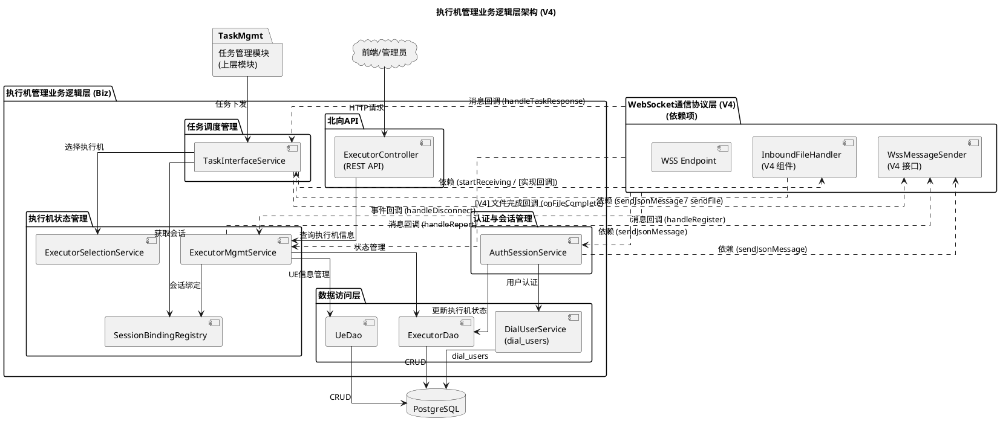
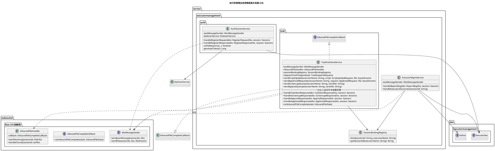
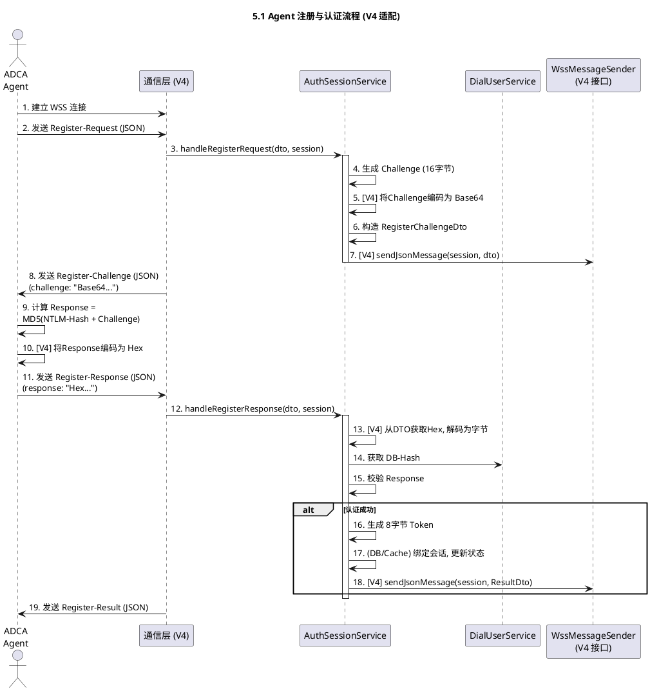
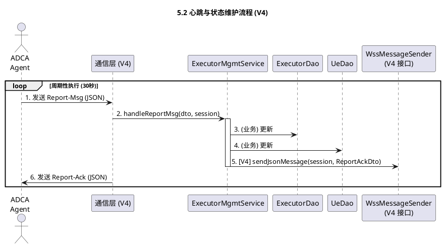
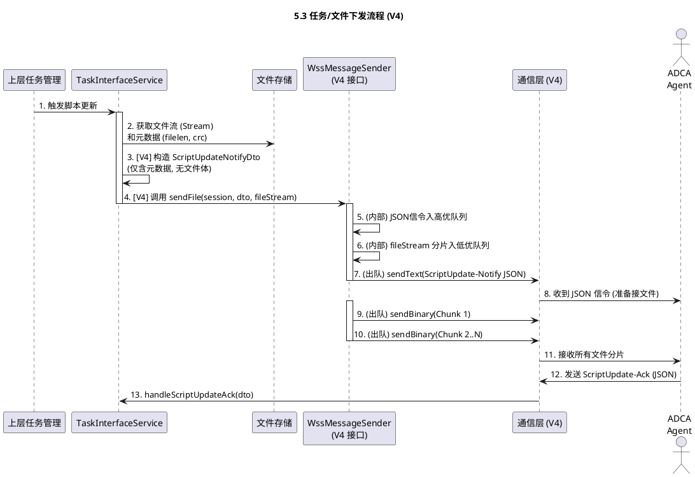
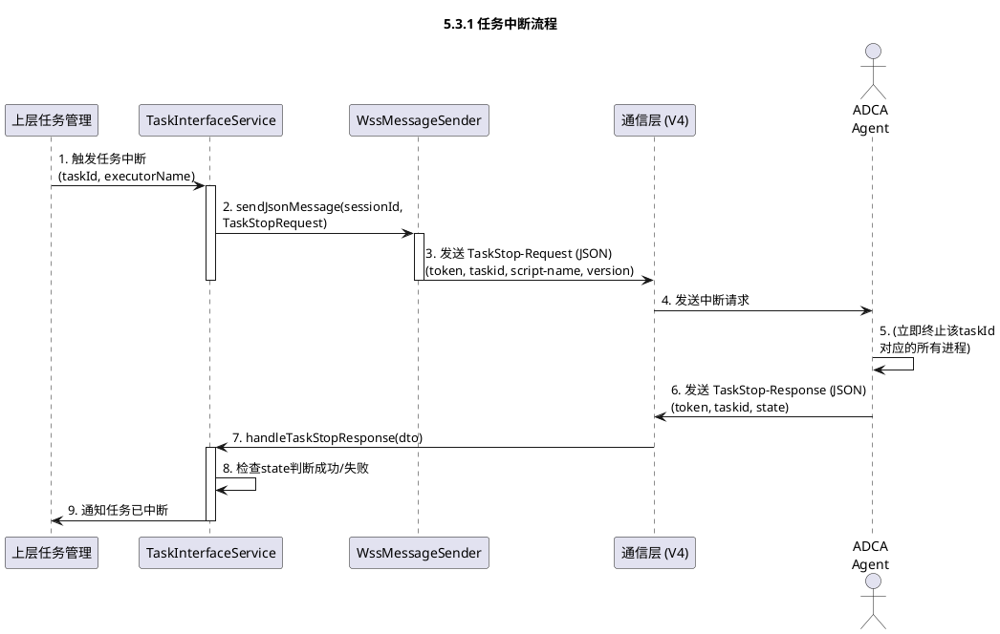
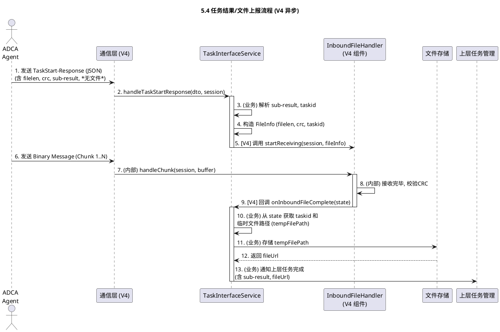
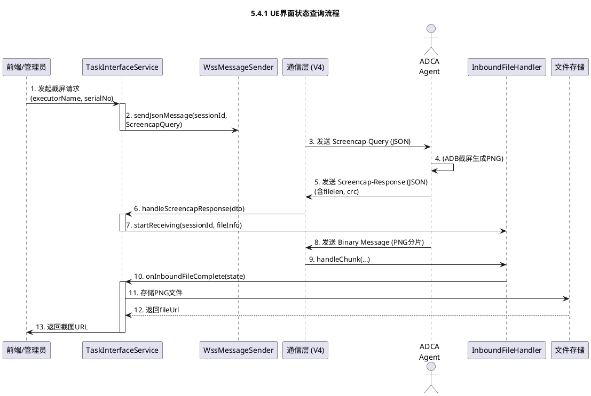
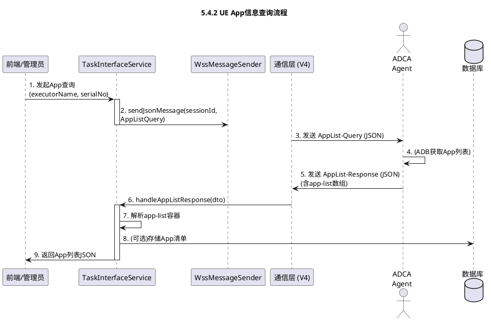
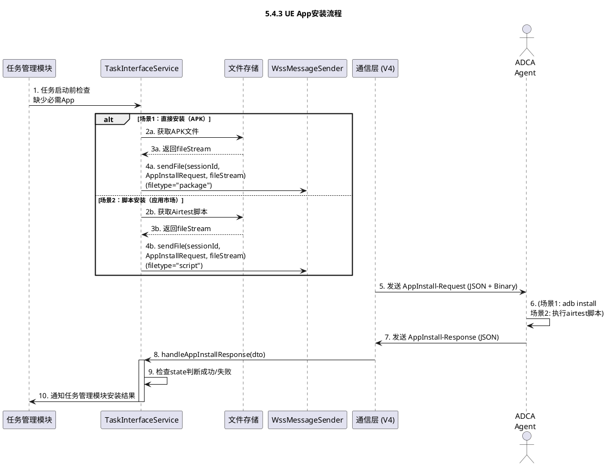

# 执行机管理业务逻辑设计

> **文档版本**：V4
> **最后更新**：2025-11-13
> 
> **关联文档**：
> - 本文档定义**业务逻辑层**的设计（认证、状态管理、任务调度）
> - 配套文档：[执行机管理-WebSocket通信协议设计.md](./执行机管理-WebSocket通信协议设计.md) 定义**通信协议层**的设计（WSS连接、JSON编解码、消息队列、文件分片）
> - **分层边界**：业务层通过 `WssMessageSender` 和 `InboundFileCompleteCallback` 接口依赖通信层，互不包含实现细节
> 
> **主要变更 (对比V3)**：
>
> - ✅ **依赖倒转**：业务逻辑层不再实现消息发送，转为依赖通信层提供的 `WssMessageSender` 接口。
> - ✅ **移除编码**：彻底移除 V3 的 `WssMessageSender` (实现类) 及所有 `TlvEncoder` 相关的编解码逻辑。
> - ✅ **认证适配**：`AuthSessionService` 适配V4的JSON协议，`challenge` 使用Base64编码，`response` 使用Hex编码。
> - ✅ **出站文件重构**：`TaskInterfaceService` 下发文件（脚本、App）时，不再打包二进制，而是构造元数据DTO (含 `filelen`, `crc`)，并调用 `WssMessageSender.sendFile(dto, fileStream)`。
> - ✅ **入站文件重构**：`TaskInterfaceService` 接收文件（日志、截图）流程改为异步：
>   1. `handleXxxResponse` 仅处理JSON元数据，并调用 `InboundFileHandler.startReceiving`。
>   2. 实现 `InboundFileCompleteCallback` 接口，在文件接收完毕后通过 `onInboundFileComplete` 回调处理存储和通知上层。

## 1\. 概述

### 1.1 项目背景与目标

本设计负责拨测设备管理系统中**执行机管理的业务逻辑层**，实现执行机注册认证、状态监控、任务调度、UE设备管理等核心业务功能。

### 1.2 关键需求

* **设备注册与管理**：执行机需能自动注册到UDN，上报自身及所连接UE（手机）的信息。
* **任务下发与执行**：UDN能够向指定执行机或UE下发拨测任务，由Agent触发拨测工具执行。
* **状态监控与上报**：Agent需周期性上报执行机与UE的状态，并实时反馈任务执行进度与结果。
* **环境管理**：支持从UDN远程更新拨测脚本、安装/更新UE上的App（**V4适配：支持大文件分片传输**）。
* **安全通信**：依赖V4通信层提供的WSS通道、CHAP认证与会H话管理。

### 1.3 设计目标

* **业务解耦**：与V4通信协议层（JSON/Binary）解耦，通过明确的接口依赖。
* **可测试性**：每个业务模块可独立测试，不依赖WebSocket连接。
* **可扩展性**：支持新增业务功能而不影响通信层。
* **高可用性**：支持执行机离线重连、状态恢复等容错机制。

## 2\. 系统架构

### 2.1 总体架构图



### 2.2 核心设计理念

* **分层架构**：业务逻辑与通信协议分离，提高可维护性。
* **依赖反转**：业务层不直接依赖WebSocket实现，通过V4通信层提供的 `WssMessageSender` 和 `InboundFileHandler` 接口/组件进行交互。
* **单一职责**：每个服务类专注一个业务领域。
* **事件驱动**：通过消息回调机制处理Agent上报的事件。
* **[V4] 异步文件处理**：业务层将入站大文件的处理（存储、通知）推迟到通信层的文件接收完成回调中。

### 2.3 包结构设计

```plaintext
com.huawei.cloududn.dialingtestapp
│
├── controller.executormanagement
│   └── ExecutorController.java                        // 北向API控制器（实现OpenAPI接口）
│
├── service.executormanagement
│   ├── ExecutorMgmtService.java                       // 执行机管理服务（心跳/状态/UE）
│   ├── SessionBindingRegistry.java                    // 会话绑定注册表
│   ├── ExecutorSelectionService.java                  // 执行机选择服务
│   ├── auth
│   │   └── AuthSessionService.java                    // 认证与会话服务（CHAP）
│   ├── task
│   │   ├── TaskInterfaceService.java                  // 任务接口服务（下发/回传）
│   │   │                                               // [V4] 依赖 WssMessageSender 和 InboundFileHandler
│   │   │                                               // [V4] 实现 InboundFileHandler 的回调
│   │   └── [V3 WssMessageSender.java (已删除)]        // [V4] 业务层不再包含发送器实现
│   └── dto
│       └── ExecutorDetailDto.java                     // 执行机详情DTO
│
├── dao.executormanagement
│   ├── ExecutorDao.java
│   └── UeDao.java
│
└── model (JPA Entities)                               // 实体类由 dialingtest-interface 项目根据 YAML 自动生成，无需在本模块手工实现

```

**[V4] 依赖的通信层接口 (由通信层 `websocket.flow` 包提供):**

* `WssMessageSender.java` (Interface)
* `InboundFileHandler.java` (Component)

### 2.4 系统类图设计



## 3\. 子模块说明

### 3.1 认证与会话服务 (AuthSessionService)

* **包路径**: `service.executormanagement.auth.AuthSessionService`
* **功能职责**: 负责核实Agent身份并管理其会话。
* **输入**:
  * 通信层转发的 `RegisterRequestDto`。
  * 通信层转发的 `RegisterResponseDto`（**[V4]** `response` 字段为 **Hex** 字符串）。
  * 通信层转发的 `DeRegisterRequestDto`。
* **输出**:
  * 调用 `WssMessageSender.sendJsonMessage` 发送 `RegisterChallengeDto`（**[V4]** `challenge` 字段为 **Base64** 字符串）。
  * 调用 `WssMessageSender.sendJsonMessage` 发送 `RegisterResultDto`。
  * 调用 `WssMessageSender.sendJsonMessage` 发送 `DeRegisterAckDto`。
* **对通信层的依赖**:
  * 依赖 `WssMessageSender` 接口发送JSON信令。
  * 接收通信层的消息回调。

### 3.2 执行机管理服务 (ExecutorMgmtService)

* **包路径**: `service.executormanagement.ExecutorMgmtService`
* **功能职责**: 负责执行机（Executor）和UE（User Equipment）设备的核心状态管理（在线/离线、心跳、基础UE信息），不直接处理任务结果、截屏或App列表等任务型业务。
* **输入**:
  * 通信层转发的 `ReportMsgDto` (JSON)。
  * 通信层转发的连接断开通知。
* **输出**:
  * 调用 `WssMessageSender.sendJsonMessage` 发送 `ReportAckDto` (JSON)。
  * 调用DAO更新设备状态和信息。
* **对通信层的依赖**:
  * 依赖 `WssMessageSender` 接口发送JSON信令。
  * 接收通信层的消息回调和连接事件。

### 3.3 任务接口服务 (TaskInterfaceService)

* **包路径**: `service.executormanagement.task.TaskInterfaceService`
* **功能职责**: 核心任务适配器，处理所有与任务、文件及任务相关UE操作（截屏、App列表、App安装）相关的业务，是上层任务管理模块与执行机之间的统一业务入口。
* **[V4] 出站文件下发 (如脚本更新/App安装)**:
  1. 接收上层"任务管理"模块的调用（如 `sendScriptUpdate`）。
  2. 业务逻辑准备 **元数据DTO**（如 `ScriptUpdateNotifyDto`，包含 `filelen`, `crc`，**不含文件体**）。
  3. 业务逻辑获取 `File` 或 `InputStream`。
  4. 调用 `WssMessageSender.sendFile(sessionId, metadataDto, fileStream)`。
* **[V4] 入站文件上报 (如任务日志/截图)**:
  1. **信令处理**: `handleTaskStartResponse` / `handleScreanCapResponse` 被回调。
  2. 业务逻辑解析DTO中的 **元数据** (`filelen`, `crc`) 和业务字段 (`result`, `sub-result`)。
  3. 业务逻辑调用 `InboundFileHandler.startReceiving(session, fileInfo)`，告知通信层准备接收文件（可关联 `taskId` 等业务标识）。
  4. **文件完成回调**: 通信层完成接收并校验CRC后，回调 `TaskInterfaceService.onInboundFileComplete(state)`。
  5. 业务逻辑在 `onInboundFileComplete` 回调中，从 `state` 获取临时文件路径，将其存入文件存储（Storage），并最终通知上层"任务管理"模块任务完成。
* **对通信层的依赖**:
  * 依赖 `WssMessageSender` 接口发送JSON信令和文件。
  * 依赖 `InboundFileHandler` 组件注册入站文件。
  * 接收通信层的消息回调，并**实现** `InboundFileCompleteCallback` 接口以接收文件完成通知。

### 3.4 [V4] 通信层接口依赖

本业务逻辑模块依赖 V4 通信层提供的以下核心组件：

1. **`WssMessageSender` (接口)**
   * `sendJsonMessage(sessionId, dto)`: 业务层调用此方法发送纯JSON信令（如ACK、认证、不带文件的请求）。
   * `sendFile(sessionId, dto, fileStream)`: 业务层调用此方法发送"信令+文件"组合（如脚本更新、App安装）。通信层内部负责将DTO转为JSON信令并优先发送，随后发送文件流的二进制分片。
   
2. **`InboundFileHandler` (组件)**
   * `startReceiving(sessionId, fileInfo)`: 当业务层收到一个文件上报信令（如 `TaskStartResponse`）时，调用此方法通知通信层开始接收后续的二进制分片。
   * `handleChunk(sessionId, buffer)`: 由通信层Dispatcher调用，处理接收到的文件分片。
   
3. **`InboundFileCompleteCallback` (回调接口)**
   * 业务层（`TaskInterfaceService`）需实现此接口，并在构造时注入到 `InboundFileHandler`。
   * `onInboundFileComplete(state: InboundFileState)`: 当 `InboundFileHandler` 完成文件接收并校验CRC后，通过此回调通知业务层。
   * `InboundFileState` 包含：临时文件路径（`tempFilePath`）、文件大小（`filelen`）、CRC、业务标识（如 `taskId`）等信息。

### 3.5 北向API服务 (ExecutorController)

* **包路径**: `controller.executormanagement.ExecutorController`
* **功能职责**: 提供对外的HTTP REST接口（查询、刷新执行机）。
* **对通信层的依赖**: 无直接依赖。

### 3.6 数据访问层 (DAO)

* **包路径**: `dao.executormanagement`
* **功能职责**: 负责 `executor`, `ue` 表的CRUD；`dial_users` 表由公共用户模块的 `DialUserService` 访问。
* **对通信层的依赖**: 无。

## 4\. 接口定义与数据模型

### 4.1 数据模型 (数据库表)

（V4与V3一致，此处省略 `dial_users`, `executor`, `ue` 表的详细定义）

### 4.2 [V4] 业务DTO与接口（精要）

* **DTO (出站文件)**:
  * `ScriptUpdateRequest` (V4): `scriptName`, `version`, **`filelen`**, **`crc`** (移除 `scriptFile`)。
  * `AppInstallRequest` (V4): `serialNo`, `taskId`, `appName`, **`filetype`**, **`filelen`**, **`crc`** (移除 `script`/`packageFile`)。
* **DTO (入站文件)**:
  * `TaskStartResponse` (V4): `taskId`, `result`, `sub-result`, **`filelen`**, **`crc`** (移除 `files`)。
  * `ScreencapResponse` (V4): `serialNo`, `state`, `filename`, **`filelen`**, **`crc`** (移除 `content`)。
* **接口要点**:
  * `AuthSessionService`: `handleRegisterRequest` (编码Base64), `handleRegisterResponse` (解码Hex)。
  * `ExecutorMgmtService`: `handleReportMsg`, `handleExecutorDisconnect`。
  * `TaskInterfaceService`:
    * `sendScriptUpdate(..., fileStream)`
    * `sendAppInstallRequest(..., fileStream)`
    * `handleTaskStartResponse(dto)` -\> 调用 `inboundFileHandler.startReceiving`
    * `handleScreencapResponse(dto)` -\> 调用 `inboundFileHandler.startReceiving`
    * `onInboundFileComplete(state)` -\> **[V4 新增回调]** 处理已接收的文件。

## 5\. 执行机管理业务核心流程 (V4)

### 5.0 执行机本地配置与初始化

**流程描述**: Agent初次安装时需完成本地配置，为后续认证和通信做准备。

**Agent侧配置要求**:
- **执行机名称** (`hostname`): 用于注册时标识执行机
- **服务器地址** (`cloududn_server`): UDN服务器域名或IP，通过DNS解析
- **连接URL**: `wss://{cloududn_server}:{port}/ws/executor`
- **认证凭据**: 用户名和密码（NTLM Hash加密存储）
  - 密码处理：使用Unicode编码 + MD4算法生成NTLM Hash（32位十六进制）
  - 存储位置：配置文件（避免明文存储）

**服务端配置要求**:
- 在 `dial_users` 表预先创建用户账号
- 密码字段存储与Agent相同算法生成的NTLM Hash
- 多个执行机可共用同一账号

**配置持久化**: Agent启动时自动从配置文件读取，无需每次手动输入。

---

### 5.1 Agent 注册与认证流程 (V4 适配)

**流程描述**: 四阶段CHAP认证，适配V4的Base64/Hex编码。



**关键业务逻辑**:

* `AuthService` (步骤5) 负责将 `challenge` 编码为Base64。
* `AuthService` (步骤13) 负责将 `response` (Hex) 解码回字节进行校验。
* 所有发送均委托 `WssMessageSender.sendJsonMessage`。

#### 5.1.1 Agent服务运维

**服务驻留**:
- 认证成功后，Agent作为后台服务长期驻留
- Windows: 注册为Windows Service
- Linux: 注册为systemd服务

**自动启动**:
- 系统重启后自动启动Agent进程
- 自动重新执行认证流程（5.1节）

**状态管理**:
- 认证成功后，服务端将执行机状态更新为 `ONLINE`
- 心跳维持在线状态（参见5.2节）
- 连接断开或心跳超时后，状态更新为 `OFFLINE`（参见5.5节）

---

### 5.2 心跳与状态维护流程

**流程描述**: 周期性上报，业务逻辑无重大变化，仅适配V4发送接口。



### 5.3 [V4] 任务/文件下发流程 (如脚本更新)

**流程描述**: 业务层调用 `sendFile` 接口，V4通信层负责JSON信令和Binary分片的拆分与排队发送。



**关键业务逻辑**:

* 业务层 (`TaskService` 步骤 3, 4) 只负责准备**元数据DTO**和**文件流**，并调用 `sendFile`。
* 业务层不关心分片、排队和实际的 `sendText`/`sendBinary`。

#### 5.3.1 任务中断流程

**流程描述**: 上层任务管理模块可随时中断正在执行的任务，Agent需立即停止所有相关拨测进程。



**关键业务逻辑**:
- 中断请求通过高优队列发送，确保优先处理
- Agent需立即终止该任务的所有相关进程和资源
- 通过 `state` 字段确认中断完成

---

### 5.4 [V4] 任务结果/文件上报流程 (异步回调)

**流程描述**: 业务层通过 `InboundFileHandler` 注册文件接收，并在单独的回调中处理结果。



**关键业务逻辑**:

* `handleTaskStartResponse` (步骤 3-5) 职责大幅缩小：仅处理JSON业务字段，并**调用 `startReceiving`**。
* 核心文件处理（存储）和通知上层（步骤 10-13）的逻辑，被**迁移到新的 `onInboundFileComplete` 回调方法**中。

---

### 5.4.1 UE界面状态查询流程（截屏）

**流程描述**: 支持管理员主动查询指定UE的屏幕状态，Agent调用ADB截屏并通过WSS传输PNG图片。



**服务端处理要点**:
- 触发：管理员手动发起或定时任务自动触发
- 文件接收：通过 `InboundFileHandler` 异步接收PNG分片
- 文件存储：存储到文件系统或对象存储，生成访问URL
- 异常处理：根据 `state` 字段判断截屏是否成功

---

### 5.4.2 UE App信息查询流程

**流程描述**: 支持向指定UE查询已安装的第三方App清单（包名、版本号）。



**服务端处理要点**:
- 触发：管理员手动查询或任务配置时自动查询
- 数据接收：从 `app-list` 容器提取 `app-item`（package, name, version）
- 数据存储：可选择存储到数据库用于历史追溯
- 异常处理：根据 `state` 字段判断查询是否成功

---

### 5.4.3 UE App安装流程

**流程描述**: 在任务启动前检查App清单，发现缺失必需App时发起安装。支持两种场景：直接下发APK（adb安装）或下发airtest脚本（应用市场安装并配置）。



**服务端处理要点**:
- **触发**：任务启动前自动检查UE的App清单，对比所需App列表
- **场景选择**：
  - 场景1（直接安装）：适用于可获取APK文件的情况
  - 场景2（脚本安装）：适用于需从应用市场安装或需初始配置的情况
- **配置传递**：App初次启动的配置参数（如用户名/密码）通过airtest脚本传递
- **结果处理**：根据 `state` 字段判断安装是否成功，失败时阻止任务启动

**约束条件**:
- 配置要求：如App需初次启动配置，必须通过airtest脚本自动完成
- 不支持场景：需人脸识别、指纹认证等物理交互的App
- 任务约束：任务执行期间，UE不可人工删除App或进行其他干扰操作

---

### 5.5 Agent 离线处理流程

(V4与V3一致，业务逻辑不变)

```plantuml
@startuml
title 5.5 Agent 离线处理流程

actor "ADCA\nAgent" as Agent
participant "通信层 (V4)" as CommLayer
participant "ExecutorMgmtService" as ExecService
participant "SessionBindingRegistry" as BindingRegistry
participant "ExecutorDao" as ExecDao

' 场景1: Agent 意外断线
Agent --x CommLayer : 1a. WSS 连接断开
CommLayer -> ExecService : 2a. handleExecutorDisconnect(sessionId)

' 场景2: 心跳超时
note over ExecService : 1b. 定时任务检测：\n连续90秒未收到 Report-Msg

ExecService -> ExecService : 2b. handleHeartbeatTimeout(executorName)

' 共同处理
activate ExecService
    ExecService -> BindingRegistry : 3. 获取 executorName
    ExecService -> ExecDao : 4. updateStatus(executorName, OFFLINE)
    ExecService -> BindingRegistry : 5. unbind(sessionId)\n清理会话绑定
deactivate ExecService
@enduml