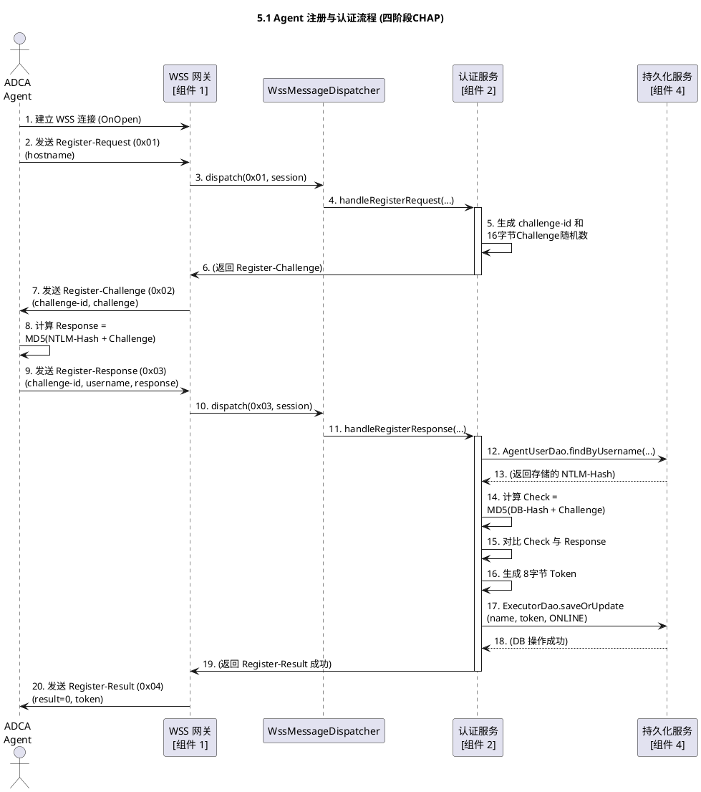
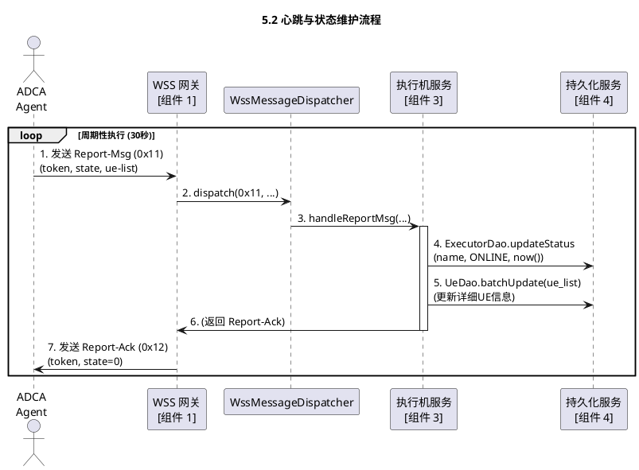
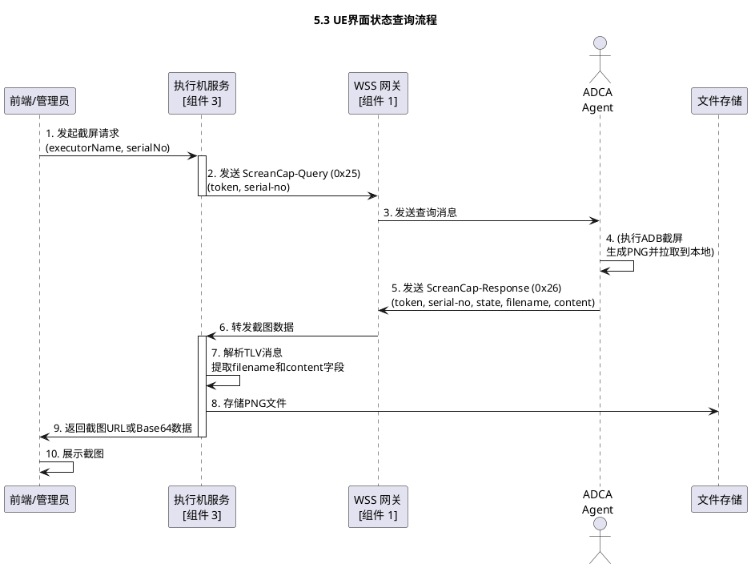
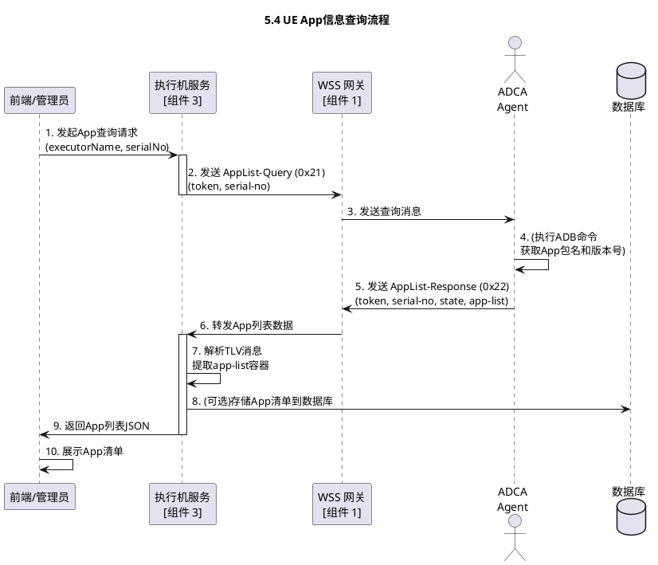
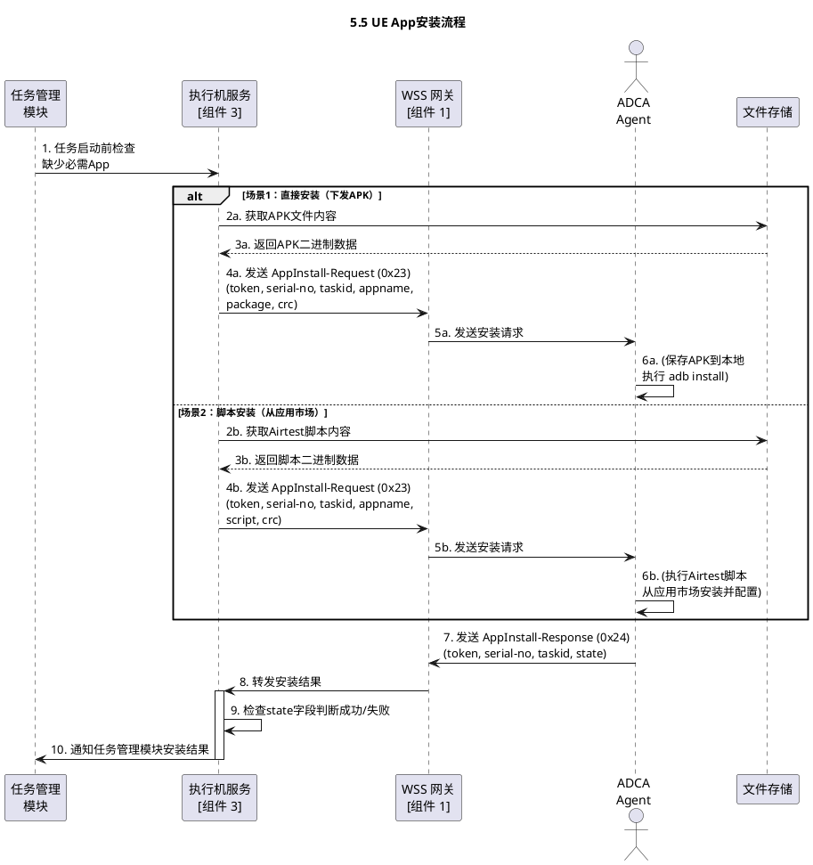
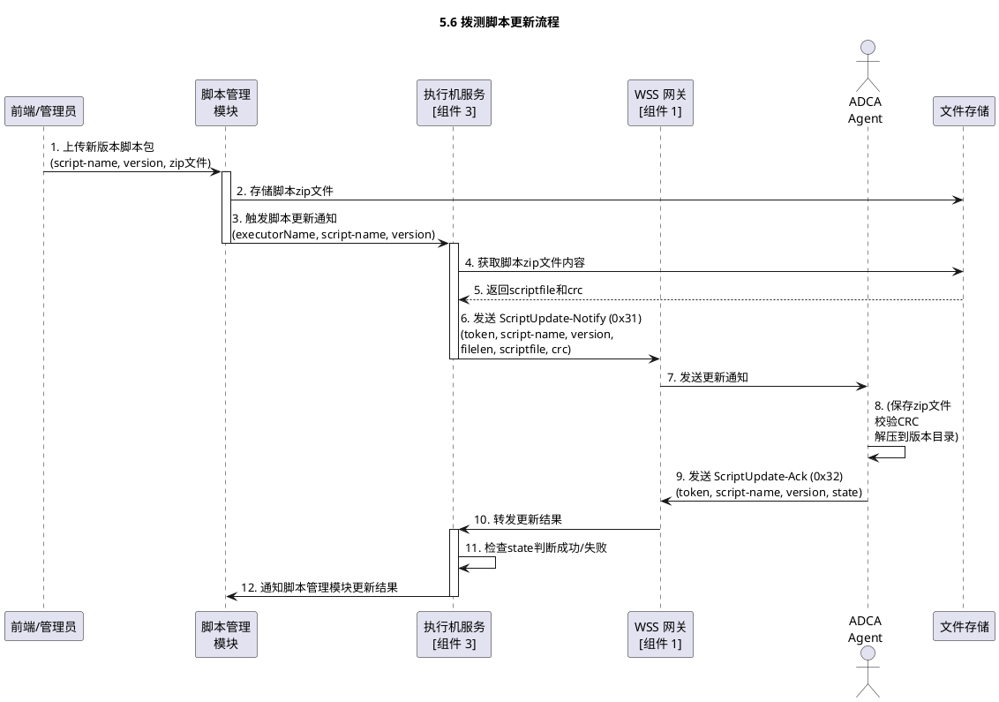
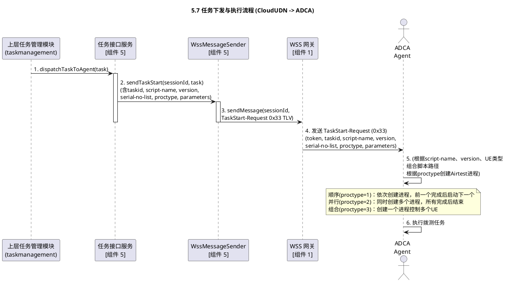
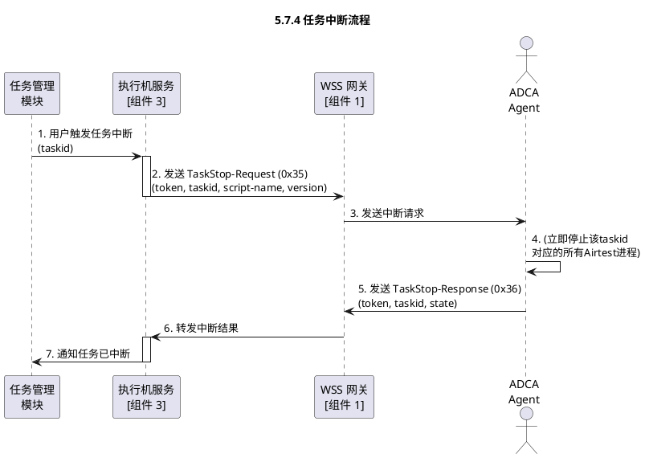
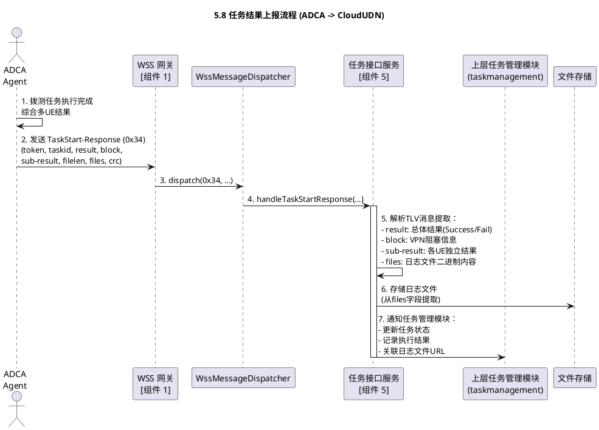
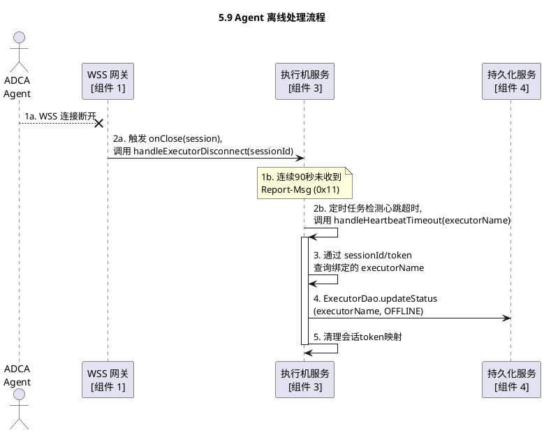

# 执行机管理组件软件实现设计

> **文档版本**：V3  
> **最后更新**：2025-11-10  
> **主要变更**：
> - ✅ 将WebSocket通信协议从JSON格式改为**TLV（Type-Length-Value）二进制格式**
> - ✅ 为所有消息类型分配**消息ID（0x01-0x36）**
> - ✅ 定义完整的**字段Tag表（0x0001-0x0105）**
> - ✅ 文件传输方式从URL改为**直接传输二进制内容（hex格式）**
> - ✅ 所有消息增加**token字段**用于会话识别
> - ✅ 新增**多UE任务支持**（serial-no-list、proctype、sub-result）
> - ✅ 补充缺失的应答消息（DeRegister-Ack、Report-Ack、TaskStop-Response）

## 1\. 概述

### 1.1 项目背景与目标

本项目旨在构建一套稳定、可控的拨测设备管理系统，实现拨测服务控制中心（UDN）对分布式执行机（PC）及其手机终端（UE）的统一管理。

项目目标是建立一个“​**控制中心 ↔ 执行代理 ↔ 实际设备**​”的自动化闭环拨测架构。Agent（执行代理）负责接收控制中心的指令，执行拨测任务，并上报执行结果。

### 1.2 关键需求

* **设备注册与管理**：执行机需能自动注册到UDN，上报自身及所连接UE（手机）的信息。
* **任务下发与执行**：UDN能够向指定执行机或UE下发拨测任务，由Agent触发拨测工具执行。
* **状态监控与上报**：Agent需周期性上报执行机与UE的状态，并实时反馈任务执行进度与结果。
* **环境管理**：支持从UDN远程更新拨测脚本、安装/更新UE上的App。
* **安全通信**：所有Agent与UDN之间的通信均需通过安全、可靠的通道进行，并支持认证与数据完整性校验。

## 2\. 系统架构

### 2.1 总体架构图

```plantuml
@startuml
title 拨测设备管理 (Executor Management) 组件架构 (按5层职责)

skinparam componentStyle uml2
skinparam linetype ortho

package "拨测设备管理服务" {

    package "1. 接入与通信层 (Gateway)" {
        component "组件 1：WebSocket 网关\n(WSS Gateway)" as Wss
    }

    package "2. 认证与会话层 (Security)" {
        component "组件 2：认证与会话服务\n(Auth & Session Service)" as AuthService
    }

    package "3. 核心业务逻辑层 (Service)" {
        component "组件 3：执行机服务\n(Executor Service)" as ExecService
    }

    package "5. 外部交互与任务调度层 (Dispatcher)" {
        component "组件 5：任务接口服务\n(Task Interface Service)" as TaskAdapter
        component "组件 6：北向API服务\n(Northbound API)" as Api
    }

    package "4. 数据持久化层 (Database)" {
        component "组件 4：持久化服务\n(Persistence Service)" as DbService
    }
}

database "Database" as DB

@enduml
```

### 2.2 核心设计理念

* **统一通信规约**：为应对大规模并发和实时性要求，所有执行机Agent与UDN控制中心之间的交互（包括注册、心跳、任务状态、控制指令）**统一使用 WebSocket (WSS) 协议**，取代传统的HTTP轮询或混合模式。

* **二进制协议（V3新增）**：采用**TLV（Type-Length-Value）二进制编码格式**，相比JSON格式具有以下优势：
  - **传输效率高**：二进制格式更紧凑，减少网络带宽消耗
  - **解析性能好**：无需JSON字符串解析，直接读取二进制数据
  - **类型安全**：明确的字段类型定义，避免类型转换错误
  - **易于扩展**：通过Tag值灵活扩展新字段，保持向后兼容
  - **支持大文件传输**：可直接嵌入二进制文件内容（脚本、日志、截图等），无需Base64编码

### 2.3 包结构设计

```plaintextcom.huawei.cloududn.dialingtest
│
├── controller.executormanagement           // (新) 1. 接入层 (REST + WSS)
│   │
│   ├── ExecutorController.java             // (新) [组件 6] 北向API
│   │   // 职责: 接收 OpenAPI 生成的 "model.ExecutorQueryRequest"
│   │   //       调用 service, 将结果转为 "model.ExecutorQueryResponse"
│   │
│   └── websocket                           // (新) [组件 1] WSS 网关
│       │
│       ├── ExecutorWebsocketEndpoint.java  // (新) 核心: WebSocket 端点
│       │
│       ├── WssMessageDispatcher.java       // (新) 核心: 消息分发器
│       │   // 职责: 解析 TLV 消息, 调用 service
│       │
│       ├── codec                           // (新) TLV 编解码器
│       │   ├── TlvEncoder.java             // TLV 消息编码器
│       │   ├── TlvDecoder.java             // TLV 消息解码器
│       │   ├── TlvField.java               // TLV 字段定义
│       │   ├── MessageType.java            // 消息类型枚举 (0x01-0x36)
│       │   └── FieldTag.java               // 字段Tag枚举 (0x0001-0x0105)
│       │
│       └── dto                             // (新) WSS 消息业务对象
│           │                               // (用于业务层传递, 由TLV编解码器转换)
│           ├── RegisterRequestDto.java
│           ├── ReportMsgDto.java
│           ├── TaskStartRequestDto.java
│           └── TaskStartResponseDto.java
│
├── service.executormanagement              // (新) 2. 核心业务逻辑层 (设备管理)
│   │
│   ├── ExecutorMgmtService.java            // (新) [组件 3]
│   ├── auth                                // (新) [组件 2]
│   │   └── AuthSessionService.java
│   ├── task                                // (新) [组件 5]
│   │   ├── TaskInterfaceService.java
│   │   └── WssMessageSender.java
│   │
│   └── dto                                 // (新) 内部业务 DTO
│       │                                   // (对应 service.taskmanagement.dto)
│       └── ExecutorDetailDto.java          // Service 层内部流转的 DTO
│
├── dao.executormanagement                  // (新) 3. 数据访问层 (设备管理)
│   │                                       // [组件 4]
│   ├── ExecutorDao.java
│   ├── UeDao.java
│   └── AgentUserDao.java
│
└── model                                   // (已有) 4. 共享模型 (API + DB)
     │
     ├── ExecutorEntity.java                 // (新) [组件 4] DB 实体
     ├── UeEntity.java                       // (新) [组件 4] DB 实体
     └── AgentUserEntity.java                // (新) [组件 4] DB 实体
     │
     ├── ExecutorQueryResponse.java          // (新) OpenAPI 生成的 "执行机查询" 响应
     └── RefreshExecutorRequest.java         // (新) OpenAPI 生成的 "刷新执行机" 请求
```

### 2.4 系统类图设计

```plantuml
@startuml
title 执行机管理 (Executor Management) 新增类关系图

skinparam componentStyle uml2
skinparam linetype ortho
skinparam packageStyle rectangle
skinparam classAttributeIconSize 0

' ---------------------------------
' 1. 接入层 (Controller)
' ---------------------------------
package "controller.executormanagement" {

    ' [组件 6] REST API
    class ExecutorController {
        + getExecutorList()
        + refreshExecutorInfo()
    }

    ' [组件 1] WSS 网关
    package "websocket" {
        class ExecutorWebsocketEndpoint {
            + onOpen(session)
            + onClose(session)
            + onMessage(message, session)
            + sendMessage(sessionId, text)
        }

        class WssMessageDispatcher {
            + dispatch(message, session)
        }

        package "dto" {
            class RegisterRequest
            class HeartbeatStatus
            class TaskStatusUpdate
        }
    }
}

' ---------------------------------
' 2. 核心业务逻辑层 (Service)
' ---------------------------------
package "service.executormanagement" {

    ' [组件 3] 核心服务
    class ExecutorMgmtService {
        + handleHeartbeatStatus(HeartbeatStatus)
        + handleExecutorDisconnect(sessionId)
        + getExecutorDetails()
    }

    ' [组件 2] 认证服务
    package "auth" {
        class AuthSessionService {
            + handleRegister(RegisterRequest, session)
        }
    }

    ' [组件 5] 任务适配器
    package "task" {
        class TaskInterfaceService {
            + handleTaskStatusUpdate(TaskStatusUpdate)
            + dispatchTaskToAgent(task)
        }
        class WssMessageSender {
            + sendTaskAssign(sessionId, task)
        }
    }

    package "dto" {
        class ExecutorDetailDto
    }
}

' ---------------------------------
' 3. 数据访问层 (DAO)
' ---------------------------------
package "dao.executormanagement" {
    ' [组件 4] 持久化服务 (的接口)
    interface AgentUserDao
    interface ExecutorDao
    interface UeDao
}

' ---------------------------------
' 4. 共享数据模型 (Model)
' ---------------------------------
package "model" {
    class AgentUserEntity
    class ExecutorEntity
    class UeEntity
    ' ... (已有的 TaskEntity 等)
}


' ---------------------------------
' 关键依赖关系 (Dependencies)
' ---------------------------------

' 1. REST API 调用链
ExecutorController ..> ExecutorMgmtService

' 2. WSS 消息入站 (Inbound) 调用链
ExecutorWebsocketEndpoint ..> WssMessageDispatcher : "委托分发"
WssMessageDispatcher ..> AuthSessionService : "路由 'register'"
WssMessageDispatcher ..> ExecutorMgmtService : "路由 'heartbeat_status'"
WssMessageDispatcher ..> TaskInterfaceService : "路由 'task_status_update'"

' 3. Service 层对 DAO 层的依赖
AuthSessionService ..> AgentUserDao
AuthSessionService ..> ExecutorDao
ExecutorMgmtService ..> ExecutorDao
ExecutorMgmtService ..> UeDao

' 4. DAO 层对 Model (Entity) 的依赖
AgentUserDao ..> AgentUserEntity
ExecutorDao ..> ExecutorEntity
UeDao ..> UeEntity

' 5. WSS 消息出站 (Outbound) 调用链
TaskInterfaceService ..> WssMessageSender : "调用发送器"
WssMessageSender ..> ExecutorWebsocketEndpoint : "获取Session并发送消息"

' 6. DTO/Entity 使用
WssMessageDispatcher ..> RegisterRequest : "解析"
ExecutorMgmtService ..> ExecutorDetailDto : "组装"

@enduml
```

## 3. 子模块说明

### 3.1 WebSocket 网关 (WSS Gateway)

* ​**包路径**​: `controller.executormanagement.websocket`
* ​**功能职责**​: 作为执行机Agent唯一的通信入口（[组件 1]）。
  1. ​**连接管理**​：负责处理和维护所有Agent客户端的WebSocket (WSS) 长连接生命周期（`OnOpen`, `OnClose`）。
  2. ​**消息分发**​：作为消息分发器 (`WssMessageDispatcher`)，解析入站JSON报文的 `message_type`，并路由到对应的业务服务（如认证服务、执行机服务）。
  3. ​**消息出口**​：提供下行消息发送能力，供其他业务服务（如任务接口服务）调用，以向指定Agent推送指令。
* ​**输入**​:
  * Agent客户端发起的WSS连接请求。
  * Agent客户端发送的WSS JSON报文（如 `register`, `heartbeat_status` 等）。
  * 内部其他服务（如 [组件 5]）的下行消息发送调用（如 `sendTaskAssign`）。
* ​**输出**​:
  * 向Agent客户端推送的WSS JSON报文（如 `register_ack`, `task_assign`）。
  * 向业务层（[组件 2, 3, 5]）分发的已解析的DTO对象。
  * 连接断开（`OnClose`）事件通知。

### 3.2 认证与会话服务 (Auth & Session Service)

* ​**包路径**​: `service.executormanagement.auth`
* ​**功能职责**​: 负责核实Agent身份并管理其会话（[组件 2]）。
  1. ​**身份认证**​：处理 `register` 消息，调用 [组件 4] 核对用户名和密码。
  2. ​**会话绑定**​：认证成功后，生成 `token`，并建立 `token` 与当前WSS连接 `sessionId` 之间的核心绑定关系，用于后续所有通信的身份识别。
* ​**输入**​:
  * [组件 1] 转发的 `register` 消息（`controller.executormanagement.websocket.dto.RegisterRequest`）。
* ​**输出**​:
  * 包含 `token` 和认证结果的响应消息（交由 [组件 1] 发送回Agent）。
  * 调用 [组件 4] `AgentUserDao` 和 `ExecutorDao` 进行数据查询。

### 3.3 执行机服务 (Executor Service)

* ​**包路径**​: `service.executormanagement.ExecutorMgmtService`
* ​**功能职责**​: 负责执行机（Executor）和UE（User Equipment）设备的核心状态管理（[组件 3]）。它不关心“任务”执行，只关心“设备”状态。
  1. ​**心跳处理**​：处理 `heartbeat_status` 消息，更新执行机 `last_online_time`，维持 `ONLINE` 状态。
  2. ​**信息管理**​：处理Agent上报的详细信息（如UE列表、App列表），并调用 [组件 4] 持久化。
  3. ​**离线处理**​：响应 [组件 1] 的 `OnClose` 事件，或心跳超时，将执行机状态更新为 `OFFLINE`。
* ​**输入**​:
  * [组件 1] 转发的 `heartbeat_status` 等状态类消息。
  * [组件 1] 转发的 `OnClose` 连接断开通知。
  * [组件 6] 转发的 `refresh` 等手动管理指令。
* ​**输出**​:
  * 调用 [组件 4] `ExecutorDao` 和 `UeDao` 更新设备状态和信息。
  * 向 [组件 6] 提供执行机列表和状态数据。

### 3.4 持久化服务 (Persistence Service)

* ​**包路径**​: `dao.executormanagement`
* ​**功能职责**​: 负责“设备管理”模块所有相关表的持久化数据管理（CRUD）（[组件 4]）。是本模块的数据基础。
* ​**输入**​:
  * [组件 2] 的 `AgentUser` 表查询调用。
  * [组件 3] 的 `Executor` 表和 `Ue` 表的增、删、改、查调用。
  * [组件 6] 的 `Executor` 表查询调用。
* ​**输出**​:
  * `model.ExecutorEntity`, `model.UeEntity`, `model.AgentUserEntity` 数据（JPA 实体）。
  * 数据库的 `INSERT`/`UPDATE` 结果。

### 3.5 任务接口服务 (Task Interface Service)

* ​**包路径**​: `service.executormanagement.task`
* ​**功能职责**​: 作为“设备管理”模块与上层“任务管理”(`taskmanagement`)模块之间的连接器（适配器）（[组件 5]）。
  1. ​**任务下发**​：接收上层“任务管理”模块的拨测指令，调用 `WssMessageSender` 将其“翻译”成 `task_assign` 消息，并通过 [组件 1] 发送给指定Agent。
  2. ​**结果上报**​：处理 [组件 1] 转发的 `task_status_update` 消息，将其“翻译”成内部事件或数据，并通知上层“任务管理”模块更新任务状态。
* ​**输入**​:
  * 上层 `taskmanagement` 模块的内部方法调用或事件（如“开始拨测任务”）。
  * [组件 1] 转发的 `task_status_update` 消息。
* ​**输出**​:
  * 调用 `WssMessageSender` (最终调用 [组件 1]) 发送 `task_assign` 消息。
  * 向上层 `taskmanagement` 模块通知任务执行进度和结果。

### 3.6 北向API服务 (Northbound API)

* ​**包路径**​: `controller.executormanagement.ExecutorController`
* ​**功能职责**​: 负责提供对“前端管理页面”或“外部管理员”的HTTP REST接口（[组件 6]）。
* ​**输入**​:
  * 前端发起的HTTP API请求（如 `GET /api/v1/executors` 查询列表）。
  * OpenAPI 生成的 `model` 请求体（如 `RefreshExecutorRequest`）。
* ​**输出**​:
  * OpenAPI 生成的 `model` JSON响应（如 `ExecutorQueryResponse`）。
  * 调用 [组件 3] `ExecutorMgmtService` 来获取数据或执行操作。

#### 3.6.1 OpenAPI 契约与生成（强制）
- 契约来源：`dialingtest-interface/src/main/resources/executor-api.yaml`（OpenAPI 3）
- 代码生成：使用 openapi-generator 生成 `com.huawei.cloududn.dialingtest.api.ExecutorsApi` 与 `com.huawei.cloududn.dialingtest.model.*`
- 实现方式：`ExecutorController` 实现 `ExecutorsApi`，方法签名与入参/出参严格使用生成模型（禁止 `Map`）
- 文档与CI：构建阶段校验 YAML、生成模型与静态文档并发布

## 4\. 接口定义与数据模型

> **版本说明**：本章节已更新至 **V3 版本**，采用 **TLV（Type-Length-Value）二进制协议**替代原 JSON 格式，以提高传输效率和安全性。所有消息类型均分配明确的消息ID（0x01-0x36），并遵循统一的TLV编码规范。

### 4.1 通信机制

**核心原则**：执行机Agent（ADCA）与UDN拨测服务控制中心（CloudUDN）之间的所有交互，**统一采用 WebSocket (WSS) 协议**。

#### 4.1.1 连接建立

* Agent启动后，向UDN发起WSS连接请求（wss://server:port/ws/executor）
* 连接建立后，需完成四阶段CHAP认证才能进行后续通信

#### 4.1.2 数据格式（TLV结构）

所有WebSocket消息均采用**TLV（Type-Length-Value）二进制结构**：

```
+--------+----------------+------------------+
| Type   | Length         | Value            |
| 1 byte | 4 bytes (BE)   | N bytes          |
+--------+----------------+------------------+
```

**字段说明**：
- **Type (1字节)**：消息ID（0x01-0x36），标识消息类型
- **Length (4字节)**：消息体长度（大端序，Big Endian），不含Type和Length本身
- **Value (N字节)**：消息体内容，嵌套TLV结构或基础类型

**消息体内部字段采用嵌套TLV结构**：

```
+--------+----------------+------------------+
| Tag    | Length         | Value            |
| 2 bytes| 2 bytes (BE)   | N bytes          |
+--------+----------------+------------------+
```

**基础类型编码规则**：
- **int**：4字节大端序
- **long**：8字节大端序（如token）
- **string**：UTF-8编码，无NULL结尾
- **hex**：原始二进制数据（如文件内容、CRC）
- **数组**：多个相同Tag的TLV依次排列

#### 4.1.3 状态维护

* Agent通过WSS连接周期性（**30秒**）发送 `Report-Msg (0x11)` 心跳包
* 服务端如果连续**3个周期（90秒）**未收到心跳，则判定Agent为`OFFLINE`（离线）
* 如果Agent持续`OFFLINE`超过**10天**，服务端可自动老化（归档或删除）该执行机数据

#### 4.1.4 会话管理

* 认证成功后，服务端分配**8字节 token**（会话ID）
* 所有后续消息必须携带该 token 用于会话识别
* WSS连接断开后，token 自动失效

### 4.2 数据模型 (数据库表)

#### 4.2.1 用户表

用于执行机登录认证。多个执行机可共用一个账户。

| 字段名 | 类型 | 约束 | 说明 |
| :--- | :--- | :--- | :--- |
| id | int | 主键 | 用户标识 |
| username | varchar(40) | 唯一 | 用户名。字母、数字、短横线、下划线 |
| password | varchar(128) | | **V2 变更**：密码。**存储 NTLM Hash 值**，用于 CHAP 认证。 |
| last\_login\_time | timestamp | | 最后登录时间 |

#### 4.2.2 执行机表

存储已注册的执行机信息。

| 字段名 | 类型 | 约束 | 说明 |
| :--- | :--- | :--- | :--- |
| name | varchar(40) | 主键 | 执行机名（唯一） |
| ip | varchar(40) | | 执行机IP (WSS连接的源IP) |
| token | varchar(256) | | 认证Token (WSS会话期间使用) |
| proxy | varchar(256) | | (可选) 连接执行机的代理信息 |
| description | text | | 执行机描述 |
| status | smallint | | 0: 离线, 1: 在线, 2: 失效 |
| last\_online\_time | timestamp | | 最后在线时间 (心跳更新) |

#### 4.2.3 UE表

存储执行机关联的手机终端信息。

| 字段名 | 类型 | 约束 | 说明 |
| :--- | :--- | :--- | :--- |
| msisdn | varchar(15) | 主键 | 手机号（国家码+国内号码） |
| executor\_name | varchar(40) | 外键 | 所属的执行机 (关联执行机表.name) |
| vendor | varchar(128) | | 品牌 |
| os | varchar(128) | | 系统 |
| info | text | | **V2 变更**：手机扩展信息 (JSON)。存储周期上报的详细状态，如 `serial`, `imei`, `model`, `os_version`, `resolution`, `ip_v4`, `ip_v6`, `battery_level` 等。 |
| task\_info | text | | 关联的拨测任务信息 (JSON 字符串) |

### 4.3 接口定义 (WebSocket 消息)

#### 4.3.0 消息类型总览

以下为ADCA与CloudUDN之间的所有消息类型及其消息ID：

| 消息类别 | 消息名 | 消息ID | 说明 | 方向 |
| :--- | :--- | :--- | :--- | :--- |
| **注册** | Register-Request | 0x01 | 注册请求消息，内容包括执行机HostName | ADCA → CloudUDN |
| | Register-Challenge | 0x02 | 注册挑战消息，内容包括ChallengeID、Challenge随机内容 | ADCA ← CloudUDN |
| | Register-Response | 0x03 | 注册应答消息，内容包括用户名、ChallengeID，经Challenge进行MD5加密后的密码 | ADCA → CloudUDN |
| | Register-Result | 0x04 | 注册结果消息，内容包括注册结果(成功/失败)，注册描述，会话Token等 | ADCA ← CloudUDN |
| | DeRegister-Request | 0x05 | 去注册请求，内容包括执行机HostName | ADCA → CloudUDN |
| | DeRegister-Ack | 0x06 | 去注册应答 | ADCA ← CloudUDN |
| **状态报告** | Report-Msg | 0x11 | 状态报告消息，定时上报UE信息 | ADCA → CloudUDN |
| | Report-Ack | 0x12 | 状态报告应答 | ADCA ← CloudUDN |
| **UE&App** | AppList-Query | 0x21 | 查询App清单 | ADCA ← CloudUDN |
| | AppList-Response | 0x22 | App列表信息 | ADCA → CloudUDN |
| | AppInstall-Request | 0x23 | App安装请求 | ADCA ← CloudUDN |
| | AppInstall-Response | 0x24 | App安装应答 | ADCA → CloudUDN |
| | ScreanCap-Query | 0x25 | 查询UE界面请求 | ADCA ← CloudUDN |
| | ScreanCap-Response | 0x26 | 查询UE界面应答 | ADCA → CloudUDN |
| **脚本&任务** | ScriptUpdate-Notify | 0x31 | 更新脚本通知 | ADCA ← CloudUDN |
| | ScriptUpdate-Ack | 0x32 | 更新脚本应答 | ADCA → CloudUDN |
| | TaskStart-Request | 0x33 | 拨测任务启动请求 | ADCA ← CloudUDN |
| | TaskStart-Response | 0x34 | 拨测任务启动应答，上报拨测结果和日志信息 | ADCA → CloudUDN |
| | TaskStop-Request | 0x35 | 拨测任务停止请求 | ADCA ← CloudUDN |
| | TaskStop-Response | 0x36 | 拨测任务停止应答 | ADCA → CloudUDN |

#### 4.3.1 字段Tag定义

消息体内部字段使用2字节Tag标识，通用Tag定义如下：

| Tag值 | 字段名 | 类型 | 说明 |
| :--- | :--- | :--- | :--- |
| 0x0001 | hostname | string | 执行机名称 |
| 0x0002 | challenge-id | int | 挑战序号 |
| 0x0003 | challenge | hex | 挑战随机数（16字节） |
| 0x0004 | username | string | 认证用户名 |
| 0x0005 | response | hex | CHAP响应（16字节MD5） |
| 0x0006 | result | int | 结果码（0-成功，非0-失败） |
| 0x0007 | description | string | 描述信息 |
| 0x0008 | token | long | 会话Token（8字节） |
| 0x0009 | state | string/int | 状态信息 |
| 0x000A | serial-no | string | 手机序列号 |
| 0x000B | brand | string | 手机品牌 |
| 0x000C | model | string | 手机型号 |
| 0x000D | os | string | 操作系统类型 |
| 0x000E | version | string | 版本号 |
| 0x000F | wmsize | string | 屏幕分辨率 |
| 0x0010 | ipv4 | string | IPv4地址 |
| 0x0011 | ipv6 | string | IPv6地址 |
| 0x0012 | battery | int | 电量百分比 |
| 0x0020 | taskid | int | 任务ID |
| 0x0021 | script-name | string | 脚本名称 |
| 0x0022 | package | string/hex | 软件包名/安装包内容 |
| 0x0023 | appname | string | App名称 |
| 0x0024 | script | hex | 安装脚本内容 |
| 0x0025 | crc | hex | CRC校验值 |
| 0x0026 | filename | string | 文件名 |
| 0x0027 | content | hex | 文件内容 |
| 0x0028 | filelen | int | 文件长度 |
| 0x0029 | scriptfile | hex | 脚本文件内容 |
| 0x002A | parameters | string | 参数列表 |
| 0x002B | proctype | int | 多UE执行关系 |
| 0x002C | block | string | VPN阻塞结果 |
| 0x0100 | ue-list | container | UE列表容器（包含多个UE） |
| 0x0101 | ue-item | container | 单个UE信息容器 |
| 0x0102 | app-list | container | App列表容器 |
| 0x0103 | app-item | container | 单个App信息容器 |
| 0x0104 | sub-result | container | 子结果容器 |
| 0x0105 | serial-no-list | container | 序列号列表容器 |

#### 4.3.2 注册与认证消息

> **设计说明**：采用四阶段CHAP认证，避免网络传输NTLM Hash明文。

##### Register-Request (0x01)

**方向**：ADCA → CloudUDN

**TLV字段**：

| Tag | 字段名 | 类型 | 必选 | 说明 |
| :--- | :--- | :--- | :--- | :--- |
| 0x0001 | hostname | string | 是 | 执行机名称 |

**示例**：
```
Type: 0x01
Length: 0x00000014 (20字节)
Value:
  0x0001 0x000F "Executor_PC_001"
```

##### Register-Challenge (0x02)

**方向**：ADCA ← CloudUDN

**TLV字段**：

| Tag | 字段名 | 类型 | 必选 | 说明 |
| :--- | :--- | :--- | :--- | :--- |
| 0x0002 | challenge-id | int | 是 | 挑战序号，用于定位认证上下文 |
| 0x0003 | challenge | hex | 是 | 16字节随机数 |

**示例**：
```
Type: 0x02
Length: 0x00000018 (24字节)
Value:
  0x0002 0x0004 0x00000001  (challenge-id=1)
  0x0003 0x0010 [16-byte-random-data]
```

##### Register-Response (0x03)

**方向**：ADCA → CloudUDN

**TLV字段**：

| Tag | 字段名 | 类型 | 必选 | 说明 |
| :--- | :--- | :--- | :--- | :--- |
| 0x0002 | challenge-id | int | 是 | 复制Register-Challenge中的值 |
| 0x0004 | username | string | 是 | 认证用户名 |
| 0x0005 | response | hex | 是 | 16字节MD5(NTLM-Hash + Challenge) |

**示例**：
```
Type: 0x03
Length: 0x00000030 (48字节)
Value:
  0x0002 0x0004 0x00000001  (challenge-id=1)
  0x0004 0x000A "agent_user"
  0x0005 0x0010 [16-byte-md5-hash]
```

##### Register-Result (0x04)

**方向**：ADCA ← CloudUDN

**TLV字段**：

| Tag | 字段名 | 类型 | 必选 | 说明 |
| :--- | :--- | :--- | :--- | :--- |
| 0x0006 | result | int | 是 | 错误码：0-成功，非0-失败 |
| 0x0007 | description | string | 是 | 描述内容，失败原因等 |
| 0x0008 | token | long | 条件 | 8字节会话ID，成功时必填 |

**示例（成功）**：
```
Type: 0x04
Length: 0x00000024 (36字节)
Value:
  0x0006 0x0004 0x00000000  (result=0)
  0x0007 0x0007 "Success"
  0x0008 0x0008 [8-byte-token]
```

##### DeRegister-Request (0x05)

**方向**：ADCA → CloudUDN

**TLV字段**：

| Tag | 字段名 | 类型 | 必选 | 说明 |
| :--- | :--- | :--- | :--- | :--- |
| 0x0008 | token | long | 是 | 会话Token |
| 0x0001 | hostname | string | 是 | 执行机名称 |

##### DeRegister-Ack (0x06)

**方向**：ADCA ← CloudUDN

**TLV字段**：

| Tag | 字段名 | 类型 | 必选 | 说明 |
| :--- | :--- | :--- | :--- | :--- |
| 0x0008 | token | long | 是 | 会话Token |
| 0x0006 | result | int | 是 | 错误码：0-成功，非0-失败 |

#### 4.3.3 状态报告消息

##### Report-Msg (0x11)

**方向**：ADCA → CloudUDN

**说明**：周期性（30秒）心跳/状态上报消息，上报执行机状态和连接的所有UE详细信息。

**TLV字段**：

| Tag | 字段名 | 类型 | 必选 | 说明 |
| :--- | :--- | :--- | :--- | :--- |
| 0x0008 | token | long | 是 | 会话Token |
| 0x0009 | state | string | 是 | 执行机状态，正常为"Normal" |
| 0x0100 | ue-list | container | 是 | UE列表容器，包含0~N个ue-item |

**ue-item (0x0101) 容器字段**：

| Tag | 字段名 | 类型 | 必选 | 说明 |
| :--- | :--- | :--- | :--- | :--- |
| 0x000A | serial-no | string | 是 | 手机序列号 |
| 0x000B | brand | string | 是 | 手机品牌（huawei/xiaomi/apple...） |
| 0x000C | model | string | 是 | 手机型号（NOH-AN01/Xiaomi-12...） |
| 0x000D | os | string | 是 | 操作系统（Android/iOS/HarmonyOS） |
| 0x000E | version | string | 是 | 操作系统版本（12.1.3） |
| 0x000F | wmsize | string | 是 | 屏幕分辨率（2772 x 1344） |
| 0x0010 | ipv4 | string | 否 | IPv4地址 |
| 0x0011 | ipv6 | string | 否 | IPv6地址 |
| 0x0012 | battery | int | 是 | 电量百分比（0-100） |

**示例**：
```
Type: 0x11
Length: 0x000000B8 (184字节)
Value:
  0x0008 0x0008 [8-byte-token]
  0x0009 0x0006 "Normal"
  0x0100 0x0098 (ue-list container, 152字节)
    0x0101 0x0048 (ue-item 1, 72字节)
      0x000A 0x0005 "SN001"
      0x000B 0x0006 "Huawei"
      0x000C 0x0009 "NOH-AN01"
      0x000D 0x0007 "Android"
      0x000E 0x0005 "13.0"
      0x000F 0x000C "2772 x 1344"
      0x0010 0x000D "192.168.1.10"
      0x0012 0x0004 0x00000055 (battery=85)
    0x0101 0x0048 (ue-item 2, ...)
      ...
```

##### Report-Ack (0x12)

**方向**：ADCA ← CloudUDN

**TLV字段**：

| Tag | 字段名 | 类型 | 必选 | 说明 |
| :--- | :--- | :--- | :--- | :--- |
| 0x0008 | token | long | 是 | 会话Token |
| 0x0009 | state | int | 是 | 错误码：0-OK，非0-异常 |

#### 4.3.4 UE&App管理消息

##### AppList-Query (0x21)

**方向**：ADCA ← CloudUDN

**TLV字段**：

| Tag | 字段名 | 类型 | 必选 | 说明 |
| :--- | :--- | :--- | :--- | :--- |
| 0x0008 | token | long | 是 | 会话Token |
| 0x000A | serial-no | string | 是 | 手机序列号 |

##### AppList-Response (0x22)

**方向**：ADCA → CloudUDN

**TLV字段**：

| Tag | 字段名 | 类型 | 必选 | 说明 |
| :--- | :--- | :--- | :--- | :--- |
| 0x0008 | token | long | 是 | 会话Token |
| 0x000A | serial-no | string | 是 | 手机序列号 |
| 0x0009 | state | int | 是 | 错误码：0-OK，非0-异常 |
| 0x0102 | app-list | container | 是 | App列表容器，包含0~N个app-item |

**app-item (0x0103) 容器字段**：

| Tag | 字段名 | 类型 | 必选 | 说明 |
| :--- | :--- | :--- | :--- | :--- |
| 0x0022 | package | string | 是 | 软件包名（com.tencent.mm） |
| 0x0023 | name | string | 否 | 软件名称（WeChat），可选 |
| 0x000E | version | string | 是 | 软件版本号（8.0.62） |

##### AppInstall-Request (0x23)

**方向**：ADCA ← CloudUDN

**说明**：支持两种App安装场景：
1. **场景1-直接安装**：下发 `package` 字段（APK文件内容），Agent通过adb命令安装
2. **场景2-脚本安装**：下发 `script` 字段（airtest脚本），Agent执行脚本从应用市场安装并完成初次启动配置

**TLV字段**：

| Tag | 字段名 | 类型 | 必选 | 说明 |
| :--- | :--- | :--- | :--- | :--- |
| 0x0008 | token | long | 是 | 会话Token |
| 0x000A | serial-no | string | 是 | 手机序列号 |
| 0x0020 | taskid | int | 是 | 任务ID |
| 0x0023 | appname | string | 是 | App名称 |
| 0x0024 | script | hex | 否 | Airtest安装脚本内容。脚本中可包含App初次启动的配置参数（如用户名/密码），以参数形式传递或硬编码 |
| 0x0022 | package | hex | 否 | APK安装包文件内容（场景1使用）。与script二选一 |
| 0x0025 | crc | hex | 否 | CRC校验值（用于校验package或script） |

##### AppInstall-Response (0x24)

**方向**：ADCA → CloudUDN

**TLV字段**：

| Tag | 字段名 | 类型 | 必选 | 说明 |
| :--- | :--- | :--- | :--- | :--- |
| 0x0008 | token | long | 是 | 会话Token |
| 0x000A | serial-no | string | 是 | 手机序列号 |
| 0x0020 | taskid | int | 是 | 任务ID |
| 0x0009 | state | int | 是 | 错误码：0-OK，非0-异常 |

##### ScreanCap-Query (0x25)

**方向**：ADCA ← CloudUDN

**TLV字段**：

| Tag | 字段名 | 类型 | 必选 | 说明 |
| :--- | :--- | :--- | :--- | :--- |
| 0x0008 | token | long | 是 | 会话Token |
| 0x000A | serial-no | string | 是 | 手机序列号 |

##### ScreanCap-Response (0x26)

**方向**：ADCA → CloudUDN

**TLV字段**：

| Tag | 字段名 | 类型 | 必选 | 说明 |
| :--- | :--- | :--- | :--- | :--- |
| 0x0008 | token | long | 是 | 会话Token |
| 0x000A | serial-no | string | 是 | 手机序列号 |
| 0x0009 | state | int | 是 | 错误码：0-OK，非0-异常 |
| 0x0026 | filename | string | 是 | 文件名（screencap_202509111200531.png） |
| 0x0027 | content | hex | 是 | 文件内容（PNG格式二进制数据） |

#### 4.3.5 脚本&任务管理消息

##### ScriptUpdate-Notify (0x31)

**方向**：ADCA ← CloudUDN

**说明**：服务端下发拨测脚本更新，直接传输脚本文件内容（zip压缩格式）。

**TLV字段**：

| Tag | 字段名 | 类型 | 必选 | 说明 |
| :--- | :--- | :--- | :--- | :--- |
| 0x0008 | token | long | 是 | 会话Token |
| 0x0021 | script-name | string | 是 | 脚本名称（douyin_openlive） |
| 0x000E | version | string | 是 | 版本号（1.0） |
| 0x0028 | filelen | int | 是 | 文件长度（字节数） |
| 0x0029 | scriptfile | hex | 是 | 脚本文件内容（zip压缩） |
| 0x0025 | crc | hex | 是 | CRC校验值 |

##### ScriptUpdate-Ack (0x32)

**方向**：ADCA → CloudUDN

**TLV字段**：

| Tag | 字段名 | 类型 | 必选 | 说明 |
| :--- | :--- | :--- | :--- | :--- |
| 0x0008 | token | long | 是 | 会话Token |
| 0x0021 | script-name | string | 是 | 脚本名称 |
| 0x000E | version | string | 是 | 版本号 |
| 0x0009 | state | int | 是 | 错误码：0-OK，非0-异常 |

##### TaskStart-Request (0x33)

**方向**：ADCA ← CloudUDN

**说明**：服务端下发拨测任务启动请求，支持多UE（0~N个）及多种执行关系。

**TLV字段**：

| Tag | 字段名 | 类型 | 必选 | 说明 |
| :--- | :--- | :--- | :--- | :--- |
| 0x0008 | token | long | 是 | 会话Token |
| 0x0020 | taskid | int | 是 | 任务ID，用于区分不同任务 |
| 0x0021 | script-name | string | 是 | 脚本名称（douyin_openlive） |
| 0x000E | version | string | 是 | 版本号（1.0） |
| 0x0105 | serial-no-list | container | 否 | UE序列号列表，不带表示该执行机下所有UE |
| 0x002B | proctype | int | 否 | 多UE执行关系：1-顺序(Series)，2-并行(Parallel)，3-组合(Coalesce)，默认1 |
| 0x002A | parameters | string | 否 | 脚本其它参数列表（"--pixel 1080P --camera back"） |

**serial-no-list (0x0105) 容器字段**：
- 包含0~N个 `serial-no (0x000A)` 字段

**示例**：
```
Type: 0x33
Length: 0x00000068 (104字节)
Value:
  0x0008 0x0008 [8-byte-token]
  0x0020 0x0004 0x000003E9 (taskid=1001)
  0x0021 0x0010 "douyin_openlive"
  0x000E 0x0003 "1.0"
  0x0105 0x0010 (serial-no-list)
    0x000A 0x0005 "SN001"
    0x000A 0x0005 "SN002"
  0x002B 0x0004 0x00000001 (proctype=1, 顺序)
  0x002A 0x0015 "--pixel 1080P --camera back"
```

##### TaskStart-Response (0x34)

**方向**：ADCA → CloudUDN

**说明**：Agent上报拨测任务执行结果，包含总体结果和各UE的子结果，以及日志文件内容。

**TLV字段**：

| Tag | 字段名 | 类型 | 必选 | 说明 |
| :--- | :--- | :--- | :--- | :--- |
| 0x0008 | token | long | 是 | 会话Token |
| 0x0020 | taskid | int | 是 | 任务ID |
| 0x0006 | result | string | 是 | 脚本执行结果：Success-成功，Fail-执行异常 |
| 0x002C | block | string | 否 | VPN阻塞结果（可选） |
| 0x0007 | description | string | 是 | 描述信息，异常时可用于定位 |
| 0x0104 | sub-result | container | 是 | 各UE执行结果容器，包含0~N个sub-result-item |
| 0x0028 | filelen | int | 是 | 日志文件总长度 |
| 0x0027 | files | hex | 是 | 执行结果日志等标注信息（多UE统一打包） |
| 0x0025 | crc | hex | 是 | CRC校验值 |

**sub-result-item 容器字段**：

| Tag | 字段名 | 类型 | 必选 | 说明 |
| :--- | :--- | :--- | :--- | :--- |
| 0x000A | serial-no | string | 是 | 手机序列号 |
| 0x0006 | result | string | 是 | 脚本执行结果：Success/Fail |
| 0x002C | block | string | 否 | VPN阻塞结果（可选） |
| 0x0007 | description | string | 是 | 描述信息 |

**示例**：
```
Type: 0x34
Length: 0x000001A8 (424字节)
Value:
  0x0008 0x0008 [8-byte-token]
  0x0020 0x0004 0x000003E9 (taskid=1001)
  0x0006 0x0007 "Success"
  0x0007 0x000B "执行完毕"
  0x0104 0x0048 (sub-result container)
    (sub-result-item 1)
      0x000A 0x0005 "SN001"
      0x0006 0x0007 "Success"
      0x0007 0x000B "执行成功"
    (sub-result-item 2)
      0x000A 0x0005 "SN002"
      0x0006 0x0007 "Success"
      0x0007 0x000B "执行成功"
  0x0028 0x0004 0x00001000 (filelen=4096)
  0x0027 0x1000 [4096-byte-log-data]
  0x0025 0x0004 [4-byte-crc]
```

##### TaskStop-Request (0x35)

**方向**：ADCA ← CloudUDN

**TLV字段**：

| Tag | 字段名 | 类型 | 必选 | 说明 |
| :--- | :--- | :--- | :--- | :--- |
| 0x0008 | token | long | 是 | 会话Token |
| 0x0020 | taskid | int | 是 | 任务ID，和启动任务的TaskId需相同 |
| 0x0021 | script-name | string | 是 | 脚本名称 |
| 0x000E | version | string | 是 | 版本号 |

##### TaskStop-Response (0x36)

**方向**：ADCA → CloudUDN

**TLV字段**：

| Tag | 字段名 | 类型 | 必选 | 说明 |
| :--- | :--- | :--- | :--- | :--- |
| 0x0008 | token | long | 是 | 会话Token |
| 0x0020 | taskid | int | 是 | 任务ID |
| 0x0009 | state | int | 是 | 错误码：0-OK，非0-异常 |
| 0x0007 | description | string | 否 | 描述信息（可选） |

# 5\. 执行机管理业务核心流程

> **版本说明**：本章节已更新至 **V3 版本**，所有流程图中的消息类型已改为标准消息名称和消息ID（如 `Register-Request (0x01)`），并反映TLV协议的特性（如直接传输文件内容而非URL）。

本章节描述执行机管理模块的核心业务流程，并使用时序图展示组件间的调用关系。

## 5.0 执行机本地配置与初始化

**流程描述：** Agent初次安装时需完成本地配置，包括执行机名称、CloudUDN服务器地址、认证用户名和密码。密码采用**NTLM Hash**加密存储（Unicode编码 + MD4加密），后续启动时自动从配置文件读取。

> **📌 服务端关系说明**：此流程为**Agent侧本地操作**，服务端仅需：
> 1. 在数据库（4.2.1用户表）中预先创建用户账号，密码字段存储**相同算法生成的NTLM Hash**
> 2. 约定NTLM Hash生成规则（Unicode编码 + MD4加密），供认证服务（5.1节）验证使用

---

## 5.1 Agent 注册与认证流程

**流程描述：** 此流程采用**四阶段CHAP认证**，避免网络传输NTLM Hash明文。
Agent客户端启动后，建立WSS连接并发送 `Register-Request (0x01)`。服务端[组件 2]收到后，生成16字节随机Challenge和challenge-id，通过 `Register-Challenge (0x02)` 返回。Agent使用本地存储的NTLM-Hash和Challenge计算Response（MD5），通过 `Register-Response (0x03)` 发回。
[组件 2]在服务端验证Response的正确性，验证通过后，生成8字节token，将会话（Session）与token绑定，更新执行机状态为`ONLINE`，并通过 `Register-Result (0x04)` 返回认证成功。



### 5.1.1 WSS连接建立

- **连接地址**：使用5.0节配置的 `cloududn_server` 域名，通过操作系统DNS机制自动解析为IP地址
- **连接URL**：`wss://{cloududn_server}:{port}/ws/executor`（如 `wss://cloududn.example.com:8443/ws/executor`）
- **协议**：采用加密的WebSocket（WSS）通信，确保传输安全

### 5.1.2 TLS证书管理

- **证书预装**：TLS证书随Agent安装包预置在 `certs/` 目录下
- **证书更新**：支持手动替换证书文件后重启Agent进程生效
- **约束**：**不支持证书在线更新**（避免安全风险）

### 5.1.3 Agent服务运维

- **服务驻留**：认证成功后，Agent作为后台服务长期驻留（Windows注册为Service，Linux注册为systemd服务）
- **自动启动**：系统重启后自动启动Agent进程，自动重新执行本节认证流程
- **状态管理**：认证成功后，服务端将执行机状态更新为 `ONLINE`（参见步骤17）

---

## 5.2 心跳与状态维护流程

**流程描述：** Agent认证成功后，周期性（**30秒**）发送 `Report-Msg (0x11)` 心跳消息。
此消息包含执行机状态和Agent通过ADB获取的**所有UE详细信息**（品牌、型号、系统版本、IP、电量等）。
[组件 3]执行机服务接收到心跳后，更新执行机的`last_online_time`，并调用[组件 4] `UeDao`将UE详细信息批量更新到数据库中。服务端返回 `Report-Ack (0x12)` 确认。



## 5.3 UE界面状态查询流程

**流程描述：** 为方便定位脚本问题，CloudUDN支持主动查询指定UE的屏幕当前状态。服务端发起查询请求后，Agent调用ADB截取手机界面生成PNG文件，并通过WSS直接传输图片二进制内容返回服务端。

> **📌 服务端关系说明**：此流程涉及服务端主动发起查询和接收截图数据。Agent侧的ADB截屏实现细节（如`adb screencap`、`adb pull`、清理临时文件）为本地操作，服务端无需关注。



### 5.3.1 服务端处理要点

- **查询触发**：支持管理员从前端手动发起，或通过定时任务自动触发
- **数据接收**：从 ScreanCap-Response (0x26) 消息的 `content` 字段（hex格式）提取PNG二进制内容
- **文件存储**：将PNG数据存储到文件系统或对象存储（如S3），生成访问URL
- **前端展示**：返回截图URL给前端，或直接返回Base64编码数据供即时展示
- **异常处理**：根据 `state` 字段判断截屏是否成功，失败时向前端返回错误信息

---

## 5.4 UE App信息查询流程

**流程描述：** CloudUDN支持向指定UE查询已安装的App清单信息。服务端发起查询请求后，Agent通过ADB命令获取第三方App的包名和版本号，并返回给服务端。

> **📌 服务端关系说明**：此流程涉及服务端主动发起查询和接收App列表数据。Agent侧的ADB命令执行细节（如`pm list packages`、`dumpsys package`解析版本号）为本地操作，服务端无需关注。



### 5.4.1 服务端处理要点

- **查询触发**：支持管理员从前端手动发起，或在任务配置时自动查询可用App
- **数据接收**：从 AppList-Response (0x22) 消息的 `app-list` 容器中提取多个 `app-item`，每个包含 `package`、`name`、`version` 字段
- **数据存储**：可选择将App清单存储到数据库，用于历史追溯和App版本管理
- **前端展示**：将App列表转换为JSON格式返回给前端，展示包名、版本号等信息
- **异常处理**：根据 `state` 字段判断查询是否成功，失败时向前端返回错误信息

---

## 5.5 UE App安装流程

**流程描述：** 在拨测任务启动前的准备阶段，CloudUDN查询执行机的用例集和UE的App安装情况，如发现缺失必需的App，则发起App安装请求。支持两种安装场景：直接下发APK安装包（adb安装）或下发airtest脚本（从应用市场安装并完成配置）。

> **📌 服务端关系说明**：此流程涉及服务端发起安装请求和接收安装结果。Agent侧的adb命令执行或airtest脚本执行为本地操作，服务端无需关注实现细节。



### 5.5.1 服务端处理要点

- **安装触发**：在拨测任务启动前，自动查询UE的App清单（参见5.4节），对比任务所需App列表，发现缺失时触发安装
- **场景选择**：
  - **场景1-直接安装**：适用于可直接获取APK文件的情况，下发 `package` 字段
  - **场景2-脚本安装**：适用于需要从应用市场安装或需要初次启动配置的情况，下发 `script` 字段
- **配置参数传递**：App初次启动所需配置参数（如用户名/密码）通过airtest脚本传递，可采用脚本参数或硬编码方式
- **结果处理**：根据 `state` 字段判断安装是否成功，失败时记录错误并阻止任务启动

### 5.5.2 约束条件

- **配置要求**：如App安装后初次启动需要配置（如输入用户名/密码），必须通过airtest脚本自动完成，配置参数从服务端通过脚本下发
- **不支持场景**：**不支持通过远端安装需要近端配置的APP**，如需人脸识别、指纹认证等需要用户物理交互的App
- **任务约束**：拨测任务启动后，**UE不可人工删除App或进行其他干扰操作**，确保任务执行环境稳定

---

## 5.6 拨测脚本更新流程

**流程描述：** CloudUDN管理员在平台上更新拨测脚本后，服务端通过ScriptUpdate-Notify消息通知执行机下载新版本脚本包。Agent接收后解压到本地目录，并按版本号维护不同版本，同一用例包支持多版本共存。

> **📌 服务端关系说明**：此流程涉及服务端发起脚本更新通知和接收更新结果。Agent侧的版本管理机制、目录结构（`scripts/{version}/{util|openlive|...}`）、解压操作为本地实现，服务端无需关注。



### 5.6.1 服务端处理要点

- **更新触发**：管理员在前端上传新版本脚本包后，服务端向所有在线执行机或指定执行机推送更新通知
- **版本管理**：服务端存储管理多个版本的脚本包，支持同一脚本的多版本共存
- **文件传输**：从文件存储（如S3）读取脚本zip文件内容，通过TLV消息直接传输二进制数据
- **更新确认**：根据 `state` 字段判断Agent是否成功下载、校验和解压脚本
- **任务关联**：任务下发时（参见5.7节）通过 `script-name` 和 `version` 字段指定使用哪个版本的脚本

---

## 5.7 任务下发与执行流程

**流程描述：** CloudUDN通过手动触发或定时任务触发拨测任务执行。上层"任务管理"模块调用本模块的[组件 5]任务接口服务，将任务"翻译"为 `TaskStart-Request (0x33)` 消息下发给Agent。支持多UE（0~N个）及三种执行关系：顺序（Series）、并行（Parallel）、组合（Coalesce）。

> **📌 服务端关系说明**：此流程涉及服务端发起任务和接收执行结果。Agent侧的实现细节（如启动器选择、脚本路径组合、Airtest进程管理）为本地操作，服务端无需关注。



### 5.7.1 服务端处理要点

- **任务触发**：支持管理员手动触发或系统定时任务自动触发
- **任务下发**：通过[组件 5]构造 TaskStart-Request (0x33) 消息，包含任务ID、脚本名称、版本号、UE序列号列表、执行关系（proctype）、参数列表等
- **多UE支持**：通过 `serial-no-list` 字段指定多个UE，通过 `proctype` 字段指定执行关系：
  - **proctype=1 (顺序)**：多个UE依次执行，前一个完成后再启动下一个
  - **proctype=2 (并行)**：多个UE同时执行，所有完成后任务结束
  - **proctype=3 (组合)**：一个脚本同时控制多个UE（如视频会议场景）
- **脚本版本管理**：通过 `script-name` 和 `version` 字段指定使用的脚本版本（参见5.6节脚本更新）

### 5.7.2 launcher和脚本路径说明

> **Agent侧实现细节**（服务端无需关注）：Agent根据 script-name、version、UE类型组合本地脚本路径并选择启动器执行。

### 5.7.3 版本约束（26.1版本）

- **不支持多UE组合场景**：CloudUDN 26.1版本主要为VPN场景，暂不支持proctype=3（组合模式）
- **任务拆解**：对一台执行机的多台UE执行相同脚本时，由CloudUDN将任务拆解后再下发给执行机，**每条消息只包含一个UE**（serial-no-list只包含一个serial-no）
- **未来版本**：后续版本将支持单消息多UE和组合执行模式

---

### 5.7.4 任务中断流程

CloudUDN可随时中断正在执行的任务，Agent需立即停止所有拨测进程。



**中断处理要点**：
- **即时响应**：Agent收到中断请求后需立即终止该任务的所有相关进程
- **状态同步**：通过 TaskStop-Response (0x36) 确认中断完成
- **资源清理**：Agent需清理该任务产生的临时文件和资源

## 5.8 任务结果上报流程

**流程描述：** Agent执行完拨测任务后，将执行结果封装为 `TaskStart-Response (0x34)` 消息上报。消息包含总体结果、各UE的子结果（sub-result）、以及日志文件的二进制内容（而非URL），全部以TLV格式直接传输。当存在多台UE时，Agent需将多部UE执行结果综合后上报总体结果，同时保留每台UE的独立结果。

> **📌 服务端关系说明**：此流程涉及服务端接收任务结果和存储日志文件。Agent侧的结果综合逻辑（如多UE综合判定规则）为本地实现，服务端只需解析消息并存储数据。



### 5.8.1 服务端处理要点

- **结果解析**：从 TaskStart-Response (0x34) 消息中提取：
  - **result字段**：总体执行结果（Success/Fail）
  - **block字段**：VPN阻塞结果（可选，用于VPN场景判定）
  - **sub-result容器**：各UE的独立执行结果（serial-no, result, block, description）
  - **files字段**：日志文件二进制内容（多UE日志统一打包）

- **日志存储**：将 `files` 字段的二进制内容存储到文件系统或对象存储（如S3），生成访问URL

- **状态更新**：通知任务管理模块更新任务状态为"成功"或"失败"，并关联日志文件URL

- **结果展示**：向前端展示总体结果和各UE的详细结果，供用户查看和问题定位

### 5.8.2 多UE结果综合规则

> **Agent侧实现细节**（服务端无需关注）：Agent按proctype综合多UE结果，生成总体result字段和各UE的sub-result。

## 5.9 Agent 离线处理流程

**流程描述：** 当Agent的WSS连接意外断开时（如网络波动、Agent崩溃），[组件 1] WSS网关会触发`onClose`事件。
或者，当服务端连续3个周期（90秒）未收到 `Report-Msg (0x11)` 心跳消息时，[组件 3]执行机服务会主动判定超时。
无论哪种情况，[组件 3]都会将数据库中对应执行机的状态更新为`OFFLINE`，并清理该执行机关联的会话token。

