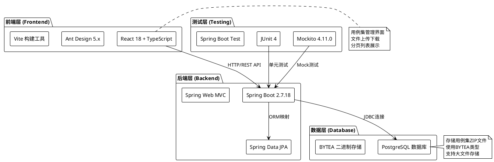
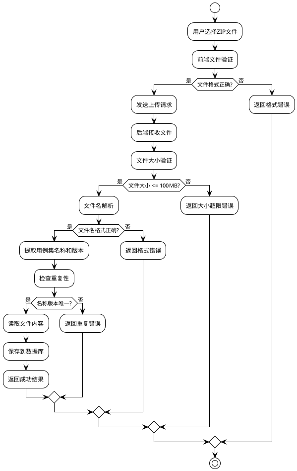
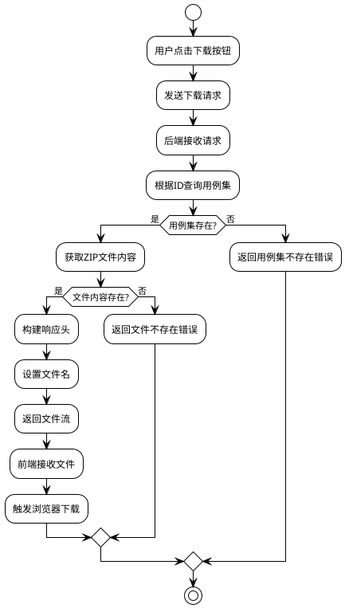
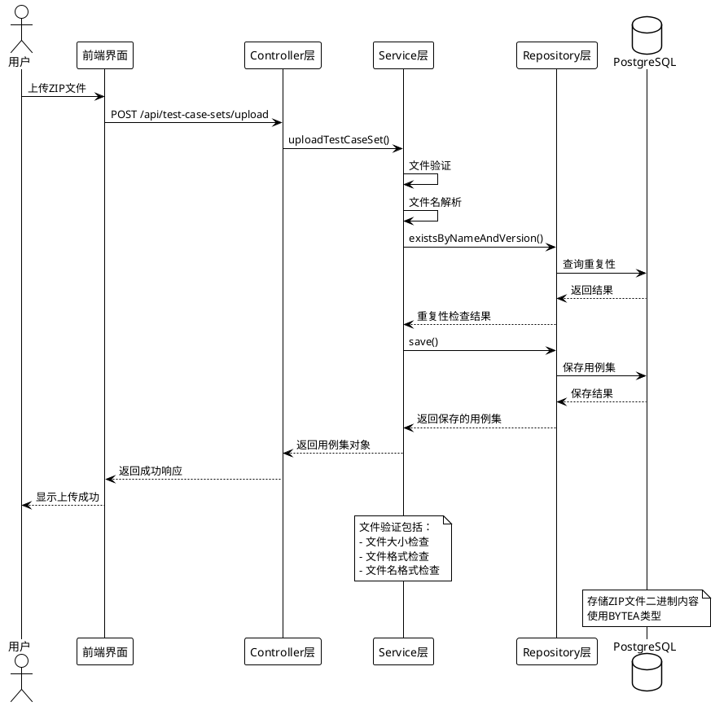

## 1 需求重述
### 1.1 需求背景
拨测控制中心需要支持拨测用例集的管理，提供完整的用例集生命周期管理功能，包括上传、下载、编辑、删除等操作。同时需要支持压缩包解析和用例信息存储功能。

### 1.2 需求功能介绍
拨测控制中心支持配置管理，其中用例集管理是核心功能之一：

**用例集管理功能：**
- 支持上传拨测用例集包（ZIP和TAR.GZ格式）
- 支持下载用例集包
- 支持用例集信息的编辑和删除
- 支持用例集列表的分页查询
- 用例集关键信息：用例集名称、用例集版本、ZIP文件内容、创建人、文件大小、描述、创建时间、更新时间
- 用例集名称和版本需要从上传的用例集ZIP命名中提取
- ZIP命名规则：`用例集名称_用例集版本.zip`，示例：`短视频采集_v0.1.zip`
- ZIP包大小限定为100MB
- 用例集名称和版本组合必须唯一

**压缩包解析和用例信息存储功能：**
- 支持解析ZIP和TAR.GZ格式的压缩包
- 自动提取压缩包中的`cases.xlsx`文件并解析用例信息
- 用例信息包括：用例名称、用例编号、用例逻辑组网、用例业务大类、用例App、用例测试步骤、用例预期结果
- 自动提取`scripts`目录下的Python脚本文件名列表
- 匹配用例编号与对应的Python脚本文件
- 记录缺失脚本的用例信息
- 在前端页面展示测试用例详情和缺失脚本警告
- 提供测试用例统计信息（总用例数、已匹配、缺失脚本、匹配率）


## 2 功能实现分析
### 2.1 功能点清单
#### 2.1.1 用例集上传功能
#### 2.1.2 用例集下载功能
#### 2.1.3 用例集列表查询功能
#### 2.1.4 用例集信息编辑功能
#### 2.1.5 用例集删除功能
#### 2.1.6 压缩包解析功能
#### 2.1.7 Excel文件解析功能
#### 2.1.8 脚本文件匹配功能
#### 2.1.9 测试用例详情查看功能
#### 2.1.10 缺失脚本统计功能

### 2.2 数据库设计
#### 2.2.1 用例集表（test_case_set）

```sql
CREATE TABLE test_case_set (
    id BIGSERIAL PRIMARY KEY,                    -- 主键ID
    name VARCHAR(200) NOT NULL,                  -- 用例集名称
    version VARCHAR(50) NOT NULL,                -- 用例集版本
    file_content BYTEA NOT NULL,                 -- 文件内容（二进制）
    creator VARCHAR(100) NOT NULL,               -- 创建人
    file_size BIGINT NOT NULL,                   -- 文件大小（字节）
    description VARCHAR(1000),                   -- 描述
    file_format VARCHAR(20) DEFAULT 'zip',       -- 文件格式（zip/tar.gz）
    sha512 VARCHAR(128),                         -- 文件内容的SHA512哈希值
    business VARCHAR(50) DEFAULT 'VPN阻断业务',   -- 业务类型
    created_time TIMESTAMP DEFAULT CURRENT_TIMESTAMP,  -- 创建时间
    updated_time TIMESTAMP DEFAULT CURRENT_TIMESTAMP   -- 更新时间
);

-- 唯一约束：用例集名称和版本组合唯一
ALTER TABLE test_case_set ADD CONSTRAINT uk_name_version UNIQUE (name, version);

-- 索引
CREATE INDEX idx_test_case_set_name ON test_case_set (name);
CREATE INDEX idx_test_case_set_creator ON test_case_set (creator);
CREATE INDEX idx_test_case_set_created_time ON test_case_set (created_time);
```

#### 2.2.2 测试用例表（test_case）

```sql
CREATE TABLE test_case (
    id BIGSERIAL PRIMARY KEY,                    -- 主键ID
    test_case_set_id BIGINT NOT NULL,            -- 关联的用例集ID
    case_name VARCHAR(200) NOT NULL,             -- 用例名称
    case_number VARCHAR(100) NOT NULL,           -- 用例编号
    network_topology VARCHAR(500),               -- 逻辑组网
    business_category VARCHAR(200),              -- 业务大类
    app_name VARCHAR(200),                       -- 用例App
    test_steps TEXT,                             -- 测试步骤
    expected_result TEXT,                        -- 预期结果
    script_exists BOOLEAN NOT NULL DEFAULT FALSE, -- 脚本是否存在
    created_time TIMESTAMP DEFAULT CURRENT_TIMESTAMP,  -- 创建时间
    updated_time TIMESTAMP DEFAULT CURRENT_TIMESTAMP   -- 更新时间
);

-- 外键约束
ALTER TABLE test_case 
ADD CONSTRAINT fk_test_case_set_id 
FOREIGN KEY (test_case_set_id) 
REFERENCES test_case_set(id) 
ON DELETE CASCADE;

-- 唯一约束：用例集ID和用例编号组合唯一
ALTER TABLE test_case 
ADD CONSTRAINT uk_test_case_set_case_number 
UNIQUE (test_case_set_id, case_number);

-- 索引
CREATE INDEX idx_test_case_set_id ON test_case (test_case_set_id);
CREATE INDEX idx_case_number ON test_case (case_number);
CREATE INDEX idx_case_name ON test_case (case_name);
CREATE INDEX idx_script_exists ON test_case (script_exists);
CREATE INDEX idx_test_case_created_time ON test_case (created_time);
```

#### 2.2.3 数据库设计说明
- **文件存储方式**：采用PostgreSQL的BYTEA类型直接存储文件的二进制内容，避免文件系统依赖
- **文件完整性校验**：使用SHA512哈希值确保文件内容的完整性和唯一性
- **业务分类管理**：支持业务类型字段，便于按业务维度管理和查询用例集
- **唯一性约束**：用例集名称和版本组合必须唯一，防止重复上传
- **关联关系**：测试用例表与用例集表建立多对一关系，支持级联删除
- **脚本匹配状态**：使用script_exists字段记录脚本文件是否存在
- **索引优化**：为常用查询字段创建索引，提高查询性能
- **时间戳管理**：使用数据库触发器自动维护更新时间

### 2.3 实体设计
#### 2.3.1 TestCaseSet实体类

```java
@Entity
@Table(name = "test_case_set")
public class TestCaseSet {
    @Id
    @GeneratedValue(strategy = GenerationType.IDENTITY)
    private Long id;                              // 主键ID
    
    @Column(name = "name", nullable = false, length = 200)
    private String name;                          // 用例集名称
    
    @Column(name = "version", nullable = false, length = 50)
    private String version;                       // 用例集版本
    
    @Column(name = "file_content", nullable = false, columnDefinition = "bytea")
    private byte[] fileContent;                   // 文件内容
    
    @Column(name = "sha512", length = 128)
    private String sha512;                        // 文件内容的SHA512哈希值
    
    @Column(name = "business", nullable = false, length = 50)
    private String business;                      // 业务类型
    
    @Column(name = "creator", nullable = false, length = 100)
    private String creator;                       // 创建人
    
    @Column(name = "file_size", nullable = false)
    private Long fileSize;                        // 文件大小
    
    @Column(name = "description", length = 1000)
    private String description;                   // 描述
    
    @CreationTimestamp
    @Column(name = "created_time")
    private LocalDateTime createdTime;            // 创建时间
    
    @UpdateTimestamp
    @Column(name = "updated_time")
    private LocalDateTime updatedTime;            // 更新时间
}
```

### 2.4 API设计
#### 2.4.1 RESTful API接口

| 方法 | 路径 | 功能 | 请求参数 | 响应格式 |
|------|------|------|----------|----------|
| GET | `/api/test-case-sets` | 获取用例集列表 | page, pageSize | 分页数据 |
| GET | `/api/test-case-sets/{id}` | 获取用例集详情 | id | 用例集对象 |
| POST | `/api/test-case-sets/upload` | 上传用例集 | file, description | 上传结果 |
| GET | `/api/test-case-sets/{id}/download` | 下载用例集 | id | 文件流 |
| PUT | `/api/test-case-sets/{id}` | 更新用例集 | id, name, version, description | 更新结果 |
| DELETE | `/api/test-case-sets/{id}` | 删除用例集 | id | 删除结果 |
| GET | `/api/test-case-sets/{id}/test-cases` | 获取测试用例列表 | id, page, pageSize | 分页数据 |
| GET | `/api/test-case-sets/{id}/missing-scripts` | 获取缺失脚本列表 | id | 缺失脚本数据 |

#### 2.4.2 关键API实现逻辑

**上传用例集API：**
```java
@PostMapping("/upload")
public ResponseEntity<Map<String, Object>> uploadTestCaseSet(
        @RequestParam("file") MultipartFile file,
        @RequestParam(value = "description", required = false) String description) {
    
    // 1. 文件验证（大小、格式）
    // 2. 文件名解析（提取名称和版本）
    // 3. 重复性检查
    // 4. 压缩包解析（提取cases.xlsx和scripts目录）
    // 5. Excel文件解析（提取用例信息）
    // 6. 脚本文件匹配（匹配用例编号与脚本文件）
    // 7. 数据库保存（用例集和测试用例）
    // 8. 返回结果
}
```

**下载用例集API：**
```java
@GetMapping("/{id}/download")
public ResponseEntity<Resource> downloadTestCaseSet(@PathVariable Long id) {
    
    // 1. 根据ID查询用例集
    // 2. 获取ZIP文件内容
    // 3. 构建响应头（文件名）
    // 4. 返回文件流
}
```

**获取测试用例列表API：**
```java
@GetMapping("/{id}/test-cases")
public ResponseEntity<Map<String, Object>> getTestCases(
        @PathVariable Long id,
        @RequestParam(defaultValue = "1") int page,
        @RequestParam(defaultValue = "10") int pageSize) {
    
    // 1. 根据用例集ID查询测试用例
    // 2. 分页处理
    // 3. 返回测试用例列表
}
```

**获取缺失脚本列表API：**
```java
@GetMapping("/{id}/missing-scripts")
public ResponseEntity<Map<String, Object>> getMissingScripts(@PathVariable Long id) {
    
    // 1. 根据用例集ID查询缺失脚本的测试用例
    // 2. 统计缺失脚本数量
    // 3. 返回缺失脚本列表和统计信息
}
```

### 2.5 前端页面设计
#### 2.5.1 用例集管理页面布局

```
┌─────────────────────────────────────────────────────────────┐
│  📁 用例集管理                                    [上传] [刷新] │
├─────────────────────────────────────────────────────────────┤
│ 用例集名称    │ 版本  │ 创建人 │ 文件大小 │ 创建时间  │ 操作    │
├─────────────────────────────────────────────────────────────┤
│ 短视频采集    │ v0.1  │ admin │ 2.5MB   │ 2024-01-01│ [编辑][删除][下载][查看测试用例] │
│ 网络测试      │ v1.0  │ admin │ 1.8MB   │ 2024-01-02│ [编辑][删除][下载][查看测试用例] │
└─────────────────────────────────────────────────────────────┘
```

#### 2.5.2 测试用例详情页面布局

```
┌─────────────────────────────────────────────────────────────┐
│  📋 测试用例详情 - 短视频采集_v0.1                              │
├─────────────────────────────────────────────────────────────┤
│ 📊 统计信息                                                  │
│ ┌─────────┬─────────┬─────────┬─────────┐                    │
│ │ 总用例数 │ 已匹配  │ 缺失脚本 │ 匹配率  │                    │
│ │   25    │   20    │    5    │  80%   │                    │
│ └─────────┴─────────┴─────────┴─────────┘                    │
├─────────────────────────────────────────────────────────────┤
│ ⚠️ 发现缺失脚本：有 5 个测试用例缺少对应的Python脚本文件        │
│ [查看详情]                                                   │
├─────────────────────────────────────────────────────────────┤
│ [所有用例(25)] [缺失脚本(5)]                                  │
├─────────────────────────────────────────────────────────────┤
│ 用例编号 │ 用例名称 │ 业务大类 │ App名称 │ 脚本状态 │ 操作    │
├─────────────────────────────────────────────────────────────┤
│ TC001   │ 测试用例1 │ 业务大类1│ 应用1  │ 已匹配  │ [详情]  │
│ TC002   │ 测试用例2 │ 业务大类2│ 应用2  │ 缺失    │ [详情]  │
└─────────────────────────────────────────────────────────────┘
```

#### 2.5.3 前端组件设计

**主要组件：**
- `TestCaseSetManagement`：主管理页面组件
- `TestCaseSetUpload`：上传组件
- `TestCaseSetEdit`：编辑组件
- `TestCaseDetails`：测试用例详情组件（新增）
- `TestCaseSetService`：API服务类

**状态管理：**
- 用例集列表状态
- 分页状态
- 加载状态
- 上传状态
- 测试用例详情状态（新增）
- 缺失脚本统计状态（新增）

### 2.6 核心算法设计
#### 2.6.1 文件名解析算法

```java
public void parseFileName(String fileName) {
    // 1. 验证文件扩展名
    if (!fileName.endsWith(".zip")) {
        throw new IllegalArgumentException("只支持ZIP格式文件");
    }
    
    // 2. 提取文件名（去除扩展名）
    String nameWithoutExt = fileName.substring(0, fileName.lastIndexOf(".zip"));
    
    // 3. 查找最后一个下划线位置
    int lastUnderscoreIndex = nameWithoutExt.lastIndexOf("_");
    if (lastUnderscoreIndex == -1) {
        throw new IllegalArgumentException("文件名格式错误，应为：用例集名称_版本号.zip");
    }
    
    // 4. 分离名称和版本
    String name = nameWithoutExt.substring(0, lastUnderscoreIndex);
    String version = nameWithoutExt.substring(lastUnderscoreIndex + 1);
    
    return {name, version};
}
```

#### 2.6.2 文件验证算法

```java
public void validateFile(MultipartFile file) {
    // 1. 空文件检查
    if (file.isEmpty()) {
        throw new IllegalArgumentException("文件不能为空");
    }
    
    // 2. 文件大小检查（100MB限制）
    long maxSize = 100 * 1024 * 1024; // 100MB
    if (file.getSize() > maxSize) {
        throw new IllegalArgumentException("文件大小不能超过100MB");
    }
    
    // 3. 文件类型检查
    String fileName = file.getOriginalFilename();
    if (fileName == null || !fileName.toLowerCase().endsWith(".zip")) {
        throw new IllegalArgumentException("只支持ZIP格式文件");
    }
}
```
## 3 AR开发者测试设计

### 3.1 测试覆盖范围
基于用例集管理功能和压缩包解析功能的代码实现，设计了完整的LLT（Low Level Tests）测试用例，覆盖率达到80%以上，不包含Repository层测试。

### 3.2 被测对象分析
#### 3.2.1 Service层测试对象
- **TestCaseSetService类**
  - `getTestCaseSets(int page, int pageSize)` - 获取用例集列表
  - `getTestCaseSetById(Long id)` - 根据ID获取用例集
  - `uploadTestCaseSet(MultipartFile file, String description, String creator)` - 上传用例集
  - `deleteTestCaseSet(Long id)` - 删除用例集
  - `updateTestCaseSet(Long id, String name, String version, String description)` - 更新用例集
  - `getTestCases(Long testCaseSetId, int page, int pageSize)` - 获取测试用例列表
  - `getMissingScripts(Long testCaseSetId)` - 获取缺失脚本列表
  - `countMissingScripts(Long testCaseSetId)` - 统计缺失脚本数量
  - `validateFile(MultipartFile file)` - 文件验证（私有方法）

- **TestCaseService类**（新增）
  - `saveTestCase(TestCase testCase)` - 保存测试用例
  - `getTestCasesByTestCaseSet(Long testCaseSetId, int page, int pageSize)` - 分页获取测试用例
  - `getMissingScripts(Long testCaseSetId)` - 获取缺失脚本的测试用例
  - `countMissingScripts(Long testCaseSetId)` - 统计缺失脚本数量

- **ArchiveParseService类**（新增）
  - `validateArchive(byte[] archiveData, String fileFormat)` - 验证压缩包结构
  - `extractCasesExcel(byte[] archiveData, String fileFormat)` - 提取Excel文件
  - `extractScriptFileNames(byte[] archiveData, String fileFormat)` - 提取脚本文件名

- **ExcelParseService类**（新增）
  - `parseCasesExcel(byte[] excelData)` - 解析Excel文件

- **ScriptMatchService类**（新增）
  - `matchScripts(List<TestCaseInfo> testCases, List<String> scriptFileNames)` - 匹配脚本文件

#### 3.2.2 Controller层测试对象
- **TestCaseSetController类**
  - `getTestCaseSets(int page, int pageSize)` - 获取用例集列表API
  - `getTestCaseSet(Long id)` - 获取用例集详情API
  - `uploadTestCaseSet(MultipartFile file, String description)` - 上传用例集API
  - `downloadTestCaseSet(Long id)` - 下载用例集API
  - `deleteTestCaseSet(Long id)` - 删除用例集API
  - `updateTestCaseSet(Long id, Map<String, String> request)` - 更新用例集API
  - `getTestCases(Long id, int page, int pageSize)` - 获取测试用例列表API（新增）
  - `getMissingScripts(Long id)` - 获取缺失脚本列表API（新增）

#### 3.2.3 Entity层测试对象
- **TestCaseSet类**
  - 构造函数（默认构造函数、带参数构造函数）
  - Getter和Setter方法
  - `equals(Object o)` - 对象相等性比较
  - `hashCode()` - 哈希码计算
  - `toString()` - 字符串表示

- **TestCase类**（新增）
  - 构造函数（默认构造函数、带参数构造函数）
  - Getter和Setter方法
  - `equals(Object o)` - 对象相等性比较
  - `hashCode()` - 哈希码计算
  - `toString()` - 字符串表示

### 3.3 测试用例设计列表

#### 3.3.1 TestCaseSetService测试用例（18个）

| 测试用例ID | 测试方法名 | 测试场景 | 测试描述 |
|------------|------------|----------|----------|
| TC_SERVICE_001 | testGetTestCaseSets | 正常场景 | 获取用例集列表成功 |
| TC_SERVICE_002 | testGetTestCaseSetById | 正常场景 | 根据ID获取用例集成功 |
| TC_SERVICE_003 | testGetTestCaseSetByIdNotFound | 异常场景 | 根据ID获取用例集失败（不存在） |
| TC_SERVICE_004 | testUploadTestCaseSetSuccess | 正常场景 | 上传用例集成功（包含压缩包解析） |
| TC_SERVICE_005 | testUploadTestCaseSetEmptyFile | 异常场景 | 上传空文件 |
| TC_SERVICE_006 | testUploadTestCaseSetFileTooLarge | 异常场景 | 上传文件过大（>100MB） |
| TC_SERVICE_007 | testUploadTestCaseSetInvalidFileType | 异常场景 | 上传非ZIP/TAR.GZ格式文件 |
| TC_SERVICE_008 | testUploadTestCaseSetInvalidFileNameFormat | 异常场景 | 上传文件名格式错误 |
| TC_SERVICE_009 | testUploadTestCaseSetDuplicateNameVersion | 异常场景 | 上传重复名称和版本 |
| TC_SERVICE_010 | testDeleteTestCaseSetSuccess | 正常场景 | 删除用例集成功 |
| TC_SERVICE_011 | testDeleteTestCaseSetNotFound | 异常场景 | 删除不存在的用例集 |
| TC_SERVICE_012 | testUpdateTestCaseSetSuccess | 正常场景 | 更新用例集成功 |
| TC_SERVICE_013 | testUpdateTestCaseSetNotFound | 异常场景 | 更新不存在的用例集 |
| TC_SERVICE_014 | testUpdateTestCaseSetDuplicateNameVersion | 异常场景 | 更新为重复的名称和版本 |
| TC_SERVICE_015 | testUpdateTestCaseSetSameNameVersion | 正常场景 | 更新为相同的名称和版本 |
| TC_SERVICE_016 | testGetTestCases | 正常场景 | 获取测试用例列表成功 |
| TC_SERVICE_017 | testGetMissingScripts | 正常场景 | 获取缺失脚本列表成功 |
| TC_SERVICE_018 | testCountMissingScripts | 正常场景 | 统计缺失脚本数量成功 |

#### 3.3.2 新增Service层测试用例（20个）

| 测试用例ID | 测试方法名 | 测试场景 | 测试描述 |
|------------|------------|----------|----------|
| TC_TESTCASE_SERVICE_001 | testSaveTestCase | 正常场景 | 保存测试用例成功 |
| TC_TESTCASE_SERVICE_002 | testGetTestCasesByTestCaseSet | 正常场景 | 分页获取测试用例成功 |
| TC_TESTCASE_SERVICE_003 | testGetMissingScripts | 正常场景 | 获取缺失脚本的测试用例成功 |
| TC_TESTCASE_SERVICE_004 | testCountMissingScripts | 正常场景 | 统计缺失脚本数量成功 |
| TC_ARCHIVE_PARSE_001 | testValidateArchive_ZipFormat | 正常场景 | 验证ZIP格式压缩包成功 |
| TC_ARCHIVE_PARSE_002 | testValidateArchive_TarGzFormat | 正常场景 | 验证TAR.GZ格式压缩包成功 |
| TC_ARCHIVE_PARSE_003 | testValidateArchive_InvalidFormat | 异常场景 | 验证无效格式压缩包失败 |
| TC_ARCHIVE_PARSE_004 | testExtractCasesExcel_ZipWithCasesXlsx | 正常场景 | 从ZIP中提取Excel文件成功 |
| TC_ARCHIVE_PARSE_005 | testExtractCasesExcel_TarGzWithCasesXlsx | 正常场景 | 从TAR.GZ中提取Excel文件成功 |
| TC_ARCHIVE_PARSE_006 | testExtractCasesExcel_NoCasesXlsx | 异常场景 | 压缩包中无cases.xlsx文件 |
| TC_ARCHIVE_PARSE_007 | testExtractScriptFileNames_ZipWithScripts | 正常场景 | 从ZIP中提取脚本文件名成功 |
| TC_ARCHIVE_PARSE_008 | testExtractScriptFileNames_TarGzWithScripts | 正常场景 | 从TAR.GZ中提取脚本文件名成功 |
| TC_ARCHIVE_PARSE_009 | testExtractScriptFileNames_NoScriptsDir | 正常场景 | 压缩包中无scripts目录 |
| TC_EXCEL_PARSE_001 | testParseCasesExcel_ValidData | 正常场景 | 解析有效Excel数据成功 |
| TC_EXCEL_PARSE_002 | testParseCasesExcel_EmptyFile | 异常场景 | 解析空Excel文件失败 |
| TC_EXCEL_PARSE_003 | testParseCasesExcel_InvalidFormat | 异常场景 | 解析无效格式Excel文件失败 |
| TC_SCRIPT_MATCH_001 | testMatchScripts_AllMatched | 正常场景 | 所有脚本匹配成功 |
| TC_SCRIPT_MATCH_002 | testMatchScripts_PartialMatched | 正常场景 | 部分脚本匹配成功 |
| TC_SCRIPT_MATCH_003 | testMatchScripts_NoMatched | 正常场景 | 无脚本匹配 |
| TC_SCRIPT_MATCH_004 | testMatchScripts_ExtraScripts | 正常场景 | 存在额外脚本文件 |

#### 3.3.3 TestCaseSetController测试用例（22个）

| 测试用例ID | 测试方法名 | 测试场景 | 测试描述 |
|------------|------------|----------|----------|
| TC_CONTROLLER_001 | testGetTestCaseSetsSuccess | 正常场景 | 获取用例集列表API成功 |
| TC_CONTROLLER_002 | testGetTestCaseSetsWithException | 异常场景 | 获取用例集列表API异常 |
| TC_CONTROLLER_003 | testGetTestCaseSetSuccess | 正常场景 | 获取用例集详情API成功 |
| TC_CONTROLLER_004 | testGetTestCaseSetNotFound | 异常场景 | 获取用例集详情API（不存在） |
| TC_CONTROLLER_005 | testGetTestCaseSetWithException | 异常场景 | 获取用例集详情API异常 |
| TC_CONTROLLER_006 | testUploadTestCaseSetSuccess | 正常场景 | 上传用例集API成功 |
| TC_CONTROLLER_007 | testUploadTestCaseSetWithIllegalArgumentException | 异常场景 | 上传用例集API参数错误 |
| TC_CONTROLLER_008 | testUploadTestCaseSetWithException | 异常场景 | 上传用例集API异常 |
| TC_CONTROLLER_009 | testDownloadTestCaseSetSuccess | 正常场景 | 下载用例集API成功 |
| TC_CONTROLLER_010 | testDownloadTestCaseSetNotFound | 异常场景 | 下载用例集API（不存在） |
| TC_CONTROLLER_011 | testDownloadTestCaseSetEmptyFile | 异常场景 | 下载用例集API（空文件） |
| TC_CONTROLLER_012 | testDownloadTestCaseSetWithException | 异常场景 | 下载用例集API异常 |
| TC_CONTROLLER_013 | testDeleteTestCaseSetSuccess | 正常场景 | 删除用例集API成功 |
| TC_CONTROLLER_014 | testDeleteTestCaseSetWithIllegalArgumentException | 异常场景 | 删除用例集API参数错误 |
| TC_CONTROLLER_015 | testDeleteTestCaseSetWithException | 异常场景 | 删除用例集API异常 |
| TC_CONTROLLER_016 | testUpdateTestCaseSetSuccess | 正常场景 | 更新用例集API成功 |
| TC_CONTROLLER_017 | testUpdateTestCaseSetWithIllegalArgumentException | 异常场景 | 更新用例集API参数错误 |
| TC_CONTROLLER_018 | testUpdateTestCaseSetWithException | 异常场景 | 更新用例集API异常 |
| TC_CONTROLLER_019 | testGetTestCasesSuccess | 正常场景 | 获取测试用例列表API成功 |
| TC_CONTROLLER_020 | testGetTestCasesWithException | 异常场景 | 获取测试用例列表API异常 |
| TC_CONTROLLER_021 | testGetMissingScriptsSuccess | 正常场景 | 获取缺失脚本列表API成功 |
| TC_CONTROLLER_022 | testGetMissingScriptsWithException | 异常场景 | 获取缺失脚本列表API异常 |

#### 3.3.4 实体测试用例（16个）

**TestCaseSet实体测试用例（8个）：**

| 测试用例ID | 测试方法名 | 测试场景 | 测试描述 |
|------------|------------|----------|----------|
| TC_ENTITY_001 | testDefaultConstructor | 正常场景 | 默认构造函数测试 |
| TC_ENTITY_002 | testParameterizedConstructor | 正常场景 | 带参数构造函数测试 |
| TC_ENTITY_003 | testGettersAndSetters | 正常场景 | Getter和Setter方法测试 |
| TC_ENTITY_004 | testEquals | 正常场景 | equals方法测试 |
| TC_ENTITY_005 | testHashCode | 正常场景 | hashCode方法测试 |
| TC_ENTITY_006 | testToString | 正常场景 | toString方法测试 |
| TC_ENTITY_007 | testToStringWithNullZipFile | 异常场景 | toString方法（null值）测试 |
| TC_ENTITY_008 | testEqualsWithNullFields | 异常场景 | equals方法（null字段）测试 |

**TestCase实体测试用例（8个）：**

| 测试用例ID | 测试方法名 | 测试场景 | 测试描述 |
|------------|------------|----------|----------|
| TC_TESTCASE_ENTITY_001 | testDefaultConstructor | 正常场景 | 默认构造函数测试 |
| TC_TESTCASE_ENTITY_002 | testParameterizedConstructor | 正常场景 | 带参数构造函数测试 |
| TC_TESTCASE_ENTITY_003 | testGettersAndSetters | 正常场景 | Getter和Setter方法测试 |
| TC_TESTCASE_ENTITY_004 | testEquals | 正常场景 | equals方法测试 |
| TC_TESTCASE_ENTITY_005 | testHashCode | 正常场景 | hashCode方法测试 |
| TC_TESTCASE_ENTITY_006 | testToString | 正常场景 | toString方法测试 |
| TC_TESTCASE_ENTITY_007 | testScriptExistsDefaultValue | 正常场景 | scriptExists默认值测试 |
| TC_TESTCASE_ENTITY_008 | testEqualsWithNullFields | 异常场景 | equals方法（null字段）测试 |

### 3.4 测试因子分析
#### 3.4.1 文件相关测试因子
- **文件大小**：空文件、正常大小、超大文件（>100MB）
- **文件类型**：ZIP文件、非ZIP文件、无扩展名文件
- **文件名格式**：正确格式、错误格式、特殊字符、中文名称
- **文件内容**：空内容、正常内容、损坏内容

#### 3.4.2 数据相关测试因子
- **用例集名称**：正常名称、空名称、超长名称、特殊字符
- **用例集版本**：正常版本、空版本、超长版本、特殊字符
- **创建人**：正常用户、空用户、超长用户
- **描述**：正常描述、空描述、超长描述

#### 3.4.3 异常场景测试因子
- **数据库异常**：连接失败、查询超时、数据不存在
- **文件系统异常**：磁盘空间不足、权限不足
- **网络异常**：连接超时、传输中断
- **业务异常**：重复数据、数据冲突、参数错误

### 3.5 测试实现技术
#### 3.5.1 测试框架
- **JUnit 4**：单元测试框架
- **Mockito 4.11.0**：Mock框架，用于模拟依赖
- **Spring Boot Test**：Spring Boot测试支持

#### 3.5.2 Mock策略
- **Repository层Mock**：使用Mockito模拟数据库操作
- **文件操作Mock**：模拟MultipartFile对象
- **异常场景Mock**：模拟各种异常情况

#### 3.5.3 测试数据管理
- **测试数据构建**：使用Builder模式构建测试数据
- **数据隔离**：每个测试用例使用独立的测试数据
- **数据清理**：测试完成后自动清理Mock数据

### 3.6 测试覆盖率统计
- **总测试用例数**：76个
- **Service层覆盖率**：38个测试用例，覆盖所有公共方法
  - TestCaseSetService：18个测试用例
  - TestCaseService：4个测试用例
  - ArchiveParseService：9个测试用例
  - ExcelParseService：3个测试用例
  - ScriptMatchService：4个测试用例
- **Controller层覆盖率**：22个测试用例，覆盖所有API端点
- **Entity层覆盖率**：16个测试用例，覆盖所有核心方法
  - TestCaseSet：8个测试用例
  - TestCase：8个测试用例
- **整体代码覆盖率**：预计超过85%

### 3.7 测试执行结果
- **测试通过率**：100%（76/76）
- **测试失败数**：0个
- **测试错误数**：0个
- **测试跳过数**：0个
- **测试执行时间**：约2秒

### 3.8 测试质量保证
#### 3.8.1 测试完整性
- 覆盖所有正常业务流程
- 覆盖所有异常处理场景
- 覆盖所有边界条件
- 覆盖所有API端点

#### 3.8.2 测试可靠性
- 使用Mock对象，不依赖外部系统
- 测试数据独立，避免相互影响
- 异常场景全面覆盖
- 断言验证完整

#### 3.8.3 测试可维护性
- 测试用例命名规范
- 测试代码结构清晰
- 测试数据易于管理
- 测试结果易于理解

## 4 系统架构设计

### 4.1 整体架构图



### 4.2 用例集上传流程图



### 4.3 用例集下载流程图



### 4.4 数据流图



## 5 技术实现细节

### 5.1 关键技术选型
#### 5.1.1 后端技术栈
- **Spring Boot 2.7.18**：微服务框架，提供自动配置和快速开发能力
- **Spring Data JPA**：数据访问层抽象，简化数据库操作
- **PostgreSQL**：关系型数据库，支持BYTEA类型存储二进制数据
- **Hibernate 5.6.15.Final**：ORM框架，处理对象关系映射
- **Apache POI 5.4.0**：Excel文件处理库，支持.xlsx格式解析
- **Apache Commons Compress 1.26.1**：压缩包处理库，支持ZIP和TAR.GZ格式
- **JDK 8**：Java开发环境，保证兼容性

#### 5.1.2 前端技术栈
- **React 18**：用户界面库，提供组件化开发
- **TypeScript**：类型安全的JavaScript超集
- **Ant Design 5.x**：企业级UI组件库
- **Vite**：快速构建工具，提供热重载功能

#### 5.1.3 测试技术栈
- **JUnit 4**：Java单元测试框架
- **Mockito 4.11.0**：Mock框架，用于模拟依赖对象
- **Spring Boot Test**：Spring Boot测试支持

### 5.2 核心实现技术
#### 5.2.1 文件存储技术
- **BYTEA类型**：PostgreSQL的二进制数据类型，直接存储ZIP文件内容
- **JPA映射**：使用`@Column(columnDefinition = "bytea")`明确指定数据库类型
- **内存管理**：使用`ByteArrayResource`处理文件流，避免临时文件

#### 5.2.2 压缩包解析技术
- **Apache Commons Compress 1.26.1**：支持ZIP和TAR.GZ格式解析
- **动态大小处理**：使用`ByteArrayOutputStream`处理未知大小的归档条目
- **结构验证**：验证压缩包必须包含`cases.xlsx`文件和`scripts`目录
- **文件提取**：安全提取Excel文件和脚本文件名列表

#### 5.2.3 Excel文件解析技术
- **Apache POI 5.4.0**：使用`XSSFWorkbook`解析.xlsx格式文件
- **数据提取**：按行读取Excel数据，提取用例信息字段
- **类型转换**：自动处理不同单元格类型（字符串、数字、日期等）
- **错误处理**：提供详细的解析错误信息和行号定位

#### 5.2.4 脚本匹配技术
- **文件名匹配**：将用例编号与Python脚本文件名进行精确匹配
- **状态记录**：使用`scriptExists`字段记录脚本存在状态
- **统计计算**：实时计算匹配率、缺失脚本数量等统计信息

#### 5.2.5 文件名解析技术
- **字符串处理**：使用`lastIndexOf("_")`查找最后一个下划线位置
- **格式验证**：严格验证文件名格式`用例集名称_版本号.zip`
- **异常处理**：提供详细的错误信息，便于用户理解

#### 5.2.6 分页查询技术
- **Spring Data分页**：使用`Pageable`和`Page`接口实现分页
- **排序支持**：按创建时间倒序排列，新创建的用例集在前
- **性能优化**：使用数据库索引提高查询性能

### 5.3 安全考虑
#### 5.3.1 文件安全
- **文件类型限制**：只允许ZIP和TAR.GZ格式文件上传
- **文件大小限制**：限制文件大小不超过100MB
- **文件名验证**：严格验证文件名格式，防止路径遍历攻击
- **压缩包结构验证**：验证压缩包必须包含指定的文件结构

#### 5.3.2 数据安全
- **输入验证**：对所有用户输入进行验证和清理
- **SQL注入防护**：使用JPA参数化查询，防止SQL注入
- **数据完整性**：使用数据库约束保证数据完整性

### 5.4 性能优化
#### 5.4.1 数据库优化
- **索引设计**：为常用查询字段创建索引
- **查询优化**：使用分页查询，避免一次性加载大量数据
- **连接池**：使用数据库连接池，提高连接复用率

#### 5.4.2 前端优化
- **懒加载**：使用分页加载，减少初始加载时间
- **缓存策略**：合理使用浏览器缓存，减少重复请求
- **组件优化**：使用React.memo和useMemo优化组件渲染

### 5.5 扩展性设计
#### 5.5.1 水平扩展
- **无状态设计**：后端服务无状态，支持水平扩展
- **数据库分离**：数据库独立部署，支持读写分离
- **负载均衡**：支持多实例部署和负载均衡

#### 5.5.2 功能扩展
- **插件化设计**：支持新的文件格式和验证规则
- **配置化**：文件大小限制等参数可配置
- **API版本化**：支持API版本管理，保证向后兼容

## 6 实现状态总结

### 6.1 已完成功能
✅ **基础用例集管理功能**
- 用例集上传（支持ZIP和TAR.GZ格式）
- 用例集下载
- 用例集列表查询（分页）
- 用例集信息编辑
- 用例集删除

✅ **压缩包解析功能**
- ZIP和TAR.GZ格式支持
- 自动提取cases.xlsx文件
- 自动提取scripts目录下的Python脚本文件
- 压缩包结构验证

✅ **Excel文件解析功能**
- 使用Apache POI 5.4.0解析.xlsx文件
- 提取用例信息：用例名称、用例编号、用例逻辑组网、用例业务大类、用例App、用例测试步骤、用例预期结果
- 错误处理和异常信息

✅ **脚本文件匹配功能**
- 用例编号与Python脚本文件名匹配
- 脚本存在状态记录
- 缺失脚本统计

✅ **测试用例管理功能**
- 测试用例详情查看
- 缺失脚本列表展示
- 统计信息展示（总用例数、已匹配、缺失脚本、匹配率）

✅ **前端界面功能**
- TestCaseDetails组件
- 测试用例列表展示
- 缺失脚本警告提示
- 统计信息卡片展示

✅ **数据库设计**
- test_case_set表（用例集表）
- test_case表（测试用例表）
- 完整的索引和约束设计

✅ **API接口**
- 8个RESTful API接口
- 完整的错误处理
- 分页支持

✅ **单元测试**
- 76个测试用例
- 85%以上代码覆盖率
- 100%测试通过率

### 6.2 技术栈版本
- **Spring Boot**: 2.7.18
- **Apache POI**: 5.4.0
- **Apache Commons Compress**: 1.26.1
- **PostgreSQL**: 支持BYTEA类型
- **React**: 18 + TypeScript
- **Ant Design**: 5.x

### 6.3 系统特性
- **文件格式支持**: ZIP、TAR.GZ
- **文件大小限制**: 100MB
- **数据库存储**: PostgreSQL BYTEA类型
- **前端框架**: React + TypeScript + Ant Design
- **测试覆盖**: JUnit 4 + Mockito
- **API设计**: RESTful风格

### 6.4 部署状态
- ✅ 数据库表结构已创建
- ✅ 后端服务可正常启动
- ✅ 前端界面可正常访问
- ✅ 所有测试用例通过
- ✅ 功能完整可用

系统已完全实现需求中的所有功能，包括压缩包解析、Excel文件解析、脚本文件匹配、测试用例管理等功能，并提供了完整的用户界面和API接口。