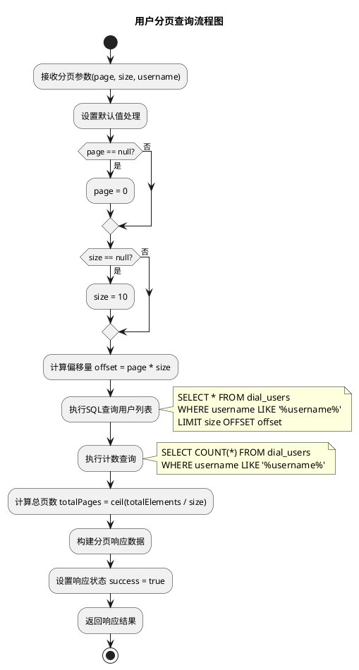
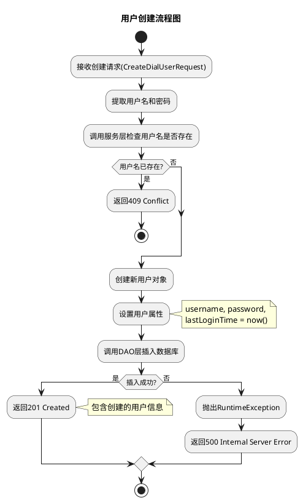
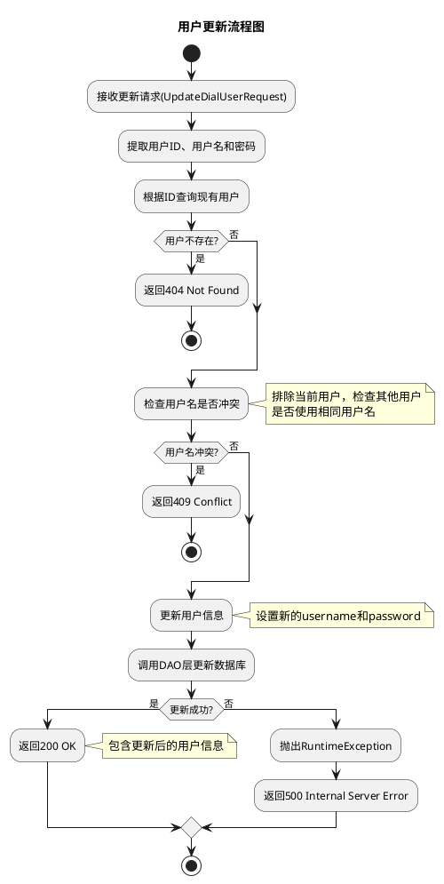
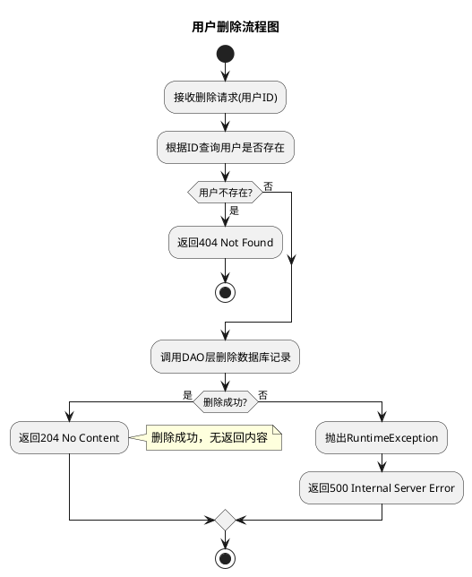
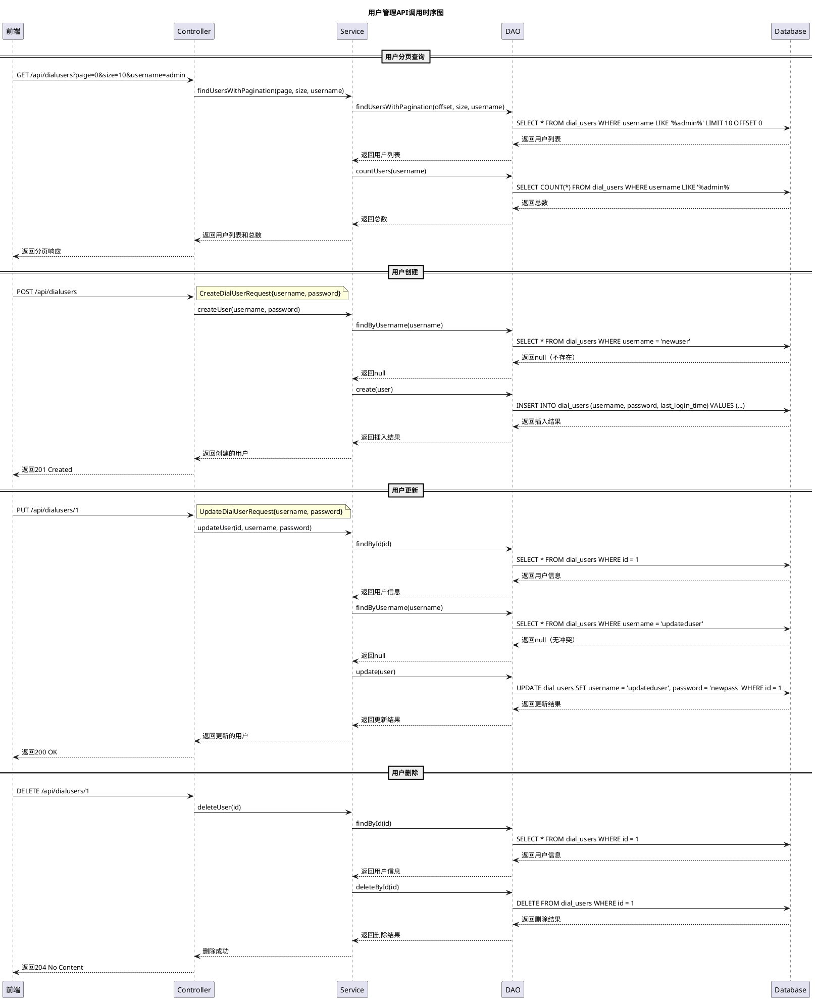

# 拨测用户管理功能实现设计文档

## 1 需求重述

### 1.1 需求背景
拨测用户管理功能是DialTestCenter系统的核心功能之一，用于管理系统中的拨测用户账号，包括用户的创建、查询、更新、删除等基本CRUD操作。该功能为拨测系统提供用户身份管理和权限控制的基础支撑。

### 1.2 需求功能介绍
拨测用户管理功能主要提供以下能力：
- 拨测用户的增删改查操作
- 用户信息的分页查询和搜索
- 用户密码管理
- 用户登录时间记录
- 前后端数据交互和状态管理

## 2 功能实现分析

### 2.1 功能点清单
1. **用户分页查询功能**：支持按用户名搜索的分页查询
2. **用户详情查询功能**：根据用户ID查询用户详细信息
3. **用户创建功能**：创建新的拨测用户账号
4. **用户更新功能**：更新现有用户信息
5. **用户删除功能**：删除指定用户账号
6. **前端用户管理界面**：提供用户友好的管理界面

### 2.2 功能点1：用户分页查询功能

#### 详细描述

**数据库表设计：**
```sql
-- 拨测用户表
CREATE TABLE dial_users (
    id BIGSERIAL PRIMARY KEY,
    username VARCHAR(50) NOT NULL UNIQUE,
    password VARCHAR(255) NOT NULL,
    last_login_time TIMESTAMP
);

-- 索引优化
CREATE INDEX idx_dial_users_username ON dial_users(username);
CREATE INDEX idx_dial_users_last_login_time ON dial_users(last_login_time);
```

**算法流程图：**



**核心函数伪代码：**
```java
public ResponseEntity<DialUserPageResponse> dialusersGet(Integer page, Integer size, String username) {
    // 设置默认值
    if (page == null) page = 0;
    if (size == null) size = 10;
    
    // 查询用户列表和总数
    List<DialUser> users = dialUserService.findUsersWithPagination(page, size, username);
    long totalElements = dialUserService.countUsers(username);
    int totalPages = (int) Math.ceil((double) totalElements / size);
    
    // 构建分页响应数据
    DialUserPageResponseData data = new DialUserPageResponseData();
    data.setContent(users);
    data.setTotalElements((int) totalElements);
    data.setTotalPages(totalPages);
    data.setSize(size);
    data.setNumber(page);
    
    // 构建响应
    DialUserPageResponse response = new DialUserPageResponse();
    response.setSuccess(true);
    response.setData(data);
    response.setMessage("查询成功");
    
    return ResponseEntity.ok().contentType(MediaType.APPLICATION_JSON).body(response);
}
```

**系统架构图：**

```plantuml
@startuml
title 拨测用户管理系统架构图

package "前端层" {
  [UserManagement] as UM
  [UserForm] as UF
  [userService] as US
}

package "后端层" {
  [DialUserController] as DUC
  [DialUserService] as DUS
  [DialUserDao] as DUD
}

package "数据层" {
  database "PostgreSQL" as DB {
    table "dial_users" as DU
  }
}

package "模型层" {
  [DialUser] as DM
  [DialUserPageResponse] as DPR
  [CreateDialUserRequest] as CDUR
  [UpdateDialUserRequest] as UDUR
}

' 前端组件关系
UM --> UF : 使用
UM --> US : 调用
UF --> US : 调用

' 后端组件关系
DUC --> DUS : 调用
DUS --> DUD : 调用
DUD --> DB : 操作

' 模型关系
DUC --> DM : 使用
DUC --> DPR : 返回
DUC --> CDUR : 接收
DUC --> UDUR : 接收

' 数据关系
DUD --> DU : 操作

note right of UM : React组件\n用户管理界面
note right of DUC : Spring Boot Controller\nREST API接口
note right of DUS : Spring Service\n业务逻辑处理
note right of DUD : MyBatis DAO\n数据访问层
note right of DB : PostgreSQL数据库\n数据持久化

@enduml
```

### 2.3 功能点2：用户创建功能

#### 详细描述

**业务逻辑流程：**



**核心函数伪代码：**
```java
public DialUser createUser(String username, String password) {
    // 检查用户名是否已存在
    if (dialUserDao.findByUsername(username) != null) {
        throw new IllegalArgumentException("用户名已存在: " + username);
    }
    
    // 创建新用户
    DialUser user = new DialUser();
    user.setUsername(username);
    user.setPassword(password);
    user.setLastLoginTime(LocalDateTime.now().toString());
    
    int result = dialUserDao.create(user);
    if (result == 0) {
        throw new RuntimeException("创建用户失败");
    }
    
    return user;
}
```

**异常处理机制：**
- IllegalArgumentException：用户名已存在
- RuntimeException：数据库插入失败
- 统一异常处理：返回适当的HTTP状态码

### 2.4 功能点3：用户更新功能

#### 详细描述

**更新逻辑流程：**



**核心函数伪代码：**
```java
public DialUser updateUser(Integer id, String username, String password) {
    // 检查用户是否存在
    DialUser existingUser = dialUserDao.findById(id);
    if (existingUser == null) {
        throw new IllegalArgumentException("用户不存在: " + id);
    }
    
    // 检查用户名是否冲突（排除当前用户）
    DialUser userWithSameName = dialUserDao.findByUsername(username);
    if (userWithSameName != null && !userWithSameName.getId().equals(id)) {
        throw new IllegalArgumentException("用户名已存在: " + username);
    }
    
    // 更新用户信息
    existingUser.setUsername(username);
    existingUser.setPassword(password);
    
    int result = dialUserDao.update(existingUser);
    if (result == 0) {
        throw new RuntimeException("更新用户失败");
    }
    
    return existingUser;
}
```

### 2.5 功能点4：用户删除功能

#### 详细描述

**删除逻辑流程：**



**核心函数伪代码：**
```java
public void deleteUser(Integer id) {
    // 检查用户是否存在
    DialUser user = dialUserDao.findById(id);
    if (user == null) {
        throw new IllegalArgumentException("用户不存在: " + id);
    }
    
    // 删除用户
    int result = dialUserDao.deleteById(id);
    if (result == 0) {
        throw new RuntimeException("删除用户失败");
    }
}
```

### 2.6 功能点5：前端用户管理界面

#### 详细描述

**前端组件架构：**
```
UserManagement (主组件)
    ↓
UserForm (用户表单组件)
    ↓
userService (API服务层)
    ↓
user.ts (类型定义)
```

**状态管理：**
```typescript
const [users, setUsers] = useState<User[]>([]);
const [loading, setLoading] = useState(false);
const [formVisible, setFormVisible] = useState(false);
const [editingUser, setEditingUser] = useState<User | null>(null);
const [formLoading, setFormLoading] = useState(false);
const [searchText, setSearchText] = useState('');
const [pagination, setPagination] = useState({
    current: 1,
    pageSize: 10,
    total: 0,
});
```

**API调用时序图：**



## 3 AR开发者测试设计

### 3.1 被测对象分析

**后端测试对象：**
- `DialUserController`：控制器层测试
- `DialUserService`：服务层测试
- `DialUser`：模型层测试

**前端测试对象：**
- `UserManagement`：用户管理组件测试
- `UserForm`：用户表单组件测试
- `userService`：API服务层测试

### 3.2 DT用例设计列表

#### 3.2.1 DialUserController测试用例

**主场景测试：**
1. **TC001_分页查询用户_正常场景**
   - 被测方法：`dialusersGet(Integer page, Integer size, String username)`
   - 测试因子：page=0, size=10, username=null
   - 预期结果：返回用户列表，success=true

2. **TC002_分页查询用户_带搜索条件**
   - 被测方法：`dialusersGet(Integer page, Integer size, String username)`
   - 测试因子：page=0, size=10, username="admin"
   - 预期结果：返回匹配的用户列表

3. **TC003_创建用户_正常场景**
   - 被测方法：`dialusersPost(CreateDialUserRequest body)`
   - 测试因子：username="newuser", password="password123"
   - 预期结果：返回201 Created，用户创建成功

4. **TC004_更新用户_正常场景**
   - 被测方法：`dialusersIdPut(Integer id, UpdateDialUserRequest body)`
   - 测试因子：id=1, username="updateduser", password="newpassword"
   - 预期结果：返回200 OK，用户更新成功

5. **TC005_删除用户_正常场景**
   - 被测方法：`dialusersIdDelete(Integer id)`
   - 测试因子：id=1
   - 预期结果：返回204 No Content，用户删除成功

**异常场景测试：**
6. **TC006_创建用户_用户名已存在**
   - 被测方法：`dialusersPost(CreateDialUserRequest body)`
   - 测试因子：username="admin"（已存在）
   - 预期结果：返回409 Conflict

7. **TC007_更新用户_用户不存在**
   - 被测方法：`dialusersIdPut(Integer id, UpdateDialUserRequest body)`
   - 测试因子：id=999（不存在）
   - 预期结果：返回404 Not Found

8. **TC008_删除用户_用户不存在**
   - 被测方法：`dialusersIdDelete(Integer id)`
   - 测试因子：id=999（不存在）
   - 预期结果：返回404 Not Found

9. **TC009_查询用户_用户不存在**
   - 被测方法：`dialusersIdGet(Integer id)`
   - 测试因子：id=999（不存在）
   - 预期结果：返回404 Not Found

10. **TC010_分页查询_无效参数**
    - 被测方法：`dialusersGet(Integer page, Integer size, String username)`
    - 测试因子：page=-1, size=0
    - 预期结果：使用默认值处理

#### 3.2.2 DialUserService测试用例

**主场景测试：**
11. **TC011_服务层分页查询_正常场景**
    - 被测方法：`findUsersWithPagination(int page, int size, String username)`
    - 测试因子：page=0, size=10, username=null
    - 预期结果：返回用户列表

12. **TC012_服务层创建用户_正常场景**
    - 被测方法：`createUser(String username, String password)`
    - 测试因子：username="testuser", password="testpass"
    - 预期结果：返回创建的用户对象

13. **TC013_服务层更新用户_正常场景**
    - 被测方法：`updateUser(Integer id, String username, String password)`
    - 测试因子：id=1, username="updated", password="newpass"
    - 预期结果：返回更新后的用户对象

14. **TC014_服务层删除用户_正常场景**
    - 被测方法：`deleteUser(Integer id)`
    - 测试因子：id=1
    - 预期结果：删除成功，无异常

**异常场景测试：**
15. **TC015_服务层创建用户_用户名已存在**
    - 被测方法：`createUser(String username, String password)`
    - 测试因子：username="admin"（已存在）
    - 预期结果：抛出IllegalArgumentException

16. **TC016_服务层更新用户_用户不存在**
    - 被测方法：`updateUser(Integer id, String username, String password)`
    - 测试因子：id=999（不存在）
    - 预期结果：抛出IllegalArgumentException

17. **TC017_服务层删除用户_用户不存在**
    - 被测方法：`deleteUser(Integer id)`
    - 测试因子：id=999（不存在）
    - 预期结果：抛出IllegalArgumentException

#### 3.2.3 DialUser模型测试用例

**主场景测试：**
18. **TC018_用户对象构造_默认构造器**
    - 被测方法：`DialUser()`默认构造器
    - 测试因子：无参数
    - 预期结果：创建空用户对象

19. **TC019_用户对象构造_参数构造器**
    - 被测方法：`DialUser(String username, String password)`
    - 测试因子：username="test", password="pass"
    - 预期结果：创建带参数的用户对象

20. **TC020_用户对象属性设置_正常场景**
    - 被测方法：setter方法
    - 测试因子：id=1, username="test", password="pass"
    - 预期结果：属性设置成功

**异常场景测试：**
21. **TC021_用户对象属性设置_空值处理**
    - 被测方法：setter方法
    - 测试因子：username=null, password=null
    - 预期结果：属性设置为null

22. **TC022_用户对象属性设置_超长字符串**
    - 被测方法：setter方法
    - 测试因子：username="a".repeat(100)
    - 预期结果：属性设置成功（数据库约束处理）

#### 3.2.4 前端组件测试用例

**主场景测试：**
23. **TC023_用户管理组件_初始加载**
    - 被测组件：`UserManagement`
    - 测试因子：组件挂载
    - 预期结果：显示用户列表，分页信息正确

24. **TC024_用户管理组件_搜索功能**
    - 被测组件：`UserManagement`
    - 测试因子：输入搜索关键词"admin"
    - 预期结果：显示匹配的用户

25. **TC025_用户管理组件_分页功能**
    - 被测组件：`UserManagement`
    - 测试因子：点击下一页
    - 预期结果：加载下一页数据

26. **TC026_用户表单组件_新增用户**
    - 被测组件：`UserForm`
    - 测试因子：填写用户名和密码，点击保存
    - 预期结果：用户创建成功

27. **TC027_用户表单组件_编辑用户**
    - 被测组件：`UserForm`
    - 测试因子：编辑现有用户信息
    - 预期结果：用户更新成功

**异常场景测试：**
28. **TC028_用户管理组件_网络错误处理**
    - 被测组件：`UserManagement`
    - 测试因子：模拟网络请求失败
    - 预期结果：显示错误提示信息

29. **TC029_用户表单组件_表单验证**
    - 被测组件：`UserForm`
    - 测试因子：提交空表单
    - 预期结果：显示验证错误信息

30. **TC030_用户表单组件_重复用户名处理**
    - 被测组件：`UserForm`
    - 测试因子：输入已存在的用户名
    - 预期结果：显示用户名已存在错误

### 3.3 测试数据准备

**测试用户数据：**
```sql
-- 基础测试数据
INSERT INTO dial_users (username, password, last_login_time) VALUES 
('admin', '$2a$10$N.zmdr9k7uOCQb376NoUnuTJ8iAt6Z5EHsM8lE9lBOsl7iKTVEFDa', NOW()),
('testuser', '$2a$10$N.zmdr9k7uOCQb376NoUnuTJ8iAt6Z5EHsM8lE9lBOsl7iKTVEFDa', NOW()),
('user1', '$2a$10$N.zmdr9k7uOCQb376NoUnuTJ8iAt6Z5EHsM8lE9lBOsl7iKTVEFDa', NOW()),
('user2', '$2a$10$N.zmdr9k7uOCQb376NoUnuTJ8iAt6Z5EHsM8lE9lBOsl7iKTVEFDa', NOW()),
('user3', '$2a$10$N.zmdr9k7uOCQb376NoUnuTJ8iAt6Z5EHsM8lE9lBOsl7iKTVEFDa', NOW());
```

**边界值测试数据：**
- 空字符串用户名
- 超长用户名（>50字符）
- 特殊字符用户名
- 空密码
- 超长密码（>255字符）

### 3.4 测试环境要求

**后端测试环境：**
- Spring Boot Test框架
- Mockito框架
- H2内存数据库（测试用）
- JUnit 4框架

**前端测试环境：**
- React Testing Library
- Jest测试框架
- Mock Service Worker（MSW）
- Enzyme（可选）

**测试数据隔离：**
- 每个测试用例使用独立的测试数据
- 测试前后进行数据清理
- 使用事务回滚确保数据一致性

### 3.5 测试执行策略

**测试执行顺序：**
1. 单元测试：模型层 → 服务层 → 控制器层
2. 集成测试：API接口测试
3. 前端测试：组件测试 → 集成测试
4. 端到端测试：完整业务流程测试

**测试覆盖率要求：**
- 代码覆盖率：≥90%
- 分支覆盖率：≥85%
- 方法覆盖率：≥95%

**测试结果验证：**
- 所有测试用例必须通过
- 性能测试：API响应时间<200ms
- 并发测试：支持100并发用户操作
- 异常测试：所有异常场景正确处理

## 4 总结

拨测用户管理功能实现了完整的用户CRUD操作，包括后端API接口、数据库设计、前端用户界面等。通过分层架构设计，确保了代码的可维护性和可扩展性。测试设计覆盖了正常场景和异常场景，保证了功能的稳定性和可靠性。

**关键技术特点：**
- 使用Spring Boot + MyBatis实现后端服务
- 使用React + TypeScript实现前端界面
- 使用PostgreSQL作为数据存储
- 实现了RESTful API设计
- 支持分页查询和搜索功能
- 完善的异常处理机制
- 全面的单元测试覆盖
