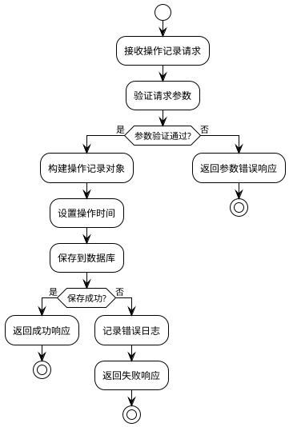

# 拨测控制中心-操作记录模块-软件实现设计文档

## 1 需求重述

### 1.1 需求背景
拨测控制中心需要记录用户的所有操作行为，以便进行审计、问题追踪和系统监控。操作记录模块需要支持中英文双语环境，确保在不同语言环境下都能正确记录和展示操作信息。

### 1.2 需求功能介绍
操作记录模块主要功能包括：
- 记录用户操作日志（创建、更新、删除、查看等）
- 支持多条件查询和分页展示
- 提供操作统计信息
- 支持操作记录导出
- 多语言环境支持（中文/英文操作描述）

## 2 功能实现分析

### 2.1 功能点清单
1. 操作记录创建和存储
2. 操作记录查询和分页
3. 操作记录详情查看
4. 操作记录统计信息
5. 操作记录导出功能

### 2.2 功能点1：操作记录创建和存储

#### 详细描述

**数据库表设计：**

```sql
-- 操作记录表
CREATE TABLE operation_logs (
    id BIGSERIAL PRIMARY KEY,                                    -- 主键ID，自增长
    username VARCHAR(50) NOT NULL,                              -- 用户名，冗余存储便于查询
    operation_type VARCHAR(20) NOT NULL,                        -- 操作类型，如CREATE、UPDATE、DELETE等
    operation_target VARCHAR(50) NOT NULL,                     -- 操作目标，如USER、TEST_CASE_SET等
    operation_description_zh TEXT,                              -- 中文操作描述
    operation_description_en TEXT,                              -- 英文操作描述
    operation_data JSONB,                                       -- 操作数据，存储操作相关的JSON数据
    operation_time TIMESTAMP NOT NULL DEFAULT CURRENT_TIMESTAMP -- 操作时间，精确到秒
);

-- 添加检查约束：确保至少有一个描述字段不为空
ALTER TABLE operation_logs 
ADD CONSTRAINT chk_description_not_empty 
CHECK (
    operation_description_zh IS NOT NULL OR operation_description_en IS NOT NULL
);
```

**算法流程图：**



**函数伪代码：**

```java
/**
 * 创建操作记录
 * @param request 操作记录请求
 * @return 操作记录对象
 */
public OperationLog createOperationLog(OperationLogCreateRequest request) {
    // 1. 参数验证
    validateRequest(request);
    
    // 2. 构建操作记录对象
    OperationLog operationLog = new OperationLog();
    operationLog.setUsername(request.getUsername());
    operationLog.setOperationType(request.getOperationType());
    operationLog.setOperationTarget(request.getOperationTarget());
    operationLog.setOperationDescriptionZh(request.getOperationDescriptionZh());
    operationLog.setOperationDescriptionEn(request.getOperationDescriptionEn());
    operationLog.setOperationData(request.getOperationData());
    // operation_time由数据库默认值自动设置
    
    // 3. 保存到数据库
    OperationLog savedLog = operationLogRepository.save(operationLog);
    
    // 4. 记录日志
    logger.info("Operation log created: {} - {} {}", 
                request.getUsername(), 
                request.getOperationType(), 
                request.getOperationTarget());
    
    return savedLog;
}
```

### 2.3 功能点2：操作记录查询和分页

#### 详细描述

**数据库查询设计：**

```sql
-- 分页查询操作记录
SELECT 
    ol.id,
    ol.username,
    ol.operation_type,
    ol.operation_target,
    ol.operation_description_zh,
    ol.operation_description_en,
    ol.operation_data,
    ol.operation_time
FROM operation_logs ol
WHERE 1=1
    AND (? IS NULL OR ol.username = ?)
    AND (? IS NULL OR ol.operation_type = ?)
    AND (? IS NULL OR ol.operation_target = ?)
    AND (? IS NULL OR ol.operation_time >= ?)
    AND (? IS NULL OR ol.operation_time <= ?)
ORDER BY ol.operation_time DESC
LIMIT ? OFFSET ?;
```

**函数伪代码：**

```java
/**
 * 分页查询操作记录
 * @param params 查询参数
 * @return 分页响应
 */
public OperationLogPageResponse getOperationLogs(OperationLogQueryParams params) {
    // 1. 构建查询条件
    Specification<OperationLog> spec = buildQuerySpecification(params);
    
    // 2. 执行分页查询
    Pageable pageable = PageRequest.of(params.getPage(), params.getSize());
    Page<OperationLog> page = operationLogRepository.findAll(spec, pageable);
    
    // 3. 构建分页响应
    OperationLogPageResponse response = new OperationLogPageResponse();
    response.setContent(page.getContent());
    response.setTotalElements(page.getTotalElements());
    response.setTotalPages(page.getTotalPages());
    response.setSize(page.getSize());
    response.setNumber(page.getNumber());
    response.setFirst(page.isFirst());
    response.setLast(page.isLast());
    
    return response;
}
```

### 2.4 功能点3：操作记录统计信息

#### 详细描述

**统计查询设计：**

```sql
-- 获取操作记录统计信息
SELECT 
    COUNT(*) as totalOperations,
    COUNT(DISTINCT username) as uniqueUsers,
    COUNT(DISTINCT operation_type) as uniqueOperationTypes,
    COUNT(DISTINCT operation_target) as uniqueOperationTargets
FROM operation_logs
WHERE (? IS NULL OR operation_time >= ?)
    AND (? IS NULL OR operation_time <= ?);
```

**函数伪代码：**

```java
/**
 * 获取操作记录统计信息
 * @param params 统计查询参数
 * @return 统计信息
 */
public OperationLogStatistics getOperationLogStatistics(StatisticsQueryParams params) {
    // 1. 执行统计查询
    OperationLogStatistics statistics = operationLogRepository.getStatistics(
        params.getStartTime(), 
        params.getEndTime()
    );
    
    return statistics;
}
```

## 3 AR开发者测试设计

### 3.1 测试用例设计原则
- 覆盖所有功能点的正常场景和异常场景
- 测试多语言环境下的功能正确性
- 验证数据库操作的完整性和一致性
- 测试分页查询的边界条件
- 验证导出功能的正确性

### 3.2 测试用例列表

#### 3.2.1 操作记录创建测试用例

| 用例ID | 测试场景 | 输入数据 | 预期结果 | 测试方法 |
|--------|----------|----------|----------|----------|
| TC001 | 正常创建操作记录 | 有效请求参数 | 创建成功，返回操作记录 | testCreateOperationLog_Success |
| TC002 | 缺少必填参数 | 缺少username | 返回400错误 | testCreateOperationLog_MissingUsername |
| TC003 | 缺少操作描述 | 缺少operationDescriptionZh和operationDescriptionEn | 返回400错误 | testCreateOperationLog_MissingDescription |
| TC004 | 数据库连接异常 | 正常参数，数据库异常 | 返回500错误 | testCreateOperationLog_DatabaseError |

#### 3.2.2 操作记录查询测试用例

| 用例ID | 测试场景 | 输入数据 | 预期结果 | 测试方法 |
|--------|----------|----------|----------|----------|
| TC007 | 正常分页查询 | page=0, size=20 | 返回分页数据 | testGetOperationLogs_Success |
| TC008 | 按用户名筛选 | username="admin" | 返回该用户的操作记录 | testGetOperationLogs_ByUsername |
| TC009 | 按操作类型筛选 | operationType="CREATE" | 返回创建类型的操作记录 | testGetOperationLogs_ByOperationType |
| TC010 | 按操作目标筛选 | operationTarget="USER" | 返回用户相关的操作记录 | testGetOperationLogs_ByOperationTarget |
| TC011 | 按时间范围筛选 | startTime, endTime | 返回时间范围内的操作记录 | testGetOperationLogs_ByTimeRange |
| TC012 | 空结果查询 | 不存在的筛选条件 | 返回空列表 | testGetOperationLogs_EmptyResult |
| TC013 | 分页边界测试 | page=0, size=0 | 返回400错误 | testGetOperationLogs_InvalidPageSize |
| TC014 | 分页边界测试 | page=-1, size=20 | 返回400错误 | testGetOperationLogs_InvalidPageNumber |

### 3.3 测试数据准备

#### 3.3.1 基础测试数据
```sql
-- 插入测试操作记录
INSERT INTO operation_logs (username, operation_type, operation_target, operation_description_zh, operation_description_en, operation_data, operation_time) VALUES
('admin', 'CREATE', 'USER', '创建用户: testuser1', 'Create user: testuser1', '{"username": "testuser1"}'::jsonb, '2024-01-15 10:00:00'),
('admin', 'UPDATE', 'USER', '更新用户: testuser1', 'Update user: testuser1', '{"username": "testuser1"}'::jsonb, '2024-01-15 11:00:00'),
('testuser1', 'VIEW', 'TEST_CASE_SET', '查看测试用例集', 'View test case set', '{}'::jsonb, '2024-01-15 12:00:00');
```

### 3.4 测试环境要求
- Java 8+
- Spring Boot 2.x
- PostgreSQL 12+
- JUnit 4
- Mockito
- TestContainers（用于集成测试）

### 3.5 测试覆盖率要求
- 代码覆盖率：≥90%
- 分支覆盖率：≥85%
- 方法覆盖率：100%
- 类覆盖率：100%

### 3.6 性能测试要求
- 单次查询响应时间：<200ms
- 分页查询响应时间：<500ms
- 统计查询响应时间：<1s
- 导出功能响应时间：<5s（1000条记录）
- 并发查询支持：100个并发用户