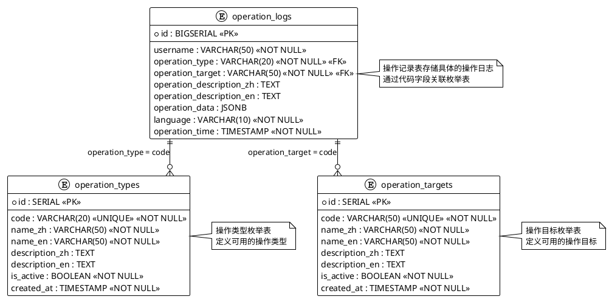

# 操作记录模块设计方案

## 1. 需求分析

### 1.1 业务需求
- 记录用户在系统中的所有操作行为
- 支持中英文页面的操作记录
- 提供操作记录的查询、统计、导出功能
- 支持按用户、操作类型、时间范围等条件筛选
- 记录操作时的语言环境信息

### 1.2 技术需求
- 前后端分离架构
- 支持国际化（i18n）
- 数据库持久化存储
- RESTful API设计
- 实时操作记录

## 2. 数据库设计

### 2.1 操作记录表（operation_logs）

```sql
-- 操作记录表
CREATE TABLE operation_logs (
    id BIGSERIAL PRIMARY KEY,                                    -- 主键ID，自增长
    username VARCHAR(50) NOT NULL,                              -- 用户名，冗余存储便于查询
    operation_type VARCHAR(20) NOT NULL,                        -- 操作类型，如CREATE、UPDATE、DELETE等
    operation_target VARCHAR(50) NOT NULL,                     -- 操作目标，如USER、TEST_CASE_SET等
    operation_description TEXT,                                 -- 操作描述，详细说明操作内容
    operation_data JSONB,                                       -- 操作数据，存储操作相关的JSON数据
    language VARCHAR(10) NOT NULL DEFAULT 'zh',                -- 操作时的语言环境，zh/en
    operation_time TIMESTAMP NOT NULL DEFAULT CURRENT_TIMESTAMP -- 操作时间，精确到秒
);

-- 创建索引
CREATE INDEX idx_operation_logs_username ON operation_logs(username);                 -- 用户名索引，用于按用户名查询
CREATE INDEX idx_operation_logs_operation_type ON operation_logs(operation_type);     -- 操作类型索引，用于按操作类型查询
CREATE INDEX idx_operation_logs_operation_target ON operation_logs(operation_target); -- 操作目标索引，用于按操作目标查询
CREATE INDEX idx_operation_logs_language ON operation_logs(language);                 -- 语言索引，用于按语言环境查询
CREATE INDEX idx_operation_logs_operation_time ON operation_logs(operation_time);    -- 操作时间索引，用于按时间范围查询

-- 复合索引
CREATE INDEX idx_operation_logs_username_time ON operation_logs(username, operation_time);    -- 用户名+时间复合索引，用于用户操作历史查询
CREATE INDEX idx_operation_logs_type_time ON operation_logs(operation_type, operation_time); -- 操作类型+时间复合索引，用于操作类型统计查询
```

### 2.2 表关联关系分析

#### 2.2.1 关联关系说明

操作记录表（operation_logs）与操作类型枚举表（operation_types）、操作目标枚举表（operation_targets）之间存在**逻辑外键关联关系**：

1. **operation_logs.operation_type** → **operation_types.code**
   - 操作记录表中的操作类型字段引用操作类型枚举表的代码
   - 用于确保操作类型的规范性和一致性

2. **operation_logs.operation_target** → **operation_targets.code**
   - 操作记录表中的操作目标字段引用操作目标枚举表的代码
   - 用于确保操作目标的规范性和一致性

#### 2.2.2 关联关系图



#### 2.2.3 关联关系优势

1. **数据一致性**：通过枚举表确保操作记录中的类型和目标值都是有效的
2. **多语言支持**：枚举表提供中英文名称，支持国际化显示
3. **扩展性**：可以动态添加新的操作类型和目标，无需修改代码
4. **维护性**：统一的枚举管理，便于维护和更新
5. **查询优化**：通过关联查询可以获取更丰富的信息

#### 2.2.4 ID字段必要性分析

**关于枚举表是否需要ID字段的讨论：**

**保留ID字段的理由：**
1. **数据库设计规范**：每个表都应该有主键，ID字段作为主键符合数据库设计规范
2. **ORM框架支持**：大多数ORM框架（如JPA/Hibernate）需要主键字段
3. **性能考虑**：整数ID字段在JOIN操作时性能更好
4. **存储效率**：整数ID比字符串CODE占用更少存储空间
5. **索引效率**：整数索引比字符串索引更高效

**使用CODE字段关联的优势：**
1. **业务语义清晰**：CODE字段直接表达业务含义，如"CREATE"、"UPDATE"
2. **可读性强**：查询结果中直接显示业务代码，无需额外JOIN
3. **维护简单**：不需要维护ID与CODE的映射关系

**推荐方案：保留ID字段，但使用CODE字段关联**

```sql
-- 优化后的枚举表设计
CREATE TABLE operation_types (
    id SERIAL PRIMARY KEY,                                       -- 保留ID作为主键
    code VARCHAR(20) NOT NULL UNIQUE,                           -- CODE作为业务键
    name_zh VARCHAR(50) NOT NULL,                                -- 中文名称
    name_en VARCHAR(50) NOT NULL,                               -- 英文名称
    description_zh TEXT,                                         -- 中文描述
    description_en TEXT,                                         -- 英文描述
    is_active BOOLEAN NOT NULL DEFAULT TRUE,                     -- 是否启用
    created_at TIMESTAMP NOT NULL DEFAULT CURRENT_TIMESTAMP     -- 创建时间
);

-- 操作记录表使用CODE字段关联
CREATE TABLE operation_logs (
    id BIGSERIAL PRIMARY KEY,
    username VARCHAR(50) NOT NULL,
    operation_type VARCHAR(20) NOT NULL,                        -- 关联operation_types.code
    operation_target VARCHAR(50) NOT NULL,                     -- 关联operation_targets.code
    operation_description_zh TEXT,                              -- 中文操作描述
    operation_description_en TEXT,                              -- 英文操作描述
    operation_data JSONB,
    language VARCHAR(10) NOT NULL DEFAULT 'zh',                -- 操作时的语言环境
    operation_time TIMESTAMP NOT NULL DEFAULT CURRENT_TIMESTAMP
);
```

**两种设计方案对比：**

| 方案 | 优点 | 缺点 | 适用场景 |
|------|------|------|----------|
| **方案1：使用ID关联** | • 性能最优<br>• 存储空间小<br>• 索引效率高<br>• ORM支持好 | • 业务语义不清晰<br>• 需要额外JOIN获取名称<br>• 维护复杂 | 高性能要求、大数据量场景 |
| **方案2：使用CODE关联** | • 业务语义清晰<br>• 可读性强<br>• 维护简单<br>• 无需额外JOIN | • 性能略低<br>• 存储空间大<br>• 字符串索引效率低 | 业务优先、可读性要求高 |
| **方案3：混合使用** | • 兼顾性能和可读性<br>• 灵活性高<br>• 支持多种查询方式 | • 设计复杂<br>• 维护成本高 | 复杂业务场景 |

**最终建议：**

对于操作记录模块，**推荐使用方案2（CODE字段关联）**，原因如下：

1. **业务优先**：操作记录模块更注重业务语义和可读性
2. **数据量适中**：操作记录虽然会增长，但不会达到需要极致性能优化的级别
3. **维护简单**：CODE字段关联维护成本低，开发效率高
4. **国际化支持**：CODE字段配合枚举表的中英文名称，完美支持多语言
5. **扩展性好**：可以动态添加新的操作类型和目标

**关联查询优化：**
```sql
-- 使用CODE字段关联查询（推荐）
SELECT 
    ol.id,
    ol.username,
    ol.operation_description,
    ot.name_zh as operation_type_name,
    otg.name_zh as operation_target_name,
    ol.language,
    ol.operation_time
FROM operation_logs ol
LEFT JOIN operation_types ot ON ol.operation_type = ot.code
LEFT JOIN operation_targets otg ON ol.operation_target = otg.code
WHERE ol.language = 'zh'
ORDER BY ol.operation_time DESC;

-- 如果需要高性能查询，可以使用ID关联
SELECT 
    ol.id,
    ol.username,
    ol.operation_description,
    ot.name_zh as operation_type_name,
    otg.name_zh as operation_target_name,
    ol.language,
    ol.operation_time
FROM operation_logs ol
LEFT JOIN operation_types ot ON ol.operation_type_id = ot.id
LEFT JOIN operation_targets otg ON ol.operation_target_id = otg.id
WHERE ol.language = 'zh'
ORDER BY ol.operation_time DESC;
```

#### 2.2.5 物理外键约束说明

**建议不添加物理外键约束**，原因如下：

1. **性能考虑**：操作记录表数据量大，物理外键会影响插入性能
2. **灵活性**：允许在枚举表更新前插入操作记录，避免外键约束冲突
3. **维护性**：删除枚举表记录时不会影响历史操作记录
4. **扩展性**：支持动态添加新的操作类型和目标

**替代方案**：
- 使用应用层验证确保数据一致性
- 通过数据库触发器或存储过程进行数据验证
- 定期数据清理脚本检查数据完整性

#### 2.2.6 关联查询示例

```sql
-- 查询操作记录及其类型和目标的中文名称
SELECT 
    ol.id,
    ol.username,
    ol.operation_description,
    ot.name_zh as operation_type_name,
    otg.name_zh as operation_target_name,
    ol.language,
    ol.operation_time
FROM operation_logs ol
LEFT JOIN operation_types ot ON ol.operation_type = ot.code
LEFT JOIN operation_targets otg ON ol.operation_target = otg.code
WHERE ol.language = 'zh'
ORDER BY ol.operation_time DESC;

-- 统计各操作类型的数量（带中文名称）
SELECT 
    ol.operation_type,
    ot.name_zh,
    COUNT(*) as count
FROM operation_logs ol
LEFT JOIN operation_types ot ON ol.operation_type = ot.code
GROUP BY ol.operation_type, ot.name_zh
ORDER BY count DESC;

-- 统计各操作目标的数量（带中文名称）
SELECT 
    ol.operation_target,
    otg.name_zh,
    COUNT(*) as count
FROM operation_logs ol
LEFT JOIN operation_targets otg ON ol.operation_target = otg.code
GROUP BY ol.operation_target, otg.name_zh
ORDER BY count DESC;

-- 检查数据完整性（查找无效的操作类型）
SELECT DISTINCT ol.operation_type
FROM operation_logs ol
LEFT JOIN operation_types ot ON ol.operation_type = ot.code
WHERE ot.code IS NULL;

-- 检查数据完整性（查找无效的操作目标）
SELECT DISTINCT ol.operation_target
FROM operation_logs ol
LEFT JOIN operation_targets otg ON ol.operation_target = otg.code
WHERE otg.code IS NULL;
```

#### 2.2.7 多语言场景分析

**使用场景：在中文场景下新增了两个拨测用户，切换到英文展示场景，操作记录能否正确呈现**

**场景分析：**

1. **操作记录存储**：
   - 用户在中文界面下新增两个用户
   - 操作记录会以 `language = 'zh'` 存储
   - `operation_description_zh` 字段存储中文描述，如："创建用户: user1"
   - `operation_description_en` 字段存储英文描述，如："Create user: user1"

2. **切换到英文界面**：
   - 用户切换到英文界面查看操作记录
   - 前端会根据当前语言环境查询对应的操作描述字段

**解决方案：**

**方案1：按语言环境查询（推荐）**
```sql
-- 查询英文界面的操作记录（显示英文名称和描述）
SELECT 
    ol.id,
    ol.username,
    ol.operation_description_en as operation_description,  -- 使用英文描述
    ot.name_en as operation_type_name,  -- 使用英文名称
    otg.name_en as operation_target_name,  -- 使用英文名称
    ol.language,
    ol.operation_time
FROM operation_logs ol
LEFT JOIN operation_types ot ON ol.operation_type = ot.code
LEFT JOIN operation_targets otg ON ol.operation_target = otg.code
WHERE ol.language = 'zh'  -- 查询中文操作记录
ORDER BY ol.operation_time DESC;

-- 查询中文界面的操作记录（显示中文名称和描述）
SELECT 
    ol.id,
    ol.username,
    ol.operation_description_zh as operation_description,  -- 使用中文描述
    ot.name_zh as operation_type_name,  -- 使用中文名称
    otg.name_zh as operation_target_name,  -- 使用中文名称
    ol.language,
    ol.operation_time
FROM operation_logs ol
LEFT JOIN operation_types ot ON ol.operation_type = ot.code
LEFT JOIN operation_targets otg ON ol.operation_target = otg.code
WHERE ol.language = 'zh'  -- 查询中文操作记录
ORDER BY ol.operation_time DESC;
```

**方案2：动态语言显示**
```sql
-- 根据当前语言环境动态显示名称和描述
SELECT 
    ol.id,
    ol.username,
    CASE 
        WHEN 'en' = 'en' THEN ol.operation_description_en 
        ELSE ol.operation_description_zh 
    END as operation_description,
    CASE 
        WHEN 'en' = 'en' THEN ot.name_en 
        ELSE ot.name_zh 
    END as operation_type_name,
    CASE 
        WHEN 'en' = 'en' THEN otg.name_en 
        ELSE otg.name_zh 
    END as operation_target_name,
    ol.language,
    ol.operation_time
FROM operation_logs ol
LEFT JOIN operation_types ot ON ol.operation_type = ot.code
LEFT JOIN operation_targets otg ON ol.operation_target = otg.code
ORDER BY ol.operation_time DESC;
```

**方案3：前端处理（最佳方案）**
```typescript
// 前端根据当前语言环境处理显示
const getOperationDescription = (record: OperationLog, currentLanguage: string) => {
  return currentLanguage === 'en' 
    ? record.operationDescriptionEn 
    : record.operationDescriptionZh
}

const getOperationTypeName = (operationType: string, currentLanguage: string) => {
  const typeMap = {
    'CREATE': currentLanguage === 'en' ? 'Create' : '创建',
    'UPDATE': currentLanguage === 'en' ? 'Update' : '更新',
    'DELETE': currentLanguage === 'en' ? 'Delete' : '删除'
  }
  return typeMap[operationType] || operationType
}

const getOperationTargetName = (operationTarget: string, currentLanguage: string) => {
  const targetMap = {
    'USER': currentLanguage === 'en' ? 'User Management' : '用户管理',
    'TEST_CASE_SET': currentLanguage === 'en' ? 'Test Case Set' : '测试用例集'
  }
  return targetMap[operationTarget] || operationTarget
}
```

**实际效果：**

| 操作记录 | 中文界面显示 | 英文界面显示 |
|----------|-------------|-------------|
| 操作类型 | 创建 | Create |
| 操作目标 | 用户管理 | User Management |
| 操作描述 | 创建用户: user1 | Create user: user1 |
| 语言标识 | zh | zh |

**关键点：**

1. **操作描述分别存储**：`operation_description_zh` 和 `operation_description_en` 字段分别存储中英文描述
2. **枚举名称动态显示**：通过关联查询获取对应语言环境下的名称
3. **语言标识不变**：`language` 字段记录的是操作时的语言环境，不会改变
4. **数据完整性**：所有操作记录都能正确显示，支持完整的多语言体验
5. **存储冗余**：虽然增加了存储空间，但提供了更好的用户体验

**结论：**
✅ **操作记录能够完美呈现**，系统会根据当前界面语言环境动态显示对应的操作类型、目标名称和操作描述，提供完整的多语言用户体验。

**具体数据示例：**

```sql
-- 1. 在中文界面下新增两个用户的操作记录
INSERT INTO operation_logs (
    username, operation_type, operation_target, 
    operation_description_zh, operation_description_en, operation_data, 
    language, operation_time
) VALUES 
(
    'admin', 'CREATE', 'USER', 
    '创建用户: user1', 
    'Create user: user1',
    '{"username": "user1", "role": "USER"}', 
    'zh', '2024-01-15 14:30:25'
),
(
    'admin', 'CREATE', 'USER', 
    '创建用户: user2', 
    'Create user: user2',
    '{"username": "user2", "role": "USER"}', 
    'zh', '2024-01-15 14:31:10'
);

-- 2. 切换到英文界面后的查询结果
-- 查询所有操作记录，显示英文名称和描述
SELECT 
    ol.id,
    ol.username,
    ol.operation_description_en as operation_description,
    ot.name_en as operation_type_name,
    otg.name_en as operation_target_name,
    ol.language,
    ol.operation_time
FROM operation_logs ol
LEFT JOIN operation_types ot ON ol.operation_type = ot.code
LEFT JOIN operation_targets otg ON ol.operation_target = otg.code
ORDER BY ol.operation_time DESC;
```

**查询结果对比：**

| 字段 | 中文界面显示 | 英文界面显示 |
|------|-------------|-------------|
| operation_type_name | 创建 | Create |
| operation_target_name | 用户管理 | User Management |
| operation_description | 创建用户: user1 | Create user: user1 |
| language | zh | zh |

**前端实现示例：**

```typescript
// React组件中的多语言处理
const OperationLogTable: React.FC = () => {
  const { language } = useI18nContext()
  
  const columns = [
    {
      title: language === 'en' ? 'Operation Type' : '操作类型',
      dataIndex: 'operationType',
      render: (type: string) => {
        const typeName = language === 'en' 
          ? getOperationTypeName(type, 'en')
          : getOperationTypeName(type, 'zh')
        return <Tag color="blue">{typeName}</Tag>
      }
    },
    {
      title: language === 'en' ? 'Target' : '操作目标',
      dataIndex: 'operationTarget',
      render: (target: string) => {
        const targetName = language === 'en'
          ? getOperationTargetName(target, 'en')
          : getOperationTargetName(target, 'zh')
        return <Tag color="green">{targetName}</Tag>
      }
    },
    {
      title: language === 'en' ? 'Description' : '操作描述',
      dataIndex: 'operationDescription',
      render: (record: OperationLog) => {
        const description = language === 'en'
          ? record.operationDescriptionEn
          : record.operationDescriptionZh
        return description
      }
    }
  ]
  
  return <Table columns={columns} dataSource={operationLogs} />
}
```

#### 2.2.8 Language字段必要性分析

**问题：在支持中英文分别存储操作描述的情况下，`language` 字段是否还有必要？**

**分析结果：建议保留 `language` 字段**

**保留 `language` 字段的理由：**

1. **操作上下文记录**：
   - 记录操作发生时的实际语言环境
   - 提供操作历史的完整上下文信息
   - 便于审计和问题追溯

2. **业务逻辑支持**：
   - 某些业务规则可能需要根据操作时的语言环境进行判断
   - 支持按语言环境进行数据统计和分析
   - 便于生成多语言报告

3. **数据完整性**：
   - 即使有中英文描述字段，`language` 字段仍然提供额外的元数据信息
   - 有助于数据验证和一致性检查

4. **查询优化**：
   - 可以基于 `language` 字段进行索引优化
   - 支持按语言环境快速筛选操作记录

5. **扩展性考虑**：
   - 未来可能需要支持更多语言
   - 便于添加语言相关的业务逻辑

**使用场景示例：**

```sql
-- 场景1：按语言环境统计操作数量
SELECT 
    language,
    COUNT(*) as operation_count
FROM operation_logs
GROUP BY language;

-- 场景2：查询特定语言环境下的操作记录
SELECT * FROM operation_logs 
WHERE language = 'zh' 
ORDER BY operation_time DESC;

-- 场景3：跨语言环境的数据分析
SELECT 
    language,
    operation_type,
    COUNT(*) as count
FROM operation_logs
GROUP BY language, operation_type
ORDER BY language, count DESC;

-- 场景4：验证数据一致性
SELECT * FROM operation_logs 
WHERE language = 'zh' 
  AND operation_description_zh IS NULL;
```

**优化建议：**

1. **索引优化**：
```sql
-- 为language字段创建索引
CREATE INDEX idx_operation_logs_language ON operation_logs(language);

-- 创建复合索引
CREATE INDEX idx_operation_logs_language_time ON operation_logs(language, operation_time);
```

2. **数据验证**：
```sql
-- 添加检查约束，确保数据一致性
ALTER TABLE operation_logs 
ADD CONSTRAINT chk_language_description 
CHECK (
    (language = 'zh' AND operation_description_zh IS NOT NULL) OR
    (language = 'en' AND operation_description_en IS NOT NULL) OR
    (operation_description_zh IS NOT NULL AND operation_description_en IS NOT NULL)
);
```

**最终建议：**

✅ **保留 `language` 字段**，原因如下：

1. **元数据价值**：提供操作发生时的语言环境信息
2. **业务支持**：支持按语言环境进行统计和分析
3. **数据完整性**：保持操作记录的完整上下文
4. **查询优化**：支持高效的按语言筛选
5. **扩展性**：为未来功能扩展预留空间

**优化后的表结构：**
```sql
CREATE TABLE operation_logs (
    id BIGSERIAL PRIMARY KEY,
    username VARCHAR(50) NOT NULL,
    operation_type VARCHAR(20) NOT NULL,
    operation_target VARCHAR(50) NOT NULL,
    operation_description_zh TEXT,                              -- 中文操作描述
    operation_description_en TEXT,                              -- 英文操作描述
    operation_data JSONB,
    language VARCHAR(10) NOT NULL DEFAULT 'zh',                -- 操作时的语言环境（保留）
    operation_time TIMESTAMP NOT NULL DEFAULT CURRENT_TIMESTAMP
);
```

### 2.3 字段用途说明

#### 2.3.1 操作记录表字段详细说明

| 字段名 | 数据类型 | 用途说明 | 示例值 |
|--------|----------|----------|--------|
| `id` | BIGSERIAL | 主键ID，唯一标识每条操作记录 | 1, 2, 3... |
| `username` | VARCHAR(50) | 操作用户名，冗余存储便于查询和显示 | "admin", "testuser" |
| `operation_type` | VARCHAR(20) | 操作类型代码，标识操作行为 | "CREATE", "UPDATE", "DELETE" |
| `operation_target` | VARCHAR(50) | 操作目标代码，标识操作对象 | "USER", "TEST_CASE_SET" |
| `operation_description_zh` | TEXT | 中文操作描述，详细说明操作内容 | "创建用户: admin" |
| `operation_description_en` | TEXT | 英文操作描述，详细说明操作内容 | "Create user: admin" |
| `operation_data` | JSONB | 操作相关数据，存储操作前后的数据变化 | {"old": {}, "new": {"username": "admin"}} |
| `language` | VARCHAR(10) | 操作时的语言环境，支持多语言审计和统计分析 | "zh", "en" |
| `operation_time` | TIMESTAMP | 操作发生时间，精确到秒 | "2024-01-15 14:30:25" |

#### 2.3.2 操作类型枚举表字段说明

| 字段名 | 数据类型 | 用途说明 | 示例值 |
|--------|----------|----------|--------|
| `id` | SERIAL | 主键ID，唯一标识操作类型 | 1, 2, 3... |
| `code` | VARCHAR(20) | 操作类型代码，用于业务逻辑 | "CREATE", "UPDATE" |
| `name_zh` | VARCHAR(50) | 中文名称，用于中文界面显示 | "创建", "更新" |
| `name_en` | VARCHAR(50) | 英文名称，用于英文界面显示 | "Create", "Update" |
| `description_zh` | TEXT | 中文描述，详细说明操作类型 | "创建新记录" |
| `description_en` | TEXT | 英文描述，详细说明操作类型 | "Create new record" |
| `is_active` | BOOLEAN | 是否启用，用于控制操作类型可用性 | true, false |
| `created_at` | TIMESTAMP | 创建时间，用于数据管理 | "2024-01-15 14:30:25" |

#### 2.3.3 操作目标枚举表字段说明

| 字段名 | 数据类型 | 用途说明 | 示例值 |
|--------|----------|----------|--------|
| `id` | SERIAL | 主键ID，唯一标识操作目标 | 1, 2, 3... |
| `code` | VARCHAR(50) | 操作目标代码，用于业务逻辑 | "USER", "TEST_CASE_SET" |
| `name_zh` | VARCHAR(50) | 中文名称，用于中文界面显示 | "用户管理", "测试用例集" |
| `name_en` | VARCHAR(50) | 英文名称，用于英文界面显示 | "User Management", "Test Case Set" |
| `description_zh` | TEXT | 中文描述，详细说明操作目标 | "用户相关操作" |
| `description_en` | TEXT | 英文描述，详细说明操作目标 | "User related operations" |
| `is_active` | BOOLEAN | 是否启用，用于控制操作目标可用性 | true, false |
| `created_at` | TIMESTAMP | 创建时间，用于数据管理 | "2024-01-15 14:30:25" |

#### 2.3.4 索引用途说明

| 索引名 | 索引字段 | 用途说明 | 查询场景 |
|--------|----------|----------|----------|
| `idx_operation_logs_username` | username | 按用户名查询操作记录 | 按用户名搜索操作记录 |
| `idx_operation_logs_operation_type` | operation_type | 按操作类型查询操作记录 | 查看特定类型的操作 |
| `idx_operation_logs_operation_target` | operation_target | 按操作目标查询操作记录 | 查看特定模块的操作 |
| `idx_operation_logs_language` | language | 按语言环境查询操作记录 | 查看中英文页面操作、语言环境统计 |
| `idx_operation_logs_language_time` | language, operation_time | 语言+时间复合查询 | 按语言环境的时间范围查询 |
| `idx_operation_logs_operation_time` | operation_time | 按时间范围查询操作记录 | 时间范围筛选 |
| `idx_operation_logs_username_time` | username, operation_time | 用户名+时间复合查询 | 用户操作历史分页查询 |
| `idx_operation_logs_type_time` | operation_type, operation_time | 操作类型+时间复合查询 | 操作类型统计查询 |

#### 2.3.5 字段设计原则

1. **冗余设计**：`username`字段冗余存储，避免频繁关联查询
2. **JSONB存储**：`operation_data`使用JSONB格式，支持灵活的数据结构
3. **多语言支持**：`operation_description_zh`和`operation_description_en`字段支持完整的多语言体验
4. **语言环境记录**：`language`字段记录操作时的语言环境，支持审计和统计分析
5. **时间精度**：使用TIMESTAMP类型，精确到秒级
6. **索引优化**：针对常用查询场景设计单列和复合索引
7. **扩展性**：枚举表设计支持动态添加操作类型和目标

### 2.4 操作类型枚举表（operation_types）

```sql
-- 操作类型枚举表
CREATE TABLE operation_types (
    id SERIAL PRIMARY KEY,                                       -- 主键ID，自增长
    code VARCHAR(20) NOT NULL UNIQUE,                           -- 操作类型代码，如CREATE、UPDATE等
    name_zh VARCHAR(50) NOT NULL,                                -- 中文名称
    name_en VARCHAR(50) NOT NULL,                               -- 英文名称
    description_zh TEXT,                                         -- 中文描述
    description_en TEXT,                                         -- 英文描述
    is_active BOOLEAN NOT NULL DEFAULT TRUE,                     -- 是否启用
    created_at TIMESTAMP NOT NULL DEFAULT CURRENT_TIMESTAMP     -- 创建时间
);

-- 插入基础操作类型
INSERT INTO operation_types (code, name_zh, name_en, description_zh, description_en) VALUES
('CREATE', '创建', 'Create', '创建新记录', 'Create new record'),
('UPDATE', '更新', 'Update', '更新现有记录', 'Update existing record'),
('DELETE', '删除', 'Delete', '删除记录', 'Delete record'),
('VIEW', '查看', 'View', '查看记录', 'View record'),
('LOGIN', '登录', 'Login', '用户登录', 'User login'),
('LOGOUT', '登出', 'Logout', '用户登出', 'User logout'),
('EXPORT', '导出', 'Export', '导出数据', 'Export data'),
('IMPORT', '导入', 'Import', '导入数据', 'Import data'),
('UPLOAD', '上传', 'Upload', '上传文件', 'Upload file'),
('DOWNLOAD', '下载', 'Download', '下载文件', 'Download file');
```

### 2.5 操作目标枚举表（operation_targets）

```sql
-- 操作目标枚举表
CREATE TABLE operation_targets (
    id SERIAL PRIMARY KEY,                                       -- 主键ID，自增长
    code VARCHAR(50) NOT NULL UNIQUE,                           -- 操作目标代码，如USER、TEST_CASE_SET等
    name_zh VARCHAR(50) NOT NULL,                                -- 中文名称
    name_en VARCHAR(50) NOT NULL,                               -- 英文名称
    description_zh TEXT,                                         -- 中文描述
    description_en TEXT,                                         -- 英文描述
    is_active BOOLEAN NOT NULL DEFAULT TRUE,                     -- 是否启用
    created_at TIMESTAMP NOT NULL DEFAULT CURRENT_TIMESTAMP     -- 创建时间
);

-- 插入基础操作目标
INSERT INTO operation_targets (code, name_zh, name_en, description_zh, description_en) VALUES
('USER', '用户管理', 'User Management', '用户相关操作', 'User related operations'),
('USER_ROLE', '角色管理', 'Role Management', '用户角色相关操作', 'User role related operations'),
('TEST_CASE_SET', '测试用例集', 'Test Case Set', '测试用例集相关操作', 'Test case set related operations'),
('SOFTWARE_PACKAGE', '软件包管理', 'Software Package Management', '软件包相关操作', 'Software package related operations'),
('OPERATION_LOG', '操作记录', 'Operation Log', '操作记录相关操作', 'Operation log related operations'),
('SYSTEM', '系统', 'System', '系统相关操作', 'System related operations');
```

### 2.6 数据示例

#### 2.6.1 操作记录数据示例

```sql
-- 插入示例操作记录
INSERT INTO operation_logs (
    username, operation_type, operation_target, 
    operation_description, operation_data, 
    language, operation_time
) VALUES 
(
    'admin', 'CREATE', 'USER', 
    '创建用户: testuser', 
    '{"username": "testuser", "role": "USER"}', 
    'zh', '2024-01-15 14:30:25'
),
(
    'admin', 'UPDATE', 'USER', 
    'Update user: testuser', 
    '{"old": {"role": "USER"}, "new": {"role": "ADMIN"}}', 
    'en', '2024-01-15 14:35:10'
),
(
    'testuser', 'LOGIN', 'SYSTEM', 
    '用户登录系统', 
    '{"loginTime": "2024-01-15 14:40:00"}', 
    'zh', '2024-01-15 14:40:00'
);
```

#### 2.6.2 查询示例

```sql
-- 查询特定用户的操作记录
SELECT ol.*, ot.name_zh as operation_type_name, otg.name_zh as target_name
FROM operation_logs ol
LEFT JOIN operation_types ot ON ol.operation_type = ot.code
LEFT JOIN operation_targets otg ON ol.operation_target = otg.code
WHERE ol.username = 'admin'
ORDER BY ol.operation_time DESC;

-- 查询中文页面的操作记录
SELECT ol.*, ot.name_zh as operation_type_name, otg.name_zh as target_name
FROM operation_logs ol
LEFT JOIN operation_types ot ON ol.operation_type = ot.code
LEFT JOIN operation_targets otg ON ol.operation_target = otg.code
WHERE ol.language = 'zh'
ORDER BY ol.operation_time DESC;

-- 查询特定时间范围的操作记录
SELECT ol.*, ot.name_zh as operation_type_name, otg.name_zh as target_name
FROM operation_logs ol
LEFT JOIN operation_types ot ON ol.operation_type = ot.code
LEFT JOIN operation_targets otg ON ol.operation_target = otg.code
WHERE ol.operation_time BETWEEN '2024-01-15 00:00:00' AND '2024-01-15 23:59:59'
ORDER BY ol.operation_time DESC;

-- 统计各语言的操作数量
SELECT language, COUNT(*) as operation_count
FROM operation_logs
GROUP BY language;

-- 统计各操作类型的数量
SELECT ol.operation_type, ot.name_zh, COUNT(*) as count
FROM operation_logs ol
LEFT JOIN operation_types ot ON ol.operation_type = ot.code
GROUP BY ol.operation_type, ot.name_zh
ORDER BY count DESC;
```

## 3. 后端API设计

### 3.1 操作记录控制器（OperationLogController）

```java
@RestController
@RequestMapping("/api/operation-logs")
public class OperationLogController {
    
    @Autowired
    private OperationLogService operationLogService;
    
    /**
     * 分页查询操作记录
     */
    @GetMapping
    public ResponseEntity<OperationLogPageResponse> getOperationLogs(
            @RequestParam(defaultValue = "0") int page,
            @RequestParam(defaultValue = "20") int size,
            @RequestParam(required = false) String username,
            @RequestParam(required = false) String operationType,
            @RequestParam(required = false) String target,
            @RequestParam(required = false) String language,
            @RequestParam(required = false) @DateTimeFormat(iso = DateTimeFormat.ISO.DATE_TIME) LocalDateTime startTime,
            @RequestParam(required = false) @DateTimeFormat(iso = DateTimeFormat.ISO.DATE_TIME) LocalDateTime endTime) {
        // 实现逻辑
    }
    
    /**
     * 根据ID查询操作记录
     */
    @GetMapping("/{id}")
    public ResponseEntity<OperationLogResponse> getOperationLogById(@PathVariable Long id) {
        // 实现逻辑
    }
    
    /**
     * 记录操作日志
     */
    @PostMapping
    public ResponseEntity<OperationLogResponse> logOperation(@RequestBody OperationLogCreateRequest request) {
        // 实现逻辑
    }
    
    /**
     * 获取操作统计信息
     */
    @GetMapping("/statistics")
    public ResponseEntity<OperationLogStatisticsResponse> getStatistics(
            @RequestParam(required = false) String language,
            @RequestParam(required = false) @DateTimeFormat(iso = DateTimeFormat.ISO.DATE_TIME) LocalDateTime startTime,
            @RequestParam(required = false) @DateTimeFormat(iso = DateTimeFormat.ISO.DATE_TIME) LocalDateTime endTime) {
        // 实现逻辑
    }
    
    /**
     * 导出操作记录
     */
    @GetMapping("/export")
    public ResponseEntity<byte[]> exportOperationLogs(
            @RequestParam(required = false) String username,
            @RequestParam(required = false) String operationType,
            @RequestParam(required = false) String target,
            @RequestParam(required = false) String language,
            @RequestParam(required = false) @DateTimeFormat(iso = DateTimeFormat.ISO.DATE_TIME) LocalDateTime startTime,
            @RequestParam(required = false) @DateTimeFormat(iso = DateTimeFormat.ISO.DATE_TIME) LocalDateTime endTime,
            @RequestParam(defaultValue = "excel") String format) {
        // 实现逻辑
    }
}
```

### 3.2 操作记录服务（OperationLogService）

```java
@Service
@Transactional
public class OperationLogService {
    
    @Autowired
    private OperationLogDao operationLogDao;
    
    @Autowired
    private OperationTypeDao operationTypeDao;
    
    @Autowired
    private OperationTargetDao operationTargetDao;
    
    /**
     * 记录操作日志
     */
    public OperationLog logOperation(OperationLogCreateRequest request) {
        // 验证操作类型和目标
        validateOperationType(request.getOperationType());
        validateOperationTarget(request.getOperationTarget());
        
        // 创建操作记录
        OperationLog operationLog = new OperationLog();
        operationLog.setUserId(request.getUserId());
        operationLog.setUsername(request.getUsername());
        operationLog.setOperationType(request.getOperationType());
        operationLog.setOperationTarget(request.getOperationTarget());
        operationLog.setOperationDescription(request.getDescription());
        operationLog.setOperationData(request.getOperationData());
        operationLog.setIpAddress(request.getIpAddress());
        operationLog.setUserAgent(request.getUserAgent());
        operationLog.setLanguage(request.getLanguage());
        operationLog.setSessionId(request.getSessionId());
        operationLog.setOperationTime(LocalDateTime.now());
        
        return operationLogDao.save(operationLog);
    }
    
    /**
     * 分页查询操作记录
     */
    @Transactional(readOnly = true)
    public Page<OperationLog> findOperationLogsWithPagination(OperationLogQueryParams params) {
        return operationLogDao.findOperationLogsWithPagination(params);
    }
    
    /**
     * 获取操作统计信息
     */
    @Transactional(readOnly = true)
    public OperationLogStatistics getStatistics(OperationLogStatisticsParams params) {
        return operationLogDao.getStatistics(params);
    }
    
    /**
     * 验证操作类型
     */
    private void validateOperationType(String operationType) {
        if (!operationTypeDao.existsByCode(operationType)) {
            throw new IllegalArgumentException("Invalid operation type: " + operationType);
        }
    }
    
    /**
     * 验证操作目标
     */
    private void validateOperationTarget(String operationTarget) {
        if (!operationTargetDao.existsByCode(operationTarget)) {
            throw new IllegalArgumentException("Invalid operation target: " + operationTarget);
        }
    }
}
```

### 3.3 操作记录实体（OperationLog）

```java
@Entity
@Table(name = "operation_logs")
public class OperationLog {
    
    @Id
    @GeneratedValue(strategy = GenerationType.IDENTITY)
    private Long id;
    
    @Column(name = "username", nullable = false, length = 50)
    private String username;
    
    @Column(name = "operation_type", nullable = false, length = 20)
    private String operationType;
    
    @Column(name = "operation_target", nullable = false, length = 50)
    private String operationTarget;
    
    @Column(name = "operation_description")
    private String operationDescription;
    
    @Column(name = "operation_data", columnDefinition = "jsonb")
    private String operationData;
    
    @Column(name = "language", nullable = false, length = 10)
    private String language = "zh";
    
    @Column(name = "operation_time", nullable = false)
    private LocalDateTime operationTime;
    
    // 构造函数、getter、setter等
}
```

## 4. 前端设计

### 4.1 操作记录管理组件（OperationLogManagement）

```typescript
import React, { useState, useEffect, useCallback } from 'react'
import {
  Card,
  Table,
  Button,
  Input,
  Select,
  DatePicker,
  Space,
  Row,
  Col,
  Tag,
  message,
  Tooltip,
  Typography,
  Statistic
} from 'antd'
import {
  ReloadOutlined,
  SearchOutlined,
  EyeOutlined,
  DownloadOutlined,
  BarChartOutlined
} from '@ant-design/icons'
import { useTranslation } from '../hooks/useTranslation'
import { OperationLogService } from '../services/operationLogService'
import { OperationLog, OperationLogQueryParams } from '../types/operationLog'
import moment, { Moment } from 'moment'

const { Option } = Select
const { RangePicker } = DatePicker
const { Title } = Typography

const OperationLogManagement: React.FC = () => {
  const { translateOperationLog, translateCommon } = useTranslation()
  const [operationLogs, setOperationLogs] = useState<OperationLog[]>([])
  const [loading, setLoading] = useState(false)
  const [pagination, setPagination] = useState({
    current: 1,
    pageSize: 20,
    total: 0,
  })
  const [filters, setFilters] = useState<OperationLogQueryParams>({})
  const [statistics, setStatistics] = useState<any>(null)

  // 加载操作记录
  const loadOperationLogs = useCallback(async (params: OperationLogQueryParams = {}) => {
    setLoading(true)
    try {
      const queryParams = {
        page: pagination.current - 1,
        size: pagination.pageSize,
        ...filters,
        ...params,
      }
      
      const response = await OperationLogService.getOperationLogs(queryParams)
      setOperationLogs(response.content)
      setPagination(prev => ({
        ...prev,
        total: response.totalElements,
      }))
    } catch (error) {
      console.error('Failed to load operation logs:', error)
      message.error(translateOperationLog('loadFailed'))
    } finally {
      setLoading(false)
    }
  }, [pagination.current, pagination.pageSize, filters])

  // 加载统计信息
  const loadStatistics = useCallback(async () => {
    try {
      const stats = await OperationLogService.getStatistics(filters)
      setStatistics(stats)
    } catch (error) {
      console.error('Failed to load statistics:', error)
    }
  }, [filters])

  // 初始化加载
  useEffect(() => {
    loadOperationLogs()
    loadStatistics()
  }, [loadOperationLogs, loadStatistics])

  // 处理搜索
  const handleSearch = () => {
    setPagination(prev => ({ ...prev, current: 1 }))
    loadOperationLogs()
  }

  // 处理重置
  const handleReset = () => {
    setFilters({})
    setPagination(prev => ({ ...prev, current: 1 }))
    loadOperationLogs()
  }

  // 处理表格变化
  const handleTableChange = (pagination: any) => {
    setPagination(prev => ({
      ...prev,
      current: pagination.current,
      pageSize: pagination.pageSize,
    }))
    loadOperationLogs()
  }

  // 处理导出
  const handleExport = async () => {
    try {
      const blob = await OperationLogService.exportOperationLogs(filters)
      const url = window.URL.createObjectURL(blob)
      const a = document.createElement('a')
      a.href = url
      a.download = `operation_logs_${moment().format('YYYY-MM-DD_HH-mm-ss')}.xlsx`
      document.body.appendChild(a)
      a.click()
      window.URL.revokeObjectURL(url)
      document.body.removeChild(a)
      message.success(translateOperationLog('exportSuccess'))
    } catch (error) {
      console.error('Failed to export operation logs:', error)
      message.error(translateOperationLog('exportFailed'))
    }
  }

  // 表格列定义
  const columns = [
    {
      title: translateOperationLog('table.id'),
      dataIndex: 'id',
      key: 'id',
      width: 80,
    },
    {
      title: translateOperationLog('table.username'),
      dataIndex: 'username',
      key: 'username',
      width: 120,
    },
    {
      title: translateOperationLog('table.operationTime'),
      dataIndex: 'operationTime',
      key: 'operationTime',
      width: 180,
      render: (time: string) => moment(time).format('YYYY-MM-DD HH:mm:ss'),
    },
    {
      title: translateOperationLog('table.operationType'),
      dataIndex: 'operationType',
      key: 'operationType',
      width: 120,
      render: (type: string) => (
        <Tag color="blue">
          {translateOperationLog(`operationTypes.${type}`)}
        </Tag>
      ),
    },
    {
      title: translateOperationLog('table.target'),
      dataIndex: 'operationTarget',
      key: 'operationTarget',
      width: 150,
      render: (target: string) => (
        <Tag color="green">
          {translateOperationLog(`targets.${target}`)}
        </Tag>
      ),
    },
    {
      title: translateOperationLog('table.description'),
      dataIndex: 'operationDescription',
      key: 'operationDescription',
      ellipsis: true,
    },
    {
      title: translateOperationLog('table.language'),
      dataIndex: 'language',
      key: 'language',
      width: 80,
      render: (language: string) => (
        <Tag color={language === 'zh' ? 'red' : 'blue'}>
          {language === 'zh' ? '中文' : 'English'}
        </Tag>
      ),
    },
    {
      title: translateOperationLog('table.actions'),
      key: 'actions',
      width: 100,
      render: (record: OperationLog) => (
        <Space>
          <Tooltip title={translateOperationLog('viewDetails')}>
            <Button
              type="text"
              icon={<EyeOutlined />}
              onClick={() => handleViewDetails(record)}
            />
          </Tooltip>
        </Space>
      ),
    },
  ]

  return (
    <div>
      <Card>
        <Title level={4}>{translateOperationLog('title')}</Title>
        <p>{translateOperationLog('description')}</p>
        
        {/* 统计信息 */}
        {statistics && (
          <Row gutter={16} style={{ marginBottom: 16 }}>
            <Col span={6}>
              <Statistic
                title={translateOperationLog('statistics.totalCount')}
                value={statistics.totalCount}
              />
            </Col>
            <Col span={6}>
              <Statistic
                title={translateOperationLog('statistics.todayCount')}
                value={statistics.todayCount}
              />
            </Col>
            <Col span={6}>
              <Statistic
                title={translateOperationLog('statistics.activeUsers')}
                value={statistics.activeUsers}
              />
            </Col>
            <Col span={6}>
              <Statistic
                title={translateOperationLog('statistics.operationTypes')}
                value={statistics.operationTypes}
              />
            </Col>
          </Row>
        )}
        
        {/* 筛选条件 */}
        <Card size="small" style={{ marginBottom: 16 }}>
          <Row gutter={16}>
            <Col span={6}>
              <Input
                placeholder={translateOperationLog('filters.usernamePlaceholder')}
                value={filters.username}
                onChange={(e) => setFilters(prev => ({ ...prev, username: e.target.value }))}
              />
            </Col>
            <Col span={6}>
              <Select
                placeholder={translateOperationLog('filters.operationTypePlaceholder')}
                value={filters.operationType}
                onChange={(value) => setFilters(prev => ({ ...prev, operationType: value }))}
                style={{ width: '100%' }}
              >
                <Option value="CREATE">{translateOperationLog('operationTypes.CREATE')}</Option>
                <Option value="UPDATE">{translateOperationLog('operationTypes.UPDATE')}</Option>
                <Option value="DELETE">{translateOperationLog('operationTypes.DELETE')}</Option>
                <Option value="LOGIN">{translateOperationLog('operationTypes.LOGIN')}</Option>
                <Option value="LOGOUT">{translateOperationLog('operationTypes.LOGOUT')}</Option>
                <Option value="VIEW">{translateOperationLog('operationTypes.VIEW')}</Option>
                <Option value="EXPORT">{translateOperationLog('operationTypes.EXPORT')}</Option>
                <Option value="IMPORT">{translateOperationLog('operationTypes.IMPORT')}</Option>
                <Option value="UPLOAD">{translateOperationLog('operationTypes.UPLOAD')}</Option>
                <Option value="DOWNLOAD">{translateOperationLog('operationTypes.DOWNLOAD')}</Option>
              </Select>
            </Col>
            <Col span={6}>
              <Select
                placeholder={translateOperationLog('filters.targetPlaceholder')}
                value={filters.target}
                onChange={(value) => setFilters(prev => ({ ...prev, target: value }))}
                style={{ width: '100%' }}
              >
                <Option value="USER">{translateOperationLog('targets.USER')}</Option>
                <Option value="USER_ROLE">{translateOperationLog('targets.USER_ROLE')}</Option>
                <Option value="TEST_CASE_SET">{translateOperationLog('targets.TEST_CASE_SET')}</Option>
                <Option value="SOFTWARE_PACKAGE">{translateOperationLog('targets.SOFTWARE_PACKAGE')}</Option>
                <Option value="OPERATION_LOG">{translateOperationLog('targets.OPERATION_LOG')}</Option>
                <Option value="SYSTEM">{translateOperationLog('targets.SYSTEM')}</Option>
              </Select>
            </Col>
            <Col span={6}>
              <Space>
                <Button type="primary" icon={<SearchOutlined />} onClick={handleSearch}>
                  {translateCommon('search')}
                </Button>
                <Button icon={<ReloadOutlined />} onClick={handleReset}>
                  {translateCommon('reset')}
                </Button>
                <Button icon={<DownloadOutlined />} onClick={handleExport}>
                  {translateOperationLog('export')}
                </Button>
              </Space>
            </Col>
          </Row>
        </Card>
        
        {/* 操作记录表格 */}
        <Table
          columns={columns}
          dataSource={operationLogs}
          loading={loading}
          pagination={{
            current: pagination.current,
            pageSize: pagination.pageSize,
            total: pagination.total,
            showSizeChanger: true,
            showQuickJumper: true,
            showTotal: (total, range) =>
              `${range[0]}-${range[1]} of ${total} items`,
          }}
          onChange={handleTableChange}
          scroll={{ x: 1200 }}
        />
      </Card>
    </div>
  )
}

export default OperationLogManagement
```

### 4.2 操作记录服务（OperationLogService）

```typescript
import { 
  OperationLog, 
  OperationLogPageResponse, 
  OperationLogQueryParams, 
  OperationLogCreateParams,
  OperationLogStatistics,
  ApiResponse 
} from '../types/operationLog'

const API_BASE_URL = '/dialingtest/api/operation-logs'

export class OperationLogService {
  /**
   * 获取操作记录列表（分页，支持多条件筛选）
   */
  static async getOperationLogs(params: OperationLogQueryParams = {}): Promise<OperationLogPageResponse> {
    const {
      page = 0,
      size = 20,
      username,
      operationType,
      target,
      language,
      startTime,
      endTime
    } = params
    
    const url = new URL(`${API_BASE_URL}`)
    
    // 添加查询参数
    url.searchParams.append('page', page.toString())
    url.searchParams.append('size', size.toString())
    
    if (username) {
      url.searchParams.append('username', username)
    }
    if (operationType) {
      url.searchParams.append('operationType', operationType)
    }
    if (target) {
      url.searchParams.append('target', target)
    }
    if (language) {
      url.searchParams.append('language', language)
    }
    if (startTime) {
      url.searchParams.append('startTime', startTime)
    }
    if (endTime) {
      url.searchParams.append('endTime', endTime)
    }
    
    try {
      const response = await fetch(url.toString())
      if (!response.ok) {
        throw new Error(`HTTP error! status: ${response.status}`)
      }
      
      const result: ApiResponse<OperationLogPageResponse> = await response.json()
      if (!result.success) {
        throw new Error(result.message || 'Failed to get operation logs')
      }
      
      return result.data
    } catch (error) {
      console.error('Error fetching operation logs:', error)
      throw error
    }
  }

  /**
   * 记录操作日志
   */
  static async logOperation(params: OperationLogCreateParams): Promise<OperationLog> {
    const url = `${API_BASE_URL}`
    
    try {
      const response = await fetch(url, {
        method: 'POST',
        headers: {
          'Content-Type': 'application/json',
        },
        body: JSON.stringify(params),
      })
      
      if (!response.ok) {
        throw new Error(`HTTP error! status: ${response.status}`)
      }
      
      const result: ApiResponse<OperationLog> = await response.json()
      if (!result.success) {
        throw new Error(result.message || 'Failed to log operation')
      }
      
      return result.data
    } catch (error) {
      console.error('Error logging operation:', error)
      throw error
    }
  }

  /**
   * 获取操作统计信息
   */
  static async getStatistics(params: any = {}): Promise<OperationLogStatistics> {
    const url = new URL(`${API_BASE_URL}/statistics`)
    
    // 添加查询参数
    Object.keys(params).forEach(key => {
      if (params[key]) {
        url.searchParams.append(key, params[key])
      }
    })
    
    try {
      const response = await fetch(url.toString())
      if (!response.ok) {
        throw new Error(`HTTP error! status: ${response.status}`)
      }
      
      const result: ApiResponse<OperationLogStatistics> = await response.json()
      if (!result.success) {
        throw new Error(result.message || 'Failed to get statistics')
      }
      
      return result.data
    } catch (error) {
      console.error('Error fetching statistics:', error)
      throw error
    }
  }

  /**
   * 导出操作记录
   */
  static async exportOperationLogs(params: any = {}): Promise<Blob> {
    const url = new URL(`${API_BASE_URL}/export`)
    
    // 添加查询参数
    Object.keys(params).forEach(key => {
      if (params[key]) {
        url.searchParams.append(key, params[key])
      }
    })
    
    try {
      const response = await fetch(url.toString())
      if (!response.ok) {
        throw new Error(`HTTP error! status: ${response.status}`)
      }
      
      return await response.blob()
    } catch (error) {
      console.error('Error exporting operation logs:', error)
      throw error
    }
  }
}
```

### 4.3 操作记录类型定义（operationLog.ts）

```typescript
/**
 * 操作记录相关类型定义
 */

/**
 * 操作记录实体
 */
export interface OperationLog {
  id: number
  username: string
  operationType: string
  operationTarget: string
  operationDescription?: string
  operationData?: any
  language: string
  operationTime: string
}

/**
 * 操作记录分页响应
 */
export interface OperationLogPageResponse {
  content: OperationLog[]
  totalElements: number
  totalPages: number
  size: number
  number: number
  first: boolean
  last: boolean
}

/**
 * 操作记录查询参数
 */
export interface OperationLogQueryParams {
  page?: number
  size?: number
  username?: string
  operationType?: string
  target?: string
  language?: string
  startTime?: string
  endTime?: string
}

/**
 * 操作记录创建参数
 */
export interface OperationLogCreateParams {
  username: string
  operationType: string
  operationTarget: string
  description?: string
  operationData?: any
  language: string
}

/**
 * 操作记录统计信息
 */
export interface OperationLogStatistics {
  totalCount: number
  todayCount: number
  activeUsers: number
  operationTypes: number
  languageStats: {
    zh: number
    en: number
  }
  operationTypeStats: {
    [key: string]: number
  }
  targetStats: {
    [key: string]: number
  }
}

/**
 * API响应格式
 */
export interface ApiResponse<T> {
  success: boolean
  data: T
  message: string
}

/**
 * 操作类型枚举
 */
export enum OperationType {
  CREATE = 'CREATE',
  UPDATE = 'UPDATE',
  DELETE = 'DELETE',
  LOGIN = 'LOGIN',
  LOGOUT = 'LOGOUT',
  VIEW = 'VIEW',
  EXPORT = 'EXPORT',
  IMPORT = 'IMPORT',
  UPLOAD = 'UPLOAD',
  DOWNLOAD = 'DOWNLOAD'
}

/**
 * 操作目标类型枚举
 */
export enum OperationTarget {
  USER = 'USER',
  USER_ROLE = 'USER_ROLE',
  TEST_CASE_SET = 'TEST_CASE_SET',
  SOFTWARE_PACKAGE = 'SOFTWARE_PACKAGE',
  OPERATION_LOG = 'OPERATION_LOG',
  SYSTEM = 'SYSTEM'
}
```

## 5. 国际化方案

### 5.1 中文语言包（zh.json）

```json
{
  "operationLog": {
    "title": "操作记录管理",
    "description": "查看和管理系统操作记录",
    "table": {
      "id": "ID",
      "username": "用户名",
      "operationTime": "操作时间",
      "operationType": "操作类型",
      "target": "操作对象",
      "description": "操作描述",
      "language": "语言",
      "actions": "操作"
    },
    "filters": {
      "username": "用户名",
      "usernamePlaceholder": "请输入用户名",
      "operationType": "操作类型",
      "operationTypePlaceholder": "请选择操作类型",
      "target": "操作对象",
      "targetPlaceholder": "请选择操作对象",
      "language": "语言",
      "languagePlaceholder": "请选择语言",
      "timeRange": "时间范围",
      "timeRangePlaceholder": "请选择时间范围"
    },
    "statistics": {
      "totalCount": "总操作记录数",
      "todayCount": "今日操作数",
      "activeUsers": "活跃用户数",
      "operationTypes": "操作类型数"
    },
    "operationTypes": {
      "CREATE": "创建",
      "UPDATE": "更新",
      "DELETE": "删除",
      "LOGIN": "登录",
      "LOGOUT": "登出",
      "VIEW": "查看",
      "EXPORT": "导出",
      "IMPORT": "导入",
      "UPLOAD": "上传",
      "DOWNLOAD": "下载"
    },
    "targets": {
      "USER": "用户管理",
      "USER_ROLE": "角色管理",
      "TEST_CASE_SET": "测试用例集",
      "SOFTWARE_PACKAGE": "软件包管理",
      "OPERATION_LOG": "操作记录",
      "SYSTEM": "系统"
    },
    "actions": {
      "viewDetails": "查看详情",
      "export": "导出",
      "exportSuccess": "导出成功",
      "exportFailed": "导出失败",
      "loadFailed": "加载失败"
    }
  }
}
```

### 5.2 英文语言包（en.json）

```json
{
  "operationLog": {
    "title": "Operation Log Management",
    "description": "View and manage system operation logs",
    "table": {
      "id": "ID",
      "username": "Username",
      "operationTime": "Operation Time",
      "operationType": "Operation Type",
      "target": "Target",
      "description": "Description",
      "language": "Language",
      "actions": "Actions"
    },
    "filters": {
      "username": "Username",
      "usernamePlaceholder": "Please enter username",
      "operationType": "Operation Type",
      "operationTypePlaceholder": "Please select operation type",
      "target": "Target",
      "targetPlaceholder": "Please select target",
      "language": "Language",
      "languagePlaceholder": "Please select language",
      "timeRange": "Time Range",
      "timeRangePlaceholder": "Please select time range"
    },
    "statistics": {
      "totalCount": "Total Operation Count",
      "todayCount": "Today's Operations",
      "activeUsers": "Active Users",
      "operationTypes": "Operation Types"
    },
    "operationTypes": {
      "CREATE": "Create",
      "UPDATE": "Update",
      "DELETE": "Delete",
      "LOGIN": "Login",
      "LOGOUT": "Logout",
      "VIEW": "View",
      "EXPORT": "Export",
      "IMPORT": "Import",
      "UPLOAD": "Upload",
      "DOWNLOAD": "Download"
    },
    "targets": {
      "USER": "User Management",
      "USER_ROLE": "Role Management",
      "TEST_CASE_SET": "Test Case Set",
      "SOFTWARE_PACKAGE": "Software Package Management",
      "OPERATION_LOG": "Operation Log",
      "SYSTEM": "System"
    },
    "actions": {
      "viewDetails": "View Details",
      "export": "Export",
      "exportSuccess": "Export successful",
      "exportFailed": "Export failed",
      "loadFailed": "Load failed"
    }
  }
}
```

## 6. 操作记录工具类

### 6.1 操作记录工具（OperationLogUtils）

```typescript
import { OperationLogService } from '../services/operationLogService'
import { OperationLogCreateParams } from '../types/operationLog'

export class OperationLogUtils {
  /**
   * 记录操作日志
   */
  static async logOperation(
    operationType: string,
    operationTarget: string,
    description?: string,
    operationData?: any
  ): Promise<void> {
    try {
      const params: OperationLogCreateParams = {
        username: getCurrentUsername(),
        operationType,
        operationTarget,
        description,
        operationData,
        language: getCurrentLanguage(),
      }
      
      await OperationLogService.logOperation(params)
    } catch (error) {
      console.error('Failed to log operation:', error)
      // 不抛出异常，避免影响主业务流程
    }
  }

  /**
   * 记录用户操作
   */
  static async logUserOperation(
    operationType: string,
    target: string,
    description?: string,
    data?: any
  ): Promise<void> {
    await this.logOperation(operationType, target, description, data)
  }

  /**
   * 记录系统操作
   */
  static async logSystemOperation(
    operationType: string,
    description?: string,
    data?: any
  ): Promise<void> {
    await this.logOperation(operationType, 'SYSTEM', description, data)
  }

  /**
   * 获取当前用户名
   */
  private static getCurrentUsername(): string {
    // 从用户上下文或localStorage获取
    return localStorage.getItem('username') || 'anonymous'
  }

  /**
   * 获取当前语言
   */
  private static getCurrentLanguage(): string {
    // 从i18n上下文获取
    return localStorage.getItem('i18nextLng') || 'zh'
  }
}
```

## 7. 使用示例

### 7.1 在组件中使用操作记录

```typescript
import { OperationLogUtils } from '../utils/OperationLogUtils'

const UserManagement: React.FC = () => {
  // 创建用户时记录操作
  const handleCreateUser = async (userData: any) => {
    try {
      await createUser(userData)
      await OperationLogUtils.logUserOperation(
        'CREATE',
        'USER',
        `创建用户: ${userData.username}`,
        { username: userData.username }
      )
      message.success('用户创建成功')
    } catch (error) {
      message.error('用户创建失败')
    }
  }

  // 删除用户时记录操作
  const handleDeleteUser = async (userId: number) => {
    try {
      await deleteUser(userId)
      await OperationLogUtils.logUserOperation(
        'DELETE',
        'USER',
        `删除用户: ${userId}`,
        { userId }
      )
      message.success('用户删除成功')
    } catch (error) {
      message.error('用户删除失败')
    }
  }

  return (
    // 组件JSX
  )
}
```

### 7.2 在服务中使用操作记录

```typescript
import { OperationLogUtils } from '../utils/OperationLogUtils'

export class UserService {
  static async createUser(userData: any): Promise<User> {
    try {
      const user = await api.post('/users', userData)
      
      // 记录操作日志
      await OperationLogUtils.logUserOperation(
        'CREATE',
        'USER',
        `创建用户: ${userData.username}`,
        { userId: user.id, username: userData.username }
      )
      
      return user
    } catch (error) {
      // 记录错误操作
      await OperationLogUtils.logUserOperation(
        'CREATE',
        'USER',
        `创建用户失败: ${userData.username}`,
        { error: error.message }
      )
      throw error
    }
  }
}
```

## 8. 总结

### 8.1 设计特点

1. **多语言支持**：记录操作时的语言环境，支持中英文页面操作记录
2. **完整的CRUD操作**：支持操作记录的创建、查询、统计、导出
3. **灵活的筛选条件**：支持按用户、操作类型、目标、语言、时间等条件筛选
4. **统计功能**：提供操作统计信息，包括总数、今日操作、活跃用户等
5. **导出功能**：支持Excel格式导出操作记录
6. **工具类封装**：提供便捷的操作记录工具类，简化使用

### 8.2 技术优势

1. **前后端分离**：RESTful API设计，前端React组件
2. **类型安全**：TypeScript类型定义，确保类型安全
3. **国际化支持**：完整的i18n方案，支持中英文切换
4. **数据库优化**：合理的索引设计，支持高效查询
5. **异常处理**：完善的异常处理机制
6. **可扩展性**：模块化设计，易于扩展新功能

### 8.3 使用建议

1. **操作记录时机**：在关键业务操作完成后记录日志
2. **数据量控制**：定期清理历史操作记录，避免数据量过大
3. **性能优化**：使用异步记录，避免影响主业务流程
4. **安全考虑**：敏感操作数据需要脱敏处理
5. **监控告警**：对异常操作进行监控和告警

这个设计方案提供了完整的操作记录功能，支持中英文页面的操作记录，具有良好的扩展性和维护性。
