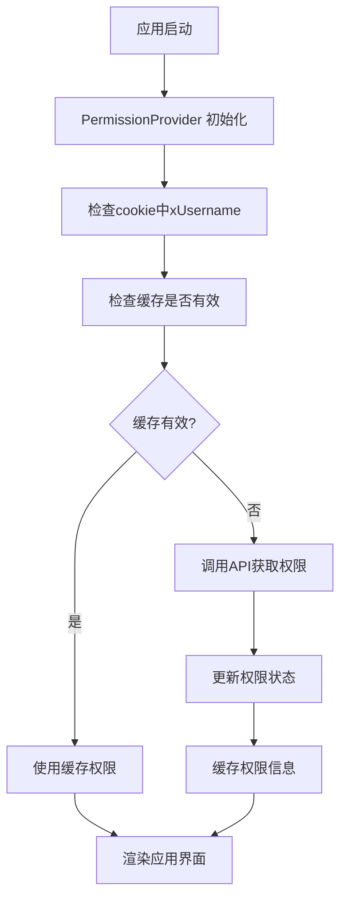
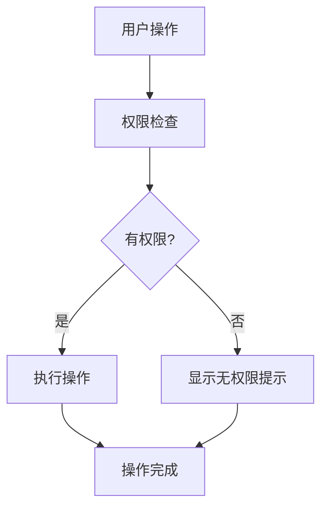
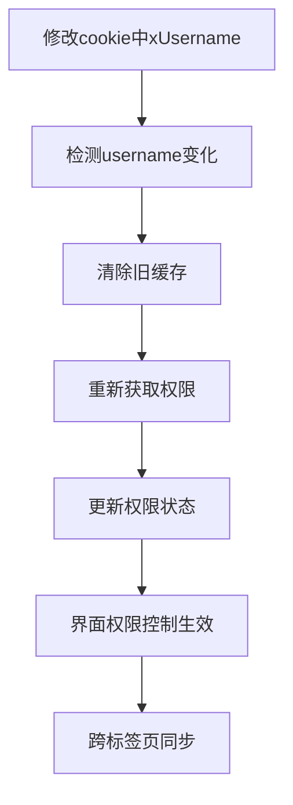
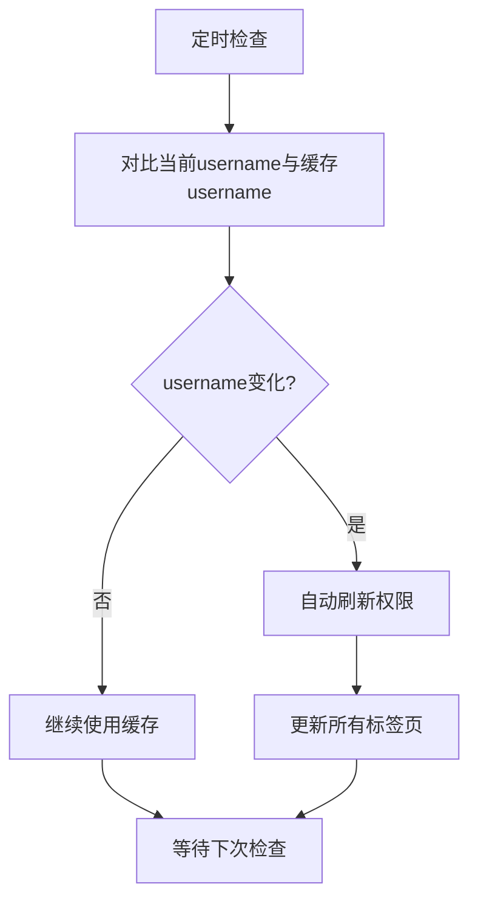

# 权限管理系统说明文档

## 📋 概述

本文档详细说明了 DialTestCenter 项目的权限管理系统设计、实现和使用方法。该系统采用基于角色的访问控制（RBAC）模式，实现了细粒度的权限管理，支持智能缓存和实时权限更新。

## 🎯 设计目标

- **项目加载时获取权限**: 应用启动时自动获取用户所有角色和权限信息
- **页面访问开放**: 所有用户都能访问所有页面，不限制页面访问
- **操作权限控制**: 根据用户权限动态控制操作按钮的显示/隐藏
- **权限实时生效**: 权限变更后自动检测并更新，无需手动刷新页面
- **智能缓存机制**: 基于username的智能缓存，避免重复请求

## 🏗️ 系统架构

### 后端架构

```
UserRoleController
├── userRolesPermissionGet()     # 获取用户权限信息
├── userRolesPost()              # 创建用户角色
├── userRolesIdPut()             # 更新用户角色
├── userRolesIdDelete()          # 删除用户角色
└── userRolesRolesGet()          # 获取所有角色定义
```

### 前端架构

```
PermissionProvider (Context)
├── usePermission Hook           # 权限管理核心 Hook
├── PagePermission 组件          # 页面权限控制组件
├── RolePermission 组件          # 角色权限控制组件
└── 智能缓存系统                 # 基于username的缓存管理
```

## 🔧 技术实现

### 1. 后端实现

#### API 接口

**接口路径**: `GET /dialingtest/api/user-roles/permission`

**请求头**:
```
X-Username: admin
Cache-Control: no-cache
Pragma: no-cache
```

**响应格式**:
```json
{
  "success": true,
  "data": {
    "username": "admin",
    "roles": ["ADMIN"],
    "pagePermissions": {
      "user-management": {
        "hasAccess": true,
        "operations": ["create", "edit", "delete", "view"]
      },
      "test-case-set": {
        "hasAccess": true,
        "operations": ["upload", "download", "delete", "view"]
      },
      "user-role-management": {
        "hasAccess": true,
        "operations": ["create", "edit", "delete", "view"]
      }
    }
  },
  "message": "获取用户权限信息成功"
}
```

#### 权限配置

```java
// 用户管理页面权限
UserPermissionResponseDataPagePermissions userManagementPerms = new UserPermissionResponseDataPagePermissions();
userManagementPerms.setHasAccess(true); // 所有用户都能访问页面
if (userRoles.contains("ADMIN")) {
    userManagementPerms.setOperations(Arrays.asList("create", "edit", "delete", "view"));
} else {
    userManagementPerms.setOperations(Arrays.asList("view"));
}
pagePermissions.put("user-management", userManagementPerms);

// 用例集管理页面权限
UserPermissionResponseDataPagePermissions testCaseSetPerms = new UserPermissionResponseDataPagePermissions();
testCaseSetPerms.setHasAccess(true); // 所有用户都能访问页面
if (userRoles.contains("ADMIN") || userRoles.contains("OPERATOR")) {
    testCaseSetPerms.setOperations(Arrays.asList("upload", "download", "delete", "view"));
} else if (userRoles.contains("BROWSER")) {
    testCaseSetPerms.setOperations(Arrays.asList("download", "view"));
} else {
    testCaseSetPerms.setOperations(Arrays.asList("view"));
}
pagePermissions.put("test-case-set", testCaseSetPerms);
```

### 2. 前端实现

#### 权限管理 Hook

```typescript
// hooks/usePermission.ts
export const usePermission = (): PermissionContextType => {
  const context = useContext(PermissionContext);
  if (context === undefined) {
    throw new Error('usePermission must be used within a PermissionProvider');
  }
  return context;
};

// 权限检查方法
const hasRole = useCallback((role: string): boolean => {
  return userPermission?.roles.includes(role) || false;
}, [userPermission]);

const hasPagePermission = useCallback((pageId: string, operation?: string): boolean => {
  if (!userPermission) return false;
  
  const pagePermission = userPermission.pagePermissions[pageId];
  if (!pagePermission) return false;
  
  if (!operation) return pagePermission.hasAccess;
  
  return pagePermission.operations.includes(operation);
}, [userPermission]);
```

#### 智能缓存系统

```typescript
// 智能缓存检查逻辑
const cachedPermission = sessionStorage.getItem('userPermission');
const cachedTime = sessionStorage.getItem('userPermissionTime');
const cachedUsername = sessionStorage.getItem('userPermissionUsername');
const currentUsername = getXUsernameFromCookie();
const now = new Date().getTime();
const cacheExpiry = 5 * 60 * 1000; // 5分钟

// 检查条件：缓存存在 + 未过期 + username未变化
if (cachedPermission && cachedTime && cachedUsername && 
    (now - parseInt(cachedTime)) < cacheExpiry && 
    cachedUsername === currentUsername) {
  // 使用缓存
  const parsed = JSON.parse(cachedPermission);
  setUserPermission(parsed);
  return;
}

// 如果username发生变化，清除旧缓存
if (cachedUsername && cachedUsername !== currentUsername) {
  sessionStorage.removeItem('userPermission');
  sessionStorage.removeItem('userPermissionTime');
  sessionStorage.removeItem('userPermissionUsername');
}
```

#### 权限控制组件

```typescript
// 页面权限组件
export const PagePermission: React.FC<PagePermissionProps> = ({ 
  pageId, 
  operation, 
  children, 
  fallback = null 
}) => {
  const { hasPagePermission } = usePermission();
  
  const hasPermission = hasPagePermission(pageId, operation);
  
  return hasPermission ? <>{children}</> : <>{fallback}</>;
};

// 角色权限组件
export const RolePermission: React.FC<RolePermissionProps> = ({ 
  roles, 
  children, 
  fallback = null, 
  requireAll = false 
}) => {
  const { hasAnyRole, hasAllRoles } = usePermission();
  
  const hasPermission = requireAll ? hasAllRoles(roles) : hasAnyRole(roles);
  
  return hasPermission ? <>{children}</> : <>{fallback}</>;
};
```

#### 自动权限更新机制

```typescript
// 监听cookie变化，检测username变化
useEffect(() => {
  const checkUsernameChange = () => {
    const currentUsername = getXUsernameFromCookie();
    const cachedUsername = sessionStorage.getItem('userPermissionUsername');
    
    if (cachedUsername && cachedUsername !== currentUsername) {
      console.log('检测到cookie中username变化，自动刷新权限:', cachedUsername, '->', currentUsername);
      refreshPermission();
    }
  };

  // 定期检查cookie变化（每30秒）
  const interval = setInterval(checkUsernameChange, 30000);
  
  // 监听storage事件（跨标签页同步）
  const handleStorageChange = (e: StorageEvent) => {
    if (e.key === 'userPermissionUsername' && e.newValue !== e.oldValue) {
      console.log('检测到其他标签页username变化，刷新权限');
      refreshPermission();
    }
  };

  window.addEventListener('storage', handleStorageChange);

  return () => {
    clearInterval(interval);
    window.removeEventListener('storage', handleStorageChange);
  };
}, [refreshPermission]);
```

## 📊 角色权限配置

### 角色定义

| 角色 | 中文名称 | 权限描述 |
|------|----------|----------|
| ADMIN | 管理员 | 拥有所有权限 |
| OPERATOR | 操作员 | 可以操作用例集，不能管理用户 |
| BROWSER | 浏览者 | 只能查看和下载 |
| EXECUTOR | 执行机 | 执行测试用例 |

### 页面权限矩阵

| 页面 | ADMIN | OPERATOR | BROWSER | EXECUTOR |
|------|-------|----------|---------|----------|
| **用户管理** | | | | |
| - 查看 | ✅ | ✅ | ✅ | ✅ |
| - 新增 | ✅ | ❌ | ❌ | ❌ |
| - 编辑 | ✅ | ❌ | ❌ | ❌ |
| - 删除 | ✅ | ❌ | ❌ | ❌ |
| **用例集管理** | | | | |
| - 查看 | ✅ | ✅ | ✅ | ✅ |
| - 上传 | ✅ | ✅ | ❌ | ❌ |
| - 下载 | ✅ | ✅ | ✅ | ✅ |
| - 编辑 | ✅ | ✅ | ❌ | ❌ |
| - 删除 | ✅ | ✅ | ❌ | ❌ |
| **用户角色管理** | | | | |
| - 查看 | ✅ | ✅ | ✅ | ✅ |
| - 新增 | ✅ | ❌ | ❌ | ❌ |
| - 编辑 | ✅ | ❌ | ❌ | ❌ |
| - 删除 | ✅ | ❌ | ❌ | ❌ |

## 🎨 使用指南

### 1. 应用集成

```typescript
// App.tsx
import { PermissionProvider } from './hooks/usePermission';

function App() {
  return (
    <I18nProvider>
      <PermissionProvider>
        <Layout>
          <Routes>
            {/* 路由配置 */}
          </Routes>
        </Layout>
      </PermissionProvider>
    </I18nProvider>
  );
}
```

### 2. 组件中使用权限控制

#### 基础权限检查

```typescript
const UserManagement = () => {
  const { hasPagePermission, hasRole } = usePermission();
  
  return (
    <div>
      {/* 根据权限显示按钮 */}
      {hasPagePermission('user-management', 'create') && (
        <Button onClick={handleAdd}>新增用户</Button>
      )}
      
      {hasRole('ADMIN') && (
        <Button onClick={handleDelete}>删除用户</Button>
      )}
    </div>
  );
};
```

#### 使用权限控制组件

```typescript
const UserManagement = () => {
  return (
    <div>
      {/* 页面权限控制 */}
      <PagePermission pageId="user-management" operation="create">
        <Button onClick={handleAdd}>新增用户</Button>
      </PagePermission>
      
      {/* 角色权限控制 */}
      <RolePermission roles={['ADMIN']}>
        <Button onClick={handleDelete}>删除用户</Button>
      </RolePermission>
    </div>
  );
};
```

#### 表格操作列权限控制

```typescript
const UserTable = () => {
  const { hasPagePermission } = usePermission();
  
  const columns = [
    { title: '用户名', dataIndex: 'username' },
    { title: '角色', dataIndex: 'role' },
  ];
  
  // 根据权限添加操作列
  if (hasPagePermission('user-management', 'edit') || 
      hasPagePermission('user-management', 'delete')) {
    columns.push({
      title: '操作',
      key: 'action',
      render: (record: User) => (
        <Space>
          <PagePermission pageId="user-management" operation="edit">
            <Button onClick={() => handleEdit(record)}>编辑</Button>
          </PagePermission>
          <PagePermission pageId="user-management" operation="delete">
            <Button danger onClick={() => handleDelete(record)}>删除</Button>
          </PagePermission>
        </Space>
      ),
    });
  }
  
  return <Table columns={columns} dataSource={users} />;
};
```

### 3. 权限缓存机制

#### 智能缓存策略

```typescript
// 缓存存储
sessionStorage.setItem('userPermission', JSON.stringify(permission));
sessionStorage.setItem('userPermissionTime', timestamp.toString());
sessionStorage.setItem('userPermissionUsername', currentUsername);

// 缓存检查
const cachedPermission = sessionStorage.getItem('userPermission');
const cachedTime = sessionStorage.getItem('userPermissionTime');
const cachedUsername = sessionStorage.getItem('userPermissionUsername');
const currentUsername = getXUsernameFromCookie();

// 缓存条件：存在 + 未过期 + username未变化
if (cachedPermission && cachedTime && cachedUsername && 
    (now - parseInt(cachedTime)) < cacheExpiry && 
    cachedUsername === currentUsername) {
  // 使用缓存
}
```

#### 权限刷新机制

```typescript
// 强制刷新权限
const refreshPermission = useCallback(async () => {
  // 清除所有缓存，强制重新获取
  sessionStorage.removeItem('userPermission');
  sessionStorage.removeItem('userPermissionTime');
  sessionStorage.removeItem('userPermissionUsername');
  console.log('清除权限缓存，强制重新获取');
  await fetchUserPermission();
}, [fetchUserPermission]);
```

## 🔄 权限管理流程

### 1. 应用启动流程



### 2. 权限检查流程



### 3. 权限更新流程



### 4. 自动检测流程



## 🛠️ 开发指南

### 1. 添加新页面权限

#### 后端配置

```java
// 在 UserRoleController.java 中添加新页面权限
UserPermissionResponseDataPagePermissions newPagePerms = new UserPermissionResponseDataPagePermissions();
newPagePerms.setHasAccess(true);
if (userRoles.contains("ADMIN")) {
    newPagePerms.setOperations(Arrays.asList("create", "edit", "delete", "view"));
} else {
    newPagePerms.setOperations(Arrays.asList("view"));
}
pagePermissions.put("new-page", newPagePerms);
```

#### 前端使用

```typescript
// 在组件中使用新页面权限
const NewPage = () => {
  return (
    <div>
      <PagePermission pageId="new-page" operation="create">
        <Button>新增</Button>
      </PagePermission>
      
      <PagePermission pageId="new-page" operation="edit">
        <Button>编辑</Button>
      </PagePermission>
    </div>
  );
};
```

### 2. 添加新角色

#### 后端配置

```java
// 1. 在数据库中添加新角色
// 2. 在权限配置中添加新角色逻辑
if (userRoles.contains("NEW_ROLE")) {
    newPagePerms.setOperations(Arrays.asList("view", "custom_operation"));
}
```

#### 前端使用

```typescript
// 使用新角色权限
<RolePermission roles={['NEW_ROLE']}>
  <Button>新角色专用操作</Button>
</RolePermission>
```

### 3. 调试权限问题

```typescript
// 在组件中添加权限调试信息
const DebugComponent = () => {
  const { userPermission, hasPagePermission } = usePermission();
  
  console.log('当前用户权限:', userPermission);
  console.log('是否有创建权限:', hasPagePermission('user-management', 'create'));
  
  return <div>调试信息已输出到控制台</div>;
};
```

### 4. 权限API调试

```typescript
// 权限API请求调试信息
console.log('权限API请求配置:', {
  url: `/dialingtest/api/user-roles/permission?t=${timestamp}`,
  headers: headers,
  xUsername: headers['X-Username'],
  cookies: document.cookie
});

// 权限API响应调试信息
console.log('权限API响应数据:', result);

// 权限加载调试信息
console.log('权限信息已加载:', {
  username: userPermission.username,
  roles: userPermission.roles,
  pagePermissions: userPermission.pagePermissions
});
```

## 📋 最佳实践

### 1. 权限检查原则

- **最小权限原则**: 默认不给权限，需要时再授予
- **权限分离**: 页面访问权限和操作权限分离
- **智能缓存**: 基于username的智能缓存，避免重复请求
- **权限验证**: 前后端都要进行权限验证

### 2. 组件设计原则

- **权限组件化**: 使用权限控制组件，避免重复代码
- **权限声明式**: 通过组件属性声明权限需求
- **权限可读性**: 权限控制逻辑清晰易懂

### 3. 性能优化

- **智能缓存**: 使用基于username的智能缓存机制
- **按需加载**: 只在需要时进行权限检查
- **批量检查**: 避免频繁的单个权限检查
- **自动更新**: 自动检测username变化，无需手动刷新

### 4. 缓存策略

- **缓存时间**: 5分钟缓存过期时间
- **缓存键**: 包含username信息，确保用户隔离
- **自动清理**: username变化时自动清除旧缓存
- **跨标签页**: 支持多标签页权限同步

## 🚨 注意事项

### 1. 安全注意事项

- **后端验证**: 前端权限控制只是UI层面的，后端必须进行权限验证
- **权限泄露**: 不要在客户端暴露敏感权限信息
- **权限绕过**: 确保用户无法绕过前端权限控制

### 2. 开发注意事项

- **权限一致性**: 确保前后端权限逻辑一致
- **权限测试**: 充分测试各种权限组合
- **权限文档**: 及时更新权限配置文档
- **API路径**: 使用正确的API路径 `/dialingtest/api/user-roles/permission`

### 3. 维护注意事项

- **权限审计**: 定期审计权限配置
- **权限清理**: 及时清理无用的权限配置
- **权限监控**: 监控权限使用情况
- **缓存管理**: 定期检查缓存机制是否正常工作

### 4. 常见问题

#### Cookie问题
- **Cookie不存在**: 系统会自动设置默认值 `admin`
- **Cookie变化**: 系统会自动检测并更新权限
- **Cookie格式**: 确保cookie格式正确 `xUsername=value`

#### 缓存问题
- **缓存过期**: 5分钟后自动重新获取
- **缓存清理**: username变化时自动清理
- **缓存同步**: 多标签页自动同步

#### API问题
- **路径错误**: 使用正确路径 `/dialingtest/api/user-roles/permission`
- **响应格式**: 确保返回JSON格式，不是HTML
- **请求头**: 确保包含 `X-Username` 头

## 🔧 故障排除

### 1. 权限不生效

**检查步骤**:
1. 检查控制台是否有权限API请求
2. 检查API响应是否为JSON格式
3. 检查cookie中xUsername是否正确
4. 检查缓存是否过期

**解决方案**:
```typescript
// 强制刷新权限
const { refreshPermission } = usePermission();
refreshPermission();
```

### 2. 权限缓存问题

**检查步骤**:
1. 检查sessionStorage中的权限数据
2. 检查username是否变化
3. 检查缓存时间是否过期

**解决方案**:
```javascript
// 手动清除缓存
sessionStorage.removeItem('userPermission');
sessionStorage.removeItem('userPermissionTime');
sessionStorage.removeItem('userPermissionUsername');
```

### 3. API请求失败

**检查步骤**:
1. 检查API路径是否正确
2. 检查后端服务是否启动
3. 检查网络连接是否正常

**解决方案**:
```typescript
// 检查API路径
console.log('API路径:', '/dialingtest/api/user-roles/permission');

// 检查请求头
console.log('请求头:', headers);
```

## 📚 相关文档

- [API 接口文档](./api-documentation.md)
- [前端组件文档](./component-documentation.md)
- [数据库设计文档](./database-design.md)
- [部署指南](./deployment-guide.md)

## 🔗 相关链接

- [项目仓库](https://github.com/your-org/DialTestCenter)
- [在线演示](https://demo.dialtestcenter.com)
- [问题反馈](https://github.com/your-org/DialTestCenter/issues)

---

**文档版本**: v2.0  
**最后更新**: 2024-01-XX  
**维护人员**: 开发团队

## 📝 更新日志

### v2.0 (2024-01-XX)
- ✅ 修复权限API路径问题
- ✅ 实现智能缓存机制
- ✅ 添加username变化自动检测
- ✅ 支持跨标签页权限同步
- ✅ 优化错误处理和调试信息
- ✅ 完善权限管理流程文档

### v1.0 (2024-01-XX)
- ✅ 基础权限管理系统
- ✅ 角色权限配置
- ✅ 页面权限控制
- ✅ 权限缓存机制