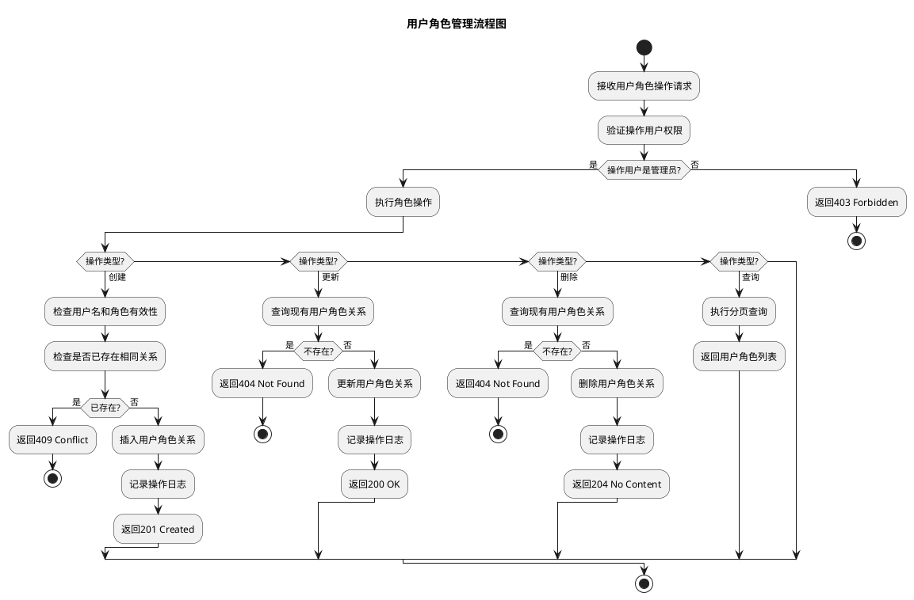
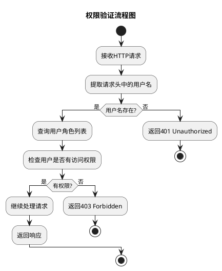
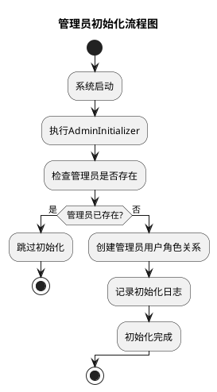
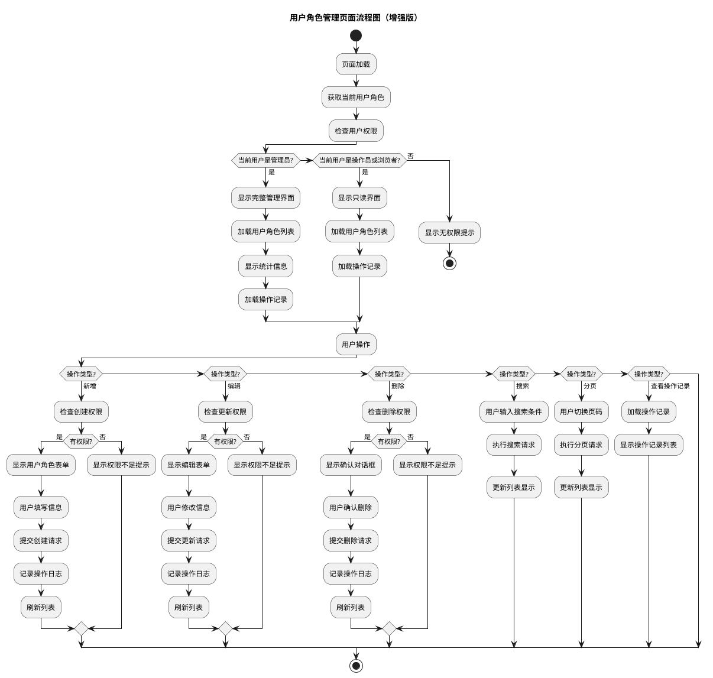
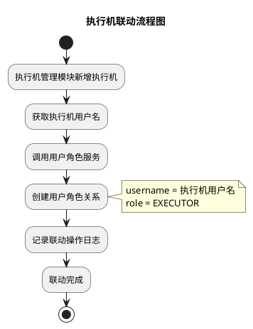
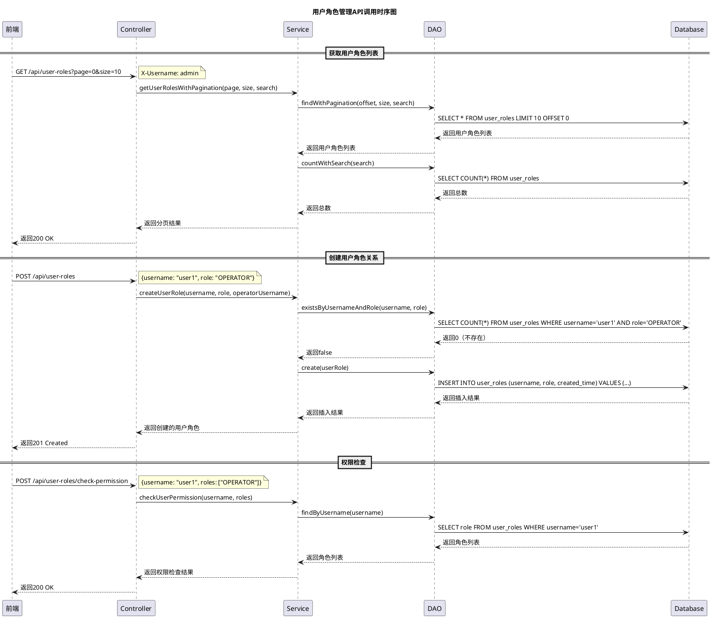

# 用户角色管理模块设计方案

## 1 需求重述

### 1.1 需求背景
用户角色管理模块是DialTestCenter系统的核心权限管理功能，用于管理系统中的用户-角色关系，实现基于角色的访问控制（RBAC）。该模块为拨测系统提供细粒度的权限管理，确保不同角色用户只能访问其权限范围内的功能。

### 1.2 需求功能介绍
用户角色管理模块主要提供以下能力：
- 用户-角色关系的增删改查操作
- 基于角色的权限验证和拦截
- 内置管理员账号初始化
- 与执行机管理模块的联动机制
- 用户角色管理页面
- 权限验证和拦截机制
- **操作记录功能**：记录所有用户角色相关操作到操作记录模块
- **权限校验方案**：支持前端控制和后台控制两种权限校验模式

## 2 功能实现分析

### 2.1 功能点清单
1. **用户角色关系数据管理**：用户-角色表的CRUD操作
2. **权限验证机制**：基于角色的接口访问控制
3. **管理员初始化**：系统启动时自动创建管理员账号
4. **用户角色管理页面**：前端管理界面
5. **执行机联动机制**：新增执行机时自动分配EXECUTOR角色
6. **权限拦截器**：统一的权限验证拦截机制
7. **操作记录集成**：所有用户角色操作记录到操作记录模块
8. **权限校验方案**：前端控制和后台控制两种权限校验模式

### 2.2 功能点1：用户角色关系数据管理

#### 详细描述

**数据库表设计：**
```sql
-- 用户角色关系表
CREATE TABLE user_roles (
    id BIGSERIAL PRIMARY KEY,
    username VARCHAR(50) NOT NULL,
    role VARCHAR(20) NOT NULL,
    UNIQUE(username, role)
);

-- 角色枚举表（可选，用于角色描述）
CREATE TABLE roles (
    id SERIAL PRIMARY KEY,
    code VARCHAR(20) NOT NULL UNIQUE,
    name_zh VARCHAR(50) NOT NULL,
    name_en VARCHAR(50) NOT NULL,
    description_zh TEXT,
    description_en TEXT
);

-- 插入角色定义
INSERT INTO roles (code, name_zh, name_en, description_zh, description_en) VALUES
('ADMIN', '管理员', 'Administrator', '拥有所有权限', 'Has all permissions'),
('OPERATOR', '操作员', 'Operator', '可以执行拨测任务相关的所有操作', 'Can execute all dial test related operations'),
('BROWSER', '浏览者', 'Browser', '仅查看', 'View only'),
('EXECUTOR', '执行机', 'Executor', '执行机注册使用', 'For executor registration');

-- 创建索引
CREATE INDEX idx_user_roles_username ON user_roles(username);
CREATE INDEX idx_user_roles_role ON user_roles(role);

-- 插入默认管理员
INSERT INTO user_roles (username, role) VALUES ('Admin', 'ADMIN');

-- 关联操作记录表（operation_logs）
-- 用户角色管理模块的所有操作都会记录到operation_logs表
-- 操作类型：CREATE, UPDATE, DELETE, VIEW
-- 操作目标：USER_ROLE
-- 支持中英文操作描述存储
```

**算法流程图：**



**核心函数伪代码：**
```java
// 用户角色服务类
class UserRoleService {
    
    // 创建用户角色关系
    function createUserRole(username, role, operatorUsername) {
        // 验证角色有效性
        if (!isValidRole(role)) {
            throw new IllegalArgumentException("无效的角色: " + role);
        }
        
        // 检查是否已存在
        if (userRoleDao.existsByUsernameAndRole(username, role)) {
            throw new IllegalArgumentException("用户角色关系已存在");
        }
        
        // 创建用户角色关系
        UserRole userRole = new UserRole();
        userRole.setUsername(username);
        userRole.setRole(role);
        userRole.setCreatedTime(LocalDateTime.now());
        
        int result = userRoleDao.create(userRole);
        if (result == 0) {
            throw new RuntimeException("创建用户角色关系失败");
        }
        
        // 记录操作日志到操作记录模块
        operationLogUtil.logUserRoleCreate(operatorUsername, username, role);
        
        return userRole;
    }
    
    // 查询用户角色列表
    function getUserRolesWithPagination(page, size, search) {
        int offset = page * size;
        List<UserRole> userRoles = userRoleDao.findWithPagination(offset, size, search);
        long total = userRoleDao.countWithSearch(search);
        
        return new PageResult(userRoles, total, page, size);
    }
    
    // 根据用户名查询角色
    function getUserRolesByUsername(username) {
        return userRoleDao.findByUsername(username);
    }
    
    // 检查用户是否有指定角色
    function hasRole(username, role) {
        return userRoleDao.existsByUsernameAndRole(username, role);
    }
    
    // 检查用户是否有任一角色
    function hasAnyRole(username, roles) {
        return userRoleDao.existsByUsernameAndRoles(username, roles);
    }
}
```

**系统架构图：**

```plantuml
@startuml
title 用户角色管理系统架构图

package "前端层" {
  [UserRoleManagement] as URM
  [UserRoleForm] as URF
  [usePermission] as UP
  [userRoleService] as URS
}

package "后端层" {
  [UserRoleController] as URC
  [UserRoleService] as URS_B
  [UserRoleDao] as URD
  [PermissionInterceptor] as PI
  [AdminInitializer] as AI
}

package "数据层" {
  database "PostgreSQL" as DB {
    table "user_roles" as UR
    table "roles" as R
    table "operation_logs" as OL
  }
}

package "模型层" {
  [UserRole] as UR_M
  [Role] as R_M
  [UserRoleResponse] as URR
  [CreateUserRoleRequest] as CUR
}

' 前端组件关系
URM --> URF : 使用
URM --> UP : 调用
URM --> URS : 调用
URF --> URS : 调用

' 后端组件关系
URC --> URS_B : 调用
URS_B --> URD : 调用
URD --> DB : 操作
PI --> URS_B : 权限验证
AI --> URS_B : 初始化管理员

' 模型关系
URC --> UR_M : 使用
URC --> URR : 返回
URC --> CUR : 接收

' 数据关系
URD --> UR : 操作
URD --> R : 操作
URS_B --> OL : 记录日志

note right of URM : React组件\n用户角色管理界面
note right of URC : Spring Boot Controller\nREST API接口
note right of URS_B : Spring Service\n业务逻辑处理
note right of URD : MyBatis DAO\n数据访问层
note right of PI : 权限拦截器\n统一权限验证
note right of AI : 管理员初始化器\n系统启动时创建管理员

@enduml
```

### 2.3 功能点2：权限验证机制

#### 详细描述

**权限校验方案选择：**

经过分析，推荐采用**混合方案**（前端控制 + 后台校验）：

| 方案 | 安全性 | 用户体验 | 开发复杂度 | 维护性 | 推荐度 |
|------|--------|----------|------------|--------|--------|
| 方案一：前端控制 | ❌ 低 | ✅ 好 | ✅ 简单 | ❌ 差 | ❌ 不推荐 |
| 方案二：后台控制 | ✅ 高 | ❌ 差 | ❌ 复杂 | ✅ 好 | ⚠️ 可用 |
| **方案三：混合方案** | ✅ **高** | ✅ **好** | ✅ **适中** | ✅ **好** | ✅ **推荐** |

**混合方案优势：**
- **安全性最高**：前端控制用户体验，后台确保安全性
- **用户体验好**：用户只看到有权限的功能
- **开发效率高**：前端控制简单，后台有统一的权限框架
- **维护性好**：权限逻辑集中管理，易于维护和更新
- **审计友好**：后台记录所有权限检查，便于审计

**权限验证流程：**



**权限注解设计：**
```java
// 权限控制注解
@Target({ElementType.METHOD, ElementType.TYPE})
@Retention(RetentionPolicy.RUNTIME)
public @interface RequireRole {
    Role[] value() default {};
    boolean requireAll() default false; // 是否需要所有角色
}

// 角色枚举
public enum Role {
    ADMIN("管理员", "拥有所有权限"),
    OPERATOR("操作员", "可以执行拨测任务相关的所有操作"),
    BROWSER("浏览者", "仅查看"),
    EXECUTOR("执行机", "执行机注册使用");
}

// 前端权限检查Hook
@Target({ElementType.METHOD, ElementType.TYPE})
@Retention(RetentionPolicy.RUNTIME)
public @interface FrontendPermission {
    String[] roles() default {};
    String description() default "";
}
```

**权限拦截器伪代码：**
```java
@Component
class PermissionInterceptor implements HandlerInterceptor {
    
    @Autowired
    private UserRoleService userRoleService;
    
    @Autowired
    private OperationLogService operationLogService;
    
    function preHandle(request, response, handler) {
        // 获取请求头中的用户名
        String username = request.getHeader("X-Username");
        if (username == null || username.isEmpty()) {
            response.setStatus(401);
            return false;
        }
        
        // 检查方法上的权限注解
        RequireRole requireRole = getRequireRoleAnnotation(handler);
        if (requireRole != null) {
            // 查询用户角色
            List<String> userRoles = userRoleService.getUserRolesByUsername(username);
            
            // 验证权限
            if (!hasRequiredRoles(userRoles, requireRole)) {
                // 记录权限检查失败日志
                operationLogService.logOperation(
                    username, "PERMISSION_DENIED", "USER_ROLE", 
                    "权限检查失败: " + request.getRequestURI()
                );
                
                response.setStatus(403);
                return false;
            }
            
            // 记录权限检查成功日志
            operationLogService.logOperation(
                username, "PERMISSION_CHECK", "USER_ROLE", 
                "权限检查成功: " + request.getRequestURI()
            );
        }
        
        return true;
    }
    
    function hasRequiredRoles(userRoles, requireRole) {
        Role[] requiredRoles = requireRole.value();
        boolean requireAll = requireRole.requireAll();
        
        if (requireAll) {
            // 需要拥有所有指定角色
            return Arrays.stream(requiredRoles)
                .allMatch(role -> userRoles.contains(role.name()));
        } else {
            // 需要拥有任一指定角色
            return Arrays.stream(requiredRoles)
                .anyMatch(role -> userRoles.contains(role.name()));
        }
    }
}
```

### 2.4 功能点3：管理员初始化机制

#### 详细描述

**初始化流程：**



**管理员初始化器伪代码：**
```java
@Component
class AdminInitializer implements ApplicationRunner {
    
    function run(args) {
        String adminUsername = "admin";
        
        // 检查管理员是否已存在
        if (!userRoleService.hasRole(adminUsername, Role.ADMIN)) {
            try {
                // 创建管理员角色关系
                userRoleService.createUserRole(adminUsername, Role.ADMIN, "system");
                
                // 记录初始化日志
                operationLogUtil.logSystemInit("system", adminUsername, "管理员初始化");
                
                log.info("管理员账号初始化成功: {}", adminUsername);
            } catch (Exception e) {
                log.error("管理员账号初始化失败", e);
            }
        } else {
            log.info("管理员账号已存在，跳过初始化");
        }
    }
}
```

### 2.5 功能点4：用户角色管理页面

#### 详细描述

**前端组件架构（集成权限控制和操作记录）：**
```
UserRoleManagement (主组件)
    ↓
UserRoleForm (用户角色表单组件)
    ↓
userRoleService (API服务层)
    ↓
usePermission (权限检查Hook) ← 新增权限控制
    ↓
useOperationLog (操作记录Hook) ← 新增操作记录
    ↓
userRole.ts (类型定义)
```

**状态管理设计（增强版）：**
```typescript
// 用户角色管理页面状态
interface UserRoleManagementState {
    userRoles: UserRole[];           // 用户角色列表
    loading: boolean;                // 加载状态
    modalVisible: boolean;           // 模态框显示状态
    editingUserRole: UserRole | null; // 正在编辑的用户角色
    formLoading: boolean;           // 表单提交状态
    currentUserRoles: string[];      // 当前用户角色
    userRoleLoading: boolean;        // 用户角色加载状态
    searchText: string;             // 搜索文本
    pagination: PaginationConfig;    // 分页配置
    // 新增权限控制状态
    permissions: {
        canManageUsers: boolean;     // 是否可以管理用户
        canViewUsers: boolean;       // 是否可以查看用户
        canCreateUsers: boolean;     // 是否可以创建用户
        canUpdateUsers: boolean;     // 是否可以更新用户
        canDeleteUsers: boolean;     // 是否可以删除用户
    };
    // 新增操作记录状态
    operationLogs: OperationLog[];   // 操作记录列表
    operationLogLoading: boolean;    // 操作记录加载状态
}

// 权限检查Hook（增强版）
interface PermissionHook {
    hasAdminRole: (userRoles: string[]) => boolean;
    canManageUsers: (userRoles: string[]) => boolean;
    canExecuteTasks: (userRoles: string[]) => boolean;
    canRegisterExecutor: (userRoles: string[]) => boolean;
    canBrowse: (userRoles: string[]) => boolean;
    hasRole: (userRoles: string[], role: Role) => boolean;
    hasAnyRole: (userRoles: string[], roles: Role[]) => boolean;
    // 新增细粒度权限检查
    canCreateUserRole: (userRoles: string[]) => boolean;
    canUpdateUserRole: (userRoles: string[]) => boolean;
    canDeleteUserRole: (userRoles: string[]) => boolean;
    canViewUserRoles: (userRoles: string[]) => boolean;
}

// 操作记录Hook（新增）
interface OperationLogHook {
    logUserRoleOperation: (operationType: string, target: string, description: string, data?: any) => Promise<void>;
    logPermissionCheck: (operation: string, success: boolean) => Promise<void>;
    getOperationLogs: (params: OperationLogQueryParams) => Promise<OperationLog[]>;
    refreshOperationLogs: () => Promise<void>;
}
```

**页面功能流程（集成权限控制和操作记录）：**



### 2.6 功能点5：执行机联动机制

#### 详细描述

**联动机制设计：**



**联动服务伪代码：**
```java
@Service
class ExecutorIntegrationService {
    
    function onExecutorCreated(executorUsername) {
        try {
            // 检查是否已存在EXECUTOR角色
            if (!userRoleService.hasRole(executorUsername, Role.EXECUTOR)) {
                // 创建执行机角色关系
                userRoleService.createUserRole(executorUsername, Role.EXECUTOR, "system");
                
                // 记录联动日志
                operationLogUtil.logExecutorIntegration("system", executorUsername, "执行机角色自动分配");
                
                log.info("执行机角色自动分配成功: {}", executorUsername);
            }
        } catch (Exception e) {
            log.error("执行机角色自动分配失败: {}", executorUsername, e);
        }
    }
    
    function onExecutorDeleted(executorUsername) {
        try {
            // 删除执行机角色关系
            userRoleService.deleteUserRoleByUsernameAndRole(executorUsername, Role.EXECUTOR);
            
            // 记录联动日志
            operationLogUtil.logExecutorIntegration("system", executorUsername, "执行机角色自动删除");
            
            log.info("执行机角色自动删除成功: {}", executorUsername);
        } catch (Exception e) {
            log.error("执行机角色自动删除失败: {}", executorUsername, e);
        }
    }
}
```

### 2.7 功能点6：操作记录集成

#### 详细描述

**操作记录集成设计：**

用户角色管理模块的所有操作都会记录到操作记录模块（operation_logs表），实现完整的操作审计。

**操作记录类型：**
- **CREATE**：创建用户角色关系
- **UPDATE**：更新用户角色关系  
- **DELETE**：删除用户角色关系
- **VIEW**：查看用户角色列表
- **PERMISSION_CHECK**：权限检查成功
- **PERMISSION_DENIED**：权限检查失败

**操作记录目标：**
- **USER_ROLE**：用户角色管理相关操作

**操作记录工具类：**
```java
@Component
public class UserRoleOperationLogUtil {
    
    @Autowired
    private OperationLogService operationLogService;
    
    /**
     * 记录用户角色创建操作
     */
    public void logUserRoleCreate(String operatorUsername, String targetUsername, String role) {
        String descriptionZh = String.format("创建用户角色: %s -> %s", targetUsername, role);
        String descriptionEn = String.format("Create user role: %s -> %s", targetUsername, role);
        
        operationLogService.logOperation(
            operatorUsername, "CREATE", "USER_ROLE", 
            descriptionZh, descriptionEn,
            Map.of("targetUsername", targetUsername, "role", role)
        );
    }
    
    /**
     * 记录用户角色更新操作
     */
    public void logUserRoleUpdate(String operatorUsername, String targetUsername, String oldRole, String newRole) {
        String descriptionZh = String.format("更新用户角色: %s %s -> %s", targetUsername, oldRole, newRole);
        String descriptionEn = String.format("Update user role: %s %s -> %s", targetUsername, oldRole, newRole);
        
        operationLogService.logOperation(
            operatorUsername, "UPDATE", "USER_ROLE", 
            descriptionZh, descriptionEn,
            Map.of("targetUsername", targetUsername, "oldRole", oldRole, "newRole", newRole)
        );
    }
    
    /**
     * 记录用户角色删除操作
     */
    public void logUserRoleDelete(String operatorUsername, String targetUsername, String role) {
        String descriptionZh = String.format("删除用户角色: %s -> %s", targetUsername, role);
        String descriptionEn = String.format("Delete user role: %s -> %s", targetUsername, role);
        
        operationLogService.logOperation(
            operatorUsername, "DELETE", "USER_ROLE", 
            descriptionZh, descriptionEn,
            Map.of("targetUsername", targetUsername, "role", role)
        );
    }
    
    /**
     * 记录权限检查操作
     */
    public void logPermissionCheck(String username, String operation, boolean success) {
        String descriptionZh = String.format("权限检查: %s %s", operation, success ? "成功" : "失败");
        String descriptionEn = String.format("Permission check: %s %s", operation, success ? "success" : "failed");
        
        operationLogService.logOperation(
            username, success ? "PERMISSION_CHECK" : "PERMISSION_DENIED", "USER_ROLE", 
            descriptionZh, descriptionEn,
            Map.of("operation", operation, "success", success)
        );
    }
}
```

**集成到用户角色服务：**
```java
@Service
@Transactional
public class UserRoleService {
    
    @Autowired
    private UserRoleOperationLogUtil operationLogUtil;
    
    // 创建用户角色关系
    function createUserRole(username, role, operatorUsername) {
        // 验证角色有效性
        if (!isValidRole(role)) {
            throw new IllegalArgumentException("无效的角色: " + role);
        }
        
        // 检查是否已存在
        if (userRoleDao.existsByUsernameAndRole(username, role)) {
            throw new IllegalArgumentException("用户角色关系已存在");
        }
        
        // 创建用户角色关系
        UserRole userRole = new UserRole();
        userRole.setUsername(username);
        userRole.setRole(role);
        userRole.setCreatedTime(LocalDateTime.now());
        
        int result = userRoleDao.create(userRole);
        if (result == 0) {
            throw new RuntimeException("创建用户角色关系失败");
        }
        
        // 记录操作日志到操作记录模块
        operationLogUtil.logUserRoleCreate(operatorUsername, username, role);
        
        return userRole;
    }
    
    // 更新用户角色关系
    function updateUserRole(id, username, role, operatorUsername) {
        // 查询现有用户角色关系
        UserRole existingUserRole = userRoleDao.findById(id);
        if (existingUserRole == null) {
            throw new IllegalArgumentException("用户角色关系不存在");
        }
        
        String oldRole = existingUserRole.getRole();
        
        // 更新用户角色关系
        existingUserRole.setUsername(username);
        existingUserRole.setRole(role);
        existingUserRole.setUpdatedTime(LocalDateTime.now());
        
        int result = userRoleDao.update(existingUserRole);
        if (result == 0) {
            throw new RuntimeException("更新用户角色关系失败");
        }
        
        // 记录操作日志到操作记录模块
        operationLogUtil.logUserRoleUpdate(operatorUsername, username, oldRole, role);
        
        return existingUserRole;
    }
    
    // 删除用户角色关系
    function deleteUserRole(id, operatorUsername) {
        // 查询现有用户角色关系
        UserRole existingUserRole = userRoleDao.findById(id);
        if (existingUserRole == null) {
            throw new IllegalArgumentException("用户角色关系不存在");
        }
        
        String username = existingUserRole.getUsername();
        String role = existingUserRole.getRole();
        
        // 删除用户角色关系
        int result = userRoleDao.deleteById(id);
        if (result == 0) {
            throw new RuntimeException("删除用户角色关系失败");
        }
        
        // 记录操作日志到操作记录模块
        operationLogUtil.logUserRoleDelete(operatorUsername, username, role);
        
        return true;
    }
}
```

### 2.8 功能点7：API接口设计

#### 详细描述

**REST API接口规范（集成权限校验和操作记录）：**

```yaml
# 用户角色管理API
paths:
  /api/user-roles:
    get:
      summary: 获取用户角色列表
      description: 支持分页查询和搜索，需要ADMIN或OPERATOR权限
      parameters:
        - name: page
          in: query
          type: integer
          default: 0
        - name: size
          in: query
          type: integer
          default: 10
        - name: search
          in: query
          type: string
      headers:
        X-Username:
          required: true
          type: string
          description: 操作用户名
      responses:
        200:
          description: 成功返回用户角色列表
        401:
          description: 未提供用户名
        403:
          description: 权限不足
          
    post:
      summary: 创建用户角色关系
      description: 创建新的用户角色关系，需要ADMIN权限，自动记录操作日志
      parameters:
        - name: body
          in: body
          required: true
          schema:
            type: object
            properties:
              username:
                type: string
                description: 目标用户名
              role:
                type: string
                enum: [ADMIN, OPERATOR, BROWSER, EXECUTOR]
                description: 角色类型
      headers:
        X-Username:
          required: true
          type: string
          description: 操作用户名
      responses:
        201:
          description: 创建成功
        400:
          description: 请求参数错误
        409:
          description: 用户角色关系已存在
        403:
          description: 权限不足
          
  /api/user-roles/{id}:
    put:
      summary: 更新用户角色关系
      description: 更新现有用户角色关系，需要ADMIN权限，自动记录操作日志
      parameters:
        - name: id
          in: path
          required: true
          type: integer
          description: 用户角色关系ID
        - name: body
          in: body
          required: true
          schema:
            type: object
            properties:
              username:
                type: string
              role:
                type: string
                enum: [ADMIN, OPERATOR, BROWSER, EXECUTOR]
      headers:
        X-Username:
          required: true
          type: string
      responses:
        200:
          description: 更新成功
        404:
          description: 用户角色关系不存在
        403:
          description: 权限不足
          
    delete:
      summary: 删除用户角色关系
      description: 删除用户角色关系，需要ADMIN权限，自动记录操作日志
      parameters:
        - name: id
          in: path
          required: true
          type: integer
          description: 用户角色关系ID
      headers:
        X-Username:
          required: true
          type: string
      responses:
        204:
          description: 删除成功
        404:
          description: 用户角色关系不存在
        403:
          description: 权限不足
          
  /api/user-roles/check-permission:
    post:
      summary: 检查用户权限
      description: 检查用户是否具有指定权限，自动记录权限检查日志
      parameters:
        - name: body
          in: body
          required: true
          schema:
            type: object
            properties:
              username:
                type: string
                description: 要检查的用户名
              roles:
                type: array
                items:
                  type: string
                description: 要检查的角色列表
      headers:
        X-Username:
          required: true
                  type: string
      responses:
        200:
          description: 权限检查结果
          schema:
            type: object
            properties:
              hasPermission:
                type: boolean
              userRoles:
                type: array
                items:
                  type: string
        401:
          description: 未提供用户名
```

**API调用时序图：**



## 4 总结

### 4.1 设计特点

1. **完整的权限管理**：基于角色的访问控制（RBAC），支持细粒度权限管理
2. **混合权限校验方案**：前端控制用户体验，后台确保安全性，双重保护机制
3. **操作记录集成**：所有用户角色操作自动记录到操作记录模块，支持完整审计
4. **多语言支持**：操作记录支持中英文描述，完美支持国际化
5. **执行机联动**：与执行机管理模块联动，自动分配EXECUTOR角色
6. **管理员初始化**：系统启动时自动创建管理员账号
7. **RESTful API设计**：标准的REST API接口，支持权限校验和操作记录

### 4.2 技术优势

1. **安全性高**：混合权限校验方案，前端控制用户体验，后台确保安全性
2. **可维护性好**：权限逻辑集中管理，操作记录统一存储
3. **扩展性强**：模块化设计，易于扩展新功能和角色
4. **审计友好**：完整的操作记录，支持多语言审计
5. **性能优化**：合理的数据库索引设计，支持高效查询
6. **异常处理**：完善的异常处理机制和错误提示

### 4.3 权限校验方案总结

**推荐采用混合方案（前端控制 + 后台校验）：**

| 方案 | 安全性 | 用户体验 | 开发复杂度 | 维护性 | 推荐度 |
|------|--------|----------|------------|--------|--------|
| 方案一：前端控制 | ❌ 低 | ✅ 好 | ✅ 简单 | ❌ 差 | ❌ 不推荐 |
| 方案二：后台控制 | ✅ 高 | ❌ 差 | ❌ 复杂 | ✅ 好 | ⚠️ 可用 |
| **方案三：混合方案** | ✅ **高** | ✅ **好** | ✅ **适中** | ✅ **好** | ✅ **推荐** |

**混合方案优势：**
- **安全性最高**：前端控制用户体验，后台确保安全性
- **用户体验好**：用户只看到有权限的功能
- **开发效率高**：前端控制简单，后台有统一的权限框架
- **维护性好**：权限逻辑集中管理，易于维护和更新
- **审计友好**：后台记录所有权限检查，便于审计

### 4.4 操作记录集成总结

**操作记录功能特点：**
1. **自动记录**：所有用户角色操作自动记录到operation_logs表
2. **多语言支持**：操作描述支持中英文存储，支持国际化显示
3. **完整审计**：记录操作类型、目标、描述、数据、语言环境等完整信息
4. **权限检查记录**：记录权限检查成功和失败的情况
5. **工具类封装**：提供便捷的操作记录工具类，简化使用

**操作记录类型：**
- **CREATE**：创建用户角色关系
- **UPDATE**：更新用户角色关系  
- **DELETE**：删除用户角色关系
- **VIEW**：查看用户角色列表
- **PERMISSION_CHECK**：权限检查成功
- **PERMISSION_DENIED**：权限检查失败

### 4.5 使用建议

1. **权限管理**：建议采用混合权限校验方案，确保安全性和用户体验
2. **操作记录**：在关键业务操作完成后自动记录日志，便于审计
3. **角色设计**：根据业务需求合理设计角色，避免权限过于复杂
4. **性能优化**：定期清理历史操作记录，避免数据量过大
5. **安全考虑**：敏感操作数据需要脱敏处理
6. **监控告警**：对异常操作进行监控和告警

### 4.6 扩展性考虑

1. **新角色支持**：可以轻松添加新的角色类型
2. **权限细化**：可以进一步细化权限控制粒度
3. **操作记录扩展**：可以扩展更多操作类型和目标
4. **多语言扩展**：可以支持更多语言环境
5. **集成扩展**：可以与其他模块进行更深入的集成

这个设计方案提供了完整的用户角色管理功能，集成了权限校验和操作记录，具有良好的安全性、可维护性和扩展性。

### 3.2 DT用例设计列表

#### 3.2.1 UserRoleController测试用例（增强版）

**主场景测试：**
1. **TC001_分页查询用户角色_正常场景**
   - 被测方法：`getUserRolesWithPagination(page, size, search)`
   - 测试因子：page=0, size=10, search=null, X-Username=admin
   - 预期结果：返回用户角色列表，success=true，记录VIEW操作日志

2. **TC002_分页查询用户角色_带搜索条件**
   - 被测方法：`getUserRolesWithPagination(page, size, search)`
   - 测试因子：page=0, size=10, search="admin", X-Username=admin
   - 预期结果：返回匹配的用户角色列表，记录VIEW操作日志

3. **TC003_创建用户角色_正常场景**
   - 被测方法：`createUserRole(CreateUserRoleRequest body)`
   - 测试因子：username="user1", role="OPERATOR", X-Username=admin
   - 预期结果：返回201 Created，用户角色创建成功，记录CREATE操作日志

4. **TC004_更新用户角色_正常场景**
   - 被测方法：`updateUserRole(id, UpdateUserRoleRequest body)`
   - 测试因子：id=1, username="user1", role="ADMIN", X-Username=admin
   - 预期结果：返回200 OK，用户角色更新成功，记录UPDATE操作日志

5. **TC005_删除用户角色_正常场景**
   - 被测方法：`deleteUserRole(id)`
   - 测试因子：id=1, X-Username=admin
   - 预期结果：返回204 No Content，用户角色删除成功，记录DELETE操作日志

6. **TC006_权限检查_正常场景**
   - 被测方法：`checkUserPermission(CheckPermissionRequest body)`
   - 测试因子：username="user1", roles=["OPERATOR"], X-Username=admin
   - 预期结果：返回200 OK，权限检查结果，记录PERMISSION_CHECK操作日志

**异常场景测试：**
7. **TC007_创建用户角色_用户角色关系已存在**
   - 被测方法：`createUserRole(CreateUserRoleRequest body)`
   - 测试因子：username="admin", role="ADMIN"（已存在）
   - 预期结果：返回409 Conflict

8. **TC008_创建用户角色_无效角色**
   - 被测方法：`createUserRole(CreateUserRoleRequest body)`
   - 测试因子：username="user1", role="INVALID_ROLE"
   - 预期结果：返回400 Bad Request

9. **TC009_更新用户角色_用户角色不存在**
   - 被测方法：`updateUserRole(id, UpdateUserRoleRequest body)`
   - 测试因子：id=999（不存在）
   - 预期结果：返回404 Not Found

10. **TC010_删除用户角色_用户角色不存在**
    - 被测方法：`deleteUserRole(id)`
    - 测试因子：id=999（不存在）
    - 预期结果：返回404 Not Found

11. **TC011_权限不足_非管理员访问**
    - 被测方法：`createUserRole(CreateUserRoleRequest body)`
    - 测试因子：X-Username=operator（非管理员）
    - 预期结果：返回403 Forbidden

12. **TC012_未提供用户名**
    - 被测方法：`getUserRolesWithPagination(page, size, search)`
    - 测试因子：无X-Username头
    - 预期结果：返回401 Unauthorized

#### 3.2.2 UserRoleService测试用例

**主场景测试：**
13. **TC013_服务层分页查询_正常场景**
    - 被测方法：`getUserRolesWithPagination(page, size, search)`
    - 测试因子：page=0, size=10, search=null
    - 预期结果：返回用户角色列表

14. **TC014_服务层创建用户角色_正常场景**
    - 被测方法：`createUserRole(username, role, operatorUsername)`
    - 测试因子：username="testuser", role="OPERATOR", operatorUsername="admin"
    - 预期结果：返回创建的用户角色对象

15. **TC015_服务层更新用户角色_正常场景**
    - 被测方法：`updateUserRole(id, username, role, operatorUsername)`
    - 测试因子：id=1, username="updated", role="ADMIN", operatorUsername="admin"
    - 预期结果：返回更新后的用户角色对象

16. **TC016_服务层删除用户角色_正常场景**
    - 被测方法：`deleteUserRole(id, operatorUsername)`
    - 测试因子：id=1, operatorUsername="admin"
    - 预期结果：删除成功，无异常

17. **TC017_服务层权限检查_正常场景**
    - 被测方法：`checkUserPermission(username, roles)`
    - 测试因子：username="user1", roles=["OPERATOR"]
    - 预期结果：返回权限检查结果

**异常场景测试：**
18. **TC018_服务层创建用户角色_用户角色关系已存在**
    - 被测方法：`createUserRole(username, role, operatorUsername)`
    - 测试因子：username="admin", role="ADMIN"（已存在）
    - 预期结果：抛出IllegalArgumentException

19. **TC019_服务层创建用户角色_无效角色**
    - 被测方法：`createUserRole(username, role, operatorUsername)`
    - 测试因子：username="user1", role="INVALID_ROLE"
    - 预期结果：抛出IllegalArgumentException

20. **TC020_服务层更新用户角色_用户角色不存在**
    - 被测方法：`updateUserRole(id, username, role, operatorUsername)`
    - 测试因子：id=999（不存在）
    - 预期结果：抛出IllegalArgumentException

21. **TC021_服务层删除用户角色_用户角色不存在**
    - 被测方法：`deleteUserRole(id, operatorUsername)`
    - 测试因子：id=999（不存在）
    - 预期结果：抛出IllegalArgumentException

#### 3.2.3 PermissionInterceptor测试用例

**主场景测试：**
22. **TC022_权限拦截器_管理员访问**
    - 被测方法：`preHandle(request, response, handler)`
    - 测试因子：X-Username=admin, @RequireRole(ADMIN)
    - 预期结果：返回true，允许访问

23. **TC023_权限拦截器_操作员访问**
    - 被测方法：`preHandle(request, response, handler)`
    - 测试因子：X-Username=operator, @RequireRole(OPERATOR)
    - 预期结果：返回true，允许访问

24. **TC024_权限拦截器_多角色验证**
    - 被测方法：`preHandle(request, response, handler)`
    - 测试因子：X-Username=admin, @RequireRole({ADMIN, OPERATOR})
    - 预期结果：返回true，允许访问

**异常场景测试：**
25. **TC025_权限拦截器_权限不足**
    - 被测方法：`preHandle(request, response, handler)`
    - 测试因子：X-Username=browser, @RequireRole(ADMIN)
    - 预期结果：返回false，设置403状态码

26. **TC026_权限拦截器_未提供用户名**
    - 被测方法：`preHandle(request, response, handler)`
    - 测试因子：无X-Username头
    - 预期结果：返回false，设置401状态码

27. **TC027_权限拦截器_用户不存在**
    - 被测方法：`preHandle(request, response, handler)`
    - 测试因子：X-Username=nonexistent
    - 预期结果：返回false，设置403状态码

#### 3.2.4 AdminInitializer测试用例

**主场景测试：**
28. **TC028_管理员初始化_首次启动**
    - 被测方法：`run(args)`
    - 测试因子：数据库中无管理员记录
    - 预期结果：创建管理员角色关系，记录初始化日志

29. **TC029_管理员初始化_管理员已存在**
    - 被测方法：`run(args)`
    - 测试因子：数据库中已存在管理员记录
    - 预期结果：跳过初始化，记录日志
