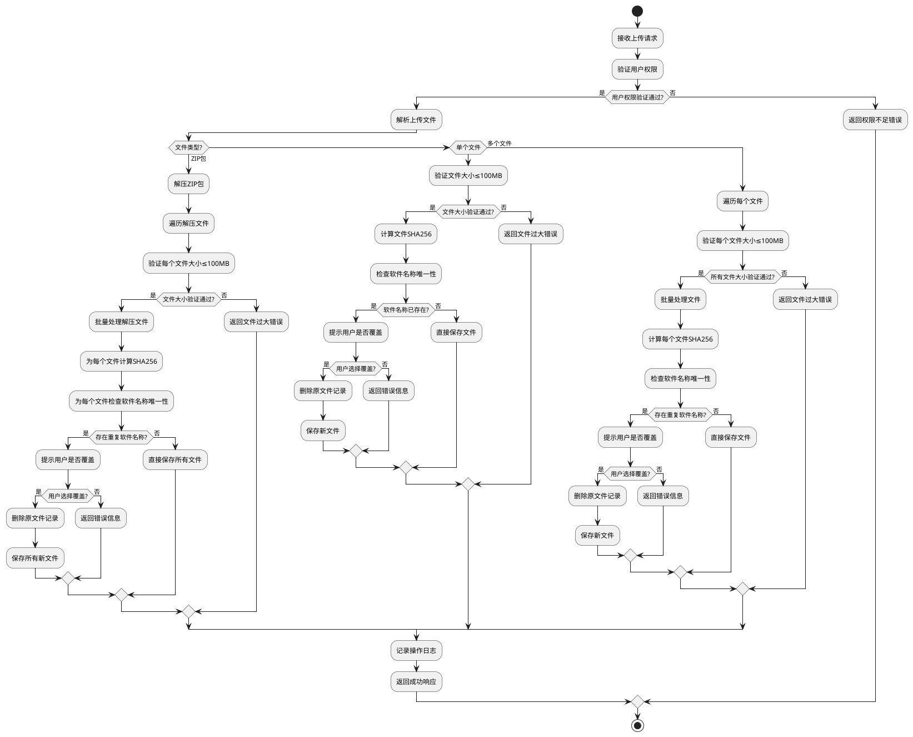
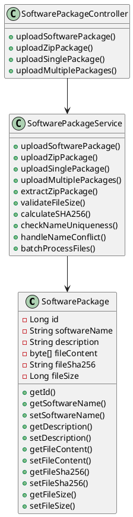
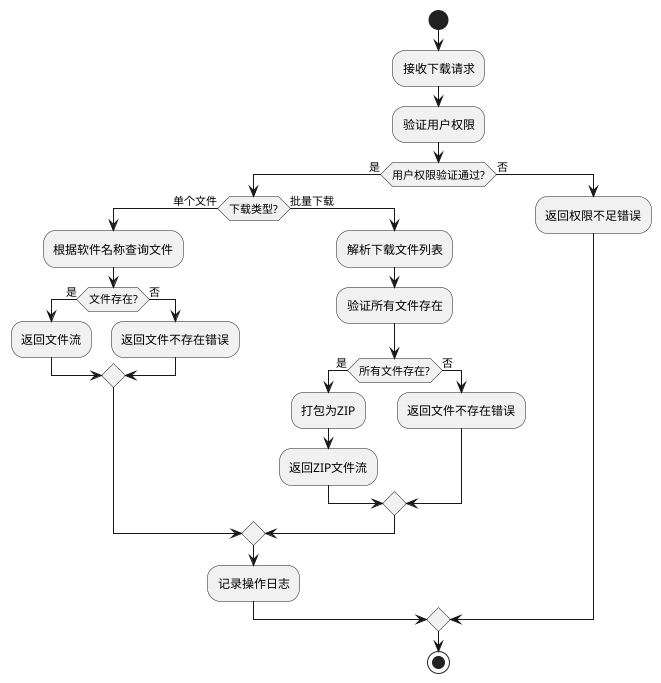
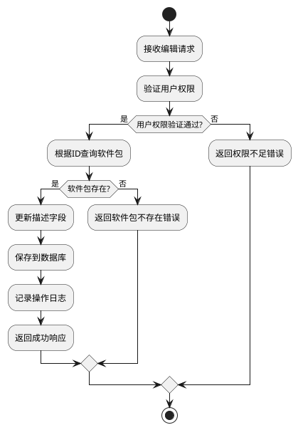
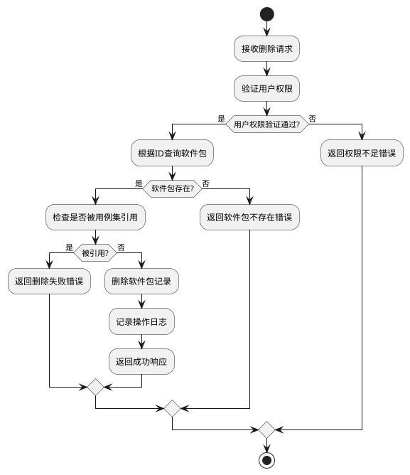
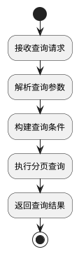
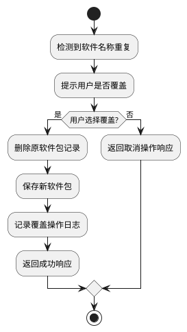

# 软件包管理模块软件实现设计文档

## 1 需求重述

### 1.1 需求背景
拨测脚本执行时，其依赖的软件包必须提前安装好，因此需要提前管理需要的软件包。此次需要的软件包主要为手机上的APP安装包，涉及Android和iOS系统。

### 1.2 需求功能介绍
软件包管理模块提供对拨测脚本依赖软件包的完整生命周期管理，包括上传、下载、编辑、删除和查询功能，支持多种上传方式和权限控制。

## 2 功能实现分析

### 2.1 功能点清单
1. 软件包上传功能
2. 软件包下载功能
3. 软件包信息编辑功能
4. 软件包删除功能
5. 软件包列表查询功能
6. 软件包覆盖处理功能
7. 操作记录功能

### 2.2 功能点1：软件包上传功能

#### 详细描述

**数据库表设计：**
```sql
CREATE TABLE software_package (
    id BIGSERIAL PRIMARY KEY,
    software_name VARCHAR(255) NOT NULL UNIQUE,
    description TEXT,
    file_content BYTEA NOT NULL,
    file_sha256 VARCHAR(64) NOT NULL,
    file_size BIGINT NOT NULL
);

CREATE INDEX idx_software_package_name ON software_package(software_name);
```

**权限控制：**
- 仅ADMIN和OPERATOR角色有上传权限
- 通过用户角色表验证用户权限

**上传方式支持：**
1. 上传ZIP包（包含多个安装包）- 解压后按单个软件包存储
2. 上传单个安装包
3. 上传多个安装包

**文件大小限制：**
- 单个文件：≤100MB
- ZIP包：≤1GB

**算法流程图：**


**核心类设计：**


### 2.3 功能点2：软件包下载功能

#### 详细描述

**权限控制：**
- ADMIN、OPERATOR、EXECUTOR角色有下载权限
- 支持批量下载

**下载流程：**


### 2.4 功能点3：软件包信息编辑功能

#### 详细描述

**权限控制：**
- 仅ADMIN和OPERATOR角色有编辑权限
- 仅支持编辑描述字段

**编辑流程：**


### 2.5 功能点4：软件包删除功能

#### 详细描述

**权限控制：**
- 仅ADMIN和OPERATOR角色有删除权限

**删除流程：**


### 2.6 功能点5：软件包列表查询功能

#### 详细描述

**权限控制：**
- 所有人均有查看权限
- 支持分页查询

**查询流程：**


### 2.7 功能点6：软件包覆盖处理功能

#### 详细描述

**覆盖处理流程：**


### 2.8 功能点7：操作记录功能

#### 详细描述

**操作记录说明：**
所有软件包管理操作（上传、下载、编辑、删除、覆盖）的操作记录由操作记录模块统一管理，包括：
- 操作时间
- 操作用户
- 操作类型
- 操作对象
- 操作结果

软件包管理模块通过调用操作记录模块的接口记录操作信息。

## 3 AR开发者测试设计

### 3.1 测试对象
- SoftwarePackageController
- SoftwarePackageService
- SoftwarePackage实体类

### 3.2 测试用例设计

#### 3.2.1 软件包上传功能测试

**主场景：**
1. 正常上传单个软件包
2. 正常上传ZIP包（解压后按单个软件包存储）
3. 正常上传多个软件包

**分支场景：**
1. 权限验证失败
2. 文件大小超限
3. 软件名称重复（用户选择覆盖）
4. 软件名称重复（用户选择不覆盖）
5. ZIP包解压失败
6. ZIP包中包含不支持的文件格式
7. ZIP包中部分文件大小超限
8. 文件SHA256计算失败
9. 数据库保存失败

**异常场景：**
1. 上传空文件
2. 上传非支持格式文件
3. 网络中断
4. 数据库连接异常

#### 3.2.2 软件包下载功能测试

**主场景：**
1. 正常下载单个软件包
2. 正常批量下载软件包

**分支场景：**
1. 权限验证失败
2. 软件包不存在
3. 批量下载中部分文件不存在

**异常场景：**
1. 文件读取失败
2. ZIP打包失败
3. 网络传输中断

#### 3.2.3 软件包信息编辑功能测试

**主场景：**
1. 正常编辑软件包描述

**分支场景：**
1. 权限验证失败
2. 软件包不存在
3. 描述字段为空

**异常场景：**
1. 数据库更新失败
2. 并发编辑冲突

#### 3.2.4 软件包删除功能测试

**主场景：**
1. 正常删除软件包

**分支场景：**
1. 权限验证失败
2. 软件包不存在
3. 软件包被用例集引用

**异常场景：**
1. 数据库删除失败
2. 外键约束冲突

#### 3.2.5 软件包列表查询功能测试

**主场景：**
1. 正常分页查询
2. 按软件名称模糊查询
3. 按上传时间范围查询

**分支场景：**
1. 查询结果为空
2. 分页参数异常

**异常场景：**
1. 数据库查询失败
2. 查询超时

### 3.3 测试因子组合

**文件大小因子：**
- 0MB（空文件）
- 1MB（小文件）
- 50MB（中等文件）
- 100MB（最大限制）
- 101MB（超限文件）

**文件类型因子：**
- .apk文件
- .ipa文件
- .zip文件
- 不支持格式文件

**权限因子：**
- ADMIN角色
- OPERATOR角色
- EXECUTOR角色
- BROWSER角色
- 无权限用户

**软件名称因子：**
- 唯一名称
- 重复名称
- 特殊字符名称
- 超长名称

### 3.4 测试用例列表

#### 3.4.1 实体类测试用例

| 用例编号 | 测试对象 | 测试场景 | 测试因子组合 | 预期结果 |
|---------|---------|---------|-------------|---------|
| TC001 | SoftwarePackage | 默认构造函数 | 无参数构造函数 | 创建空对象，所有字段为null |
| TC002 | SoftwarePackage | 参数化构造函数 | 所有字段参数 | 正确设置所有字段值 |
| TC003 | SoftwarePackage | ID的getter和setter | 设置ID=1L | 正确设置和获取ID值 |
| TC004 | SoftwarePackage | 软件名称的getter和setter | 设置软件名称 | 正确设置和获取软件名称 |
| TC005 | SoftwarePackage | 描述的getter和setter | 设置描述信息 | 正确设置和获取描述信息 |
| TC006 | SoftwarePackage | 文件内容的getter和setter | 设置字节数组 | 正确设置和获取文件内容 |
| TC007 | SoftwarePackage | SHA256的getter和setter | 设置SHA256值 | 正确设置和获取SHA256值 |
| TC008 | SoftwarePackage | 文件大小的getter和setter | 设置文件大小 | 正确设置和获取文件大小 |
| TC009 | SoftwarePackage | equals方法-相同对象 | 相同对象引用 | 返回true |
| TC010 | SoftwarePackage | equals方法-null对象 | 与null比较 | 返回false |
| TC011 | SoftwarePackage | equals方法-不同类型 | 与String对象比较 | 返回false |
| TC012 | SoftwarePackage | equals方法-相同ID和名称 | 相同ID和软件名称 | 返回true |
| TC013 | SoftwarePackage | equals方法-不同ID | 不同ID，相同名称 | 返回false |
| TC014 | SoftwarePackage | equals方法-不同名称 | 相同ID，不同名称 | 返回false |
| TC015 | SoftwarePackage | hashCode方法 | 相同对象多次调用 | 返回一致的值 |
| TC016 | SoftwarePackage | hashCode方法-相等对象 | 两个相等对象 | 返回相同的hashCode |
| TC017 | SoftwarePackage | toString方法 | 设置所有字段 | 包含所有字段信息 |
| TC018 | SoftwarePackage | toString方法-null值 | 所有字段为null | 正确处理null值 |

#### 3.4.2 服务层测试用例

| 用例编号 | 测试对象 | 测试场景 | 测试因子组合 | 预期结果 |
|---------|---------|---------|-------------|---------|
| TC019 | SoftwarePackagesService | 分页获取软件包列表-正常情况 | 有效分页参数+关键字 | 返回正确的分页数据 |
| TC020 | SoftwarePackagesService | 分页获取软件包列表-空关键字 | 有效分页参数+null关键字 | 返回所有数据的分页结果 |
| TC021 | SoftwarePackagesService | 根据ID获取软件包详情-正常情况 | 存在的软件包ID | 返回正确的软件包信息 |
| TC022 | SoftwarePackagesService | 根据ID获取软件包详情-不存在 | 不存在的软件包ID | 返回null |
| TC023 | SoftwarePackagesService | 更新软件包描述-正常情况 | 存在的软件包ID+新描述 | 更新成功并返回更新后的信息 |
| TC024 | SoftwarePackagesService | 删除软件包-正常情况 | 存在的软件包ID | 删除成功，返回true |
| TC025 | SoftwarePackagesService | 删除软件包-不存在 | 不存在的软件包ID | 返回false |
| TC026 | SoftwarePackagesService | 删除软件包-数据库删除失败 | 存在的软件包ID+数据库错误 | 返回false |
| TC027 | SoftwarePackagesService | 检查软件包是否被引用-被引用 | 被用例集引用的软件包 | 返回true |
| TC028 | SoftwarePackagesService | 检查软件包是否被引用-未被引用 | 未被引用的软件包 | 返回false |
| TC029 | SoftwarePackagesService | 检查软件包是否被引用-不存在 | 不存在的软件包ID | 返回false |
| TC030 | SoftwarePackagesService | 上传单个软件包-正常情况 | 有效的APK文件+描述 | 上传成功，返回软件包对象 |
| TC031 | SoftwarePackagesService | 上传单个软件包-名称已存在不覆盖 | 重复软件名称+overwrite=false | 抛出IllegalArgumentException |
| TC032 | SoftwarePackagesService | 上传单个软件包-名称已存在覆盖 | 重复软件名称+overwrite=true | 覆盖成功，返回软件包对象 |
| TC033 | SoftwarePackagesService | 上传ZIP包-正常情况 | 包含APK和IPA的ZIP包 | 解压成功，返回软件包列表 |
| TC034 | SoftwarePackagesService | 上传ZIP包-不支持的文件格式 | 包含TXT文件的ZIP包 | 抛出IllegalArgumentException |

#### 3.4.3 控制器层测试用例

| 用例编号 | 测试对象 | 测试场景 | 测试因子组合 | 预期结果 |
|---------|---------|---------|-------------|---------|
| TC035 | FileUploadController | 上传单个软件包-正常情况 | ADMIN角色+APK文件+描述 | 返回200状态码，上传成功 |
| TC036 | FileUploadController | 上传单个软件包-权限不足 | BROWSER角色+APK文件 | 返回403状态码，权限不足 |
| TC037 | FileUploadController | 上传单个软件包-不支持的文件格式 | ADMIN角色+TXT文件 | 返回400状态码，文件格式错误 |
| TC038 | FileUploadController | 上传ZIP包-正常情况 | ADMIN角色+ZIP文件+描述 | 返回200状态码，解压上传成功 |
| TC039 | FileUploadController | 上传ZIP包-权限不足 | BROWSER角色+ZIP文件 | 返回403状态码，权限不足 |
| TC040 | FileUploadController | 上传软件包-服务异常 | ADMIN角色+APK文件+服务异常 | 返回500状态码，服务器内部错误 |

### 3.5 测试覆盖率要求

- 代码覆盖率：≥90%
- 分支覆盖率：≥85%
- 方法覆盖率：100%
- 类覆盖率：100%

### 3.6 测试环境要求

- Java 8+
- Spring Boot 2.x
- PostgreSQL 12+
- JUnit 4
- Mockito 3.x
- 测试数据：包含各种大小和格式的测试文件

### 3.7 LLT测试实现说明

#### 3.7.1 测试文件结构

```
src/test/java/com/huawei/cloududn/dialingtest/
├── entity/
│   └── SoftwarePackageTest.java                    # 软件包实体类单元测试
├── service/
│   └── SoftwarePackagesServiceTest.java            # 软件包服务层单元测试
└── controller/
    └── FileUploadControllerTest.java               # 文件上传控制器单元测试（包含软件包管理测试）
```

#### 3.7.2 测试实现特点

**实体类测试（SoftwarePackageTest.java）：**
- 测试默认构造函数和参数化构造函数
- 测试所有属性的getter和setter方法
- 测试equals()和hashCode()方法的正确性
- 测试toString()方法的完整性
- 覆盖null值处理场景

**服务层测试（SoftwarePackagesServiceTest.java）：**
- 使用@Mock注解模拟依赖的DAO层
- 测试所有业务方法的正常流程和异常流程
- 测试文件上传、ZIP包解压等核心功能
- 验证权限检查和数据验证逻辑
- 使用MockMultipartFile模拟文件上传

**控制器层测试（FileUploadControllerTest.java）：**
- 使用@Mock注解模拟服务层依赖
- 测试HTTP请求处理的各种场景
- 测试权限验证、文件格式验证等
- 验证HTTP状态码和响应体的正确性
- 使用MockMultipartHttpServletRequest模拟HTTP请求

#### 3.7.3 测试数据准备

**测试文件生成：**
- 使用ByteArrayOutputStream和ZipOutputStream创建测试ZIP文件
- 模拟不同格式的软件包文件（APK、IPA）
- 创建包含不支持格式的测试文件

**Mock对象配置：**
- 配置DAO层方法的返回值
- 模拟数据库操作的成功和失败场景
- 配置服务层方法的异常抛出

#### 3.7.4 测试执行说明

**运行单个测试类：**
```bash
mvn test -Dtest=SoftwarePackageTest
mvn test -Dtest=SoftwarePackagesServiceTest
mvn test -Dtest=FileUploadControllerTest
```

**运行所有软件包管理相关测试：**
```bash
mvn test -Dtest="*SoftwarePackage*Test"
```

**生成测试覆盖率报告：**
```bash
mvn clean test jacoco:report
```

#### 3.7.5 测试质量保证

**测试覆盖率要求：**
- 代码覆盖率：≥90%
- 分支覆盖率：≥85%
- 方法覆盖率：100%
- 类覆盖率：100%

**测试用例设计原则：**
- 每个测试方法只测试一个特定功能
- 使用描述性的测试方法命名
- 包含正常流程和异常流程的测试
- 验证所有边界条件和错误场景
- 确保测试的独立性和可重复性
